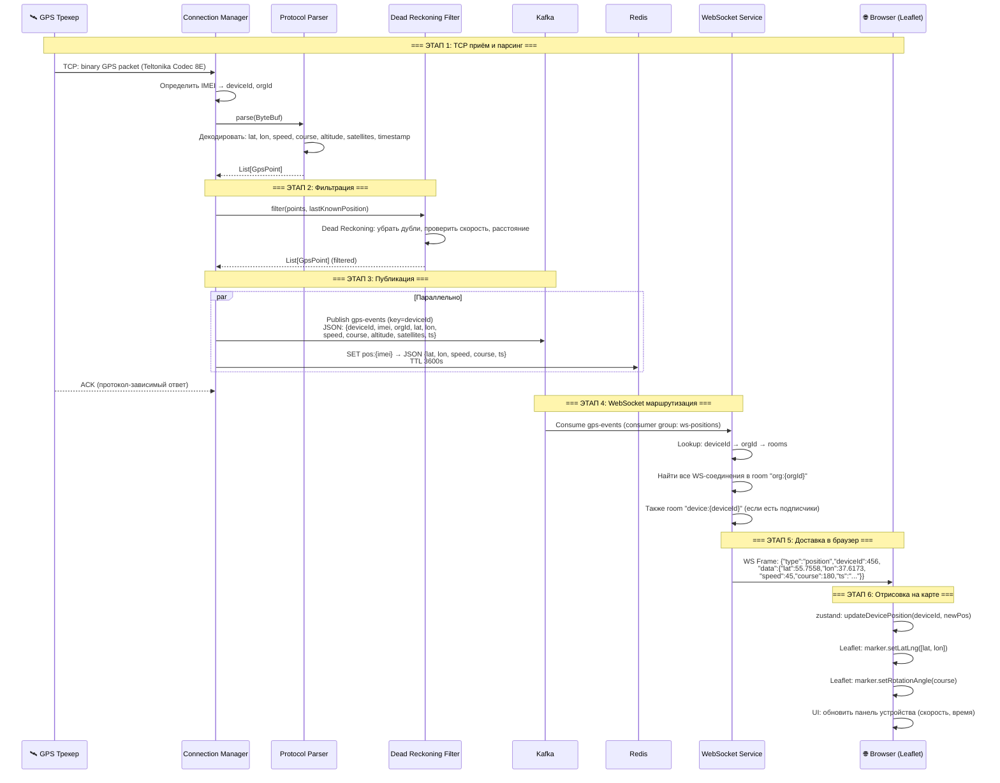
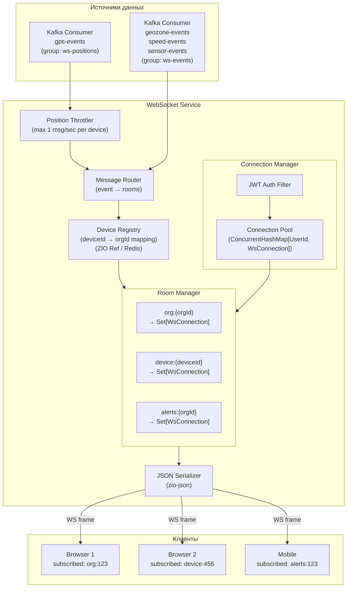
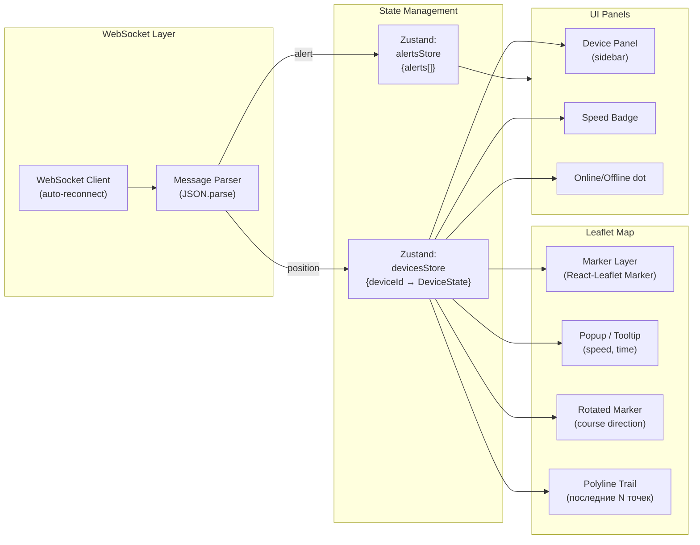
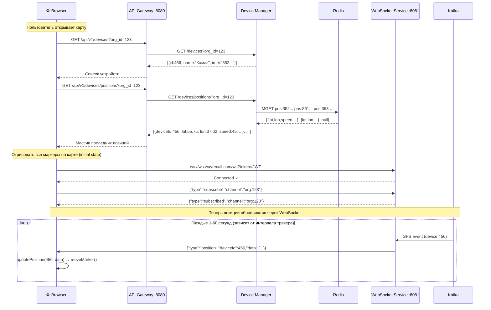
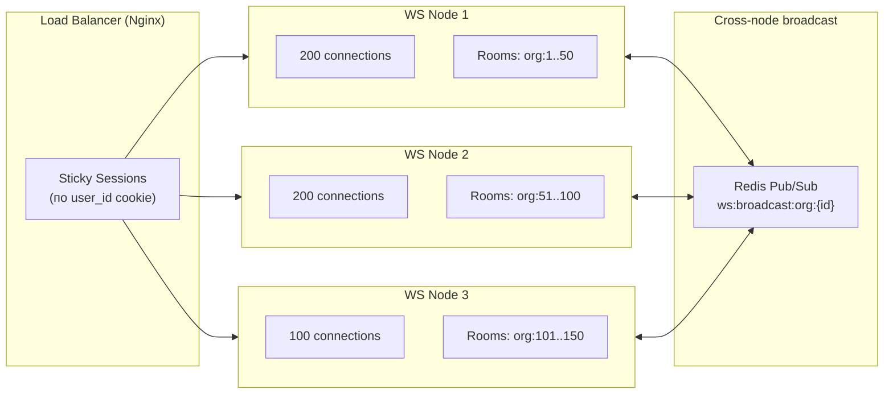
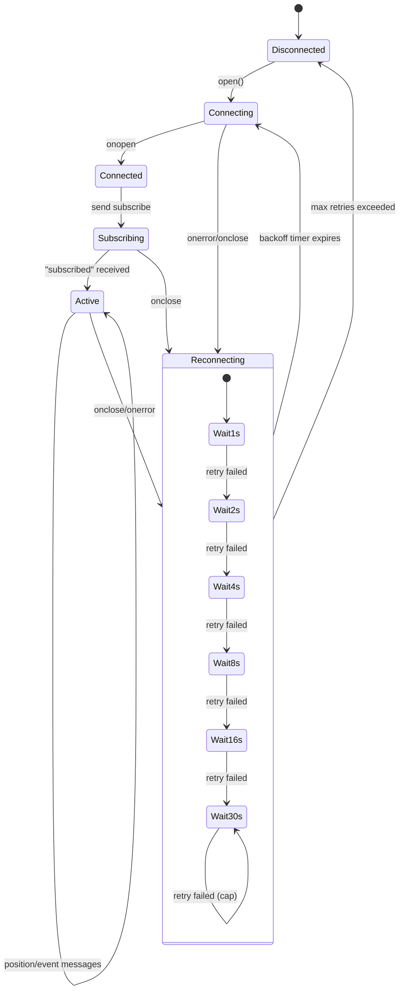
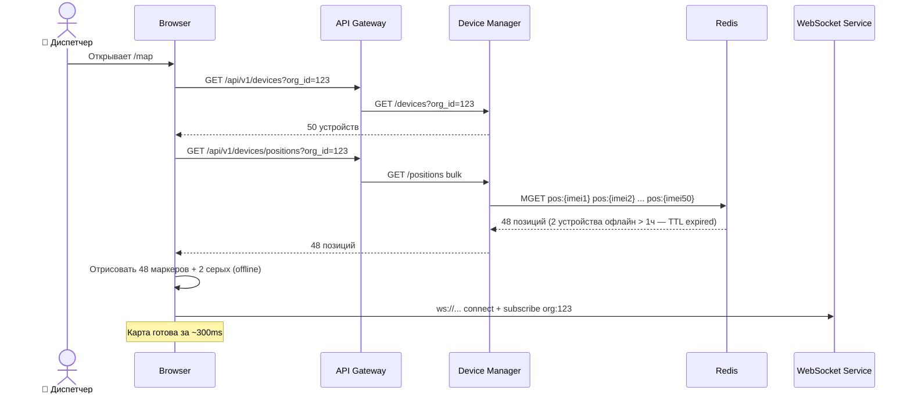
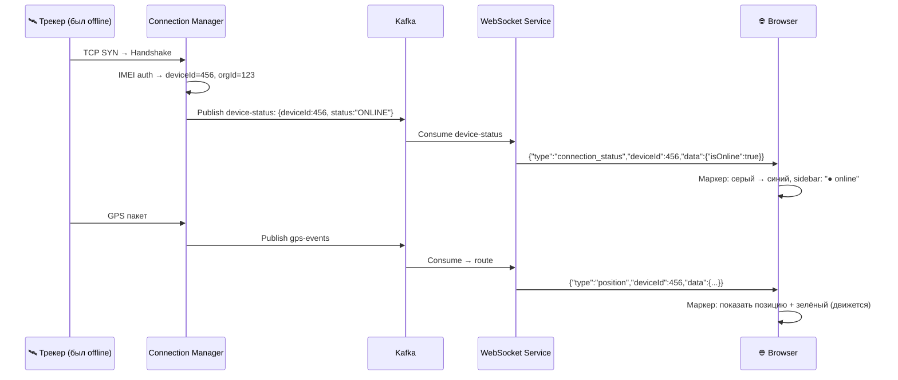
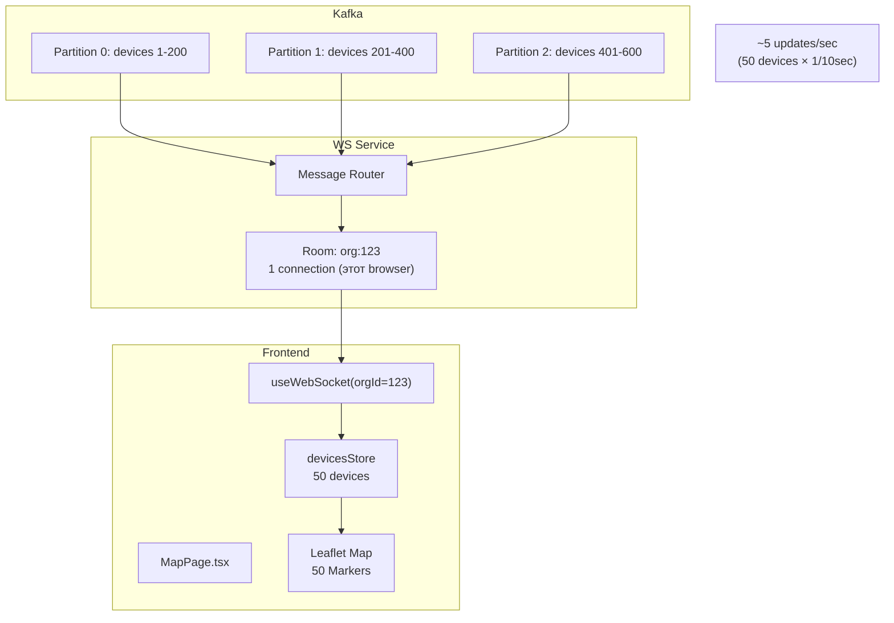

# 🗺️ Real-Time отображение позиций транспорта

> Тег: `АКТУАЛЬНО` | Обновлён: `2026-06-02` | Версия: `1.0`

## Цель документа

Детальное описание: **как работает отрисовка позиций машин в реальном времени** — от GPS-трекера до маркера на карте в браузере пользователя.

---

## 📑 Содержание

1. [Обзор потока данных](#1-обзор-потока-данных)
2. [Путь GPS-пакета (End-to-End)](#2-путь-gps-пакета-end-to-end)
3. [Connection Manager → Kafka](#3-connection-manager--kafka)
4. [WebSocket Service: Kafka → Browser](#4-websocket-service-kafka--browser)
5. [Frontend: WebSocket → Карта Leaflet](#5-frontend-websocket--карта-leaflet)
6. [Первоначальная загрузка (Initial Load)](#6-первоначальная-загрузка-initial-load)
7. [Масштабирование и производительность](#7-масштабирование-и-производительность)
8. [Обработка отключений](#8-обработка-отключений)
9. [Протокол сообщений](#9-протокол-сообщений)
10. [Диаграммы всех сценариев](#10-диаграммы-всех-сценариев)
11. [Оптимизации](#11-оптимизации)
12. [Сравнение с Legacy Stels](#12-сравнение-с-legacy-stels)

---

## 1. Обзор потока данных

### Общая схема (ASCII)

```
 GPS Трекер                Connection Manager            Kafka              WebSocket Service           Browser
 ─────────                 ──────────────────            ─────              ─────────────────           ───────
     │                            │                        │                       │                      │
     │  TCP пакет (бинарный)      │                        │                       │                      │
     │ =========================> │                        │                       │                      │
     │                            │                        │                       │                      │
     │                    ┌──── Parse ────┐                │                       │                      │
     │                    │ Protocol      │                │                       │                      │
     │                    │ Filter DR     │                │                       │                      │
     │                    │ Enrich        │                │                       │                      │
     │                    └──────┬────────┘                │                       │                      │
     │                           │                        │                       │                      │
     │                           │ GpsEvent (JSON)        │                       │                      │
     │                           │ =====================> │                       │                      │
     │                           │                        │                       │                      │
     │                           │ Redis: SET pos:{imei}  │                       │                      │
     │                           │ ─────────────────────> │ (Redis)               │                      │
     │                           │                        │                       │                      │
     │                           │                        │  Consume gps-events   │                      │
     │                           │                        │ =====================>│                      │
     │                           │                        │                       │                      │
     │                           │                        │               ┌── Lookup ──┐                │
     │                           │                        │               │ device_id   │                │
     │                           │                        │               │ → org_id    │                │
     │                           │                        │               │ → room      │                │
     │                           │                        │               └──────┬──────┘                │
     │                           │                        │                      │                       │
     │                           │                        │                      │ WS frame (JSON)       │
     │                           │                        │                      │ =====================>│
     │                           │                        │                      │                       │
     │                           │                        │                      │              ┌── Leaflet ──┐
     │                           │                        │                      │              │ moveMarker  │
     │                           │                        │                      │              │ updatePanel │
     │                           │                        │                      │              └─────────────┘
```

### Latency Budget

| Этап | Время | Кумулятивно |
|------|-------|-------------|
| TCP пакет → Parse → Filter | ~5-10ms | 10ms |
| Publish в Kafka | ~5-15ms | 25ms |
| Kafka → WS Service consume | ~10-30ms | 55ms |
| Lookup device → org → room | ~1-3ms | 58ms |
| WebSocket frame → Browser | ~10-30ms | 88ms |
| React re-render → Leaflet | ~5-15ms | **~100ms** |
| **Итого (p99)** | | **< 150ms** |

---

## 2. Путь GPS-пакета (End-to-End)

### Полная Sequence Diagram



---

## 3. Connection Manager → Kafka

### Что публикуется в Kafka

**Топик:** `gps-events`  
**Ключ партиции:** `deviceId` (числовой) — гарантирует порядок точек одного устройства  
**Consumer groups:** `history-writer`, `rule-checker`, `ws-positions`, `sensors-processor`

### Формат сообщения (JSON)

```json
{
  "deviceId": 456,
  "imei": "352093089439473",
  "organizationId": 123,
  "timestamp": "2026-06-02T14:30:15.123Z",
  "latitude": 55.755826,
  "longitude": 37.617300,
  "altitude": 156.0,
  "speed": 45.2,
  "course": 180,
  "satellites": 12,
  "hdop": 0.9,
  "inputs": {
    "ignition": true,
    "door": false,
    "sos": false
  },
  "analogInputs": {
    "power": 13.8,
    "battery": 4.1,
    "fuel1": 342
  },
  "eventId": null,
  "valid": true
}
```

### Redis: Последняя позиция

CM также записывает позицию в Redis для быстрого доступа (initial load):

```
KEY:    pos:{imei}
VALUE:  {"lat":55.755826,"lon":37.617300,"speed":45.2,"course":180,
         "alt":156,"sat":12,"ts":"2026-06-02T14:30:15.123Z","ign":true}
TTL:    3600 (1 час — если не обновляется, значит устройство офлайн)
```

**Зачем Redis?** При открытии карты (initial load) нужны **последние позиции всех устройств** организации — читать из Redis быстрее, чем Kafka.

---

## 4. WebSocket Service: Kafka → Browser

### Архитектура WebSocket Service



### Как WS Service определяет, кому отправить

```scala
// Псевдокод маршрутизации позиции
def routePosition(event: GpsEvent): Task[Unit] = for {
  // 1. Определяем org_id устройства (из кэша или Kafka сообщения)
  orgId     <- deviceRegistry.getOrgId(event.deviceId)
  
  // 2. Находим все room'ы, куда нужно отправить
  orgRoom   <- roomManager.getRoom(s"org:$orgId")      // все устройства организации
  devRoom   <- roomManager.getRoom(s"device:${event.deviceId}") // конкретное устройство
  
  // 3. Объединяем connection'ы (убираем дубли)
  allConns  = (orgRoom.connections ++ devRoom.connections).distinct
  
  // 4. Сериализуем и отправляем
  message   <- serializer.encode(PositionMessage(event))
  _         <- ZIO.foreachParDiscard(allConns)(conn => conn.send(message))
} yield ()
```

### Throttling позиций

Некоторые трекеры шлют данные каждую секунду. На карте обновлять маркер 60 раз в минуту избыточно.

**Стратегия:** WebSocket Service троттлит позиции:
- Максимум **1 обновление в секунду** на устройство для room `org:{id}`
- Максимум **2 обновления в секунду** для room `device:{id}` (фокус на конкретном устройстве)
- **События** (геозоны, алерты) — **без троттлинга**, доставляются немедленно

```scala
// Throttle: хранить timestamp последней отправки на устройство в комнату
val lastSentRef: Ref[Map[(DeviceId, RoomId), Instant]]

def shouldSend(deviceId: DeviceId, room: RoomId, now: Instant): Boolean = {
  val key = (deviceId, room)
  val lastSent = lastSentMap.getOrElse(key, Instant.MIN)
  now.toEpochMilli - lastSent.toEpochMilli >= 1000 // 1 секунда
}
```

---

## 5. Frontend: WebSocket → Карта Leaflet

### Архитектура фронтенда (real-time часть)



### React код: useWebSocket hook

```typescript
// hooks/useWebSocket.ts
import { useEffect, useRef, useCallback } from 'react';
import { useAuthStore } from '../stores/authStore';
import { useDevicesStore } from '../stores/devicesStore';
import { useAlertsStore } from '../stores/alertsStore';

interface WsMessage {
  type: 'position' | 'geozone_event' | 'alert' | 'connection_status' | 'pong' | 'subscribed';
  deviceId?: number;
  data?: unknown;
}

export function useWebSocket(orgId: number) {
  const wsRef = useRef<WebSocket | null>(null);
  const reconnectTimer = useRef<ReturnType<typeof setTimeout>>();
  const token = useAuthStore(s => s.accessToken);
  const updatePosition = useDevicesStore(s => s.updatePosition);
  const updateStatus = useDevicesStore(s => s.updateStatus);
  const addAlert = useAlertsStore(s => s.addAlert);

  const connect = useCallback(() => {
    if (!token) return;
    
    const ws = new WebSocket(`wss://ws.wayrecall.com/ws?token=${token}`);
    wsRef.current = ws;

    ws.onopen = () => {
      // Подписка на все устройства организации
      ws.send(JSON.stringify({ type: 'subscribe', channel: `org:${orgId}` }));
      // Подписка на алерты
      ws.send(JSON.stringify({ type: 'subscribe', channel: `alerts:${orgId}` }));
    };

    ws.onmessage = (event) => {
      const msg: WsMessage = JSON.parse(event.data);

      switch (msg.type) {
        case 'position':
          // Обновить позицию устройства в Zustand store
          updatePosition(msg.deviceId!, msg.data as PositionData);
          break;
        case 'connection_status':
          updateStatus(msg.deviceId!, msg.data as StatusData);
          break;
        case 'alert':
        case 'geozone_event':
          addAlert(msg.data as AlertData);
          break;
        case 'pong':
          break; // heartbeat response
      }
    };

    ws.onclose = () => {
      // Экспоненциальный reconnect: 1s, 2s, 4s, 8s, max 30s
      reconnectTimer.current = setTimeout(connect, getBackoffDelay());
    };

    ws.onerror = () => ws.close();
  }, [token, orgId]);

  // Heartbeat: ping каждые 25 секунд
  useEffect(() => {
    const interval = setInterval(() => {
      if (wsRef.current?.readyState === WebSocket.OPEN) {
        wsRef.current.send(JSON.stringify({ type: 'ping' }));
      }
    }, 25_000);
    return () => clearInterval(interval);
  }, []);

  useEffect(() => {
    connect();
    return () => {
      clearTimeout(reconnectTimer.current);
      wsRef.current?.close();
    };
  }, [connect]);

  return wsRef;
}
```

### Zustand Store: позиции устройств

```typescript
// stores/devicesStore.ts
import { create } from 'zustand';

interface PositionData {
  lat: number;
  lon: number;
  speed: number;
  course: number;
  altitude: number;
  satellites: number;
  timestamp: string;
  ignition: boolean;
}

interface DeviceState {
  deviceId: number;
  name: string;
  imei: string;
  position: PositionData | null;
  isOnline: boolean;
  lastUpdate: string | null;
  // Trail — последние N точек для отрисовки хвоста
  trail: [number, number][]; // [lat, lon][]
}

interface DevicesStore {
  devices: Map<number, DeviceState>;
  
  // Начальная загрузка (REST)
  setDevices: (devices: DeviceState[]) => void;
  
  // Real-time обновление (WebSocket)
  updatePosition: (deviceId: number, pos: PositionData) => void;
  updateStatus: (deviceId: number, status: { isOnline: boolean }) => void;
}

const MAX_TRAIL_POINTS = 20; // Последние 20 точек на карте

export const useDevicesStore = create<DevicesStore>((set) => ({
  devices: new Map(),

  setDevices: (devices) => set({
    devices: new Map(devices.map(d => [d.deviceId, d]))
  }),

  updatePosition: (deviceId, pos) => set((state) => {
    const device = state.devices.get(deviceId);
    if (!device) return state;

    const newTrail = [...device.trail, [pos.lat, pos.lon] as [number, number]]
      .slice(-MAX_TRAIL_POINTS); // Ограничиваем хвост

    const newDevice: DeviceState = {
      ...device,
      position: pos,
      isOnline: true,
      lastUpdate: pos.timestamp,
      trail: newTrail,
    };

    const newMap = new Map(state.devices);
    newMap.set(deviceId, newDevice);
    return { devices: newMap };
  }),

  updateStatus: (deviceId, status) => set((state) => {
    const device = state.devices.get(deviceId);
    if (!device) return state;
    
    const newMap = new Map(state.devices);
    newMap.set(deviceId, { ...device, isOnline: status.isOnline });
    return { devices: newMap };
  }),
}));
```

### Leaflet: Компонент карты с маркерами

```tsx
// components/map/VehicleMarkers.tsx
import { Marker, Popup, Polyline, useMap } from 'react-leaflet';
import { useDevicesStore } from '../../stores/devicesStore';
import { useMemo } from 'react';
import L from 'leaflet';

// Иконка с поворотом по курсу
function createVehicleIcon(course: number, isOnline: boolean, speed: number) {
  const color = !isOnline ? '#999' : speed > 0 ? '#22c55e' : '#3b82f6';
  
  return L.divIcon({
    className: 'vehicle-marker',
    html: `
      <div style="transform: rotate(${course}deg)">
        <svg width="24" height="24" viewBox="0 0 24 24">
          <path d="M12 2 L8 22 L12 18 L16 22 Z" fill="${color}" stroke="#fff" stroke-width="1.5"/>
        </svg>
      </div>
    `,
    iconSize: [24, 24],
    iconAnchor: [12, 12],
  });
}

export function VehicleMarkers() {
  const devices = useDevicesStore(s => s.devices);
  
  // Мемоизация: пересоздаём массив только при изменении positions
  const markers = useMemo(() => {
    const result: JSX.Element[] = [];
    
    devices.forEach((device) => {
      if (!device.position) return;
      const { lat, lon, speed, course } = device.position;
      
      result.push(
        <Marker
          key={device.deviceId}
          position={[lat, lon]}
          icon={createVehicleIcon(course, device.isOnline, speed)}
        >
          <Popup>
            <b>{device.name}</b><br/>
            Скорость: {speed.toFixed(1)} км/ч<br/>
            Курс: {course}°<br/>
            Спутники: {device.position.satellites}<br/>
            {new Date(device.position.timestamp).toLocaleTimeString()}
          </Popup>
        </Marker>
      );
      
      // Хвост (trail) — последние точки
      if (device.trail.length > 1) {
        result.push(
          <Polyline
            key={`trail-${device.deviceId}`}
            positions={device.trail}
            color={device.isOnline ? '#3b82f6' : '#999'}
            weight={2}
            opacity={0.6}
          />
        );
      }
    });
    
    return result;
  }, [devices]);
  
  return <>{markers}</>;
}
```

### Визуализация: что видит пользователь

```
┌─────────────────────────────────────────────────────────────────────────────┐
│  WayRecall Tracker    [🔍 Поиск...]              🔔 3  👤 Admin   ⚙️      │
├────────────────┬────────────────────────────────────────────────────────────┤
│                │                                                            │
│ 📋 Устройства │              ┌─────────────────────────┐                   │
│                │              │       КАРТА (Leaflet)    │                   │
│ ● Камаз 001   │              │                          │                   │
│   45 км/ч ▶   │              │    ▲ Камаз 001           │                   │
│   14:30:15     │              │    │ (45 км/ч, курс 180°)│                   │
│                │              │    │ trail ···            │                   │
│ ● Газель 015  │              │    │                      │                   │
│   0 км/ч ■    │              │                ◀ Газель   │                   │
│   14:28:42     │              │               (стоит)    │                   │
│                │              │                          │                   │
│ ○ МАЗ 042     │              │       [геозона А]        │                   │
│   offline      │              │       ╭─────────╮        │                   │
│   13:15:00     │              │       │  склад  │        │                   │
│                │              │       ╰─────────╯        │                   │
│                │              │                          │                   │
│ Всего: 3      │              └─────────────────────────┘                   │
│ Online: 2     │                                                            │
│ Offline: 1    │  ─────────────────────────────────                         │
│                │  🔔 14:29:01 Камаз 001 — покинул геозону "Склад"          │
│                │  🔔 14:25:33 Газель 015 — превышение 82 км/ч              │
├────────────────┴────────────────────────────────────────────────────────────┤
│  ● Online: 2   ○ Offline: 1   📡 WS: Connected   ⏱ Last: 0.1s ago        │
└─────────────────────────────────────────────────────────────────────────────┘

Легенда маркеров:
  ▲  — движется (зелёный, повёрнут по курсу)
  ■  — стоит (синий)
  ●  — онлайн
  ○  — офлайн (серый)
  ── — trail (хвост последних 20 точек)
```

---

## 6. Первоначальная загрузка (Initial Load)

При открытии карты нужно **сразу** показать все устройства. WebSocket даёт только **обновления**, а начальные позиции — через REST.

### Sequence Diagram: Initial Load + Real-time



### Код Initial Load

```typescript
// pages/MapPage.tsx
import { useEffect } from 'react';
import { useQuery } from '@tanstack/react-query';
import { MapContainer, TileLayer } from 'react-leaflet';
import { VehicleMarkers } from '../components/map/VehicleMarkers';
import { useWebSocket } from '../hooks/useWebSocket';
import { useDevicesStore } from '../stores/devicesStore';
import { useAuthStore } from '../stores/authStore';
import { api } from '../api/client';

export function MapPage() {
  const orgId = useAuthStore(s => s.user?.organizationId);
  const setDevices = useDevicesStore(s => s.setDevices);

  // 1. Загрузить список устройств
  const { data: devices } = useQuery({
    queryKey: ['devices', orgId],
    queryFn: () => api.get(`/api/v1/devices?org_id=${orgId}`),
    staleTime: 60_000, // Кэш 1 минуту
  });

  // 2. Загрузить последние позиции (bulk)
  const { data: positions } = useQuery({
    queryKey: ['positions', orgId],
    queryFn: () => api.get(`/api/v1/devices/positions?org_id=${orgId}`),
    staleTime: 10_000, // Кэш 10 секунд
  });

  // 3. Объединить devices + positions → store
  useEffect(() => {
    if (devices && positions) {
      const merged = devices.map((d: any) => ({
        ...d,
        position: positions.find((p: any) => p.deviceId === d.id)?.data ?? null,
        isOnline: positions.some((p: any) => p.deviceId === d.id),
        trail: [],
      }));
      setDevices(merged);
    }
  }, [devices, positions]);

  // 4. Подключить WebSocket для real-time обновлений
  useWebSocket(orgId!);

  return (
    <MapContainer center={[55.75, 37.62]} zoom={10} style={{ height: '100%' }}>
      <TileLayer url="https://{s}.tile.openstreetmap.org/{z}/{x}/{y}.png" />
      <VehicleMarkers />
    </MapContainer>
  );
}
```

---

## 7. Масштабирование и производительность

### Расчёт нагрузки

| Параметр | Значение |
|----------|----------|
| Максимум устройств | 20 000 |
| Средний интервал отправки | 10 секунд |
| GPS events/sec в Kafka | ~2 000 |
| WS Service consume rate | ~2 000 msg/sec |
| Среднее кол-во WS-подключений | ~500 (диспетчеры) |
| Среднее устройств на организацию | 50 |
| Updates per WS connection/sec | ~5 (50 устройств / 10 сек) |

### Горизонтальное масштабирование WS Service



**Как работает cross-node broadcast:**

1. WS Node 1 получает GPS event для org:75
2. org:75 имеет подписчиков на Node 1 и Node 2
3. Node 1 отправляет своим локальным подписчикам напрямую
4. Node 1 публикует в Redis Pub/Sub `ws:broadcast:org:75`
5. Node 2 получает из Redis → отправляет своим локальным подписчикам

### Kafka Consumer: параллелизм

```
Топик gps-events: 12 партиций
Consumer group ws-positions: 3 инстанса WS Service
→ Каждый инстанс обрабатывает 4 партиции
→ ~660 msg/sec на инстанс
```

---

## 8. Обработка отключений

### State Diagram: WebSocket Connection



### Сценарии отключения

| Сценарий | Что происходит | Восстановление |
|----------|---------------|----------------|
| **Браузер закрыл** | WS close → очистка rooms | — |
| **Сеть пропала** | onclose через 30-60с | Reconnect с backoff |
| **WS Service рестарт** | Все connections разрываются | Клиент reconnect → re-subscribe → re-fetch positions |
| **JWT expired** | WS Service закрывает с code 4001 | Клиент refresh token → reconnect |
| **Kafka lag** | Позиции задерживаются | Отображается индикатор задержки "⏱ lag: 5s" |

### Гарантии при reconnect

```typescript
// При переподключении:
// 1. Re-subscribe на org и alert rooms
// 2. Запросить последние позиции через REST (для синхронизации пропущенных обновлений)
// 3. Показать пользователю "Соединение восстановлено"

ws.onopen = async () => {
  // Re-subscribe
  ws.send(JSON.stringify({ type: 'subscribe', channel: `org:${orgId}` }));
  ws.send(JSON.stringify({ type: 'subscribe', channel: `alerts:${orgId}` }));
  
  // Синхронизация — перезагружаем все позиции
  const freshPositions = await api.get(`/api/v1/devices/positions?org_id=${orgId}`);
  updateAllPositions(freshPositions);
  
  showToast('Соединение восстановлено', 'success');
};
```

---

## 9. Протокол сообщений

### Client → Server

```typescript
// Подписка на канал
{ "type": "subscribe", "channel": "org:123" }
{ "type": "subscribe", "channel": "device:456" }
{ "type": "subscribe", "channel": "alerts:123" }

// Отписка
{ "type": "unsubscribe", "channel": "org:123" }

// Heartbeat
{ "type": "ping" }
```

### Server → Client

```typescript
// Подтверждение подписки
{ "type": "subscribed", "channel": "org:123" }

// 📍 Позиция устройства
{
  "type": "position",
  "deviceId": 456,
  "data": {
    "lat": 55.755826,
    "lon": 37.617300,
    "speed": 45.2,
    "course": 180,
    "altitude": 156.0,
    "satellites": 12,
    "timestamp": "2026-06-02T14:30:15.123Z",
    "ignition": true
  }
}

// 📍 Событие геозоны
{
  "type": "geozone_event",
  "deviceId": 456,
  "data": {
    "eventType": "LEAVE",
    "geozoneName": "Склад",
    "geozoneId": 789,
    "timestamp": "2026-06-02T14:29:01.000Z",
    "lat": 55.755826,
    "lon": 37.617300
  }
}

// 🚨 Алерт (скорость, датчик, ТО)
{
  "type": "alert",
  "deviceId": 456,
  "data": {
    "alertType": "SPEED_VIOLATION",
    "message": "Превышение скорости: 82 км/ч (лимит 60)",
    "severity": "WARNING",
    "timestamp": "2026-06-02T14:25:33.000Z"
  }
}

// 🔌 Статус подключения
{
  "type": "connection_status",
  "deviceId": 456,
  "data": {
    "isOnline": false,
    "lastSeen": "2026-06-02T14:30:15.123Z"
  }
}

// Heartbeat ответ
{ "type": "pong" }

// Ошибка
{ "type": "error", "message": "Unauthorized", "code": 4001 }
```

---

## 10. Диаграммы всех сценариев

### Сценарий 1: Пользователь открывает карту



### Сценарий 2: Трекер появляется онлайн



### Сценарий 3: Массовая подписка (50+ устройств)



---

## 11. Оптимизации

### 11.1 Batch updates (frontend)

Вместо обновления маркера на каждое WS-сообщение, собираем обновления в micro-batch:

```typescript
// Буферизация обновлений 100ms
const pendingUpdates = new Map<number, PositionData>();
let flushTimer: ReturnType<typeof setTimeout> | null = null;

function onWsMessage(msg: WsMessage) {
  if (msg.type === 'position') {
    pendingUpdates.set(msg.deviceId!, msg.data as PositionData);
    
    if (!flushTimer) {
      flushTimer = setTimeout(() => {
        // Один batch React re-render вместо N отдельных
        batchUpdatePositions(pendingUpdates);
        pendingUpdates.clear();
        flushTimer = null;
      }, 100); // 100ms = 10 FPS обновлений карты (достаточно для глаза)
    }
  }
}
```

### 11.2 Viewport filtering (отправлять только видимые)

Если пользователь увеличил карту — нет смысла отправлять позиции устройств вне видимой области:

```typescript
// Client сообщает серверу текущий viewport
ws.send(JSON.stringify({
  type: 'viewport',
  bounds: {
    north: 55.82,
    south: 55.70,
    east: 37.75,
    west: 37.50
  }
}));

// WS Service фильтрует: отправляет position только если
// point внутри bounds клиента
// → Снижает трафик для организаций с 1000+ устройств
```

**Примечание:** viewport filtering — оптимизация Phase 2. В MVP отправляем все позиции org.

### 11.3 Delta encoding

Для экономии трафика — отправлять только изменившиеся поля:

```json
// Полное обновление (первое после подписки)
{"type":"position","deviceId":456,"full":true,"data":{"lat":55.75,"lon":37.62,"speed":45,"course":180,"alt":156,"sat":12,"ts":"..."}}

// Delta (следующие обновления)
{"type":"position","deviceId":456,"data":{"lat":55.76,"lon":37.63,"speed":48,"ts":"..."}}
// course, alt, sat не изменились — не отправляем
```

**Примечание:** delta encoding — оптимизация Phase 3.

### 11.4 Leaflet: Canvas renderer

Для 500+ маркеров стандартный SVG renderer тормозит. Используем Canvas:

```typescript
<MapContainer
  center={[55.75, 37.62]}
  zoom={10}
  preferCanvas={true}  // Canvas вместо SVG для маркеров
>
```

---

## 12. Сравнение с Legacy Stels

| Аспект | Legacy Stels | Wayrecall Tracker |
|--------|-------------|-------------------|
| **Транспорт** | Long polling (HTTP, 2 сек) | WebSocket (persistent) |
| **Задержка** | 2-4 секунды | < 150ms (p99) |
| **Трафик** | Полный JSON каждые 2 сек | Только delta при изменении |
| **Масштаб** | ~1000 устройств | 20 000+ |
| **Reconnect** | Страница перезагружается | Автоматический с backoff |
| **Маршрутизация** | Все объекты в одном запросе | Room-based (org, device, alerts) |
| **Фронтенд** | ExtJS 4.2 + OpenLayers | React 19 + Leaflet |
| **Обновление карты** | Перерисовка всех маркеров | Точечное обновление одного маркера |
| **Офлайн** | Нет индикации | Real-time статус online/offline |
| **Trail** | Нет | Хвост последних 20 точек |

### Legacy API: Real-time (для справки)

```javascript
// Legacy: polling каждые 2 секунды
setInterval(() => {
  Ext.Direct.MapObjects.getUpdatedAfter(lastTimestamp, function(result) {
    // result = все объекты с обновлёнными позициями
    // Перерисовать ВСЕ маркеры на OpenLayers
    updateAllMarkers(result);
    lastTimestamp = Date.now();
  });
}, 2000);
```

### Новый подход: WebSocket

```typescript
// Новый: WebSocket + точечные обновления
useWebSocket(orgId); // Один раз подключился

// Zustand store автоматически обновляет только изменившийся маркер
// React re-render только для одного компонента Marker
// Leaflet: marker.setLatLng() — O(1) операция
```

---

## Итог

### Полный путь GPS-пакета: от спутника до пикселя на карте

```
🛰️ Спутник → 📡 GPS Трекер → 🔌 TCP:5001 → Connection Manager
  → Parse (5ms) → Filter (2ms) → Publish Kafka (10ms)
  → WebSocket Service consume (20ms) → Route to room (1ms)
  → WS frame → Network (20ms) → Browser
  → Zustand store.updatePosition → React re-render → Leaflet.setLatLng
  
  ИТОГО: < 100ms (идеально) / < 150ms (p99)
```

Ключевые технологические решения:
1. **WebSocket** вместо polling — экономия трафика, снижение задержки в 20x
2. **Kafka** как шина + **Redis** для initial load — разделение потоковых и snapshot данных
3. **Room-based routing** — подписка по организации или устройству
4. **Throttling** на WS Service — не более 1 msg/sec на устройство
5. **Zustand + React-Leaflet** — точечные обновления DOM, без перерисовки всей карты
6. **Canvas renderer** — производительность для 500+ маркеров

---

*Связанные документы:*
- [ARCHITECTURE_BLOCK1.md](./blocks/ARCHITECTURE_BLOCK1.md) — Connection Manager, парсинг GPS
- [ARCHITECTURE_BLOCK3.md](./blocks/ARCHITECTURE_BLOCK3.md) — WebSocket Service, Frontend
- [CONNECTION_MANAGER.md](./services/CONNECTION_MANAGER.md) — TCP, протоколы
