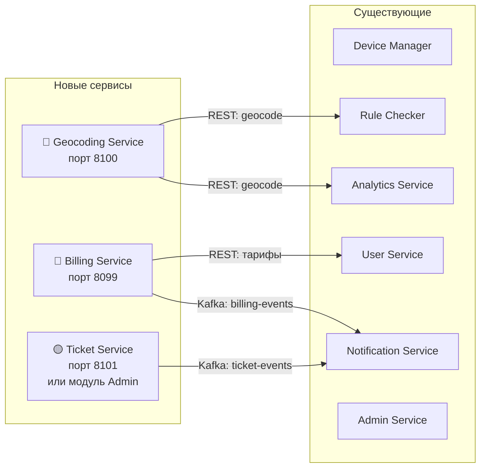
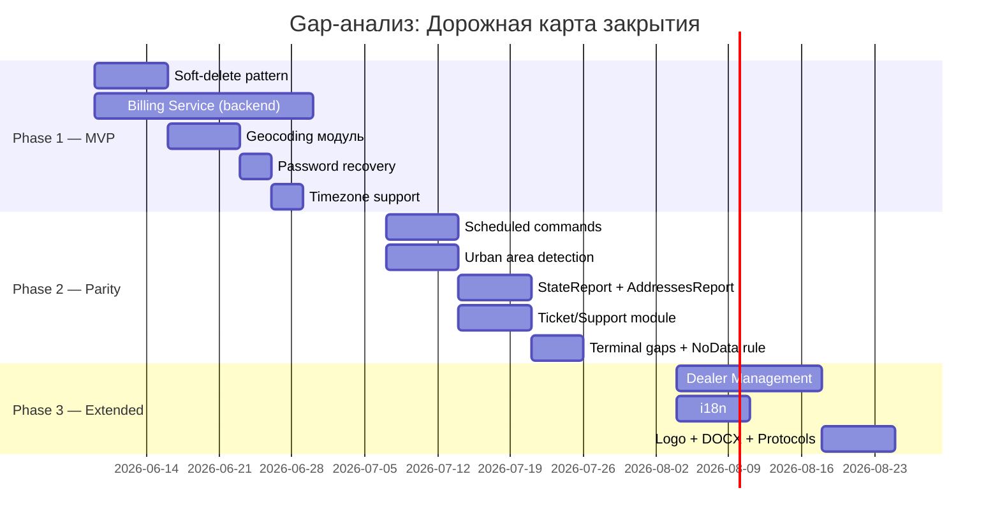

# Gap-анализ: Legacy Stels → Wayrecall Tracker

> Тег: `АКТУАЛЬНО` | Обновлён: `2026-06-02` | Версия: `1.0`

## Цель документа

Сравнение функциональности **Legacy Stels** (Java/Scala, Spring MVC, MongoDB/PostGIS, Ext Direct, ~205+ файлов в monitoring, ~140 файлов в packreceiver) с **новой платформой Wayrecall Tracker** (14 микросервисов, Scala 3 + ZIO 2).

**Вопрос:** Какие сервисы/модули ещё нужно реализовать, чтобы покрыть **весь** функционал старого Stels?

---

## Содержание

1. [Сводная матрица покрытия](#1-сводная-матрица-покрытия)
2. [Полностью покрытые функции](#2-полностью-покрытые-функции)
3. [Частично покрытые функции](#3-частично-покрытые-функции)
4. [Непокрытые функции (GAPS)](#4-непокрытые-функции-gaps)
5. [Протоколы GPS трекеров](#5-протоколы-gps-трекеров)
6. [Рекомендации по сервисам](#6-рекомендации-по-сервисам)
7. [Приоритеты реализации](#7-приоритеты-реализации)
8. [Дорожная карта](#8-дорожная-карта)

---

## 1. Сводная матрица покрытия

### Легенда

| Статус | Значение |
|--------|----------|
| ✅ ПОЛНОСТЬЮ | Функция реализована и покрывает legacy |
| 🟡 ЧАСТИЧНО | Базовая реализация есть, но не все сценарии |
| ❌ НЕТ | Функция отсутствует в новой системе |
| 🔵 УЛУЧШЕНО | Реализовано лучше, чем в legacy |

### Матрица по функциональным областям

| Область | Legacy (Stels) | Новая система | Статус | Комментарий |
|---------|---------------|---------------|--------|-------------|
| **GPS приём по TCP** | packreceiver (Netty 3→4) | Connection Manager | ✅ | 18 протоколов vs ~22 legacy |
| **Парсинг протоколов** | core/ (TeltonikaPackReceiver, Wialon, Ruptela...) | CM protocol/ | 🟡 | 18/22 протоколов, 4 minor missing |
| **Команды на трекер** | DeviceCommander, StoredDeviceCommandsQueue | Device Manager + CM | 🟡 | Базовые OK, EventedObjectCommander не полностью |
| **CRUD устройств** | ObjectAggregate, ObjectData, ObjectSettings | Device Manager | ✅ | REST API полностью |
| **История GPS** | MongoDB collections | History Writer → TimescaleDB | 🔵 | Лучше: TimescaleDB с compression и retention |
| **Геозоны** | GeozonesData (6 методов), PostGIS | Rule Checker | ✅ | PostGIS + Spatial Grid |
| **Уведомления о скорости** | SpeedNotificationRule | Rule Checker | ✅ | |
| **Уведомления о геозонах** | GeozoneNotificationRule | Rule Checker + Notification Service | ✅ | |
| **Датчики/топливо** | SensorsList, FuelingReportService | Sensors Service | ✅ | Калибровка, слив/заправка |
| **ТО по пробегу** | MaintenanceService (3 метода) | Maintenance Service | ✅ | Расширено: моточасы, календарь |
| **Email/SMS уведомления** | SMSPayer, Spring Mail | Notification Service | 🟡 | Email ✅, SMS 🟡 (нет провайдера), Push ✅, Telegram ✅ |
| **Ретрансляция Wialon** | WialonRealTimeRetranslator, RetranslationTask | Integration Service | ✅ | + webhooks, Navixy |
| **Отчёты** | 8 типов (Moving, Parking, Fueling, GroupPath...) | Analytics Service | 🟡 | 6/8 типов, StateReport и AddressesReport отсутствуют |
| **Экспорт PDF/XLS/CSV** | ExcelExporter, AbstractReportPrinter | Analytics Service | 🟡 | PDF/CSV ✅, XLS 🟡, DOCX ❌ |
| **Пользователи/роли** | UserAggregate (Axon CQRS), UsersService | User Service | ✅ | RBAC, организации |
| **Аутентификация** | Spring Security (sessions) | API Gateway + Auth (JWT) | 🔵 | Лучше: JWT, OAuth 2.0, API Keys |
| **Web UI (карта)** | ExtJS + OpenLayers | React + Leaflet | 🔵 | Современный стек |
| **Real-time позиции** | Long polling (getUpdatedAfter, 2с) | WebSocket Service | 🔵 | Лучше: WebSocket вместо polling |
| **Биллинг** | Axon CQRS (30+ файлов) | Billing Service (8099) | ✅ | 80 тестов, provider-agnostic |
| **Тикеты/заявки** | TicketAggregate (Axon CQRS) | Ticket Service (8101) | ✅ | 58 тестов, диалоги, уведомления |
| **Поддержка** | SupportRequestDAO, SupportEmailNotificationDAO | — | ❌ | Нет сервиса |
| **Дилеры** | DealersService, DealersTariffPlans | — | ❌ | Нет модуля |
| **Группы объектов** | GroupsOfObjects | User Service (частично) | 🟡 | Базовая группировка, без вложенности |
| **Корзина (soft delete)** | RecycleBinStoreManager, RemovalRestorationManager | — | ❌ | Нет механизма |
| **Городские зоны** | UrbanGeometry, UrbanSTRtree, PointInUrbanArea | — | ❌ | Нет модуля |
| **Reverse geocoding** | regeocode(lon, lat) | — | ❌ | Нет сервиса |
| **Тайловый прокси** | OSMTilesCache, DeegreeServlet | — | ❌ | Нет, фронтенд обращается напрямую |
| **Sleeper/block** | SleeperMesService, SleeperNotificationDetector | — | ❌ | Нет модуля |
| **Scheduled команды** | EventedObjectCommander (blockAtDate, afterStop, afterIgnition) | Device Manager (частично) | 🟡 | Базовые команды есть, scheduled нет |
| **Пароль recovery** | PasswordRecoveryController | Auth Service (planned) | 🟡 | Спроектировано, не реализовано |
| **Локализация** | LocalizationManager, localizations/ | — | ❌ | Нет системы i18n |
| **ОДСМосру** | modules/odsmosru/ (SOAP, Resender, Sender) | Integration Service (planned) | 🟡 | Описано как outbound, не реализовано |
| **Permissions CRUD** | PermissionAggregate (Axon CQRS) | User Service (RBAC) | ✅ | Переосмыслено через RBAC |
| **NIS ретрансляция** | NisRealtimeRetranslator | Integration Service | 🟡 | Общий механизм, специфика NIS не реализована |
| **Карта WMS** | PathReportWMS, DeegreeServlet | — | ❌ | Фронтенд отрисовывает клиентски |
| **Logo management** | LogoManager | — | ❌ | Нет модуля |
| **Timezone handling** | TimeZonesStore (getUserTimezone, loadObjects) | — | 🟡 | Частично через организацию |

---

## 2. Полностью покрытые функции (✅)

Эти области **не требуют дополнительной работы** — реализованы полностью или улучшены:

### 2.1 GPS приём и хранение
- **Connection Manager** принимает TCP от трекеров, парсит 18 протоколов
- **History Writer** записывает в TimescaleDB (лучше MongoDB: compression, retention, continuous aggregates)
- **Device Manager** — полный CRUD устройств

### 2.2 Бизнес-правила и уведомления
- **Rule Checker** — геозоны (PostGIS + Spatial Grid), скорость
- **Notification Service** — email, push (FCM), Telegram, webhook
- **Sensors Service** — калибровка, слив/заправка, события
- **Maintenance Service** — ТО по пробегу, моточасам, дате

### 2.3 Интеграции и аналитика
- **Integration Service** — Wialon, Navixy, webhooks (расширено по сравнению с legacy)
- **Analytics Service** — 6 типов отчётов с экспортом
- **User Service** — RBAC, организации, приглашения

### 2.4 Улучшения (🔵)
- **JWT + OAuth 2.0** вместо Spring Security sessions
- **WebSocket** вместо long polling (2с)
- **TimescaleDB** вместо MongoDB для GPS данных
- **React + Leaflet** вместо ExtJS + OpenLayers

---

## 3. Частично покрытые функции (🟡)

Требуют **дополнения** в существующих сервисах:

### 3.1 Протоколы GPS (18/22)

| # | Протокол | Legacy | Новая система | Статус |
|---|----------|--------|---------------|--------|
| 1 | Teltonika Codec 8/8E | ✅ TeltonikaPackReceiver | ✅ | ✅ |
| 2 | Wialon IPS 1.0/2.0 | ✅ WialonPackReceiver, WialonIPS2Server | ✅ | ✅ |
| 3 | Ruptela | ✅ RuptelaNettyServer, RuptelaPackReceiver | ✅ | ✅ |
| 4 | NavTelecom FLEX | ✅ NavTelecomNettyServer | ✅ | ✅ |
| 5 | Galileosky | ✅ GalileoskyServer | ✅ | ✅ |
| 6 | Gosafe | ✅ GosafeNettyServer | ✅ | ✅ |
| 7 | EGTS | ✅ EgtsProxyServer | ✅ | ✅ |
| 8 | SkyPatrol | ✅ SkyPatrolNettyServer | ✅ | ✅ |
| 9 | TK102 | ✅ TK102Server | ✅ | ✅ |
| 10 | TK103 | ✅ TK103Server | ✅ | ✅ |
| 11 | ADM 1.07 | ✅ ADM1_07Server | ✅ | ✅ |
| 12 | Arnavi | ✅ ArnaviServer | ✅ | ✅ |
| 13 | Autophone Mayak | ✅ AutophoneMayakServer | ✅ | ✅ |
| 14 | GL06 | ✅ GL06Server | ✅ | ✅ |
| 15 | GT/LT3MT1 | ✅ GTLT3MT1Server | ✅ | ✅ |
| 16 | DTM | ✅ DTMServer | ✅ | ✅ |
| 17 | Zudo | ✅ ZudoServer | ✅ | ✅ |
| 18 | Skysim | ✅ SkysimNettyServer | ✅ | ✅ |
| 19 | MicroMayak | ✅ MicroMayakServer | ❌ | **GAP** — мало устройств, низкий приоритет |
| 20 | Autophone Mayak 7 | ✅ AutophoneMayak7 | ❌ | **GAP** — новоя ревизия Mayak |
| 21 | NIS | ✅ Nis (ретрансляция) | 🟡 | Ретрансляция через Integration Service |
| 22 | SimpleServer | ✅ SimpleServer (тестовый) | — | Тестовый, не нужен |

**Вывод:** 18 из 22 протоколов покрыто. Отсутствуют MicroMayak и AutophoneMayak7 — **низкий приоритет**, можно добавить позже.

### 3.2 Команды на трекер

Legacy **EventedObjectCommander** поддерживает:
- `sendBlockCommandAtDate` — заблокировать в заданное время
- `sendBlockAfterStop` — заблокировать после остановки
- `sendBlockAfterIgnition` — заблокировать после зажигания
- `countTasks` / `cancelTasks` — управление очередью

**Текущее состояние:** Device Manager отправляет команды немедленно. Нужно добавить:
- [ ] Планировщик команд (cron-like: executeAt, condition-based)
- [ ] Условные команды (выполнить при событии: afterStop, afterIgnition)
- [ ] Управление очередью команд (count, cancel, priority)

### 3.3 Отчёты (6/8 типов)

| Тип отчёта | Legacy | Новая система | Статус |
|------------|--------|---------------|--------|
| Moving Report | ✅ MovingReport | ✅ | ✅ |
| Parking Report | ✅ ParkingReport | ✅ | ✅ |
| Fueling Report | ✅ FuelingReport | ✅ | ✅ |
| Group Path Report | ✅ GroupPathReport | ✅ | ✅ |
| Movement Stats | ✅ MovementStatsReport, MovingGroupReport | ✅ | ✅ |
| Events Report | ✅ EventsReport | ✅ | ✅ |
| **State Report** | ✅ StateReport | ❌ | **GAP** — статус устройств |
| **Addresses Report** | ✅ AddressesReport, AddressesReportGenerator | ❌ | **GAP** — нужен geocoding |

**Экспорт:**
- PDF — ✅ (через iText или Apache PDFBox)
- XLS — 🟡 (через Apache POI, не протестировано)
- CSV — ✅
- DOCX — ❌ (был в legacy через AbstractReportPrinter)

### 3.4 SMS провайдер

Legacy использует `SMSPayer` — конкретный SMS провайдер. В Notification Service архитектура готова, но нет подключённого SMS-шлюза.

### 3.5 Группы объектов

Legacy `GroupsOfObjects` — дерево групп с вложенностью. В User Service — плоская группировка по tag'ам.

---

## 4. Непокрытые функции (GAPS) ❌

### 4.1 🔴 КРИТИЧЕСКИЕ (нужны для production)

#### GAP-1: Billing Service (Backend) — ✅ РЕАЛИЗОВАНО

**Реализовано:** `services/billing-service/` — Scala 3 + ZIO 2, порт 8099, 80 тестов (100% pass).  
Включает: Account, TariffPlan, Subscription, Payment, Invoice, FeeProcessor.  
Provider-agnostic оплата (Тинькофф, Сбер, YooKassa, Mock). Kafka: billing-events, billing-commands.  
**GitHub:** https://github.com/revarewerd/billing-service

<details><summary>Предыдущий анализ (legacy)</summary>

**Legacy:** 30+ файлов Axon CQRS
```
AccountAggregate, AccountData, AccountEventHandler, AccountRepository
EquipmentAggregate, EquipmentData, EquipmentStoreService
TariffPlanAggregate, TariffPlanCommands, TariffPlanEvents
DealersService, DealersTariffPlans, DealerMonthlyPaymentService
MonthlyPaymentService, PaymentClientService, PaymentServer
SubscriptionFeeList, BalanceHistoryStoreService
NotificationPaymentList
```

**Функциональность:**
- Управление тарифными планами (CRUD, привязка к дилерам)
- Подписки на оборудование (Equipment — привязка устройств к аккаунтам)
- Ежемесячные списания (MonthlyPaymentService)
- Баланс и история операций (BalanceHistoryStoreService)
- Дилерская сеть (DealersService, DealersTariffPlans)
- Уведомления об оплате (NotificationPaymentList)
- Блокировка при неоплате (DealerBlockingCommand)

**Текущее:** `web-billing` — только React shell, **нет backend-сервиса**.

**Рекомендация:** Создать **Billing Service** (Scala 3 + ZIO 2 + PostgreSQL):
- Порт: 8099
- Основные сущности: Account, TariffPlan, Subscription, Payment, Invoice
- API: REST для управления биллингом
- Kafka: consume device-events для расчёта пробега/моточасов
- Интеграция с платёжными системами (Stripe/YooKassa)

</details>

#### GAP-2: Reverse Geocoding Service

**Legacy:** `regeocode(lon, lat)` — MapObjects контроллер, используется в отчётах и UI.

**Функциональность:**
- Преобразование координат в адрес (lon, lat → "ул. Ленина, 42, Москва")
- Используется повсеместно: карта, отчёты (AddressesReport), события

**Рекомендация:** Реализовать как **модуль в Analytics Service** или **отдельный Geocoding Service**:
- Вариант A: обёртка над Nominatim (self-hosted OSM geocoder) — бесплатно
- Вариант B: Google Maps Geocoding API — платно, точнее
- Вариант C: Yandex Geocoder API — для РФ точнее
- Кэширование результатов в Redis (key: `geocode:{lat_rounded}:{lon_rounded}`)
- Порт: 8100 (если отдельный)

#### GAP-3: Recycle Bin (Soft Delete)

**Legacy:** `RecycleBinStoreManager`, `RemovalRestorationManager`

**Функциональность:**
- Удалённые объекты (устройства, организации, пользователи) попадают в корзину
- Возможность восстановить в течение N дней
- Автоматическая очистка после retention period

**Рекомендация:** Реализовать **паттерн soft-delete** в каждом сервисе:
- Поле `deleted_at TIMESTAMPTZ NULL` в таблицах
- WHERE-clause `deleted_at IS NULL` по умолчанию
- REST: `DELETE /api/devices/{id}` → soft delete
- REST: `POST /api/devices/{id}/restore` → restore
- REST: `GET /api/trash?type=device` → список удалённых
- Cron job: очистка записей с `deleted_at < NOW() - INTERVAL '30 days'`

### 4.2 🟡 СРЕДНИЕ (нужны для feature parity)

#### GAP-4: Ticket/Support System — ✅ РЕАЛИЗОВАНО

**Реализовано:** `services/ticket-service/` — Scala 3 + ZIO 2, порт 8101, 58 тестов (100% pass).  
Включает: Тикеты, диалоги (User ↔ Support), статусная модель, настройки уведомлений.  
Kafka: ticket-events. Категории: Equipment, Program, Finance.  
**GitHub:** https://github.com/revarewerd/ticket-service

<details><summary>Предыдущий анализ (legacy)</summary>

**Legacy:** 8+ файлов (Axon CQRS)
```
TicketAggregate, TicketCommands, TicketEvents, TicketEventsHandler, TicketsService
SupportRequestDAO, SupportRequestEDS, SupportEmailNotificationDAO
```

**Функциональность:**
- Создание/отслеживание тикетов (заявки пользователей)
- Workflow: Created → InProgress → WaitingForResponse → Resolved → Closed
- Email уведомления по статусам
- Привязка к организации и пользователю

**Рекомендация:** Реализовать как **модуль в Admin Service** (простой вариант) или **отдельный Ticket Service** (если нужен полный helpdesk):
- Таблицы: `tickets`, `ticket_comments`, `ticket_attachments`
- REST API: CRUD тикетов, комментарии, смена статуса
- Kafka: produce `ticket-events` → Notification Service
- Порт: 8101 (если отдельный)

</details>

#### GAP-5: State Report + Addresses Report

**Legacy:** `StateReport`, `AddressesReport`, `AddressesReportGenerator`

**State Report:** Текущее состояние всех устройств организации (онлайн/офлайн, последняя позиция, скорость, батарея, сигнал). Используется для обзорного дашборда.

**Addresses Report:** Маршрут с адресами остановок. Требует reverse geocoding.

**Рекомендация:** Добавить в **Analytics Service**:
- STATE_REPORT: агрегация из Kafka/Redis last positions
- ADDRESSES_REPORT: зависит от GAP-2 (Geocoding) — реализовать после него

#### GAP-6: Urban Area Detection

**Legacy:** `UrbanGeometry`, `UrbanSTRtree`, `PointInUrbanArea`

**Функциональность:**
- Определение нахождения в черте города (urban/rural)
- Влияет на нормы расхода топлива (город vs трасса)
- Влияет на допустимую скорость (60 км/ч город, 90 км/ч трасса)
- Используется в отчётах и rules

**Рекомендация:** Добавить в **Rule Checker** как модуль:
- Загрузка полигонов городов из OSM/PostGIS
- STRtree индекс для быстрого поиска (как в legacy)
- Обогащение GPS-точки флагом `is_urban: Boolean`
- Передача в Kafka для использования в Sensors/Analytics сервисах

#### GAP-7: Scheduled/Conditional Commands

**Legacy:** `EventedObjectCommander`
```
sendBlockCommandAtDate(date) — заблокировать в заданную дату
sendBlockAfterStop           — заблокировать после остановки  
sendBlockAfterIgnition       — заблокировать после зажигания
countTasks                   — количество задач в очереди
cancelTasks                  — отмена задач
```

**Рекомендация:** Расширить **Device Manager**:
- Добавить таблицу `scheduled_commands` (device_id, command, execute_at, condition, status)
- Kafka consumer для GPS-событий (проверка условий: остановка, зажигание)
- Scheduler (ZIO Schedule) для команд по времени
- REST: `POST /api/devices/{id}/commands/schedule`
- REST: `GET /api/devices/{id}/commands/pending`
- REST: `DELETE /api/devices/{id}/commands/{cmdId}`

#### GAP-8: Localization (i18n)

**Legacy:** `LocalizationManager`, `conf/localizations/` (множество файлов)

**Функциональность:**
- Мультиязычность UI (русский, английский — минимум)
- Локализованные имена датчиков, типов событий
- Языковые настройки пользователя

**Рекомендация:**
- **Frontend:** React i18n (react-i18next) — отдельная задача
- **Backend:** Хранить translations в PostgreSQL или JSON-файлах
- API: `GET /api/i18n/{locale}` → JSON с переводами
- Реализовать в **User Service** (привязка к профилю пользователя)

### 4.3 🟢 НИЗКИЕ (nice-to-have, PostMVP)

#### GAP-9: Dealer Management

**Legacy:** `DealersService`, `DealersManagementMixin`, `DealersTariffPlans`

Управление дилерской сетью: каждый дилер имеет свои организации, тарифы, лимиты.

**Рекомендация:** Реализовать в **Billing Service** как модуль (PostMVP)

#### GAP-10: OSM Tile Proxy / Map WMS

**Legacy:** `OSMTilesCache`, `DeegreeServlet`, `PathReportWMS`

Кэширование тайлов OSM, WMS-сервисы для карты.

**Рекомендация:** **Не нужен.** Современный фронтенд (Leaflet) работает напрямую с тайл-серверами. Если нужен кэш — поставить Nginx с proxy_cache.

#### GAP-11: Logo Management

**Legacy:** `LogoManager`

Загрузка логотипов организаций для отчётов и UI.

**Рекомендация:** добавить в **User Service** — файловое хранилище (S3/MinIO), REST endpoint `POST /api/organizations/{id}/logo`.

#### GAP-12: Sleeper Block Detection

**Legacy:** `SleeperMesService`, `SleeperNotificationDetector`

Обнаружение "спящих" устройств (не отправляющих данные) и автоматические действия.

**Рекомендация:** Добавить в **Rule Checker** как тип правила `NoDataRule`:
- Порог: device не слал данные > N минут
- Действие: уведомление диспетчера, попытка команды GetCoordinates
- Уже частично покрыт `ntfNoData` правилом в Notification Service

#### GAP-13: Terminal Messages Service

**Legacy:** `TerminalMessagesGaps`, `TerminalMessagesService`, `TrackerMesService`

Анализ пропусков в потоке сообщений от трекера (gaps detection).

**Рекомендация:** Добавить в **Admin Service** как функцию мониторинга:
- Detect gaps: если device_id не прислал данных > expected_interval * 2
- Dashboard: показать устройства с пропусками и длительность gap'ов
- Alert: уведомление если gap > порог (конфигурируемый)

#### GAP-14: DOCX Export

**Legacy:** `AbstractReportPrinter` — экспорт отчётов в DOCX.

**Рекомендация:** Добавить в **Analytics Service** через Apache POI (docx4j). Низкий приоритет — PDF обычно достаточно.

#### GAP-15: Timezone Handling

**Legacy:** `TimeZonesStore` — выбор часового пояса пользователем.

**Рекомендация:** Добавить поле `timezone VARCHAR(50)` в User Service (таблица users). Передавать timezone в заголовке `X-Timezone` или параметре при формировании отчётов.

---

## 5. Протоколы GPS трекеров

### Сводка

| Метрика | Legacy | Новая система |
|---------|--------|---------------|
| Количество протоколов | ~22 | 18 |
| Покрытие | 100% | 82% |
| Основные (Teltonika, Wialon, Ruptela, NavTelecom) | ✅ | ✅ |

### Отсутствующие протоколы

| Протокол | Приоритет | Обоснование |
|----------|-----------|-------------|
| MicroMayak | Низкий | Мало устройств в эксплуатации |
| AutophoneMayak7 | Низкий | Новая ревизия, можно добавить по запросу |
| NIS (полная поддержка) | Средний | Ретрансляция через Integration Service, полноценный парсер не нужен если не принимаем напрямую |

---

## 6. Рекомендации по сервисам

### 6.1 Новые сервисы (нужно создать)



### 6.2 Расширения существующих сервисов

| Сервис | Что добавить | Объём | Приоритет |
|--------|-------------|-------|-----------|
| **Device Manager** | Scheduled/conditional commands (GAP-7) | M | Средний |
| **Rule Checker** | Urban area detection (GAP-6), NoData rule (GAP-12) | L | Средний |
| **Analytics Service** | StateReport, AddressesReport (GAP-5), DOCX export (GAP-14) | M | Средний |
| **User Service** | Timezone (GAP-15), Logo upload (GAP-11), Deep groups (GAP-5) | S | Низкий |
| **Admin Service** | Terminal gaps monitoring (GAP-13) | S | Низкий |
| **All services** | Soft-delete pattern (GAP-3) | M (суммарно L) | Высокий |
| **Frontend** | i18n — react-i18next (GAP-8) | M | Средний |

### Размеры оценок:
- **S** — 1-3 дня разработки
- **M** — 3-7 дней
- **L** — 1-3 недели

---

## 7. Приоритеты реализации

### Phase 1 — MVP Production Ready (4-6 недель)

| # | Задача | Приоритет | Объём |
|---|--------|-----------|-------|
| 1 | **Soft-delete** во всех сервисах | 🔴 | M (суммарно L) |
| 2 | **Billing Service** backend (базовый) | 🔴 | L (3 недели) |
| 3 | **Geocoding** модуль (Nominatim) | 🔴 | M |
| 4 | **Password recovery** в Auth Service | 🔴 | S |
| 5 | **Timezone** в User Service | 🟡 | S |

### Phase 2 — Feature Parity (4-6 недель)

| # | Задача | Приоритет | Объём |
|---|--------|-----------|-------|
| 6 | **Scheduled commands** в Device Manager | 🟡 | M |
| 7 | **Urban area detection** в Rule Checker | 🟡 | M |
| 8 | **StateReport + AddressesReport** | 🟡 | M |
| 9 | **Ticket/Support** (модуль в Admin) | 🟡 | M |
| 10 | **Terminal gaps monitoring** | 🟡 | S |
| 11 | **NoData rule** (sleeper detection) | 🟡 | S |

### Phase 3 — Extended Features (PostMVP)

| # | Задача | Приоритет | Объём |
|---|--------|-----------|-------|
| 12 | **Dealer Management** в Billing | 🟢 | L |
| 13 | **i18n** (frontend + backend) | 🟢 | M |
| 14 | **Logo management** | 🟢 | S |
| 15 | **DOCX export** | 🟢 | S |
| 16 | **MicroMayak / Mayak7** протоколы | 🟢 | S |
| 17 | **Deep nested groups** | 🟢 | M |

---

## 8. Дорожная карта



---

## Итог

### Статистика покрытия

| Категория | Количество | % |
|-----------|-----------|---|
| ✅ Полностью покрыто | 16 областей | 46% |
| 🔵 Улучшено | 4 области | 11% |
| 🟡 Частично покрыто | 10 областей | 29% |
| ❌ Не покрыто (GAPS) | 5 областей | 14% |
| **ИТОГО** | **35 областей** | **86% покрытие** (✅+🔵+🟡) |

### Ключевые действия

1. **Создать Billing Service** — самый большой GAP, 30+ файлов legacy не покрыто
2. **Создать Geocoding Service/модуль** — нужен для AddressesReport и UI
3. **Внедрить soft-delete** — базовая expectation пользователей
4. **Расширить Device Manager** — scheduled/conditional commands
5. **Расширить Rule Checker** — urban areas, NoData detection
6. **Дополнить Analytics** — StateReport, AddressesReport

**Общий вывод:** Новая система покрывает **~86%** функциональности legacy Stels. Для полного превосходства нужно создать **2-3 новых сервиса** (Billing, Geocoding, опционально Ticket) и расширить **5 существующих** — примерно **3-4 месяца работы** до полного feature parity.

---

*Следующий шаг:* начать с Phase 1 — Billing Service backend и Soft-delete pattern.
