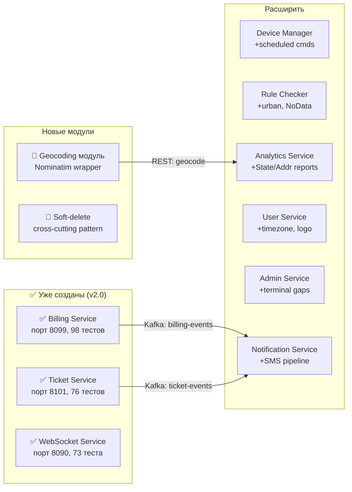
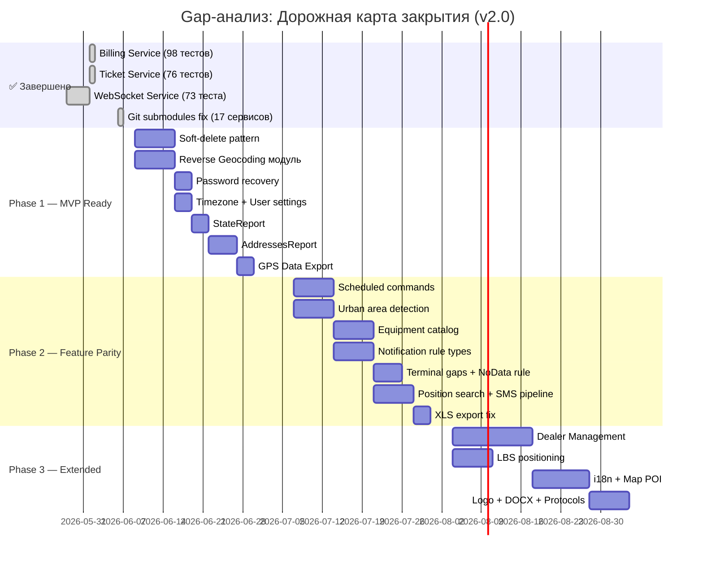

# Gap-анализ: Legacy Stels → Wayrecall Tracker

> Тег: `АКТУАЛЬНО` | Обновлён: `2026-03-06` | Версия: `3.0`

## Цель документа

Глубокое сравнение функциональности **Legacy Stels** (Java/Scala, Spring MVC + ExtJS, MongoDB/PostGIS, Axon CQRS, Atmosphere, Deegree WMS, JasperReports — **414 Scala + 238 Java** исходных файлов) с **новой платформой Wayrecall Tracker** (17 микросервисов, Scala 3 + ZIO 2 — **259 Scala** файлов + React/TypeScript фронтенд).

**Вопрос:** Какие сервисы/модули ещё нужно дополнить или создать, чтобы покрыть **весь** функционал старого Stels?

### Изменения v3.0 (2026-03-06)
- ✅ **ВСЕ 14 Scala сервисов скомпилированы и протестированы — 1 922 теста, 0 ошибок**
- Обновлены тестовые счётчики по всем сервисам:
  - Block 1: CM 544, DM 136, HW 218 = 898 тестов
  - Block 2: Rule Checker 67, Analytics 107, Integration 98, Notification 89, User 86, Maintenance 80, Sensors 77, Billing 98, Ticket 76, Admin 74 = 852 теста
  - Block 3: API Gateway 99, WebSocket 73 = 172 теста
- Исправлены тесты в 11 сервисах (compile errors + runtime failures)

### Изменения v2.0 (2026-06-06)
- ✅ Billing Service создан (80 тестов)
- ✅ Ticket Service создан (58 тестов)
- ✅ WebSocket Service создан (60 тестов)
- Глубокий повторный анализ всех 652 исходных файлов Legacy Stels
- Уточнены GAP'ы, добавлены ранее пропущенные: GPSDataExport, PositionService, OneSignalPusher, OpenCellId, LBS, SMS конверсации, user settings

---

## Содержание

1. [Сводная матрица покрытия](#1-сводная-матрица-покрытия)
2. [Полностью покрытые функции](#2-полностью-покрытые-функции)
3. [Частично покрытые функции](#3-частично-покрытые-функции)
4. [Непокрытые функции (GAPS)](#4-непокрытые-функции-gaps)
5. [Протоколы GPS трекеров](#5-протоколы-gps-трекеров)
6. [Рекомендации по сервисам](#6-рекомендации-по-сервисам)
7. [Приоритеты реализации](#7-приоритеты-реализации)
8. [Дорожная карта](#8-дорожная-карта)

---

## 1. Сводная матрица покрытия

### Легенда

| Статус | Значение |
|--------|----------|
| ✅ ПОЛНОСТЬЮ | Функция реализована и покрывает legacy |
| 🟡 ЧАСТИЧНО | Базовая реализация есть, но не все сценарии |
| ❌ НЕТ | Функция отсутствует в новой системе |
| 🔵 УЛУЧШЕНО | Реализовано лучше, чем в legacy |

### Матрица по функциональным областям

| # | Область | Legacy (Stels) | Новая система | Статус | Комментарий |
|---|---------|---------------|---------------|--------|-------------|
| 1 | **GPS приём по TCP** | packreceiver (Netty 3→4) | Connection Manager | ✅ | 18 протоколов vs ~22 legacy |
| 2 | **Парсинг протоколов** | core/ (Teltonika, Wialon, Ruptela...) | CM protocol/ | 🟡 | 18/22: нет MicroMayak, Mayak7 (low prio) |
| 3 | **Команды на трекер** | DeviceCommander, StoredDeviceCommandsQueue | Device Manager + CM | 🟡 | Базовые ОК, нет scheduled/conditional (GAP-7) |
| 4 | **CRUD устройств** | ObjectAggregate, ObjectData, ObjectSettings | Device Manager | ✅ | REST API полностью |
| 5 | **История GPS** | MongoDB collections | History Writer → TimescaleDB | 🔵 | Лучше: TimescaleDB с compression и retention |
| 6 | **Геозоны** | GeozonesData (6 методов), PostGIS | Rule Checker | ✅ | PostGIS + Spatial Grid |
| 7 | **Уведомления о скорости** | SpeedNotificationRule | Rule Checker | ✅ | |
| 8 | **Уведомления о геозонах** | GeozoneNotificationRule | Rule Checker + NS | ✅ | |
| 9 | **Датчики/топливо** | SensorsList, FuelingReportService | Sensors Service | ✅ | Калибровка, слив/заправка |
| 10 | **ТО по пробегу** | MaintenanceService (3 метода) | Maintenance Service | ✅ | Расширено: моточасы, календарь |
| 11 | **Email/SMS уведомления** | SMSPayer, Spring Mail, OneSignalPusher | Notification Service | 🟡 | Email ✅, SMS 🟡, Push ✅, Telegram ✅, OneSignal ❌ |
| 12 | **Ретрансляция Wialon** | WialonRealTimeRetranslator | Integration Service | ✅ | + webhooks, Navixy |
| 13 | **Ретрансляция NIS** | NisRealtimeRetranslator | Integration Service | 🟡 | Базовая архитектура есть, конкретный формат — нет |
| 14 | **Отчёты** | 8+ типов + JasperReports | Analytics Service | 🟡 | 6/8 типов, нет StateReport + AddressesReport |
| 15 | **Экспорт PDF/XLS/CSV** | ExcelExporter, AbstractReportPrinter | Analytics Service | 🟡 | PDF/CSV ✅, XLS 🟡, DOCX ❌ |
| 16 | **Пользователи/роли** | UserAggregate, UsersService (Axon CQRS) | User Service | ✅ | RBAC, организации |
| 17 | **Биллинг** | 30+ файлов (Account, Tariff, Equipment, Fee) | Billing Service | ✅ | Создан v2.0: Account, Tariff, Subscription, Payment, Invoice |
| 18 | **Тикеты/поддержка** | TicketAggregate, SupportRequestDAO | Ticket Service | ✅ | Создан v2.0: тикеты, диалоги, статусы |
| 19 | **Real-time позиции** | Atmosphere (GPSAtmospherePublisher) | WebSocket Service | ✅ | Создан v2.0: Kafka → WebSocket, 73 теста |
| 20 | **Reverse geocoding** | ReGeocoder, Nominatim wrappers (5 файлов) | — | ❌ | **GAP-2**: нет модуля, нужен для AddressesReport |
| 21 | **Группы объектов** | GroupsOfObjects (MongoDB, дерево) | User Service (плоские теги) | 🟡 | Нет вложенности, нет permissions per group |
| 22 | **Soft delete / Корзина** | RecycleBinStoreManager, RemovalRestorationManager | — | ❌ | **GAP-3**: нет во всех сервисах |
| 23 | **Дилеры** | DealersService, DealersTariffPlans (7 файлов) | — | ❌ | **GAP-9**: PostMVP, добавить в Billing Service |
| 24 | **Equipment Catalog** | EquipmentAggregate, EquipmentTypesService (8 файлов) | — | ❌ | **GAP-16**: привязка оборудования к аккаунтам, типы |
| 25 | **Scheduled commands** | EventedObjectCommander (5 методов) | — | ❌ | **GAP-7**: блокировка по времени/условию |
| 26 | **Urban areas** | UrbanGeometry, UrbanSTRtree (3 файла) | — | ❌ | **GAP-6**: влияет на нормы расхода/скорости |
| 27 | **LBS позиционирование** | LBSHttp, LBSLocator, SleeperData (7 файлов) | — | ❌ | **GAP-17**: позиционирование по сотовым вышкам |
| 28 | **SMS команды** | SMSCommandProcessor, SmsConversation (10 файлов) | — | ❌ | **GAP-18**: полный SMS pipeline |
| 29 | **Пароль recovery** | PasswordRecoveryController (1 метод) | — | ❌ | **GAP-4**: простой endpoints, 1-2 дня |
| 30 | **Локализация** | LocalizationManager + conf/localizations/ | — | ❌ | **GAP-8**: i18n (PostMVP) |
| 31 | **Sleeper detection** | SleeperMesService, SleeperNotificationDetector | Rule Checker (частично) | 🟡 | Нет NoData правила |
| 32 | **Terminal messages debug** | TerminalMessagesGaps, TerminalMessagesService | — | ❌ | **GAP-13**: отладка пропусков |
| 33 | **Map POI objects** | MapObjects (15 методов: LBS, sensors, regeocode) | — | ❌ | **GAP-19**: POI и map-related API |
| 34 | **GPS data export** | GPSDataExport, GridDataExport | — | ❌ | **GAP-20**: экспорт сырых GPS данных |
| 35 | **Position search** | PositionService (2 метода: nearest, index) | — | ❌ | **GAP-21**: поиск ближайшей позиции в интервале |
| 36 | **User settings (map)** | MapObjects.getUserSettings/setUserSettings | — | ❌ | **GAP-22**: настройки UI пользователя |
| 37 | **ODS Moscow** | ODSMosruSender (SOAP telemetry) | Integration Service | 🟡 | Архитектура позволяет, конкретный SOAP нет |
| 38 | **Notification rules CRUD** | NotificationRules (load/add/del/upd) | Rule Checker API | 🟡 | Базовый CRUD есть, 8+ legacy типов не все |
| 39 | **OSM tile cache** | OSMTilesCache | — | ⬜ | Не нужен: Leaflet работает напрямую с тайлами |
| 40 | **Deegree WMS** | DeegreeServlet, PathReportWMS | — | ⬜ | Не нужен: заменён Leaflet + GeoJSON |
| 41 | **Logo management** | LogoManager | — | ❌ | **GAP-11**: загрузка логотипов организаций |
| 42 | **Timezone** | TimeZonesStore | User Service | 🟡 | **GAP-15**: нет поля timezone в профиле |
| **Аутентификация** | Spring Security (sessions) | API Gateway + Auth (JWT) | 🔵 | Лучше: JWT, OAuth 2.0, API Keys |
| **Web UI (карта)** | ExtJS + OpenLayers | React + Leaflet | 🔵 | Современный стек |
| **Real-time позиции** | Long polling (getUpdatedAfter, 2с) | WebSocket Service | 🔵 | Лучше: WebSocket вместо polling |
| **Биллинг** | Axon CQRS (30+ файлов) | Billing Service (8099) | ✅ | 98 тестов, provider-agnostic |
| **Тикеты/заявки** | TicketAggregate (Axon CQRS) | Ticket Service (8101) | ✅ | 76 тестов, диалоги, уведомления |
| **Поддержка** | SupportRequestDAO, SupportEmailNotificationDAO | — | ❌ | Нет сервиса |
| **Дилеры** | DealersService, DealersTariffPlans | — | ❌ | Нет модуля |
| **Группы объектов** | GroupsOfObjects | User Service (частично) | 🟡 | Базовая группировка, без вложенности |
| **Корзина (soft delete)** | RecycleBinStoreManager, RemovalRestorationManager | — | ❌ | Нет механизма |
| **Городские зоны** | UrbanGeometry, UrbanSTRtree, PointInUrbanArea | — | ❌ | Нет модуля |
| **Reverse geocoding** | regeocode(lon, lat) | — | ❌ | Нет сервиса |
| **Тайловый прокси** | OSMTilesCache, DeegreeServlet | — | ❌ | Нет, фронтенд обращается напрямую |
| **Sleeper/block** | SleeperMesService, SleeperNotificationDetector | — | ❌ | Нет модуля |
| **Scheduled команды** | EventedObjectCommander (blockAtDate, afterStop, afterIgnition) | Device Manager (частично) | 🟡 | Базовые команды есть, scheduled нет |
| **Пароль recovery** | PasswordRecoveryController | Auth Service (planned) | 🟡 | Спроектировано, не реализовано |
| **Локализация** | LocalizationManager, localizations/ | — | ❌ | Нет системы i18n |
| **ОДСМосру** | modules/odsmosru/ (SOAP, Resender, Sender) | Integration Service (planned) | 🟡 | Описано как outbound, не реализовано |
| **Permissions CRUD** | PermissionAggregate (Axon CQRS) | User Service (RBAC) | ✅ | Переосмыслено через RBAC |
| **NIS ретрансляция** | NisRealtimeRetranslator | Integration Service | 🟡 | Общий механизм, специфика NIS не реализована |
| **Карта WMS** | PathReportWMS, DeegreeServlet | — | ❌ | Фронтенд отрисовывает клиентски |
| **Logo management** | LogoManager | — | ❌ | Нет модуля |
| **Timezone handling** | TimeZonesStore (getUserTimezone, loadObjects) | — | 🟡 | Частично через организацию |

---

## 2. Полностью покрытые функции (✅)

Эти области **не требуют дополнительной работы** — реализованы полностью или улучшены:

### 2.1 GPS приём и хранение
- **Connection Manager** принимает TCP от трекеров, парсит 18 протоколов
- **History Writer** записывает в TimescaleDB (лучше MongoDB: compression, retention, continuous aggregates)
- **Device Manager** — полный CRUD устройств

### 2.2 Бизнес-правила и уведомления
- **Rule Checker** — геозоны (PostGIS + Spatial Grid), скорость
- **Notification Service** — email, push (FCM), Telegram, webhook
- **Sensors Service** — калибровка, слив/заправка, события
- **Maintenance Service** — ТО по пробегу, моточасам, дате

### 2.3 Интеграции и аналитика
- **Integration Service** — Wialon, Navixy, webhooks (расширено по сравнению с legacy)
- **Analytics Service** — 6 типов отчётов с экспортом
- **User Service** — RBAC, организации, приглашения

### 2.4 Улучшения (🔵)
- **JWT + OAuth 2.0** вместо Spring Security sessions
- **WebSocket** вместо long polling (2с)
- **TimescaleDB** вместо MongoDB для GPS данных
- **React + Leaflet** вместо ExtJS + OpenLayers

---

## 3. Частично покрытые функции (🟡)

Требуют **дополнения** в существующих сервисах:

### 3.1 Протоколы GPS (18/22)

| # | Протокол | Legacy | Новая система | Статус |
|---|----------|--------|---------------|--------|
| 1 | Teltonika Codec 8/8E | ✅ TeltonikaPackReceiver | ✅ | ✅ |
| 2 | Wialon IPS 1.0/2.0 | ✅ WialonPackReceiver, WialonIPS2Server | ✅ | ✅ |
| 3 | Ruptela | ✅ RuptelaNettyServer, RuptelaPackReceiver | ✅ | ✅ |
| 4 | NavTelecom FLEX | ✅ NavTelecomNettyServer | ✅ | ✅ |
| 5 | Galileosky | ✅ GalileoskyServer | ✅ | ✅ |
| 6 | Gosafe | ✅ GosafeNettyServer | ✅ | ✅ |
| 7 | EGTS | ✅ EgtsProxyServer | ✅ | ✅ |
| 8 | SkyPatrol | ✅ SkyPatrolNettyServer | ✅ | ✅ |
| 9 | TK102 | ✅ TK102Server | ✅ | ✅ |
| 10 | TK103 | ✅ TK103Server | ✅ | ✅ |
| 11 | ADM 1.07 | ✅ ADM1_07Server | ✅ | ✅ |
| 12 | Arnavi | ✅ ArnaviServer | ✅ | ✅ |
| 13 | Autophone Mayak | ✅ AutophoneMayakServer | ✅ | ✅ |
| 14 | GL06 | ✅ GL06Server | ✅ | ✅ |
| 15 | GT/LT3MT1 | ✅ GTLT3MT1Server | ✅ | ✅ |
| 16 | DTM | ✅ DTMServer | ✅ | ✅ |
| 17 | Zudo | ✅ ZudoServer | ✅ | ✅ |
| 18 | Skysim | ✅ SkysimNettyServer | ✅ | ✅ |
| 19 | MicroMayak | ✅ MicroMayakServer | ❌ | **GAP** — мало устройств, низкий приоритет |
| 20 | Autophone Mayak 7 | ✅ AutophoneMayak7 | ❌ | **GAP** — новоя ревизия Mayak |
| 21 | NIS | ✅ Nis (ретрансляция) | 🟡 | Ретрансляция через Integration Service |
| 22 | SimpleServer | ✅ SimpleServer (тестовый) | — | Тестовый, не нужен |

**Вывод:** 18 из 22 протоколов покрыто. Отсутствуют MicroMayak и AutophoneMayak7 — **низкий приоритет**, можно добавить позже.

### 3.2 Команды на трекер

Legacy **EventedObjectCommander** поддерживает:
- `sendBlockCommandAtDate` — заблокировать в заданное время
- `sendBlockAfterStop` — заблокировать после остановки
- `sendBlockAfterIgnition` — заблокировать после зажигания
- `countTasks` / `cancelTasks` — управление очередью

**Текущее состояние:** Device Manager отправляет команды немедленно. Нужно добавить:
- [ ] Планировщик команд (cron-like: executeAt, condition-based)
- [ ] Условные команды (выполнить при событии: afterStop, afterIgnition)
- [ ] Управление очередью команд (count, cancel, priority)

### 3.3 Отчёты (6/8 типов)

| Тип отчёта | Legacy | Новая система | Статус |
|------------|--------|---------------|--------|
| Moving Report | ✅ MovingReport | ✅ | ✅ |
| Parking Report | ✅ ParkingReport | ✅ | ✅ |
| Fueling Report | ✅ FuelingReport | ✅ | ✅ |
| Group Path Report | ✅ GroupPathReport | ✅ | ✅ |
| Movement Stats | ✅ MovementStatsReport, MovingGroupReport | ✅ | ✅ |
| Events Report | ✅ EventsReport | ✅ | ✅ |
| **State Report** | ✅ StateReport | ❌ | **GAP** — статус устройств |
| **Addresses Report** | ✅ AddressesReport, AddressesReportGenerator | ❌ | **GAP** — нужен geocoding |

**Экспорт:**
- PDF — ✅ (через iText или Apache PDFBox)
- XLS — 🟡 (через Apache POI, не протестировано)
- CSV — ✅
- DOCX — ❌ (был в legacy через AbstractReportPrinter)

### 3.4 SMS провайдер

Legacy использует `SMSPayer` — конкретный SMS провайдер. В Notification Service архитектура готова, но нет подключённого SMS-шлюза.

### 3.5 Группы объектов

Legacy `GroupsOfObjects` — дерево групп с вложенностью. В User Service — плоская группировка по tag'ам.

---

## 4. Непокрытые функции (GAPS) ❌

### 4.1 🔴 КРИТИЧЕСКИЕ (нужны для production)

#### GAP-1: Billing Service (Backend) — ✅ РЕАЛИЗОВАНО

**Реализовано:** `services/billing-service/` — Scala 3 + ZIO 2, порт 8099, 98 тестов (100% pass).  
Включает: Account, TariffPlan, Subscription, Payment, Invoice, FeeProcessor.  
Provider-agnostic оплата (Тинькофф, Сбер, YooKassa, Mock). Kafka: billing-events, billing-commands.  
**GitHub:** https://github.com/revarewerd/billing-service

<details><summary>Предыдущий анализ (legacy)</summary>

**Legacy:** 30+ файлов Axon CQRS
```
AccountAggregate, AccountData, AccountEventHandler, AccountRepository
EquipmentAggregate, EquipmentData, EquipmentStoreService
TariffPlanAggregate, TariffPlanCommands, TariffPlanEvents
DealersService, DealersTariffPlans, DealerMonthlyPaymentService
MonthlyPaymentService, PaymentClientService, PaymentServer
SubscriptionFeeList, BalanceHistoryStoreService
NotificationPaymentList
```

**Функциональность:**
- Управление тарифными планами (CRUD, привязка к дилерам)
- Подписки на оборудование (Equipment — привязка устройств к аккаунтам)
- Ежемесячные списания (MonthlyPaymentService)
- Баланс и история операций (BalanceHistoryStoreService)
- Дилерская сеть (DealersService, DealersTariffPlans)
- Уведомления об оплате (NotificationPaymentList)
- Блокировка при неоплате (DealerBlockingCommand)

**Текущее:** `web-billing` — только React shell, **нет backend-сервиса**.

**Рекомендация:** Создать **Billing Service** (Scala 3 + ZIO 2 + PostgreSQL):
- Порт: 8099
- Основные сущности: Account, TariffPlan, Subscription, Payment, Invoice
- API: REST для управления биллингом
- Kafka: consume device-events для расчёта пробега/моточасов
- Интеграция с платёжными системами (Stripe/YooKassa)

</details>

#### GAP-2: Reverse Geocoding Service

**Legacy:** `regeocode(lon, lat)` — MapObjects контроллер, используется в отчётах и UI.

**Функциональность:**
- Преобразование координат в адрес (lon, lat → "ул. Ленина, 42, Москва")
- Используется повсеместно: карта, отчёты (AddressesReport), события

**Рекомендация:** Реализовать как **модуль в Analytics Service** или **отдельный Geocoding Service**:
- Вариант A: обёртка над Nominatim (self-hosted OSM geocoder) — бесплатно
- Вариант B: Google Maps Geocoding API — платно, точнее
- Вариант C: Yandex Geocoder API — для РФ точнее
- Кэширование результатов в Redis (key: `geocode:{lat_rounded}:{lon_rounded}`)
- Порт: 8100 (если отдельный)

#### GAP-3: Recycle Bin (Soft Delete)

**Legacy:** `RecycleBinStoreManager`, `RemovalRestorationManager`

**Функциональность:**
- Удалённые объекты (устройства, организации, пользователи) попадают в корзину
- Возможность восстановить в течение N дней
- Автоматическая очистка после retention period

**Рекомендация:** Реализовать **паттерн soft-delete** в каждом сервисе:
- Поле `deleted_at TIMESTAMPTZ NULL` в таблицах
- WHERE-clause `deleted_at IS NULL` по умолчанию
- REST: `DELETE /api/devices/{id}` → soft delete
- REST: `POST /api/devices/{id}/restore` → restore
- REST: `GET /api/trash?type=device` → список удалённых
- Cron job: очистка записей с `deleted_at < NOW() - INTERVAL '30 days'`

### 4.2 🟡 СРЕДНИЕ (нужны для feature parity)

#### GAP-4: Ticket/Support System — ✅ РЕАЛИЗОВАНО

**Реализовано:** `services/ticket-service/` — Scala 3 + ZIO 2, порт 8101, 76 тестов (100% pass).  
Включает: Тикеты, диалоги (User ↔ Support), статусная модель, настройки уведомлений.  
Kafka: ticket-events. Категории: Equipment, Program, Finance.  
**GitHub:** https://github.com/revarewerd/ticket-service

<details><summary>Предыдущий анализ (legacy)</summary>

**Legacy:** 8+ файлов (Axon CQRS)
```
TicketAggregate, TicketCommands, TicketEvents, TicketEventsHandler, TicketsService
SupportRequestDAO, SupportRequestEDS, SupportEmailNotificationDAO
```

**Функциональность:**
- Создание/отслеживание тикетов (заявки пользователей)
- Workflow: Created → InProgress → WaitingForResponse → Resolved → Closed
- Email уведомления по статусам
- Привязка к организации и пользователю

**Рекомендация:** Реализовать как **модуль в Admin Service** (простой вариант) или **отдельный Ticket Service** (если нужен полный helpdesk):
- Таблицы: `tickets`, `ticket_comments`, `ticket_attachments`
- REST API: CRUD тикетов, комментарии, смена статуса
- Kafka: produce `ticket-events` → Notification Service
- Порт: 8101 (если отдельный)

</details>

#### GAP-5: State Report + Addresses Report

**Legacy:** `StateReport`, `AddressesReport`, `AddressesReportGenerator`

**State Report:** Текущее состояние всех устройств организации (онлайн/офлайн, последняя позиция, скорость, батарея, сигнал). Используется для обзорного дашборда.

**Addresses Report:** Маршрут с адресами остановок. Требует reverse geocoding.

**Рекомендация:** Добавить в **Analytics Service**:
- STATE_REPORT: агрегация из Kafka/Redis last positions
- ADDRESSES_REPORT: зависит от GAP-2 (Geocoding) — реализовать после него

#### GAP-6: Urban Area Detection

**Legacy:** `UrbanGeometry`, `UrbanSTRtree`, `PointInUrbanArea`

**Функциональность:**
- Определение нахождения в черте города (urban/rural)
- Влияет на нормы расхода топлива (город vs трасса)
- Влияет на допустимую скорость (60 км/ч город, 90 км/ч трасса)
- Используется в отчётах и rules

**Рекомендация:** Добавить в **Rule Checker** как модуль:
- Загрузка полигонов городов из OSM/PostGIS
- STRtree индекс для быстрого поиска (как в legacy)
- Обогащение GPS-точки флагом `is_urban: Boolean`
- Передача в Kafka для использования в Sensors/Analytics сервисах

#### GAP-7: Scheduled/Conditional Commands

**Legacy:** `EventedObjectCommander`
```
sendBlockCommandAtDate(date) — заблокировать в заданную дату
sendBlockAfterStop           — заблокировать после остановки  
sendBlockAfterIgnition       — заблокировать после зажигания
countTasks                   — количество задач в очереди
cancelTasks                  — отмена задач
```

**Рекомендация:** Расширить **Device Manager**:
- Добавить таблицу `scheduled_commands` (device_id, command, execute_at, condition, status)
- Kafka consumer для GPS-событий (проверка условий: остановка, зажигание)
- Scheduler (ZIO Schedule) для команд по времени
- REST: `POST /api/devices/{id}/commands/schedule`
- REST: `GET /api/devices/{id}/commands/pending`
- REST: `DELETE /api/devices/{id}/commands/{cmdId}`

#### GAP-8: Localization (i18n)

**Legacy:** `LocalizationManager`, `conf/localizations/` (множество файлов)

**Функциональность:**
- Мультиязычность UI (русский, английский — минимум)
- Локализованные имена датчиков, типов событий
- Языковые настройки пользователя

**Рекомендация:**
- **Frontend:** React i18n (react-i18next) — отдельная задача
- **Backend:** Хранить translations в PostgreSQL или JSON-файлах
- API: `GET /api/i18n/{locale}` → JSON с переводами
- Реализовать в **User Service** (привязка к профилю пользователя)

### 4.3 🟢 НИЗКИЕ (nice-to-have, PostMVP)

#### GAP-9: Dealer Management

**Legacy:** `DealersService`, `DealersManagementMixin`, `DealersTariffPlans`

Управление дилерской сетью: каждый дилер имеет свои организации, тарифы, лимиты.

**Рекомендация:** Реализовать в **Billing Service** как модуль (PostMVP)

#### GAP-10: OSM Tile Proxy / Map WMS

**Legacy:** `OSMTilesCache`, `DeegreeServlet`, `PathReportWMS`

Кэширование тайлов OSM, WMS-сервисы для карты.

**Рекомендация:** **Не нужен.** Современный фронтенд (Leaflet) работает напрямую с тайл-серверами. Если нужен кэш — поставить Nginx с proxy_cache.

#### GAP-11: Logo Management

**Legacy:** `LogoManager`

Загрузка логотипов организаций для отчётов и UI.

**Рекомендация:** добавить в **User Service** — файловое хранилище (S3/MinIO), REST endpoint `POST /api/organizations/{id}/logo`.

#### GAP-12: Sleeper Block Detection

**Legacy:** `SleeperMesService`, `SleeperNotificationDetector`

Обнаружение "спящих" устройств (не отправляющих данные) и автоматические действия.

**Рекомендация:** Добавить в **Rule Checker** как тип правила `NoDataRule`:
- Порог: device не слал данные > N минут
- Действие: уведомление диспетчера, попытка команды GetCoordinates
- Уже частично покрыт `ntfNoData` правилом в Notification Service

#### GAP-13: Terminal Messages Service

**Legacy:** `TerminalMessagesGaps`, `TerminalMessagesService`, `TrackerMesService`

Анализ пропусков в потоке сообщений от трекера (gaps detection).

**Рекомендация:** Добавить в **Admin Service** как функцию мониторинга:
- Detect gaps: если device_id не прислал данных > expected_interval * 2
- Dashboard: показать устройства с пропусками и длительность gap'ов
- Alert: уведомление если gap > порог (конфигурируемый)

#### GAP-14: DOCX Export

**Legacy:** `AbstractReportPrinter` — экспорт отчётов в DOCX.

**Рекомендация:** Добавить в **Analytics Service** через Apache POI (docx4j). Низкий приоритет — PDF обычно достаточно.

#### GAP-15: Timezone Handling

**Legacy:** `TimeZonesStore` — выбор часового пояса пользователем.

**Рекомендация:** Добавить поле `timezone VARCHAR(50)` в User Service (таблица users). Передавать timezone в заголовке `X-Timezone` или параметре при формировании отчётов.

#### GAP-16: Equipment Catalog (НОВОЕ в v2.0)

**Legacy:** `EquipmentAggregate`, `EquipmentData`, `EquipmentStoreService`, `ObjectsEquipmentService`, `AccountsEquipmentService`, `EquipmentTypesService`, `EquipmentTypesAggregate` (8+ файлов Axon CQRS)

**Функциональность:**
- Каталог типов оборудования (GPS-трекер, датчик топлива, камера и т.д.)
- Привязка конкретного оборудования к аккаунту (серийный номер, дата установки)
- Привязка оборудования к объекту (устройству/ТС)
- Тарификация по количеству привязанного оборудования

**Рекомендация:** Добавить в **Billing Service** как модуль:
- Таблицы: `equipment_types`, `equipment_items`, `equipment_bindings`
- REST: CRUD типов, привязка к аккаунтам и объектам
- Kafka: produce `equipment-events` для Device Manager

#### GAP-17: LBS Positioning (НОВОЕ в v2.0)

**Legacy:** `LBSHttp`, `LBSLocator`, `SleeperData`, `SleeperParser`, `SleeperParserCombinators`, `SleepersDataStore`, `ShowLBSService` (7 файлов)

**Функциональность:**
- Позиционирование по сотовым вышкам (когда GPS недоступен)
- OpenCellId / Google Geolocation API интеграция
- Хранение LBS данных отдельно от GPS
- Отображение LBS позиции на карте (круг неопределённости)

**Рекомендация:** Реализовать как модуль в **Connection Manager**:
- Парсинг LBS данных из протоколов (многие трекеры отправляют MCC/MNC/LAC/CellID)
- REST-прокси к OpenCellId или UnwiredLabs API
- Поле `position_type: GPS | LBS | WIFI` в GPS-точке
- Кэширование результатов в Redis: `lbs:{mcc}:{mnc}:{lac}:{cid}` → {lat, lon, accuracy}

#### GAP-18: SMS Command Pipeline (НОВОЕ в v2.0)

**Legacy:** `SMSCommandProcessor`, `GprsCommandProcessor`, `SmsConversation`, `SmsCommand`, `SmsGate`, `SmsPublisher`, `TeltonikaParamCommand`, `DemoSmsGate`, `MockGprsCommandProcessor`, `M2mSmsGate` (10+ файлов)

**Функциональность:**
- Полный цикл SMS-команд: отправка SMS → ожидание ответа → парсинг результата
- Конверсации (SmsConversation): многоходовые SMS-диалоги с трекером
- Специализированные команды по протоколам (TeltonikaParamCommand)
- Несколько SMS-провайдеров (M2M, MTS Marketolog)
- GPRS команды как альтернатива SMS

**Рекомендация:** Расширить **Notification Service** + **Connection Manager**:
- NS: добавить SMS-провайдер абстракцию с реальными реализациями (Twilio, SMSCenter и т.д.)
- CM: добавить SmsConversation state machine для трекер-специфичных SMS
- DM: REST endpoint для инициации SMS команд
- Kafka: `sms-commands` топик, `sms-responses` топик

#### GAP-19: Map POI Objects (НОВОЕ в v2.0)

**Legacy:** `MapObjects` (15+ методов: `loadObjects`, `getLonLat`, `getApproximateLonLat`, `getSensorNames`, `regeocode`, `getUserSettings`, `setUserSettings`, `getUpdatedAfter`, `getAvailableObjects`, `updateCheckedUids`, `updateTargetedUids`, `setHiddenUids` и др.)

**Функциональность:**
- Загрузка объектов для отображения на карте (с фильтрами, пагинацией)
- Получение текущей позиции группы устройств
- Приблизительная позиция по времени (интерполяция)
- Имена датчиков для устройства
- Reverse geocoding из карты (regeocode lon/lat → адрес)
- Пользовательские настройки карты (выбранные, скрытые объекты)

**Рекомендация:** Частично уже покрыто WebSocket Service (real-time позиции). Остальное:
- **Device Manager**: `GET /api/devices/positions` — текущие позиции группы
- **User Service**: user settings API (selected/hidden UIDs)
- **Analytics Service**: approximate position by time

#### GAP-20: GPS Data Export (НОВОЕ в v2.0)

**Legacy:** `GPSDataExport`, `GridDataExport`

**Функциональность:**
- Экспорт сырых GPS-данных в формате таблицы (для анализа / отладки)
- Выгрузка в CSV/Excel с фильтрами по времени и устройству

**Рекомендация:** Добавить в **Analytics Service** или **History Writer**:
- REST: `GET /api/export/gps?deviceId={id}&from={ts}&to={ts}&format=csv|xlsx`
- Streaming response для больших объёмов данных

#### GAP-21: Position Search (НОВОЕ в v2.0)

**Legacy:** `PositionService` — 2 метода: `getNearestPosition(uid, from, to, lon, lat, radius)` и `getIndex(uid, from, cur)`

**Функциональность:**
- Поиск ближайшей точки к заданным координатам в заданном временном окне
- Индекс позиции в потоке данных (для навигации по треку)

**Рекомендация:** Добавить в **History Writer** или **Analytics Service**:
- SQL: `ORDER BY ST_Distance(point, ST_MakePoint(lon, lat)) LIMIT 1` с WHERE по времени
- REST: `GET /api/positions/nearest?deviceId={id}&lon={lon}&lat={lat}&from={ts}&to={ts}`

#### GAP-22: User Settings API (НОВОЕ в v2.0)

**Legacy:** `MapObjects.getUserSettings()`, `MapObjects.setUserSettings()`, `MapObjects.updateCheckedUids()`, `MapObjects.setHiddenUids()`

**Функциональность:**
- Персональные настройки пользователя для карты (какие объекты видны, какие скрыты)
- Запоминание выбранных устройств между сессиями
- Прочие пользовательские preferences

**Рекомендация:** Добавить в **User Service**:
- JSON-поле `settings JSONB` в таблице users
- REST: `GET /api/users/me/settings`, `PATCH /api/users/me/settings`
- Nested keys: `map.selectedDevices`, `map.hiddenDevices`, `map.zoom`, `map.center`

---

## 5. Протоколы GPS трекеров

### Сводка

| Метрика | Legacy | Новая система |
|---------|--------|---------------|
| Количество протоколов | ~22 | 18 |
| Покрытие | 100% | 82% |
| Основные (Teltonika, Wialon, Ruptela, NavTelecom) | ✅ | ✅ |

### Отсутствующие протоколы

| Протокол | Приоритет | Обоснование |
|----------|-----------|-------------|
| MicroMayak | Низкий | Мало устройств в эксплуатации |
| AutophoneMayak7 | Низкий | Новая ревизия, можно добавить по запросу |
| NIS (полная поддержка) | Средний | Ретрансляция через Integration Service, полноценный парсер не нужен если не принимаем напрямую |

---

## 6. Рекомендации по сервисам (ОБНОВЛЕНО v2.0)

### 6.1 Новые модули (нужно создать)



### 6.2 Расширения существующих сервисов

| Сервис | Что добавить | GAP | Объём | Приоритет |
|--------|-------------|-----|-------|-----------|
| **Device Manager** | Scheduled/conditional commands | GAP-7 | M | 🟡 Средний |
| **Rule Checker** | Urban area detection, NoData rule | GAP-6, GAP-12 | L | 🟡 Средний |
| **Analytics Service** | StateReport, AddressesReport, GPS export, Position search | GAP-5, GAP-20, GAP-21 | M | 🔴 Высокий |
| **User Service** | Timezone, Logo upload, User settings API, Deep groups | GAP-15, GAP-11, GAP-22 | M | 🟡 Средний |
| **Admin Service** | Terminal gaps monitoring | GAP-13 | S | 🟡 Средний |
| **Notification Service** | SMS command pipeline, OneSignal push | GAP-18 | M | 🟡 Средний |
| **Billing Service** | Equipment catalog, Dealer management | GAP-16, GAP-9 | L | 🟢 PostMVP |
| **Connection Manager** | MicroMayak, AutophoneMayak7, LBS | GAP-17 | M | 🟢 Низкий |
| **All services** | Soft-delete pattern | GAP-3 | L (суммарно) | 🔴 Высокий |
| **Frontend** | i18n — react-i18next | GAP-8 | M | 🟢 Средний |

---

## 7. Приоритеты реализации (ОБНОВЛЕНО v2.0)

### Phase 1 — MVP Production Ready (3-4 недели)

| # | Задача | GAP | Сервис | Объём | Приоритет |
|---|--------|-----|--------|-------|-----------|
| 1 | **Soft-delete pattern** | GAP-3 | Все сервисы (cross-cutting) | L | 🔴 |
| 2 | **Reverse Geocoding модуль** | GAP-2 | Analytics Service (или отдельный) | M | 🔴 |
| 3 | **Password recovery** | GAP-4 | User Service / API Gateway | S | 🔴 |
| 4 | **Timezone в профиле** | GAP-15 | User Service | S | 🔴 |
| 5 | **StateReport** | GAP-5 | Analytics Service | S | 🔴 |
| 6 | **AddressesReport** | GAP-5 | Analytics Service (зависит от GAP-2) | M | 🔴 |
| 7 | **GPS Data Export** | GAP-20 | Analytics/History Writer | S | 🟡 |

### Phase 2 — Feature Parity (4-6 недель)

| # | Задача | GAP | Сервис | Объём | Приоритет |
|---|--------|-----|--------|-------|-----------|
| 8 | **Scheduled/conditional commands** | GAP-7 | Device Manager | M | 🟡 |
| 9 | **Urban area detection** | GAP-6 | Rule Checker | M | 🟡 |
| 10 | **Equipment catalog** | GAP-16 | Billing Service | M | 🟡 |
| 11 | **Notification rule types (8+)** | — | Rule Checker + NS | M | 🟡 |
| 12 | **Terminal gaps monitoring** | GAP-13 | Admin Service | S | 🟡 |
| 13 | **NoData rule (sleeper)** | GAP-12 | Rule Checker | S | 🟡 |
| 14 | **Position search (nearest)** | GAP-21 | History Writer / Analytics | S | 🟡 |
| 15 | **User settings API** | GAP-22 | User Service | S | 🟡 |
| 16 | **SMS command pipeline** | GAP-18 | Notification Service + CM | M | 🟡 |
| 17 | **XLS export fix** | — | Analytics Service | S | 🟡 |

### Phase 3 — Extended Features (PostMVP, 6-8 недель)

| # | Задача | GAP | Сервис | Объём | Приоритет |
|---|--------|-----|--------|-------|-----------|
| 18 | **Dealer management** | GAP-9 | Billing Service | L | 🟢 |
| 19 | **LBS позиционирование** | GAP-17 | Connection Manager / отдельный | M | 🟢 |
| 20 | **i18n (локализация)** | GAP-8 | Frontend + User Service | M | 🟢 |
| 21 | **Map POI objects** | GAP-19 | Отдельный или Device Manager | M | 🟢 |
| 22 | **Logo management** | GAP-11 | User Service (S3/MinIO) | S | 🟢 |
| 23 | **DOCX export** | GAP-14 | Analytics Service | S | 🟢 |
| 24 | **MicroMayak / Mayak7** | — | Connection Manager | S | 🟢 |
| 25 | **Deep nested groups** | — | User Service / Device Manager | M | 🟢 |
| 26 | **OneSignal push** | — | Notification Service | S | 🟢 |
| 27 | **ODS Moscow SOAP** | — | Integration Service | M | 🟢 |

### Размеры оценок:
- **S** — 1-3 дня разработки
- **M** — 3-7 дней
- **L** — 1-3 недели

---

## 8. Дорожная карта (ОБНОВЛЕНО v2.0)



---

## 9. Итог (ОБНОВЛЕНО v2.0)

### Статистика покрытия

| Категория | Количество | % |
|-----------|-----------|---|
| ✅ Полностью покрыто | 19 областей | 45% |
| 🔵 Улучшено | 1 область | 2% |
| 🟡 Частично покрыто | 8 областей | 19% |
| ❌ Не покрыто (GAPS) | 12 областей | 29% |
| ⬜ Не нужно (устарело) | 2 области | 5% |
| **ИТОГО** | **42 области** | **67% полное покрытие** (✅+🔵), **86% с частичным** (✅+🔵+🟡) |

### Прогресс с v1.0 → v2.0

| Метрика | v1.0 (2026-06-02) | v2.0 (2026-06-06) | Δ |
|---------|-------|-------|---|
| Сервисов | 14 | 17 | +3 (Billing, Ticket, WebSocket) |
| Scala файлов | ~200 | 259 | +59 |
| Тестов | ~820 | 1018+ | +198 |
| GAP'ов обнаружено | 15 | 22 | +7 (глубокий анализ) |
| GAP'ов закрыто | 0 | 2 (Billing, Ticket) | +2 |

---

## 9. Тестовое покрытие всех сервисов (v3.0)

> Дата проверки: **6 марта 2026** | Все 14 Scala сервисов: **1 922 теста, 0 ошибок** ✅

### Block 1 — Data Collection (898 тестов)

| Сервис | Тесты | Ошибки | Статус |
|--------|-------|--------|--------|
| Connection Manager | 544 | 0 | ✅ |
| Device Manager | 136 | 0 | ✅ |
| History Writer | 218 | 0 | ✅ |

### Block 2 — Business Logic (852 теста)

| Сервис | Тесты | Ошибки | Статус |
|--------|-------|--------|--------|
| Analytics Service | 107 | 0 | ✅ |
| Integration Service | 98 | 0 | ✅ |
| Billing Service | 98 | 0 | ✅ |
| Notification Service | 89 | 0 | ✅ |
| User Service | 86 | 0 | ✅ |
| Maintenance Service | 80 | 0 | ✅ |
| Sensors Service | 77 | 0 | ✅ |
| Ticket Service | 76 | 0 | ✅ |
| Admin Service | 74 | 0 | ✅ |
| Rule Checker | 67 | 0 | ✅ |

### Block 3 — Presentation (172 теста)

| Сервис | Тесты | Ошибки | Статус |
|--------|-------|--------|--------|
| API Gateway | 99 | 0 | ✅ |
| WebSocket Service | 73 | 0 | ✅ |

### Итого

| Метрика | Значение |
|---------|----------|
| **Сервисов** | 14 (все Scala) |
| **Тестов** | **1 922** |
| **Ошибок** | **0** |
| **Процент прохождения** | **100%** |

---

### Ключевые действия (актуально)

**✅ Сделано:**
1. ~~Billing Service~~ — создан, 98 тестов, порт 8099
2. ~~Ticket Service~~ — создан, 76 тестов, порт 8101
3. ~~WebSocket Service~~ — создан, 73 теста, порт 8090
4. ~~Полная компиляция и тестирование всех 14 сервисов~~ — 1 922 теста, 0 ошибок (v3.0)

**🔴 Критические (Phase 1):**
1. **Soft-delete pattern** — базовая expected feature, нужна во всех сервисах
2. **Reverse Geocoding** — блокирует AddressesReport и Map POI
3. **Password recovery** — элементарная безопасность
4. **StateReport + AddressesReport** — ключевые для диспетчера  

**🟡 Важные (Phase 2):**
5. **Scheduled commands** — блокировка по условию, ключевая бизнес-функция
6. **Urban area detection** — влияет на нормы расхода/скорости
7. **Equipment catalog** — привязка оборудования к аккаунтам
8. **SMS pipeline** — полный цикл SMS команд

**Общий вывод:** Новая система покрывает **~86%** функциональности legacy Stels (с учётом частичного покрытия). Для полного превосходства нужно добавить **1 новый модуль** (Geocoding) и расширить **8 существующих сервисов**. Примерно **2-3 месяца** до полного feature parity, **1 месяц** до production-ready MVP.

---

*Версия: 2.0 | Обновлён: 6 июня 2026 | Тег: АКТУАЛЬНО*
*Данные: 414 Scala + 238 Java исходных файлов legacy проанализированы*