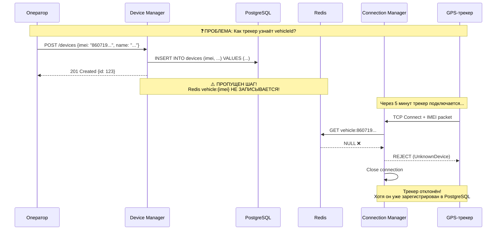

# 🔍 Щепетильный аудит архитектуры TrackerGPS

**Дата:** 26 января 2026  
**Автор:** AI-ассистент  
**Статус:** Критический анализ

---

## 📋 Содержание

1. [Критическая проблема: Регистрация трекеров](#критическая-проблема-регистрация-трекеров)
2. [Аудит Connection Manager](#аудит-connection-manager)
3. [Пробелы в архитектуре](#пробелы-в-архитектуре)
4. [Замечания по существующему коду](#замечания-по-существующему-коду)
5. [План доработок](#план-доработок)

---

## 🚨 Критическая проблема: Регистрация трекеров

### Где происходит регистрация?

**Ответ: НИГДЕ ЯВНО НЕ ОПИСАНО!**

Это **критический пробел** в архитектуре. Анализ показал:



### Текущий поток (с пробелом)

1. **Device Manager** → `POST /devices` → PostgreSQL ✅
2. **Redis `vehicle:{imei}`** → НЕ ЗАПИСЫВАЕТСЯ! ❌
3. **Connection Manager** → `GET vehicle:{imei}` → `NULL` → REJECT ❌

### Ожидаемый поток

1. **Device Manager** → `POST /devices` → PostgreSQL ✅
2. **Device Manager** → `SET vehicle:{imei} {vehicleId}` → Redis ✅
3. **Connection Manager** → `GET vehicle:{imei}` → `vehicleId` → ACCEPT ✅

---

## 🔧 Аудит Connection Manager

### Что реализовано ✅

| Компонент | Файл | Статус |
|-----------|------|--------|
| TCP Server (Netty) | `network/TcpServer.scala` | ✅ Готов |
| Protocol Parsers | `protocol/*.scala` | ✅ 4 протокола |
| IMEI Validation | `ConnectionHandler.scala` | ✅ Redis lookup |
| Dead Reckoning Filter | `filter/DeadReckoningFilter.scala` | ✅ Готов |
| Stationary Filter | `filter/StationaryFilter.scala` | ✅ Готов |
| Kafka Producer | `storage/KafkaProducer.scala` | ✅ Готов |
| Redis Client | `storage/RedisClient.scala` | ✅ Готов |
| Connection Registry | `network/ConnectionRegistry.scala` | ✅ ZIO Ref |
| Idle Watcher | `network/IdleConnectionWatcher.scala` | ✅ Готов |
| Command Service | `network/CommandService.scala` | ✅ Redis Pub/Sub |
| Dynamic Config | `config/DynamicConfigService.scala` | ✅ Готов |
| HTTP API | `api/HttpApi.scala` | ✅ Health + Config |

### Что НЕ реализовано ❌

| Функция | Описание | Критичность |
|---------|----------|-------------|
| **Device Registration Sync** | Синхронизация PostgreSQL → Redis | 🔴 Критично |
| **Graceful Reconnect** | Обработка reconnect того же IMEI | 🟡 Важно |
| **Rate Limiting** | Защита от flood атак | 🟡 Важно |
| **Connection Metrics** | Prometheus метрики per protocol | 🟢 Желательно |
| **Protocol Auto-detection** | Определение протокола автоматически | 🟢 PostMVP |
| **TLS/SSL** | Шифрование TCP соединений | 🟢 PostMVP |
| **Command Queue Persistence** | Сохранение pending commands | 🟡 Важно |

---

## 🕳️ Пробелы в архитектуре

### 1. Отсутствует синхронизация Device Manager → Redis

**Проблема:** Connection Manager ищет `vehicle:{imei}` в Redis, но Device Manager туда не пишет.

**Решение:**

```scala
// Device Manager: при создании устройства
def createDevice(req: CreateDeviceRequest): Task[Device] = for {
  // 1. Записать в PostgreSQL
  device <- deviceRepo.insert(req.toDevice)
  
  // 2. Записать mapping в Redis для Connection Manager
  _ <- redis.set(s"vehicle:${device.imei}", device.id.toString)
  _ <- redis.expire(s"vehicle:${device.imei}", 24.hours)
  
  // 3. Опубликовать событие (опционально)
  _ <- kafka.publish("device-registered", DeviceRegisteredEvent(device))
} yield device
```

### 2. Нет Kafka Consumer в Device Manager для sync

**Решение:** Device Manager должен слушать `device-status` и обновлять PostgreSQL:

```scala
// Уже описано в DEVICE_MANAGER.md, но НЕ реализовано
Consumer
  .subscribeAnd(Subscription.topics("device-status"))
  .plainStream(...)
  .mapZIO { record =>
    deviceRepo.updateStatus(record.value.imei, record.value.status)
  }
```

### 3. Нет обработки редактирования/удаления устройства

При изменении IMEI или удалении устройства:

```scala
// Device Manager: при обновлении
def updateDevice(id: Long, req: UpdateDeviceRequest): Task[Device] = for {
  oldDevice <- deviceRepo.findById(id).someOrFail(NotFound)
  
  // Если IMEI изменился — обновить Redis
  _ <- ZIO.when(req.imei.exists(_ != oldDevice.imei)) {
    redis.del(s"vehicle:${oldDevice.imei}") *>
    redis.set(s"vehicle:${req.imei.get}", id.toString)
  }
  
  device <- deviceRepo.update(id, req)
} yield device

// При удалении
def deleteDevice(id: Long): Task[Unit] = for {
  device <- deviceRepo.findById(id).someOrFail(NotFound)
  
  // Удалить из Redis
  _ <- redis.del(s"vehicle:${device.imei}")
  
  // Если подключен — отключить
  _ <- ZIO.whenCase(redis.hget("connection_registry", device.imei)) {
    case Some(instanceId) =>
      redis.publish(s"commands:$instanceId", DisconnectCommand(device.imei).toJson)
  }
  
  _ <- deviceRepo.delete(id)
} yield ()
```

### 4. Нет инвалидации кеша при изменениях

Если администратор отключает устройство (`enabled = false`), Connection Manager должен:
- Отклонять новые подключения
- Отключать текущее соединение

**Решение:** Redis Pub/Sub для device config changes:

```scala
// Device Manager публикует при изменении
redis.publish("device-config-changed", DeviceConfigChanged(imei, enabled = false))

// Connection Manager слушает
redis.psubscribe("device-config-changed") { (channel, message) =>
  val event = message.fromJson[DeviceConfigChanged]
  ZIO.when(!event.enabled) {
    registry.findByImei(event.imei).flatMap {
      case Some(entry) => 
        entry.ctx.close() // Принудительное отключение
      case None => ZIO.unit
    }
  }
}
```

### 5. Нет startup sync

При запуске Connection Manager нужно загрузить все активные устройства в Redis:

```scala
// При старте Connection Manager или Device Manager
def syncDevicesToRedis(): Task[Int] = for {
  devices <- deviceRepo.findAllEnabled()
  
  _ <- ZIO.foreachParDiscard(devices) { device =>
    redis.set(s"vehicle:${device.imei}", device.id.toString)
  }
  
  _ <- ZIO.logInfo(s"Synced ${devices.size} devices to Redis")
} yield devices.size
```

---

## 📝 Замечания по существующему коду Connection Manager

### ✅ Хорошо

1. **Чисто функциональный стиль** — ZIO, Ref, нет mutable state
2. **Отличная структура** — разделение на domain/protocol/network/storage
3. **Dead Reckoning Filter** — правильная реализация
4. **Dynamic Config** — можно менять на лету
5. **Graceful shutdown** — корректная остановка
6. **Тесты** — есть TeltonikaParserSpec, StationaryFilterSpec

### ⚠️ Требует доработки

#### 1. `RedisClient.getVehicleId` — нет fallback на PostgreSQL

```scala
// Текущий код
override def getVehicleId(imei: String): IO[RedisError, Option[Long]] =
  fromCompletionStage(commands.get(vehicleKey(imei)))
    .map(Option(_).flatMap(_.toLongOption))

// Проблема: если Redis пуст — устройство отклоняется
// Решение: добавить fallback на PostgreSQL с последующим кешированием
```

#### 2. Нет метрик per protocol

```scala
// Добавить в ConnectionHandler
Metrics.connectedDevicesGauge
  .labels(parser.protocolName)
  .inc()
```

#### 3. Reconnect handling

Если трекер переподключается (тот же IMEI), нужно:
- Закрыть старое соединение
- Зарегистрировать новое

```scala
// В ConnectionRegistry.register
override def register(imei: String, ctx: ChannelHandlerContext, parser: ProtocolParser): UIO[Unit] =
  for {
    existing <- connectionsRef.get.map(_.get(imei))
    
    // Закрыть старое соединение если есть
    _ <- ZIO.foreach(existing) { entry =>
      ZIO.logWarning(s"Duplicate connection for IMEI=$imei, closing old") *>
      ZIO.succeed(entry.ctx.close())
    }
    
    // Зарегистрировать новое
    now <- Clock.currentTime(...)
    entry = ConnectionEntry(imei, ctx, parser, now, now)
    _ <- connectionsRef.update(_ + (imei -> entry))
  } yield ()
```

#### 4. Нет rate limiting

```scala
// Добавить защиту от flood
val rateLimiter = RateLimiter.create(
  maxConnections = 100,
  perSeconds = 1,
  burstSize = 10
)

// В TcpServer при новом соединении
rateLimiter.acquire(remoteAddress.getHostString)
  .flatMap {
    case Allowed => processConnection(ctx)
    case Rejected => 
      ZIO.logWarning(s"Rate limited: $remoteAddress") *>
      ZIO.succeed(ctx.close())
  }
```

#### 5. Нет отдельного топика для "новый трекер"

Когда подключается IMEI, которого нет в системе, можно публиковать событие для автоматической регистрации:

```scala
// В ConnectionHandler при UnknownDevice
case ProtocolError.UnknownDevice(imei) =>
  kafka.publish("unknown-devices", UnknownDeviceEvent(imei, protocol, remoteAddress, timestamp)) *>
  closeConnection()

// Device Manager может слушать и создавать записи-заглушки
```

---

## 📋 План доработок

### Фаза 1: Критические исправления (сейчас)

| # | Задача | Файл | Приоритет |
|---|--------|------|-----------|
| 1 | Добавить Redis sync в Device Manager при создании | `DeviceService.scala` | 🔴 |
| 2 | Добавить Redis sync при обновлении/удалении | `DeviceService.scala` | 🔴 |
| 3 | Startup sync devices → Redis | `Main.scala` | 🔴 |
| 4 | Reconnect handling в Connection Registry | `ConnectionRegistry.scala` | 🟡 |

### Фаза 2: Важные улучшения (эта неделя)

| # | Задача | Файл | Приоритет |
|---|--------|------|-----------|
| 5 | Rate limiting на TCP | `TcpServer.scala` | 🟡 |
| 6 | Fallback Redis → PostgreSQL | `RedisClient.scala` | 🟡 |
| 7 | Device config change listener | `DynamicConfigService.scala` | 🟡 |
| 8 | Метрики per protocol | `ConnectionHandler.scala` | 🟢 |

### Фаза 3: PostMVP

| # | Задача | Приоритет |
|---|--------|-----------|
| 9 | Protocol auto-detection | 🟢 |
| 10 | TLS/SSL support | 🟢 |
| 11 | Unknown device auto-registration | 🟢 |
| 12 | Connection quality metrics | 🟢 |

---

## 🔧 Конкретные изменения для Connection Manager

### 1. Добавить fallback на PostgreSQL в RedisClient

```scala
// storage/RedisClient.scala
trait RedisClient:
  def getVehicleId(imei: String): IO[RedisError, Option[Long]]
  def getVehicleIdWithFallback(imei: String): IO[RedisError, Option[Long]] // НОВЫЙ

// Реализация
override def getVehicleIdWithFallback(imei: String): IO[RedisError, Option[Long]] =
  getVehicleId(imei).flatMap {
    case Some(id) => ZIO.succeed(Some(id))
    case None => 
      // Fallback на PostgreSQL
      deviceRepo.findByImei(imei)
        .tap {
          case Some(device) =>
            // Закешировать в Redis
            commands.setex(vehicleKey(imei), 3600, device.id.toString).asZIO.ignore
          case None => ZIO.unit
        }
        .map(_.map(_.id))
        .mapError(e => RedisError.OperationFailed(e.getMessage))
  }
```

### 2. Reconnect handling

```scala
// network/ConnectionRegistry.scala
override def register(imei: String, ctx: ChannelHandlerContext, parser: ProtocolParser): UIO[Unit] =
  for
    now <- Clock.currentTime(java.util.concurrent.TimeUnit.MILLISECONDS)
    
    // Атомарно заменяем и получаем старое значение
    oldEntry <- connectionsRef.modify { map =>
      val old = map.get(imei)
      val newEntry = ConnectionEntry(imei, ctx, parser, now, now)
      (old, map + (imei -> newEntry))
    }
    
    // Закрываем старое соединение если было
    _ <- ZIO.foreach(oldEntry) { entry =>
      ZIO.logWarning(s"Reconnect detected for IMEI=$imei, closing old connection") *>
      ZIO.attempt(entry.ctx.close()).ignore
    }
    
    count <- connectionsRef.get.map(_.size)
    _ <- ZIO.logInfo(s"Registered connection for IMEI: $imei, total: $count")
  yield ()
```

### 3. Listener для device config changes

```scala
// config/DeviceConfigListener.scala
package com.wayrecall.tracker.config

import zio.*
import com.wayrecall.tracker.storage.RedisClient
import com.wayrecall.tracker.network.ConnectionRegistry

trait DeviceConfigListener:
  def start: UIO[Unit]

object DeviceConfigListener:
  
  final case class Live(
    redis: RedisClient,
    registry: ConnectionRegistry
  ) extends DeviceConfigListener:
    
    override def start: UIO[Unit] =
      redis.psubscribe("device-config-changed") { (channel, message) =>
        (for
          event <- ZIO.fromEither(message.fromJson[DeviceConfigEvent])
          
          _ <- ZIO.when(!event.enabled) {
            registry.findByImei(event.imei).flatMap {
              case Some(entry) =>
                ZIO.logInfo(s"Disconnecting disabled device: ${event.imei}") *>
                ZIO.attempt(entry.ctx.close()).ignore
              case None => ZIO.unit
            }
          }
        yield ()).catchAll(e => ZIO.logError(s"Config event error: $e"))
      }.ignore
```

---

## 📊 Итоговая оценка архитектуры

### Оценка по критериям

| Критерий | Оценка | Комментарий |
|----------|--------|-------------|
| **Scalability** | 8/10 | Stateless дизайн, Redis, Kafka ✅ |
| **Reliability** | 6/10 | Нет fallback, нет retry policy |
| **Maintainability** | 9/10 | Чистый FP код, модульность ✅ |
| **Security** | 5/10 | Нет TLS, нет rate limiting |
| **Completeness** | 6/10 | Критический пробел с регистрацией |
| **Documentation** | 9/10 | Отличная документация ✅ |

### Общая оценка: **7.2/10**

**Вывод:** Архитектура хорошо спроектирована, но требует доработки в области интеграции компонентов (Device Manager ↔ Connection Manager через Redis).

---

## ✅ Рекомендации

1. **Срочно:** Реализовать синхронизацию devices → Redis
2. **Важно:** Добавить reconnect handling
3. **Важно:** Добавить rate limiting
4. **Желательно:** Fallback Redis → PostgreSQL
5. **PostMVP:** TLS, auto-detection, unknown device handling

---

*Документ создан: 26 января 2026*  
*Требует ревью: @isushko*
