# 📡 Block 1: Сбор и обработка данных

> Тег: `АКТУАЛЬНО` | Обновлён: `2026-03-06` | Версия: `2.0`
>
> **Ответственность:** Приём GPS данных от трекеров, парсинг протоколов, фильтрация, запись истории, управление устройствами  
> **Сервисы (3):** Connection Manager, History Writer, Device Manager

---

## 📑 Содержание

1. [Обзор блока](#-обзор-блока)
2. [Диаграмма компонентов](#-диаграмма-компонентов)
3. [UML: Доменная модель](#-uml-доменная-модель-block-1)
4. [ER: Схема баз данных](#-er-диаграмма-баз-данных)
5. [State: Жизненный цикл подключения](#-state-жизненный-цикл-подключения-устройства)
6. [Connection Manager](#-connection-manager)
7. [History Writer](#-history-writer)
8. [Device Manager](#-device-manager)
9. [Взаимодействие сервисов](#-взаимодействие-сервисов-block-1)
10. [Kafka Topics](#-kafka-topics-block-1)
11. [Redis структуры](#-redis-структуры-block-1)
12. [Prometheus метрики](#-prometheus-метрики)
13. [Deployment](#-deployment)
14. [Сводная таблица](#-сводная-таблица-block-1)

---

## 📋 Обзор блока

```
┌─────────────────────────────────────────────────────────────────────────────────┐
│                          BLOCK 1: DATA COLLECTION                               │
├─────────────────────────────────────────────────────────────────────────────────┤
│                                                                                 │
│   GPS Трекеры (Teltonika, Wialon, Ruptela, NavTelecom, ...)                    │
│        │                                                                        │
│        ▼ TCP :5001-5017                                                         │
│   ┌──────────────────────┐                                                      │
│   │  Connection Manager  │──── Redis (lettuce) ────┐                            │
│   │  (парсинг, фильтр)   │                          │                           │
│   └──────────┬───────────┘                          │                           │
│              │ Kafka                                │                           │
│     ┌────────┴─────────┐                            │                           │
│     ▼                  ▼                            ▼                           │
│  ┌────────────┐  ┌───────────┐          ┌───────────────────┐                   │
│  │  History   │  │   Rule    │          │  Device Manager   │                   │
│  │  Writer    │  │  Checker  │          │  (CRUD, команды)  │                   │
│  │  (batch)   │  │ (Block 2) │          └───────┬───────────┘                   │
│  └─────┬──────┘  └───────────┘                  │                              │
│        ▼                                        ▼                              │
│   ┌──────────┐                           ┌──────────┐                           │
│   │TimescaleDB│                           │PostgreSQL│                           │
│   └──────────┘                           └──────────┘                           │
│                                                                                 │
└─────────────────────────────────────────────────────────────────────────────────┘
```

### Основные характеристики

| Сервис | Порт | Тип | Масштабирование |
|--------|------|-----|-----------------|
| **Connection Manager** | 5001-5017 (TCP), 10090 (API) | TCP Server | Горизонтальное (по протоколам) |
| **History Writer** | 10091 | Kafka Consumer | По Kafka партициям |
| **Device Manager** | 10092 | REST API | Горизонтальное |

---

## 🧩 Диаграмма компонентов

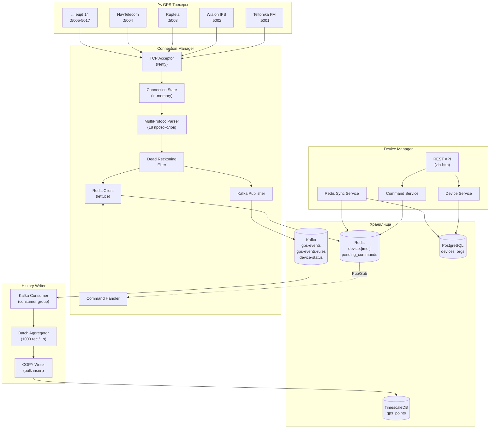
```mermaid
flowchart TB
    subgraph Trackers["🛰️ GPS Трекеры"]
        T1["Teltonika FM\n:5001"]
        T2["Wialon IPS\n:5002"]
        T3["Ruptela\n:5003"]
        T4["NavTelecom\n:5004"]
        T5["... ещё 14\n:5005-5017"]
    end

    subgraph CM["Connection Manager"]
        direction TB
        TCPAcceptor["TCP Acceptor\n(Netty)"]
        ConnState["Connection State\n(in-memory)"]
        MultiParser["MultiProtocolParser\n(18 протоколов)"]
        DRFilter["Dead Reckoning\nFilter"]
        KafkaPub["Kafka Publisher"]
        CmdHandler["Command Handler"]
        RedisClient["Redis Client\n(lettuce)"]
    end

    subgraph HW["History Writer"]
        direction TB
        KafkaConsumer["Kafka Consumer\n(consumer group)"]
        BatchAgg["Batch Aggregator\n(1000 rec / 1s)"]
        CopyWriter["COPY Writer\n(bulk insert)"]
    end

    subgraph DM["Device Manager"]
        direction TB
        RestAPI["REST API\n(zio-http)"]
        DeviceSvc["Device Service"]
        CmdSvc["Command Service"]
        SyncSvc["Redis Sync Service"]
    end

    subgraph Stores["Хранилища"]
        Kafka[("Kafka\ngps-events\ngps-events-rules\ndevice-status")]
        Redis[("Redis\ndevice:{imei}\npending_commands")]
        TSDB[("TimescaleDB\ngps_points")]
        PG[("PostgreSQL\ndevices, orgs")]
    end

    T1 & T2 & T3 & T4 & T5 --> TCPAcceptor
    TCPAcceptor --> ConnState --> MultiParser --> DRFilter --> KafkaPub --> Kafka
    DRFilter --> RedisClient --> Redis
    CmdHandler --> RedisClient
    Redis -.->|Pub/Sub| CmdHandler

    Kafka --> KafkaConsumer --> BatchAgg --> CopyWriter --> TSDB

    RestAPI --> DeviceSvc --> PG
    RestAPI --> CmdSvc --> Redis
    SyncSvc --> Redis
    SyncSvc --> PG
```

---

## 🏗️ UML: Доменная модель Block 1

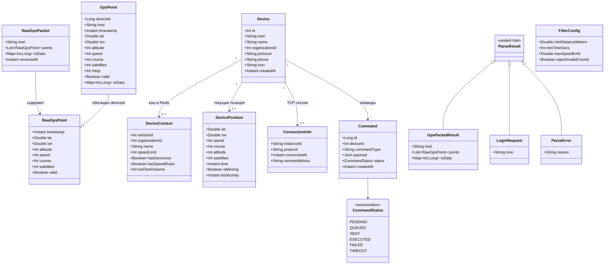
```mermaid
classDiagram
    class GpsPoint {
        +Long deviceId
        +String imei
        +Instant timestamp
        +Double lat
        +Double lon
        +Int altitude
        +Int speed
        +Int course
        +Int satellites
        +Int hdop
        +Boolean valid
        +Map~Int,Long~ ioData
    }

    class RawGpsPacket {
        +String imei
        +List~RawGpsPoint~ points
        +Map~Int,Long~ ioData
        +Instant receivedAt
    }
    
    class RawGpsPoint {
        +Instant timestamp
        +Double lat
        +Double lon
        +Int altitude
        +Int speed
        +Int course
        +Int satellites
        +Boolean valid
    }

    class Device {
        +Int id
        +String imei
        +String name
        +Int organizationId
        +String protocol
        +String phone
        +String icon
        +Instant createdAt
    }

    class DeviceContext {
        +Int vehicleId
        +Int organizationId
        +String name
        +Int speedLimit
        +Boolean hasGeozones
        +Boolean hasSpeedRules
        +Int fuelTankVolume
    }

    class DevicePosition {
        +Double lat
        +Double lon
        +Int speed
        +Int course
        +Int altitude
        +Int satellites
        +Instant time
        +Boolean isMoving
        +Instant lastActivity
    }

    class ConnectionInfo {
        +String instanceId
        +String protocol
        +Instant connectedAt
        +String remoteAddress
    }

    class Command {
        +Long id
        +Int deviceId
        +String commandType
        +Json payload
        +CommandStatus status
        +Instant createdAt
    }

    class CommandStatus {
        <<enumeration>>
        PENDING
        QUEUED
        SENT
        EXECUTED
        FAILED
        TIMEOUT
    }

    class ParseResult {
        <<sealed trait>>
    }
    class GpsPacketResult {
        +String imei
        +List~RawGpsPoint~ points
        +Map~Int,Long~ ioData
    }
    class LoginRequest {
        +String imei
    }
    class ParseError {
        +String reason
    }

    class FilterConfig {
        +Double minDistanceMeters
        +Int minTimeSecs
        +Double maxSpeedKmh
        +Boolean rejectInvalidCoords
    }

    ParseResult <|-- GpsPacketResult
    ParseResult <|-- LoginRequest
    ParseResult <|-- ParseError
    
    Device "1" --> "0..1" DeviceContext : кэш в Redis
    Device "1" --> "0..1" DevicePosition : текущая позиция
    Device "1" --> "0..1" ConnectionInfo : TCP сессия
    Device "1" --> "*" Command : команды
    Command --> CommandStatus
    
    RawGpsPacket --> "*" RawGpsPoint : содержит
    GpsPoint --|> RawGpsPoint : обогащён deviceId
```

---

## 🗄️ ER: Диаграмма баз данных

### PostgreSQL (Device Manager)

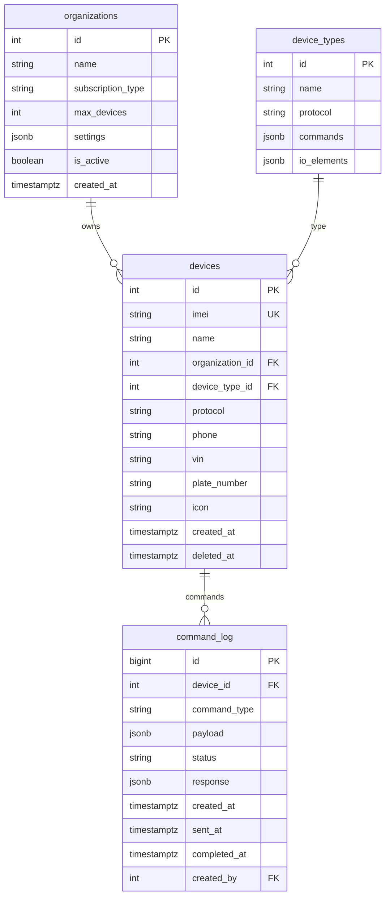
```mermaid
erDiagram
    organizations {
        int id PK
        string name
        string subscription_type
        int max_devices
        jsonb settings
        boolean is_active
        timestamptz created_at
    }

    devices {
        int id PK
        string imei UK
        string name
        int organization_id FK
        int device_type_id FK
        string protocol
        string phone
        string vin
        string plate_number
        string icon
        timestamptz created_at
        timestamptz deleted_at
    }

    device_types {
        int id PK
        string name
        string protocol
        jsonb commands
        jsonb io_elements
    }

    command_log {
        bigint id PK
        int device_id FK
        string command_type
        jsonb payload
        string status
        jsonb response
        timestamptz created_at
        timestamptz sent_at
        timestamptz completed_at
        int created_by FK
    }

    organizations ||--o{ devices : "owns"
    device_types ||--o{ devices : "type"
    devices ||--o{ command_log : "commands"
```

### TimescaleDB (History Writer)

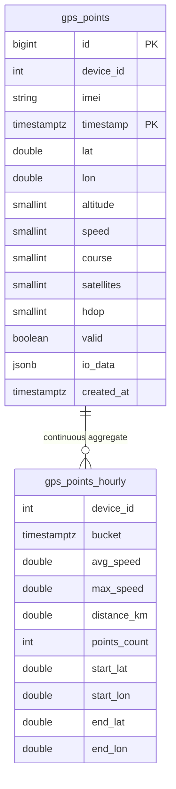
```mermaid
erDiagram
    gps_points {
        bigint id PK
        int device_id
        string imei
        timestamptz timestamp PK
        double lat
        double lon
        smallint altitude
        smallint speed
        smallint course
        smallint satellites
        smallint hdop
        boolean valid
        jsonb io_data
        timestamptz created_at
    }

    gps_points_hourly {
        int device_id
        timestamptz bucket
        double avg_speed
        double max_speed
        double distance_km
        int points_count
        double start_lat
        double start_lon
        double end_lat
        double end_lon
    }
    
    gps_points ||--o{ gps_points_hourly : "continuous aggregate"
```

---

## 🔄 State: Жизненный цикл подключения устройства

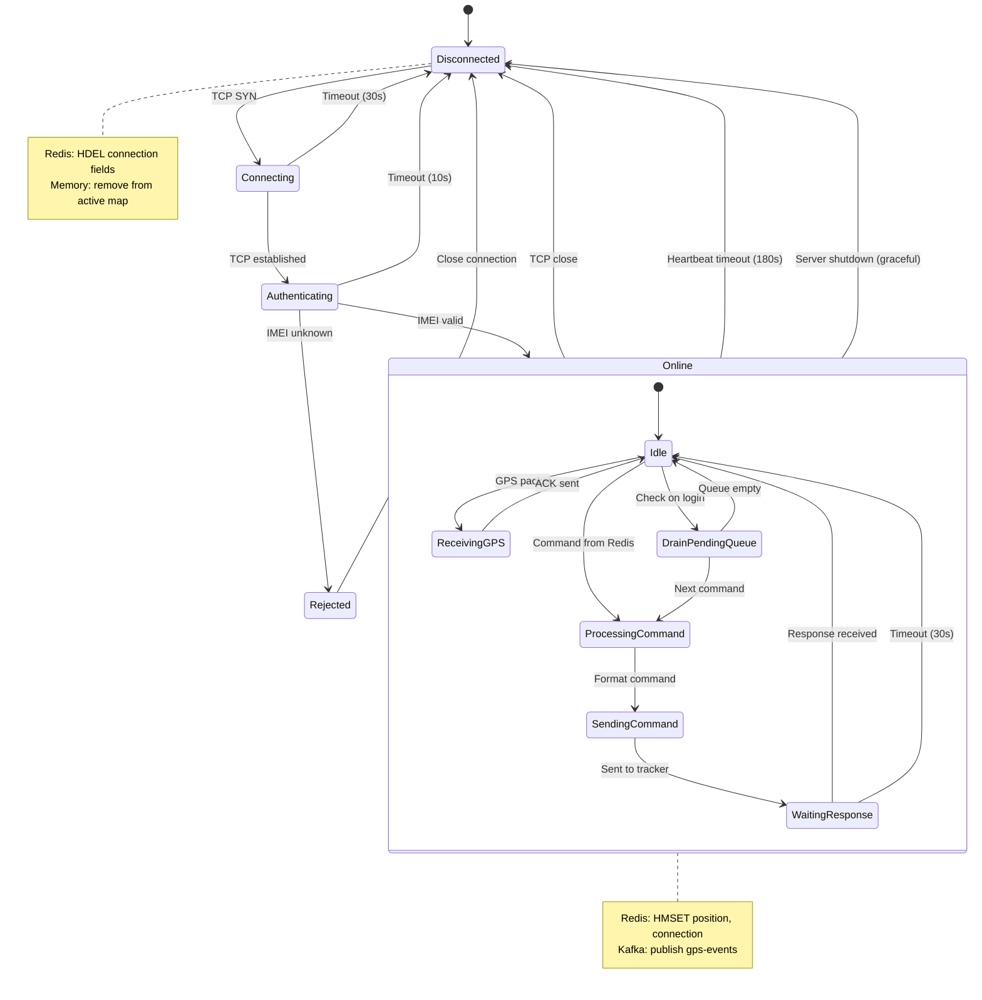
```mermaid
stateDiagram-v2
    [*] --> Disconnected

    Disconnected --> Connecting : TCP SYN
    
    Connecting --> Authenticating : TCP established
    Connecting --> Disconnected : Timeout (30s)

    Authenticating --> Rejected : IMEI unknown
    Authenticating --> Online : IMEI valid
    Authenticating --> Disconnected : Timeout (10s)

    Rejected --> Disconnected : Close connection
    
    state Online {
        [*] --> Idle
        
        Idle --> ReceivingGPS : GPS packet
        ReceivingGPS --> Idle : ACK sent
        
        Idle --> ProcessingCommand : Command from Redis
        ProcessingCommand --> SendingCommand : Format command
        SendingCommand --> WaitingResponse : Sent to tracker
        WaitingResponse --> Idle : Response received
        WaitingResponse --> Idle : Timeout (30s)
        
        Idle --> DrainPendingQueue : Check on login
        DrainPendingQueue --> ProcessingCommand : Next command
        DrainPendingQueue --> Idle : Queue empty
    }

    Online --> Disconnected : TCP close
    Online --> Disconnected : Heartbeat timeout (180s)
    Online --> Disconnected : Server shutdown (graceful)

    note right of Disconnected
        Redis: HDEL connection fields
        Memory: remove from active map
    end note

    note right of Online
        Redis: HMSET position, connection
        Kafka: publish gps-events
    end note
```

---

## 🖥️ Connection Manager

### Обзор

| Параметр | Значение |
|----------|----------|
| **Ответственность** | Приём TCP, парсинг 18 протоколов, фильтрация, публикация в Kafka |
| **Порты TCP** | 5001-5017 (по одному на протокол) |
| **Порт API** | 10090 (health, metrics, admin) |
| **Redis** | lettuce-core 6.3.2 (рабочий, не zio-redis) |
| **Kafka produce** | gps-events, gps-events-rules, device-status |

### Внутренняя архитектура

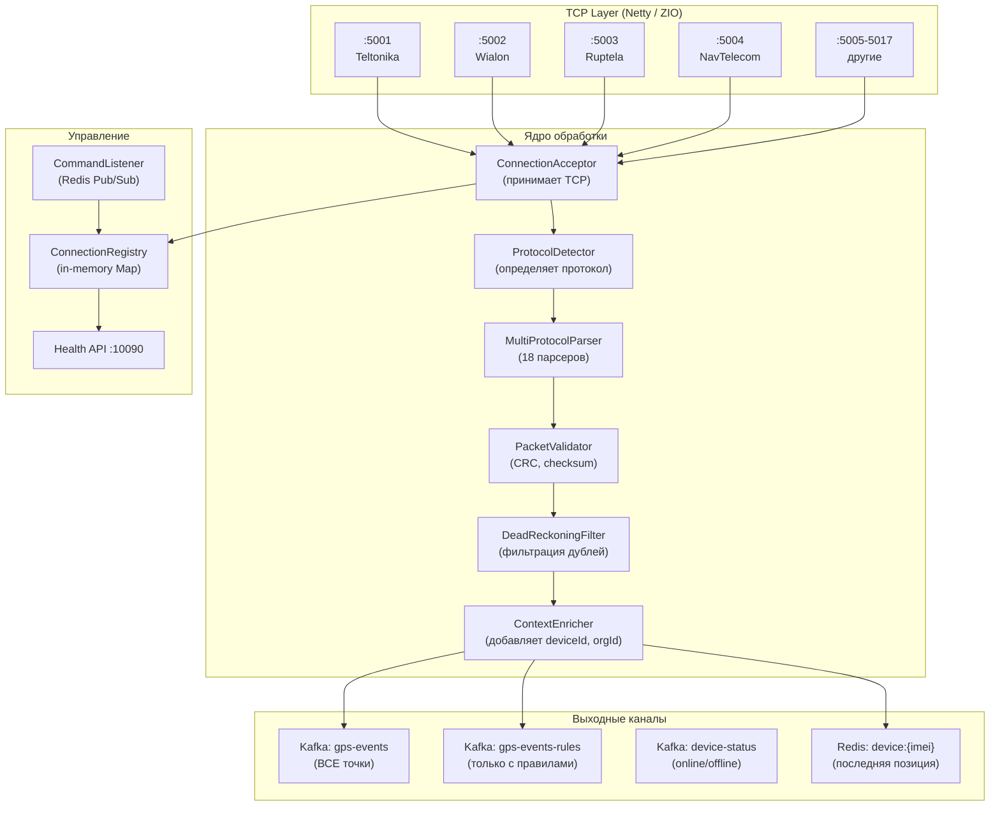
```mermaid
flowchart TB
    subgraph TCP["TCP Layer (Netty / ZIO)"]
        direction LR
        Port5001[":5001\nTeltonika"]
        Port5002[":5002\nWialon"]
        Port5003[":5003\nRuptela"]
        Port5004[":5004\nNavTelecom"]
        PortN[":5005-5017\nдругие"]
    end

    subgraph Core["Ядро обработки"]
        direction TB
        Acceptor["ConnectionAcceptor\n(принимает TCP)"]
        ProtocolDetector["ProtocolDetector\n(определяет протокол)"]
        Parser["MultiProtocolParser\n(18 парсеров)"]
        Validator["PacketValidator\n(CRC, checksum)"]
        Filter["DeadReckoningFilter\n(фильтрация дублей)"]
        Enricher["ContextEnricher\n(добавляет deviceId, orgId)"]
    end

    subgraph Output["Выходные каналы"]
        KafkaGPS["Kafka: gps-events\n(ВСЕ точки)"]
        KafkaRules["Kafka: gps-events-rules\n(только с правилами)"]
        KafkaStatus["Kafka: device-status\n(online/offline)"]
        RedisPos["Redis: device:{imei}\n(последняя позиция)"]
    end

    subgraph Management["Управление"]
        ConnRegistry["ConnectionRegistry\n(in-memory Map)"]
        CmdListener["CommandListener\n(Redis Pub/Sub)"]
        HealthAPI["Health API :10090"]
    end

    Port5001 & Port5002 & Port5003 & Port5004 & PortN --> Acceptor
    Acceptor --> ProtocolDetector --> Parser --> Validator --> Filter --> Enricher
    Enricher --> KafkaGPS & KafkaRules
    Enricher --> RedisPos
    Acceptor --> ConnRegistry
    CmdListener --> ConnRegistry
    ConnRegistry --> HealthAPI
```

### Протоколы (18 парсеров)

| # | Протокол | Порт | Формат | Особенности |
|---|----------|------|--------|-------------|
| 1 | Teltonika Codec 8/8E | 5001 | Binary | AVL, IO Elements, CRC16 |
| 2 | Wialon IPS | 5002 | Text | Разделитель `#`, CRC |
| 3 | Wialon NIS | 5002 | Text | Расширенный IPS |
| 4 | Ruptela | 5003 | Binary | GPS + CAN данные |
| 5 | NavTelecom FLEX | 5004 | Binary | Модульный формат |
| 6 | EGTS | 5005 | Binary | Гос. стандарт РФ |
| 7 | Galileosky | 5006 | Binary | Теги |
| 8 | Arnavi | 5007 | Binary | Простой бинарный |
| 9 | Neomatica | 5008 | Binary | ADM протокол |
| 10 | Novacom/Starline | 5009 | Binary | Охранные системы |
| 11 | Scout | 5010 | Binary | — |
| 12 | Queclink | 5011 | Text | AT-команды |
| 13 | Concox | 5012 | Binary | GT06 совместимый |
| 14 | Meitrack | 5013 | Text | $$ формат |
| 15 | Suntech | 5014 | Text | ST300/ST600 |
| 16 | Totem | 5015 | Text | $$-разделитель |
| 17 | H02 | 5016 | Text | *HQ протокол |
| 18 | GT06 | 5017 | Binary | Универсальный китайский |

### UML: Структура парсеров

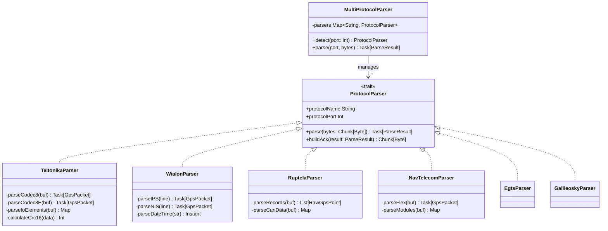
```mermaid
classDiagram
    class ProtocolParser {
        <<trait>>
        +parse(bytes: Chunk[Byte]) Task[ParseResult]
        +buildAck(result: ParseResult) Chunk[Byte]
        +protocolName String
        +protocolPort Int
    }

    class TeltonikaParser {
        -parseCodec8(buf) Task[GpsPacket]
        -parseCodec8E(buf) Task[GpsPacket]
        -parseIoElements(buf) Map
        -calculateCrc16(data) Int
    }

    class WialonParser {
        -parseIPS(line) Task[GpsPacket]
        -parseNIS(line) Task[GpsPacket]
        -parseDateTime(str) Instant
    }

    class RuptelaParser {
        -parseRecords(buf) List[RawGpsPoint]
        -parseCanData(buf) Map
    }

    class NavTelecomParser {
        -parseFlex(buf) Task[GpsPacket]
        -parseModules(buf) Map
    }

    class MultiProtocolParser {
        -parsers Map~String, ProtocolParser~
        +detect(port: Int) ProtocolParser
        +parse(port, bytes) Task[ParseResult]
    }

    ProtocolParser <|.. TeltonikaParser
    ProtocolParser <|.. WialonParser
    ProtocolParser <|.. RuptelaParser
    ProtocolParser <|.. NavTelecomParser
    ProtocolParser <|.. EgtsParser
    ProtocolParser <|.. GalileoskyParser
    
    MultiProtocolParser --> "*" ProtocolParser : manages
```

### Sequence Diagram: Полный цикл GPS пакета

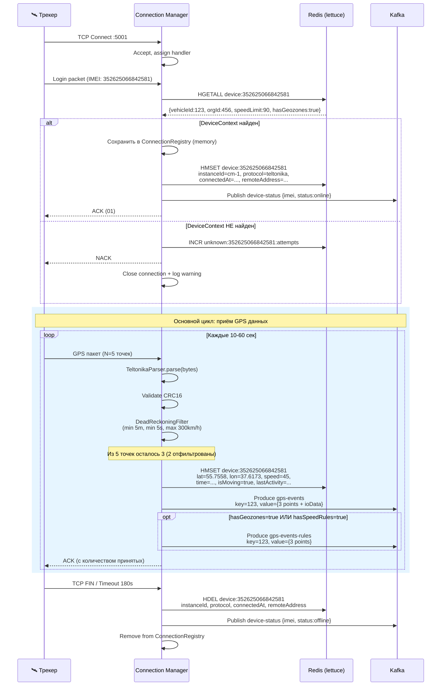
```mermaid
sequenceDiagram
    participant T as 🛰️ Трекер
    participant CM as Connection Manager
    participant R as Redis (lettuce)
    participant K as Kafka

    T->>CM: TCP Connect :5001
    CM->>CM: Accept, assign handler
    
    T->>CM: Login packet (IMEI: 352625066842581)

    CM->>R: HGETALL device:352625066842581
    R-->>CM: {vehicleId:123, orgId:456, speedLimit:90, hasGeozones:true}

    alt DeviceContext найден
        CM->>CM: Сохранить в ConnectionRegistry (memory)
        CM->>R: HMSET device:352625066842581<br/>instanceId=cm-1, protocol=teltonika,<br/>connectedAt=..., remoteAddress=...
        CM->>K: Publish device-status {imei, status:online}
        CM-->>T: ACK (01)
    else DeviceContext НЕ найден
        CM->>R: INCR unknown:352625066842581:attempts
        CM-->>T: NACK
        CM->>CM: Close connection + log warning
    end

    rect rgb(230, 245, 255)
        Note over T,K: Основной цикл: приём GPS данных
        loop Каждые 10-60 сек
            T->>CM: GPS пакет (N=5 точек)
            CM->>CM: TeltonikaParser.parse(bytes)
            CM->>CM: Validate CRC16
            CM->>CM: DeadReckoningFilter<br/>(min 5m, min 5s, max 300km/h)

            Note over CM: Из 5 точек осталось 3 (2 отфильтрованы)

            CM->>R: HMSET device:352625066842581<br/>lat=55.7558, lon=37.6173, speed=45,<br/>time=..., isMoving=true, lastActivity=...

            CM->>K: Produce gps-events<br/>key=123, value={3 points + ioData}
            
            opt hasGeozones=true ИЛИ hasSpeedRules=true
                CM->>K: Produce gps-events-rules<br/>key=123, value={3 points}
            end

            CM-->>T: ACK (с количеством принятых)
        end
    end

    T->>CM: TCP FIN / Timeout 180s
    CM->>R: HDEL device:352625066842581<br/>instanceId, protocol, connectedAt, remoteAddress
    CM->>K: Publish device-status {imei, status:offline}
    CM->>CM: Remove from ConnectionRegistry
```

### Sequence Diagram: Обработка offline очереди команд

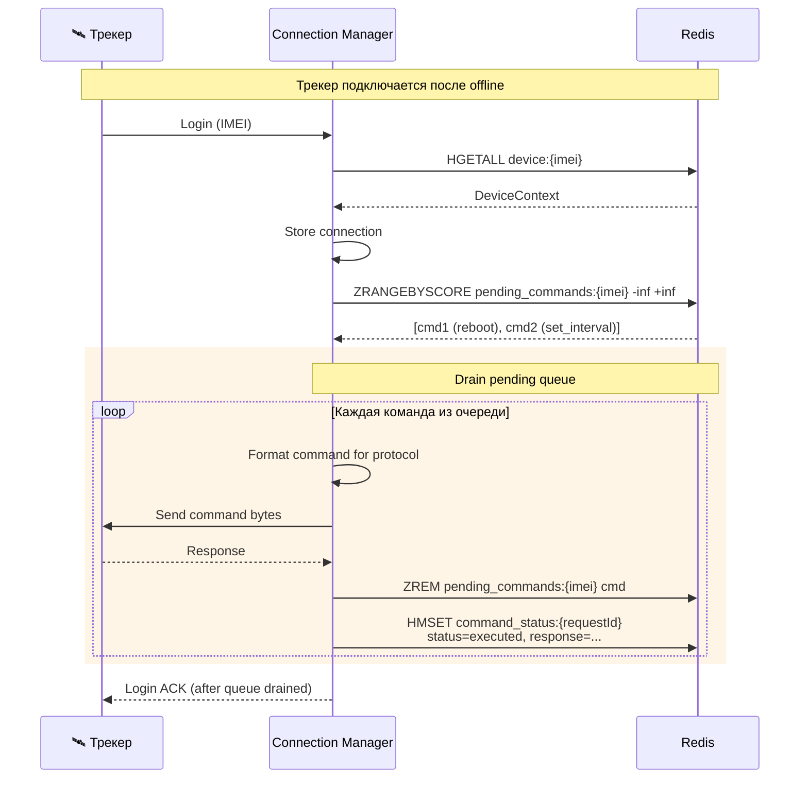
```mermaid
sequenceDiagram
    participant T as 🛰️ Трекер
    participant CM as Connection Manager
    participant R as Redis

    Note over T,R: Трекер подключается после offline

    T->>CM: Login (IMEI)
    CM->>R: HGETALL device:{imei}
    R-->>CM: DeviceContext
    CM->>CM: Store connection

    CM->>R: ZRANGEBYSCORE pending_commands:{imei} -inf +inf
    R-->>CM: [cmd1 (reboot), cmd2 (set_interval)]

    rect rgb(255, 245, 230)
        Note over CM,R: Drain pending queue
        loop Каждая команда из очереди
            CM->>CM: Format command for protocol
            CM->>T: Send command bytes
            T-->>CM: Response
            CM->>R: ZREM pending_commands:{imei} cmd
            CM->>R: HMSET command_status:{requestId}<br/>status=executed, response=...
        end
    end

    CM-->>T: Login ACK (after queue drained)
```

### Фильтрация (Dead Reckoning)

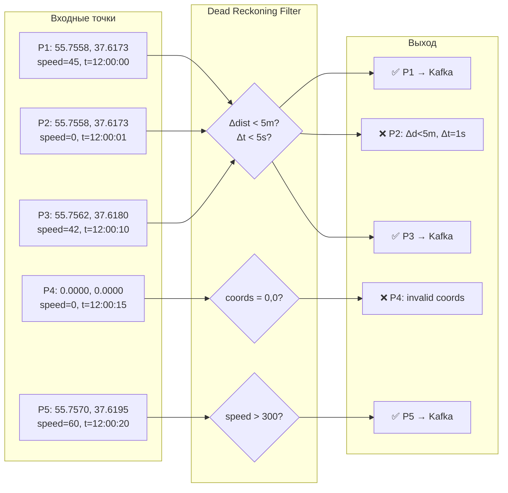
```mermaid
flowchart LR
    subgraph Input["Входные точки"]
        P1["P1: 55.7558, 37.6173\nspeed=45, t=12:00:00"]
        P2["P2: 55.7558, 37.6173\nspeed=0, t=12:00:01"]
        P3["P3: 55.7562, 37.6180\nspeed=42, t=12:00:10"]
        P4["P4: 0.0000, 0.0000\nspeed=0, t=12:00:15"]
        P5["P5: 55.7570, 37.6195\nspeed=60, t=12:00:20"]
    end

    subgraph Filter["Dead Reckoning Filter"]
        F1{"Δdist < 5m?\nΔt < 5s?"}
        F2{"coords = 0,0?"}
        F3{"speed > 300?"}
    end

    subgraph Output["Выход"]
        OK1["✅ P1 → Kafka"]
        SKIP1["❌ P2: Δd<5m, Δt=1s"]
        OK2["✅ P3 → Kafka"]
        SKIP2["❌ P4: invalid coords"]
        OK3["✅ P5 → Kafka"]
    end

    P1 --> F1 --> OK1
    P2 --> F1 --> SKIP1
    P3 --> F1 --> OK2
    P4 --> F2 --> SKIP2
    P5 --> F3 --> OK3
```

---

## 📝 History Writer

### Обзор

| Параметр | Значение |
|----------|----------|
| **Ответственность** | Consume из Kafka, батчирование, запись в TimescaleDB |
| **Порт** | 10091 (health, metrics) |
| **Kafka consume** | gps-events (12 партиций) |
| **Запись** | COPY / Batch INSERT (1000 записей или 1 секунда) |
| **Идемпотентность** | ON CONFLICT DO NOTHING (по IMEI + timestamp) |

### Внутренняя архитектура

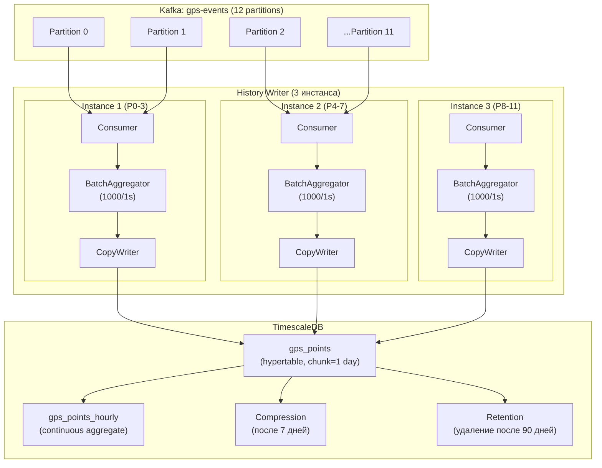
```mermaid
flowchart TB
    subgraph Kafka["Kafka: gps-events (12 partitions)"]
        P0["Partition 0"]
        P1["Partition 1"]
        P2["Partition 2"]
        PN["...Partition 11"]
    end

    subgraph HW["History Writer (3 инстанса)"]
        subgraph I1["Instance 1 (P0-3)"]
            C1["Consumer"]
            B1["BatchAggregator\n(1000/1s)"]
            W1["CopyWriter"]
        end
        subgraph I2["Instance 2 (P4-7)"]
            C2["Consumer"]
            B2["BatchAggregator\n(1000/1s)"]
            W2["CopyWriter"]
        end
        subgraph I3["Instance 3 (P8-11)"]
            C3["Consumer"]
            B3["BatchAggregator\n(1000/1s)"]
            W3["CopyWriter"]
        end
    end

    subgraph TSDB["TimescaleDB"]
        HT["gps_points\n(hypertable, chunk=1 day)"]
        CA["gps_points_hourly\n(continuous aggregate)"]
        Compress["Compression\n(после 7 дней)"]
        Retention["Retention\n(удаление после 90 дней)"]
    end

    P0 & P1 --> C1 --> B1 --> W1 --> HT
    P2 & PN --> C2 --> B2 --> W2 --> HT
    C3 --> B3 --> W3 --> HT
    HT --> CA
    HT --> Compress
    HT --> Retention
```

### Sequence Diagram: Batch запись

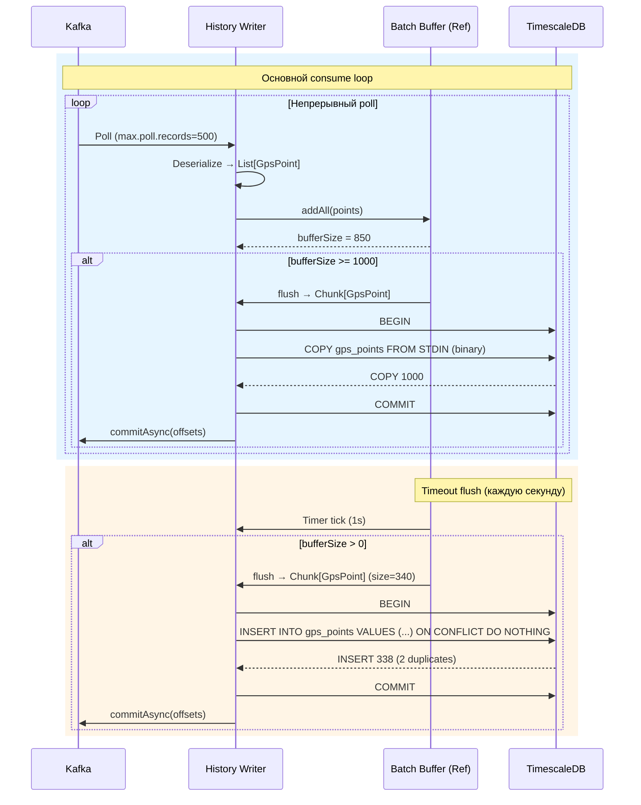
```mermaid
sequenceDiagram
    participant K as Kafka
    participant HW as History Writer
    participant B as Batch Buffer (Ref)
    participant DB as TimescaleDB

    rect rgb(230, 245, 255)
        Note over K,DB: Основной consume loop
        loop Непрерывный poll
            K->>HW: Poll (max.poll.records=500)
            HW->>HW: Deserialize → List[GpsPoint]
            HW->>B: addAll(points)
            B-->>HW: bufferSize = 850

            alt bufferSize >= 1000
                B->>HW: flush → Chunk[GpsPoint]
                HW->>DB: BEGIN
                HW->>DB: COPY gps_points FROM STDIN (binary)
                DB-->>HW: COPY 1000
                HW->>DB: COMMIT
                HW->>K: commitAsync(offsets)
            end
        end
    end

    rect rgb(255, 245, 230)
        Note over B,DB: Timeout flush (каждую секунду)
        B->>HW: Timer tick (1s)
        alt bufferSize > 0
            B->>HW: flush → Chunk[GpsPoint] (size=340)
            HW->>DB: BEGIN
            HW->>DB: INSERT INTO gps_points VALUES (...) ON CONFLICT DO NOTHING
            DB-->>HW: INSERT 338 (2 duplicates)
            HW->>DB: COMMIT
            HW->>K: commitAsync(offsets)
        end
    end
```

### State: Управление batch буфером

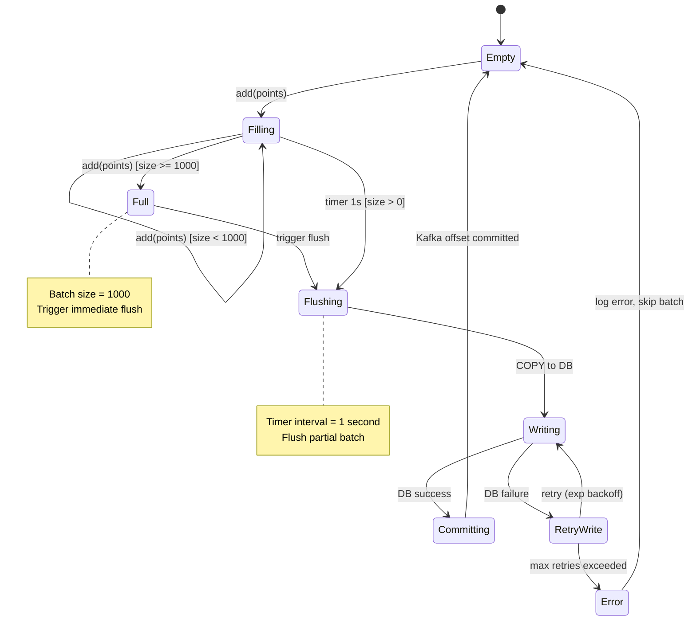
```mermaid
stateDiagram-v2
    [*] --> Empty
    
    Empty --> Filling : add(points)
    Filling --> Filling : add(points) [size < 1000]
    Filling --> Full : add(points) [size >= 1000]
    Full --> Flushing : trigger flush
    Filling --> Flushing : timer 1s [size > 0]
    
    Flushing --> Writing : COPY to DB
    Writing --> Committing : DB success
    Writing --> RetryWrite : DB failure
    RetryWrite --> Writing : retry (exp backoff)
    RetryWrite --> Error : max retries exceeded
    
    Committing --> Empty : Kafka offset committed
    Error --> Empty : log error, skip batch

    note right of Full
        Batch size = 1000
        Trigger immediate flush
    end note

    note right of Flushing
        Timer interval = 1 second
        Flush partial batch
    end note
```

### TimescaleDB схема

```sql
-- Основная hypertable для GPS точек
CREATE TABLE gps_points (
    id          BIGSERIAL,
    device_id   INTEGER NOT NULL,
    imei        VARCHAR(20) NOT NULL,
    timestamp   TIMESTAMPTZ NOT NULL,
    lat         DOUBLE PRECISION NOT NULL,
    lon         DOUBLE PRECISION NOT NULL,
    altitude    SMALLINT,
    speed       SMALLINT,              -- км/ч * 10
    course      SMALLINT,              -- градусы 0-360
    satellites  SMALLINT,
    hdop        SMALLINT,              -- * 10
    valid       BOOLEAN DEFAULT true,
    io_data     JSONB,                 -- датчики {65: 1500, 239: 1}
    created_at  TIMESTAMPTZ DEFAULT NOW(),
    
    PRIMARY KEY (timestamp, device_id)
);

-- Hypertable: chunk = 1 день
SELECT create_hypertable('gps_points', 'timestamp',
    chunk_time_interval => INTERVAL '1 day');

-- Индексы
CREATE INDEX idx_gps_device_time ON gps_points (device_id, timestamp DESC);
CREATE INDEX idx_gps_imei_time   ON gps_points (imei, timestamp DESC);

-- Сжатие (после 7 дней)
ALTER TABLE gps_points SET (
    timescaledb.compress,
    timescaledb.compress_segmentby = 'device_id',
    timescaledb.compress_orderby   = 'timestamp DESC'
);
SELECT add_compression_policy('gps_points', INTERVAL '7 days');

-- Retention (удаление после 90 дней)
SELECT add_retention_policy('gps_points', INTERVAL '90 days');

-- Continuous Aggregate: часовая статистика
CREATE MATERIALIZED VIEW gps_points_hourly
WITH (timescaledb.continuous) AS
SELECT
    device_id,
    time_bucket('1 hour', timestamp) AS bucket,
    AVG(speed)::DECIMAL(5,1)         AS avg_speed,
    MAX(speed)                       AS max_speed,
    COUNT(*)                         AS points_count,
    FIRST(lat, timestamp)            AS start_lat,
    FIRST(lon, timestamp)            AS start_lon,
    LAST(lat, timestamp)             AS end_lat,
    LAST(lon, timestamp)             AS end_lon
FROM gps_points
GROUP BY device_id, time_bucket('1 hour', timestamp)
WITH NO DATA;

-- Обновление continuous aggregate каждый час
SELECT add_continuous_aggregate_policy('gps_points_hourly',
    start_offset    => INTERVAL '3 hours',
    end_offset      => INTERVAL '1 hour',
    schedule_interval => INTERVAL '1 hour'
);
```

---

## 📱 Device Manager

### Обзор

| Параметр | Значение |
|----------|----------|
| **Ответственность** | CRUD устройств, отправка команд, синхронизация Redis |
| **Порт** | 10092 |
| **БД** | PostgreSQL (master data) + Redis (cache, command queue) |
| **Redis** | lettuce-core 6.3.2 |

### Внутренняя архитектура

```mermaid
flowchart TB
    subgraph Clients["Клиенты"]
        GW["API Gateway\n(HTTP)"]
        Admin["Admin Panel"]
    end

    subgraph DM["Device Manager"]
        direction TB
        subgraph API["REST API Layer"]
            DevRoutes["/devices/*"]
            CmdRoutes["/commands/*"]
            OrgRoutes["/organizations/*"]
        end

        subgraph Services["Service Layer"]
            DevSvc["DeviceService"]
            CmdSvc["CommandService"]
            SyncSvc["RedisSyncService"]
        end

        subgraph Repos["Repository Layer"]
            DevRepo["DeviceRepository\n(Doobie)"]
            CmdRepo["CommandRepository\n(Doobie)"]
        end
    end

    subgraph Storage["Хранилища"]
        PG[("PostgreSQL\ndevices, orgs,\ncommand_log")]
        Redis[("Redis\ndevice:{imei}\npending_commands")]
    end

    subgraph CM["Connection Manager"]
        CmdHandler["Command Handler\n(Pub/Sub listener)"]
    end

    GW & Admin --> DevRoutes & CmdRoutes & OrgRoutes
    DevRoutes --> DevSvc --> DevRepo --> PG
    CmdRoutes --> CmdSvc --> CmdRepo --> PG
    CmdSvc --> Redis
    DevSvc --> SyncSvc --> Redis
    SyncSvc --> PG
    Redis -.->|Pub/Sub commands:{imei}| CmdHandler
    CmdHandler -.->|Pub/Sub results:{imei}| CmdSvc
```

### Sequence Diagram: CRUD устройства с синхронизацией Redis

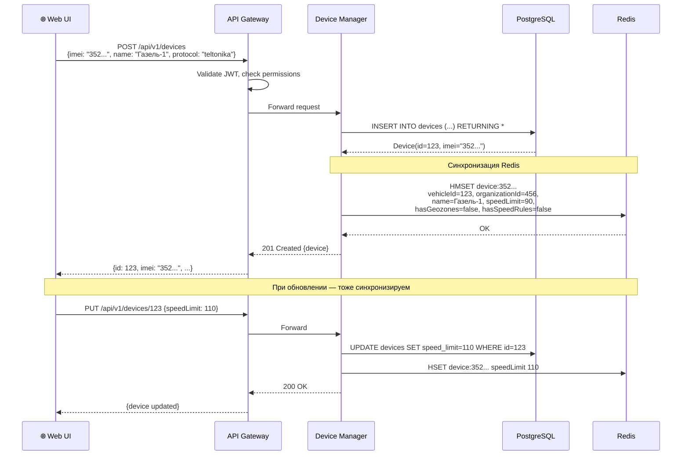
```mermaid
sequenceDiagram
    participant UI as 🌐 Web UI
    participant GW as API Gateway
    participant DM as Device Manager
    participant PG as PostgreSQL
    participant R as Redis

    UI->>GW: POST /api/v1/devices<br/>{imei: "352...", name: "Газель-1", protocol: "teltonika"}
    GW->>GW: Validate JWT, check permissions
    GW->>DM: Forward request

    DM->>PG: INSERT INTO devices (...) RETURNING *
    PG-->>DM: Device(id=123, imei="352...")

    Note over DM,R: Синхронизация Redis
    DM->>R: HMSET device:352...<br/>vehicleId=123, organizationId=456,<br/>name=Газель-1, speedLimit=90,<br/>hasGeozones=false, hasSpeedRules=false
    R-->>DM: OK

    DM-->>GW: 201 Created {device}
    GW-->>UI: {id: 123, imei: "352...", ...}

    Note over UI,R: При обновлении — тоже синхронизируем

    UI->>GW: PUT /api/v1/devices/123 {speedLimit: 110}
    GW->>DM: Forward
    DM->>PG: UPDATE devices SET speed_limit=110 WHERE id=123
    DM->>R: HSET device:352... speedLimit 110
    DM-->>GW: 200 OK
    GW-->>UI: {device updated}
```

### Sequence Diagram: Отправка команды

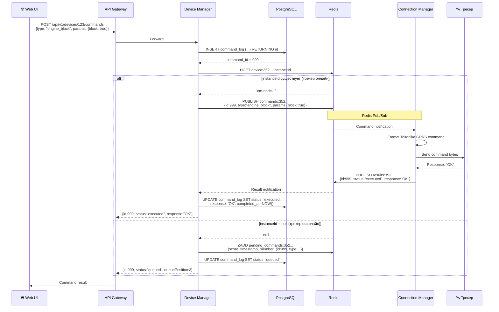
```mermaid
sequenceDiagram
    participant UI as 🌐 Web UI
    participant GW as API Gateway
    participant DM as Device Manager
    participant PG as PostgreSQL
    participant R as Redis
    participant CM as Connection Manager
    participant T as 🛰️ Трекер

    UI->>GW: POST /api/v1/devices/123/commands<br/>{type: "engine_block", params: {block: true}}
    GW->>DM: Forward

    DM->>PG: INSERT command_log (...) RETURNING id
    PG-->>DM: command_id = 999

    DM->>R: HGET device:352... instanceId
    
    alt instanceId существует (трекер онлайн)
        R-->>DM: "cm-node-1"
        DM->>R: PUBLISH commands:352...<br/>{id:999, type:"engine_block", params:{block:true}}
        
        Note over R,CM: Redis Pub/Sub
        R-->>CM: Command notification
        CM->>CM: Format Teltonika GPRS command
        CM->>T: Send command bytes
        T-->>CM: Response: "OK"
        CM->>R: PUBLISH results:352...<br/>{id:999, status:"executed", response:"OK"}
        R-->>DM: Result notification
        
        DM->>PG: UPDATE command_log SET status='executed',<br/>response='OK', completed_at=NOW()
        DM-->>GW: {id:999, status:"executed", response:"OK"}
    else instanceId = null (трекер оффлайн)
        R-->>DM: null
        DM->>R: ZADD pending_commands:352...<br/>{score: timestamp, member: {id:999, type:...}}
        DM->>PG: UPDATE command_log SET status='queued'
        DM-->>GW: {id:999, status:"queued", queuePosition:3}
    end
    
    GW-->>UI: Command result
```

### REST API

```yaml
# Устройства
GET    /api/v1/devices                    # Список (фильтр по orgId)
GET    /api/v1/devices/{id}               # Одно устройство
POST   /api/v1/devices                    # Создать
PUT    /api/v1/devices/{id}               # Обновить
DELETE /api/v1/devices/{id}               # Soft delete

# Позиции
GET    /api/v1/devices/{id}/position      # Текущая позиция (из Redis)
GET    /api/v1/devices/positions           # Все позиции org (bulk из Redis)
GET    /api/v1/devices/{id}/track          # Трек за период (из TimescaleDB)

# Команды
POST   /api/v1/devices/{id}/commands      # Отправить команду
GET    /api/v1/devices/{id}/commands      # История команд
GET    /api/v1/commands/{id}              # Статус конкретной команды
DELETE /api/v1/commands/{id}              # Отменить (если ещё в очереди)

# Импорт/Экспорт
POST   /api/v1/devices/import             # CSV import
GET    /api/v1/devices/export             # CSV export
```

---

## 🔗 Взаимодействие сервисов Block 1

### Полная Sequence Diagram

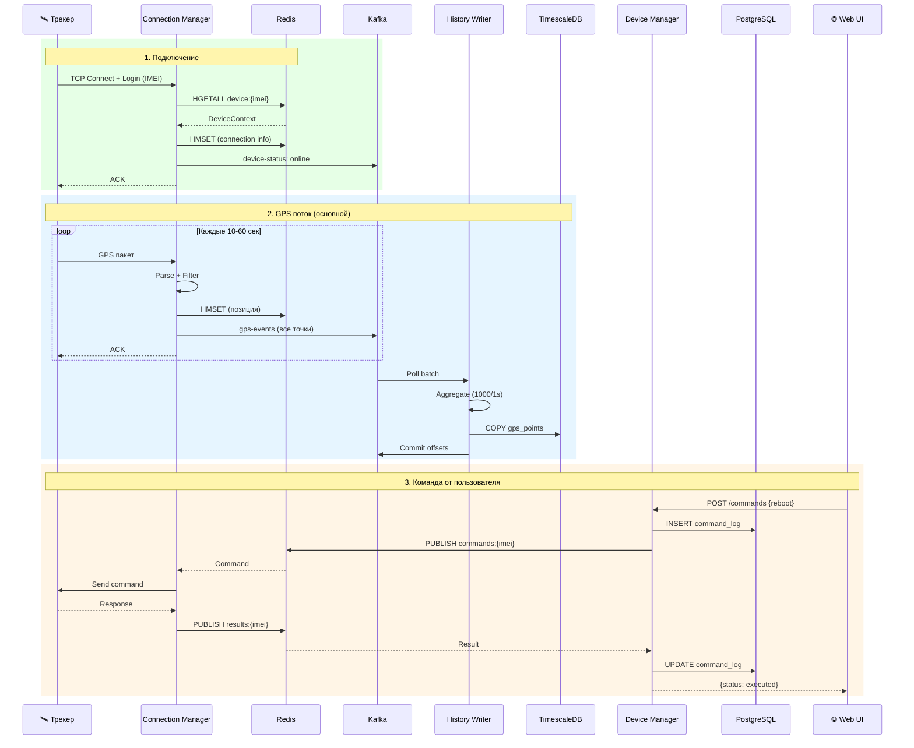
```mermaid
sequenceDiagram
    participant T as 🛰️ Трекер
    participant CM as Connection Manager
    participant R as Redis
    participant K as Kafka
    participant HW as History Writer
    participant TSDB as TimescaleDB
    participant DM as Device Manager
    participant PG as PostgreSQL
    participant UI as 🌐 Web UI

    rect rgb(230, 255, 230)
        Note over T,R: 1. Подключение
        T->>CM: TCP Connect + Login (IMEI)
        CM->>R: HGETALL device:{imei}
        R-->>CM: DeviceContext
        CM->>R: HMSET (connection info)
        CM->>K: device-status: online
        CM-->>T: ACK
    end

    rect rgb(230, 245, 255)
        Note over T,TSDB: 2. GPS поток (основной)
        loop Каждые 10-60 сек
            T->>CM: GPS пакет
            CM->>CM: Parse + Filter
            CM->>R: HMSET (позиция)
            CM->>K: gps-events (все точки)
            CM-->>T: ACK
        end

        K->>HW: Poll batch
        HW->>HW: Aggregate (1000/1s)
        HW->>TSDB: COPY gps_points
        HW->>K: Commit offsets
    end

    rect rgb(255, 245, 230)
        Note over UI,T: 3. Команда от пользователя
        UI->>DM: POST /commands {reboot}
        DM->>PG: INSERT command_log
        DM->>R: PUBLISH commands:{imei}
        R-->>CM: Command
        CM->>T: Send command
        T-->>CM: Response
        CM->>R: PUBLISH results:{imei}
        R-->>DM: Result
        DM->>PG: UPDATE command_log
        DM-->>UI: {status: executed}
    end
```

### Диаграмма потоков данных

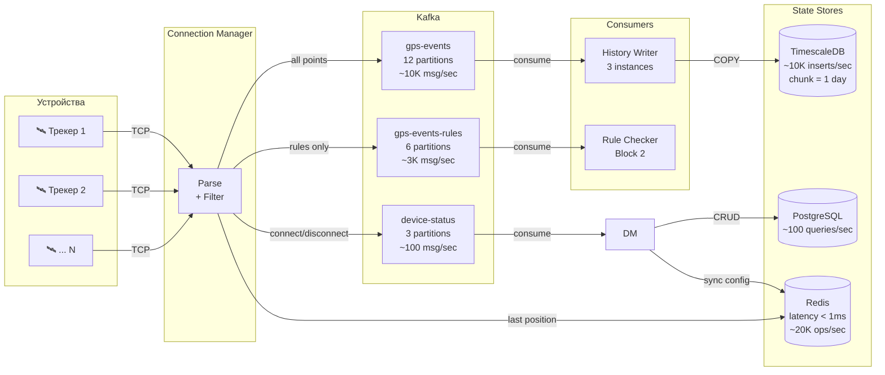
```mermaid
flowchart LR
    subgraph Devices["Устройства"]
        T1[🛰️ Трекер 1]
        T2[🛰️ Трекер 2]
        TN[🛰️ ... N]
    end

    subgraph CM["Connection Manager"]
        Parse[Parse\n+ Filter]
    end

    subgraph DataBus["Kafka"]
        GPSEvents["gps-events\n12 partitions\n~10K msg/sec"]
        RulesEvents["gps-events-rules\n6 partitions\n~3K msg/sec"]
        StatusEvents["device-status\n3 partitions\n~100 msg/sec"]
    end

    subgraph Writers["Consumers"]
        HW[History Writer\n3 instances]
        RC[Rule Checker\nBlock 2]
    end

    subgraph State["State Stores"]
        Redis[("Redis\nlatency < 1ms\n~20K ops/sec")]
        TSDB[("TimescaleDB\n~10K inserts/sec\nchunk = 1 day")]
        PG[("PostgreSQL\n~100 queries/sec")]
    end

    T1 & T2 & TN -->|TCP| Parse
    Parse -->|all points| GPSEvents
    Parse -->|rules only| RulesEvents
    Parse -->|connect/disconnect| StatusEvents
    Parse -->|last position| Redis

    GPSEvents -->|consume| HW -->|COPY| TSDB
    RulesEvents -->|consume| RC
    StatusEvents -->|consume| DM

    DM -->|CRUD| PG
    DM -->|sync config| Redis
```

---

## 📨 Kafka Topics Block 1

| Топик | Key | Partitions | Retention | Producer | Consumer |
|-------|-----|------------|-----------|----------|----------|
| **gps-events** | deviceId | 12 | 7 дней | CM | History Writer, Sensors, Analytics, Integration, Maintenance |
| **gps-events-rules** | deviceId | 6 | 7 дней | CM | Rule Checker |
| **device-status** | imei | 3 | 7 дней | CM | Device Manager |
| **device-commands** | imei | 6 | 3 дня | DM | CM |
| **command-results** | requestId | 6 | 3 дня | CM | DM |

### Структура сообщений

```json
// gps-events
{
  "deviceId": 123,
  "imei": "352625066842581",
  "organizationId": 456,
  "points": [
    {
      "timestamp": "2026-03-06T12:00:00Z",
      "lat": 55.7558,
      "lon": 37.6173,
      "speed": 45,
      "course": 180,
      "altitude": 150,
      "satellites": 12,
      "valid": true
    }
  ],
  "ioData": {"65": 1500, "239": 1, "67": 4095},
  "protocol": "teltonika",
  "receivedAt": "2026-03-06T12:00:00.050Z"
}

// device-status
{
  "imei": "352625066842581",
  "deviceId": 123,
  "status": "online",
  "protocol": "teltonika",
  "instanceId": "cm-node-1",
  "remoteAddress": "185.12.34.56:54321",
  "timestamp": "2026-03-06T12:00:00Z"
}
```

---

## 🗂️ Redis структуры Block 1

> **Реализация:** lettuce-core 6.3.2 (Java Redis клиент, проверен с Scala 3)

```
═══════════════════════════════════════════════════════════════════
  DEVICE HASH — основной ключ (без TTL, управляется Device Manager)
═══════════════════════════════════════════════════════════════════

device:{imei}                         HASH
├── CONTEXT (пишет Device Manager при sync)
│   ├── vehicleId           "123"
│   ├── organizationId      "456"
│   ├── name                "Truck-001"
│   ├── speedLimit          "90"
│   ├── hasGeozones         "true"
│   ├── hasSpeedRules       "true"
│   └── fuelTankVolume      "300"
│
├── POSITION (пишет Connection Manager при GPS)
│   ├── lat                 "55.7558"
│   ├── lon                 "37.6173"
│   ├── speed               "45"
│   ├── course              "180"
│   ├── altitude            "150"
│   ├── satellites          "12"
│   ├── time                "1706270400"
│   ├── isMoving            "true"
│   └── lastActivity        "1706270450"
│
└── CONNECTION (пишет CM при connect, удаляет при disconnect)
    ├── instanceId          "cm-node-1"
    ├── protocol            "teltonika"
    ├── connectedAt         "1706270000"
    └── remoteAddress       "192.168.1.100:54321"

═══════════════════════════════════════════════════════════════════
  COMMAND QUEUE — очередь для offline устройств
═══════════════════════════════════════════════════════════════════

pending_commands:{imei}               ZSET (TTL 24h)
  score: unix timestamp
  member: '{"id":999,"type":"reboot","payload":{...}}'

command_status:{requestId}            HASH (TTL 1h)
  status: "executed"
  response: "OK"
  sentAt: "1706270400"

═══════════════════════════════════════════════════════════════════
  PUB/SUB — команды между DM и CM
═══════════════════════════════════════════════════════════════════

commands:{imei}                       PUB/SUB channel
  DM → CM: отправь команду на трекер

results:{imei}                        PUB/SUB channel
  CM → DM: результат выполнения команды

═══════════════════════════════════════════════════════════════════
  ВСПОМОГАТЕЛЬНЫЕ
═══════════════════════════════════════════════════════════════════

unknown:{imei}:attempts               STRING (TTL 1h)
  Счётчик попыток неизвестного IMEI

cm:config                             PUB/SUB channel
  Рассылка обновлений конфигурации CM
```

---

## 📊 Prometheus метрики

### Connection Manager

```
# Подключения
gps_connections_active{protocol="teltonika"} 3500
gps_connections_active{protocol="wialon"} 2100
gps_connections_total{protocol="teltonika"} 15000

# Пакеты
gps_packets_received_total{protocol="teltonika", status="success"} 1000000
gps_packets_received_total{protocol="teltonika", status="parse_error"} 150
gps_packets_filtered_total{reason="distance"} 25000
gps_packets_filtered_total{reason="invalid_coords"} 500

# Latency
gps_parse_duration_ms{protocol="teltonika", quantile="0.50"} 0.8
gps_parse_duration_ms{protocol="teltonika", quantile="0.99"} 5.2

# Kafka publish
kafka_publish_duration_ms{topic="gps-events", quantile="0.50"} 1.2
kafka_publish_duration_ms{topic="gps-events", quantile="0.99"} 8.5

# Redis
redis_operation_duration_ms{op="HMSET", quantile="0.50"} 0.3
redis_operation_duration_ms{op="HGETALL", quantile="0.50"} 0.5
```

### History Writer

```
# Batch
history_writer_batch_size{quantile="0.50"} 850
history_writer_batch_size{quantile="0.99"} 1000
history_writer_flush_reason{reason="size"} 45000
history_writer_flush_reason{reason="timer"} 12000

# Запись
history_writer_write_duration_ms{quantile="0.50"} 45
history_writer_write_duration_ms{quantile="0.99"} 150
history_writer_points_written_total 50000000

# Consumer lag
kafka_consumer_lag{topic="gps-events", group="history-writer"} 150
```

### Device Manager

```
# CRUD
device_manager_operations_total{op="create"} 150
device_manager_operations_total{op="update"} 2400

# Команды
device_manager_commands_total{type="reboot", status="executed"} 1200
device_manager_commands_total{type="reboot", status="queued"} 350
device_manager_pending_commands_total 156

# Redis sync
device_manager_redis_sync_duration_ms{quantile="0.50"} 2.5
device_manager_cache_hits_total 450000
```

---

## 🚀 Deployment

### Диаграмма развёртывания

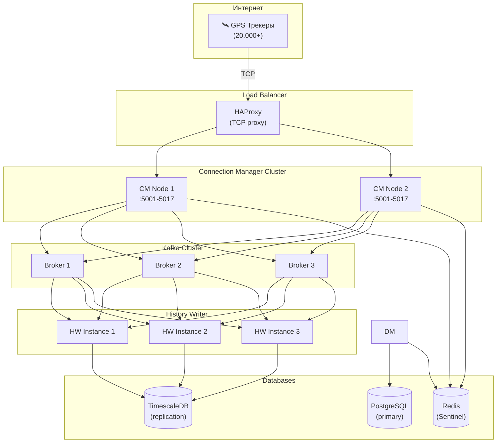
```mermaid
flowchart TB
    subgraph Internet["Интернет"]
        Trackers["🛰️ GPS Трекеры\n(20,000+)"]
    end

    subgraph LB["Load Balancer"]
        HAProxy["HAProxy\n(TCP proxy)"]
    end

    subgraph CMCluster["Connection Manager Cluster"]
        CM1["CM Node 1\n:5001-5017"]
        CM2["CM Node 2\n:5001-5017"]
    end

    subgraph Kafka["Kafka Cluster"]
        K1["Broker 1"]
        K2["Broker 2"]
        K3["Broker 3"]
    end

    subgraph HWCluster["History Writer"]
        HW1["HW Instance 1"]
        HW2["HW Instance 2"]
        HW3["HW Instance 3"]
    end

    subgraph DB["Databases"]
        TSDB[("TimescaleDB\n(replication)")]
        PG[("PostgreSQL\n(primary)")]
        Redis[("Redis\n(Sentinel)")]
    end

    Trackers -->|TCP| HAProxy
    HAProxy --> CM1 & CM2
    CM1 & CM2 --> K1 & K2 & K3
    CM1 & CM2 --> Redis
    K1 & K2 & K3 --> HW1 & HW2 & HW3
    HW1 & HW2 & HW3 --> TSDB
    DM --> PG
    DM --> Redis
```

### Docker Compose (dev)

```yaml
services:
  connection-manager:
    build: ./services/connection-manager
    ports:
      - "5001:5001"   # Teltonika
      - "5002:5002"   # Wialon
      - "5003:5003"   # Ruptela
      - "5004:5004"   # NavTelecom
      - "10090:10090" # Health API
    environment:
      KAFKA_BROKERS: kafka:9092
      REDIS_URL: redis://redis:6379
    depends_on: [kafka, redis]

  history-writer:
    build: ./services/history-writer
    ports:
      - "10091:10091" # Health API
    environment:
      KAFKA_BROKERS: kafka:9092
      DATABASE_URL: postgresql://postgres:5432/tracker
    depends_on: [kafka, timescaledb]

  device-manager:
    build: ./services/device-manager
    ports:
      - "10092:10092" # REST API
    environment:
      DATABASE_URL: postgresql://postgres:5432/tracker
      REDIS_URL: redis://redis:6379
    depends_on: [postgres, redis]
```

---

## 📊 Сводная таблица Block 1

| Параметр | Connection Manager | History Writer | Device Manager |
|----------|-------------------|----------------|----------------|
| **Тип** | TCP Server | Kafka Consumer | REST API |
| **Язык** | Scala 3 + ZIO 2 | Scala 3 + ZIO 2 | Scala 3 + ZIO 2 |
| **Порт** | 5001-5017, 10090 | 10091 | 10092 |
| **БД** | Redis (lettuce) | TimescaleDB (Doobie) | PostgreSQL (Doobie) + Redis |
| **Kafka** | Producer (3 topics) | Consumer (gps-events) | Consumer (device-status) |
| **State** | Redis + in-memory | Stateless | PostgreSQL + Redis |
| **Latency (p99)** | < 50ms | < 200ms | < 100ms |
| **Throughput** | 20K connections | 10K inserts/sec | 100 req/sec |
| **Масштабирование** | Горизонтальное | По партициям Kafka | Горизонтальное |
| **Критичность** | 🔴 Высокая | 🔴 Высокая | 🟡 Средняя |

---

**Предыдущий блок:** —  
**Следующий блок:** [ARCHITECTURE_BLOCK2.md](./ARCHITECTURE_BLOCK2.md) — Бизнес-логика

*Версия: 2.0 | Обновлён: 6 марта 2026*
