# 🧠 Block 2: Бизнес-логика

> **Ответственность:** Обработка GPS событий, геозоны, уведомления, аналитика, интеграции  
> **Сервисы (6):** Geozones, Notifications, Analytics, Integration, Sensors, Maintenance

---

## 📋 Полный список сервисов Block 2

| # | Сервис | Назначение | MVP | Статус |
|---|--------|------------|-----|--------|
| 1 | **Geozones Service** | Проверка геозон, enter/leave события | ✅ | 📋 Спроектирован |
| 2 | **Notifications Service** | Уведомления: email, sms, push, webhook | ✅ | 📋 Спроектирован |
| 3 | **Analytics Service** | Отчёты, агрегация, статистика | ✅ | 📋 Спроектирован |
| 4 | **Integration Service** | Ретрансляция в Wialon, webhooks, API | ✅ | 📋 Планируется |
| 5 | **Sensors Service** | Обработка датчиков, калибровка топлива | ✅ | 📋 Спроектирован |
| 6 | **Maintenance Service** | ТО по пробегу/моточасам, напоминания | ⏳ | 📋 PostMVP |

---

## 📋 Обзор блока

```
┌─────────────────────────────────────────────────────────────────────────────┐
│                         BLOCK 2: BUSINESS LOGIC                             │
├─────────────────────────────────────────────────────────────────────────────┤
│                                                                             │
│                        Kafka (gps-events)                                   │
│                               │                                             │
│         ┌─────────────────────┼─────────────────────┐                      │
│         │           │         │         │           │                      │
│         ▼           ▼         ▼         ▼           ▼                      │
│  ┌───────────┐┌───────────┐┌───────────┐┌───────────┐┌───────────┐        │
│  │ Geozones  ││ Sensors   ││ Analytics ││Integration││Maintenance│        │
│  │ Service   ││ Service   ││ Service   ││ Service   ││ Service   │        │
│  └─────┬─────┘└─────┬─────┘└─────┬─────┘└─────┬─────┘└─────┬─────┘        │
│        │            │            │            │            │               │
│        │ geozone-   │ sensor-    │            │ retrans-   │ maint-       │
│        │ events     │ events     │            │ late       │ events       │
│        └────────────┴────────────┴────────────┴────────────┘               │
│                               │                                             │
│                               ▼                                             │
│                    ┌─────────────────────┐                                  │
│                    │   Notifications     │                                  │
│                    │      Service        │                                  │
│                    └──────────┬──────────┘                                  │
│                               │                                             │
│                               ▼                                             │
│              ┌────────────────┼────────────────┐                           │
│              │        │       │       │        │                           │
│              ▼        ▼       ▼       ▼        ▼                           │
│            Email    SMS    Push   Webhook  Telegram                        │
│                                                                             │
└─────────────────────────────────────────────────────────────────────────────┘
```

---

## 🔄 Потоки данных Block 2

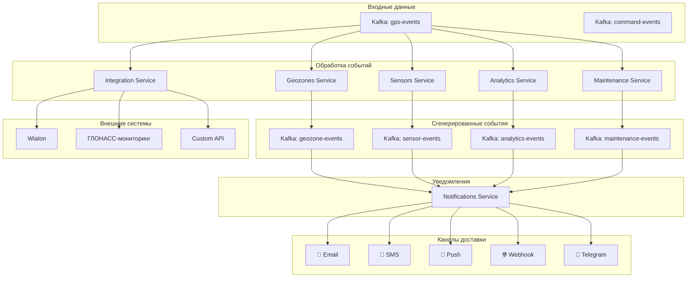

---

## 🗺️ Geozones Service

### Обзор

**Ответственность:** Проверка GPS точек на вхождение в геозоны, генерация enter/leave событий

> **Детальная документация:** [GEOZONES_SERVICE_DESIGN.md](./GEOZONES_SERVICE_DESIGN.md)  
> **FAQ:** [GEOZONES_DETAILED_FAQ.md](./GEOZONES_DETAILED_FAQ.md)

### Архитектура сервиса

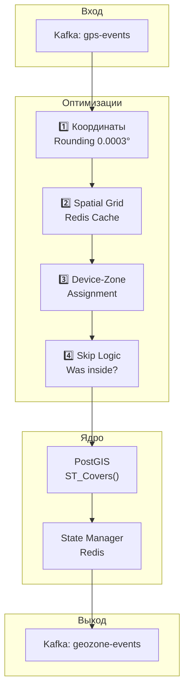

### Оптимизации (8 уровней)

| # | Оптимизация | Сокращение | Описание |
|---|------------|------------|----------|
| 1 | Coordinate Rounding | ~30% | 0.0003° = ~30м точность |
| 2 | Spatial Grid Index | 50-80% | Redis кеш зон по ячейкам |
| 3 | Device-Zone Assignment | 70-90% | Устройства → конкретные зоны |
| 4 | "Was Inside" Skip | 40-60% | Если внутри → не проверять |
| 5 | Batch Processing | Latency | Kafka micro-batches |
| 6 | PostGIS GIST Index | ~90% | Пространственный индекс |
| 7 | Simplified Geometry | ~20% | ST_Simplify для сложных |
| 8 | Inverted Grid | Быстрее | Исключение пустых ячеек |

### Результат оптимизаций

```
10,000 GPS точек/сек
    ↓ Оптимизации 1-4
~100-200 PostGIS запросов/сек
    ↓ PostGIS GIST + Batch
~10-20 мс на батч
```

### Sequence Diagram

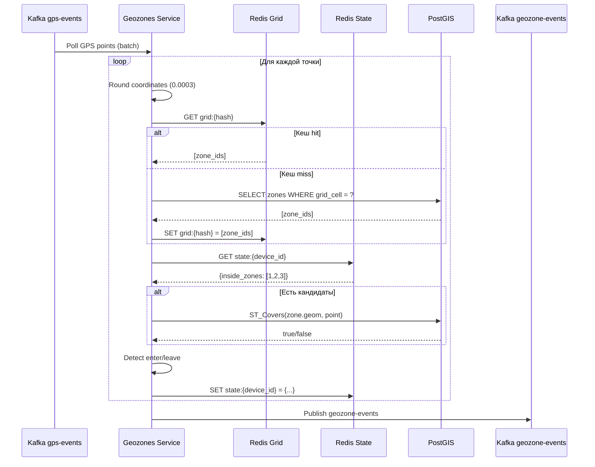

### PostgreSQL схема

```sql
-- Геозоны с PostGIS
CREATE TABLE geozones (
    id SERIAL PRIMARY KEY,
    name VARCHAR(100) NOT NULL,
    organization_id INTEGER REFERENCES organizations(id),
    zone_type VARCHAR(20) DEFAULT 'polygon',  -- polygon, circle
    geometry GEOMETRY(Geometry, 4326) NOT NULL,
    color VARCHAR(7) DEFAULT '#FF0000',
    description TEXT,
    is_active BOOLEAN DEFAULT true,
    created_at TIMESTAMPTZ DEFAULT NOW(),
    updated_at TIMESTAMPTZ DEFAULT NOW()
);

-- GIST индекс для пространственных запросов
CREATE INDEX idx_geozones_geom ON geozones USING GIST (geometry);
CREATE INDEX idx_geozones_org ON geozones (organization_id) WHERE is_active = true;

-- Spatial Grid для кеширования
CREATE TABLE geozone_grid (
    grid_hash VARCHAR(20) PRIMARY KEY,  -- geohash или custom
    zone_ids INTEGER[] NOT NULL,
    updated_at TIMESTAMPTZ DEFAULT NOW()
);

-- Связь устройств с геозонами
CREATE TABLE device_geozone_assignments (
    device_id INTEGER REFERENCES devices(id),
    geozone_id INTEGER REFERENCES geozones(id),
    PRIMARY KEY (device_id, geozone_id)
);

-- Журнал событий геозон
CREATE TABLE geozone_events (
    id BIGSERIAL PRIMARY KEY,
    device_id INTEGER NOT NULL,
    geozone_id INTEGER NOT NULL,
    event_type VARCHAR(10) NOT NULL,  -- 'enter' или 'leave'
    timestamp TIMESTAMPTZ NOT NULL,
    lat DOUBLE PRECISION NOT NULL,
    lon DOUBLE PRECISION NOT NULL,
    created_at TIMESTAMPTZ DEFAULT NOW()
);

CREATE INDEX idx_geozone_events_device 
    ON geozone_events (device_id, timestamp DESC);
```

### Redis структуры

```
# Spatial Grid Cache (зоны по ячейкам)
grid:{hash}
  value: [1, 5, 12, 45]  -- zone_ids
  TTL: 3600

# Device state (в каких зонах сейчас)
geozone:state:{device_id}
  inside_zones: [1, 2, 3]
  last_check_ts: 1706270400
  last_position: {lat, lon}
  TTL: 86400

# Zone cache (геометрия часто используемых зон)
geozone:{id}
  name: "Офис"
  geometry: WKT или GeoJSON
  bounds: {min_lat, min_lon, max_lat, max_lon}
  TTL: 3600
```

---

## 🔔 Notifications Service

### Обзор

**Ответственность:** Обработка событий, применение правил, отправка уведомлений

### Архитектура сервиса

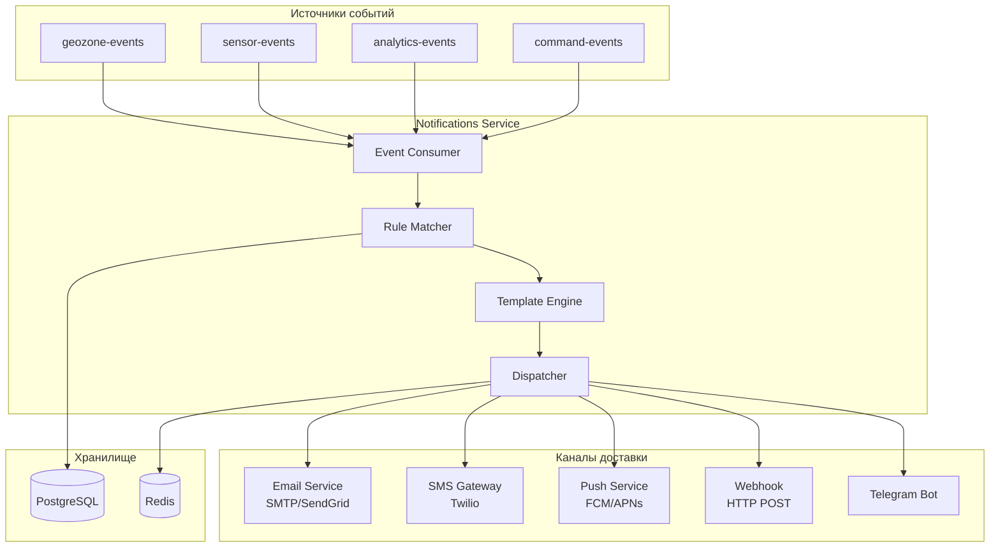

### Sequence Diagram: Обработка события

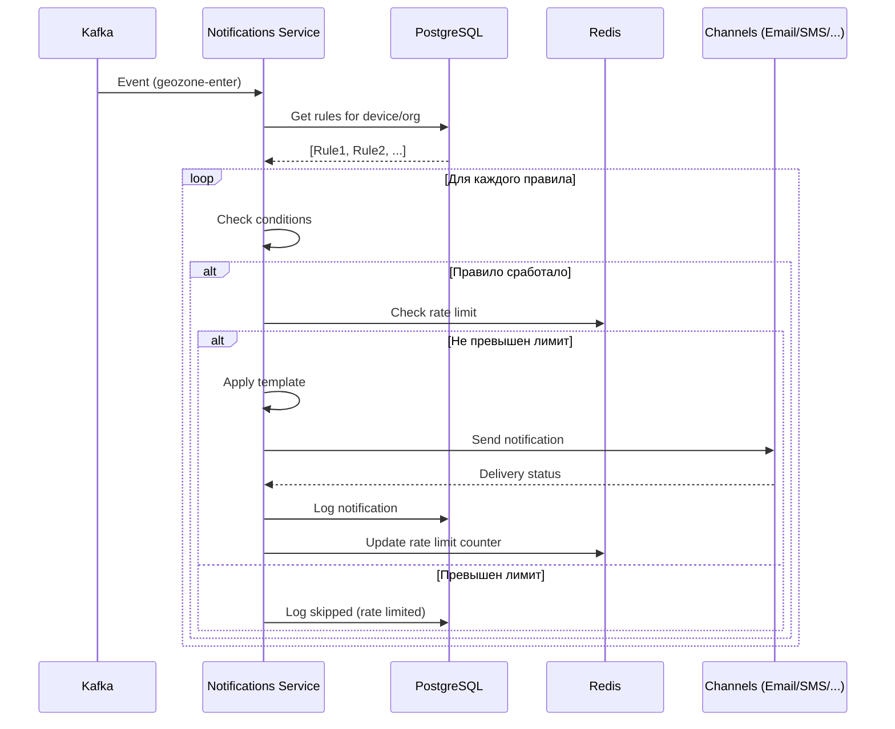

### PostgreSQL схема

```sql
-- Правила уведомлений
CREATE TABLE notification_rules (
    id SERIAL PRIMARY KEY,
    organization_id INTEGER REFERENCES organizations(id),
    name VARCHAR(100) NOT NULL,
    description TEXT,
    
    -- Триггер
    event_type VARCHAR(50) NOT NULL,      -- 'geozone_enter', 'geozone_leave', 'speed_exceed', etc
    
    -- Условия (JSON)
    conditions JSONB NOT NULL DEFAULT '{}',
    -- Пример: {"geozone_ids": [1,2,3], "device_ids": [100,101], "time_range": {"start": "08:00", "end": "18:00"}}
    
    -- Каналы доставки
    channels JSONB NOT NULL DEFAULT '[]',
    -- Пример: [{"type": "email", "recipients": ["a@b.com"]}, {"type": "sms", "phones": ["+79001234567"]}]
    
    -- Шаблоны
    template_subject VARCHAR(200),
    template_body TEXT,
    
    -- Rate limiting
    cooldown_minutes INTEGER DEFAULT 5,   -- минимальный интервал между уведомлениями
    max_per_hour INTEGER DEFAULT 10,
    
    is_active BOOLEAN DEFAULT true,
    created_at TIMESTAMPTZ DEFAULT NOW(),
    updated_at TIMESTAMPTZ DEFAULT NOW()
);

CREATE INDEX idx_notification_rules_org ON notification_rules (organization_id) WHERE is_active = true;
CREATE INDEX idx_notification_rules_event ON notification_rules (event_type) WHERE is_active = true;

-- Журнал отправленных уведомлений
CREATE TABLE notification_log (
    id BIGSERIAL PRIMARY KEY,
    rule_id INTEGER REFERENCES notification_rules(id),
    event_id BIGINT,                      -- ID исходного события
    event_type VARCHAR(50) NOT NULL,
    device_id INTEGER,
    
    channel VARCHAR(20) NOT NULL,         -- email, sms, push, webhook, telegram
    recipient VARCHAR(200) NOT NULL,      -- email address, phone, user_id, url
    
    subject VARCHAR(200),
    body TEXT,
    
    status VARCHAR(20) NOT NULL,          -- pending, sent, delivered, failed, rate_limited
    error_message TEXT,
    
    created_at TIMESTAMPTZ DEFAULT NOW(),
    sent_at TIMESTAMPTZ,
    delivered_at TIMESTAMPTZ
);

CREATE INDEX idx_notification_log_device ON notification_log (device_id, created_at DESC);
CREATE INDEX idx_notification_log_status ON notification_log (status) WHERE status = 'pending';

-- Шаблоны уведомлений (предустановленные)
CREATE TABLE notification_templates (
    id SERIAL PRIMARY KEY,
    event_type VARCHAR(50) NOT NULL,
    language VARCHAR(5) DEFAULT 'ru',
    channel VARCHAR(20) NOT NULL,
    subject VARCHAR(200),
    body TEXT NOT NULL,
    
    UNIQUE (event_type, language, channel)
);
```

### Redis структуры

```
# Rate limiting
rate_limit:{rule_id}:{device_id}:{hour}
  count: 5
  TTL: 3600

# Cooldown (последнее уведомление)
cooldown:{rule_id}:{device_id}
  sent_at: 1706270400
  TTL: cooldown_minutes * 60

# Pending notifications queue
pending_notifications
  ZSET по timestamp
```

### Prometheus метрики

```
# События
notifications_events_received_total{event_type="geozone_enter"} 50000
notifications_events_processed_total{event_type="geozone_enter"} 50000

# Правила
notifications_rules_matched_total{rule_id="1"} 1200
notifications_rules_skipped_total{reason="rate_limited"} 350

# Доставка
notifications_sent_total{channel="email", status="success"} 4500
notifications_sent_total{channel="sms", status="success"} 1200
notifications_sent_total{channel="email", status="failed"} 23

# Latency
notifications_delivery_duration_ms{channel="email", quantile="0.5"} 850
notifications_delivery_duration_ms{channel="sms", quantile="0.5"} 1200
```

---

## 📊 Analytics Service

### Обзор

**Ответственность:** Агрегация данных, генерация отчётов, статистика

### Архитектура сервиса

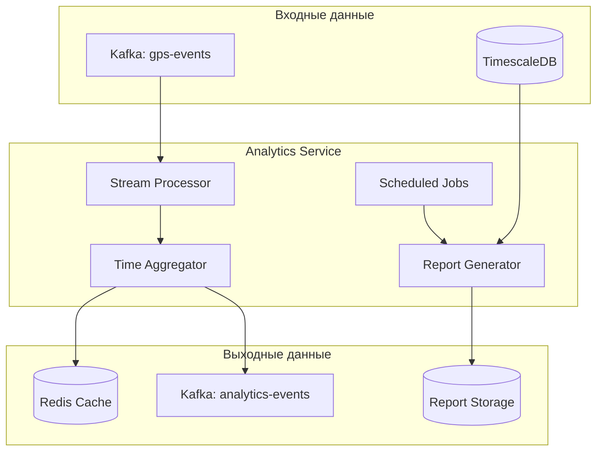

### Типы отчётов

| Отчёт | Описание | Периодичность |
|-------|----------|---------------|
| Daily Summary | Пробег, время работы, стоянки | Ежедневно |
| Trip Report | Детальные поездки | По запросу |
| Fuel Report | Расход топлива, заправки, сливы | По запросу |
| Speed Violations | Превышения скорости | По запросу |
| Geozone Visits | Посещения геозон | По запросу |
| Driver Behavior | Оценка стиля вождения | Еженедельно |

### Sequence Diagram: Генерация отчёта

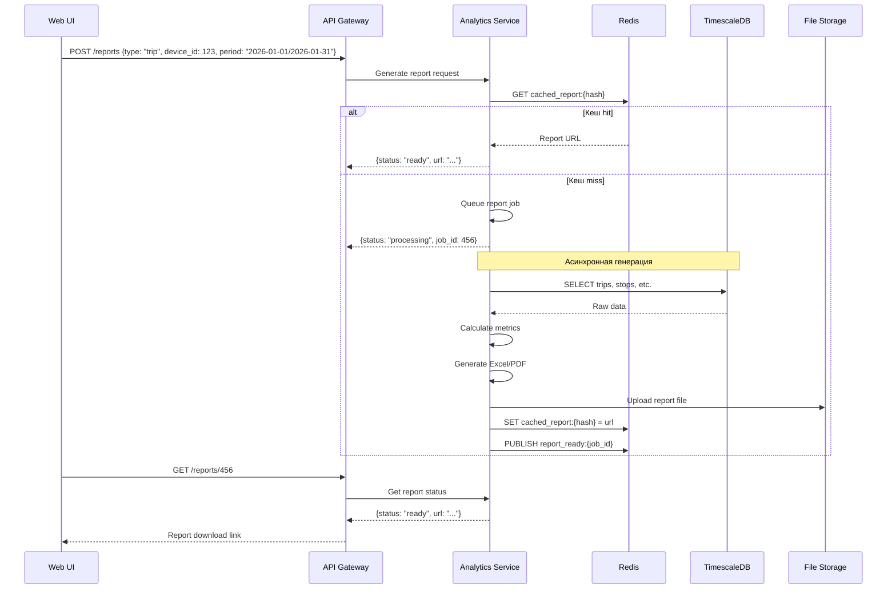

### PostgreSQL схема

```sql
-- Агрегированные данные по дням
CREATE TABLE device_daily_stats (
    device_id INTEGER NOT NULL,
    date DATE NOT NULL,
    
    -- Пробег
    total_distance_km DECIMAL(10,2),
    
    -- Время
    engine_hours INTEGER,          -- минуты
    moving_time INTEGER,           -- минуты
    idle_time INTEGER,             -- минуты
    stopped_time INTEGER,          -- минуты
    
    -- Скорость
    max_speed INTEGER,
    avg_speed DECIMAL(5,1),
    
    -- Топливо
    fuel_consumed DECIMAL(8,2),
    fuel_refilled DECIMAL(8,2),
    
    -- Счётчики
    trips_count INTEGER,
    stops_count INTEGER,
    speed_violations INTEGER,
    geozone_visits INTEGER,
    
    calculated_at TIMESTAMPTZ DEFAULT NOW(),
    
    PRIMARY KEY (device_id, date)
);

-- Детальные поездки
CREATE TABLE trips (
    id BIGSERIAL PRIMARY KEY,
    device_id INTEGER NOT NULL,
    
    start_time TIMESTAMPTZ NOT NULL,
    end_time TIMESTAMPTZ NOT NULL,
    start_lat DOUBLE PRECISION,
    start_lon DOUBLE PRECISION,
    end_lat DOUBLE PRECISION,
    end_lon DOUBLE PRECISION,
    
    distance_km DECIMAL(10,2),
    max_speed INTEGER,
    avg_speed DECIMAL(5,1),
    duration_minutes INTEGER,
    
    start_address TEXT,
    end_address TEXT,
    
    created_at TIMESTAMPTZ DEFAULT NOW()
);

CREATE INDEX idx_trips_device ON trips (device_id, start_time DESC);

-- Сгенерированные отчёты
CREATE TABLE reports (
    id UUID PRIMARY KEY DEFAULT gen_random_uuid(),
    organization_id INTEGER REFERENCES organizations(id),
    created_by INTEGER REFERENCES users(id),
    
    report_type VARCHAR(50) NOT NULL,
    parameters JSONB NOT NULL,       -- {device_ids, period, etc}
    
    status VARCHAR(20) NOT NULL,     -- pending, processing, ready, failed
    file_url TEXT,
    file_size INTEGER,
    
    created_at TIMESTAMPTZ DEFAULT NOW(),
    completed_at TIMESTAMPTZ,
    expires_at TIMESTAMPTZ           -- автоудаление через N дней
);

CREATE INDEX idx_reports_org ON reports (organization_id, created_at DESC);
```

---

## 🌡️ Sensors Service

### Обзор

**Ответственность:** Обработка данных датчиков (топливо, температура, и т.д.)

### Архитектура сервиса

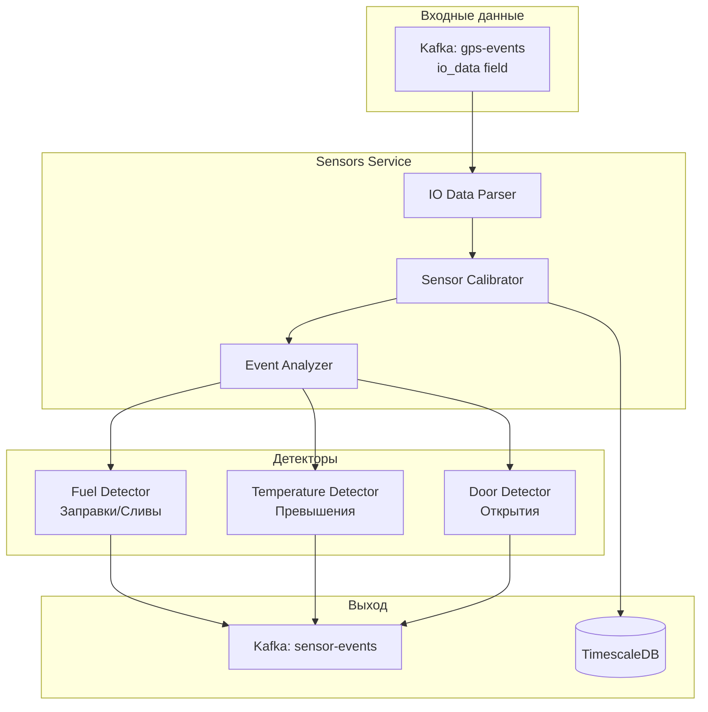

### Типы датчиков

| Тип | IO Element | Описание |
|-----|------------|----------|
| fuel_level | 65-67 | Уровень топлива (литры) |
| temperature | 72-75 | Температура (°C) |
| door_sensor | 175-178 | Датчик двери (0/1) |
| ignition | 239 | Зажигание (0/1) |
| battery | 67 | Напряжение АКБ |
| can_fuel | 83 | Топливо по CAN |
| can_rpm | 85 | Обороты двигателя |

### Калибровка топлива

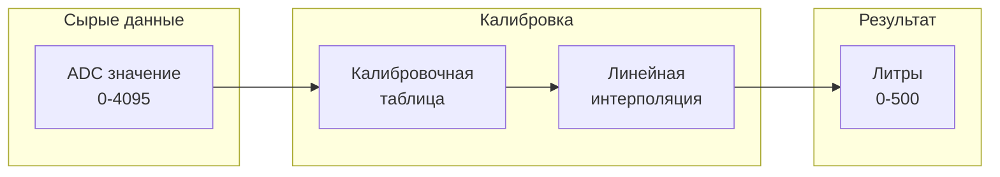

### PostgreSQL схема

```sql
-- Калибровочные таблицы датчиков
CREATE TABLE sensor_calibrations (
    id SERIAL PRIMARY KEY,
    device_id INTEGER REFERENCES devices(id),
    sensor_type VARCHAR(20) NOT NULL,     -- fuel_level, temperature, etc
    io_element INTEGER NOT NULL,          -- номер IO элемента
    
    -- Калибровочные точки (массив)
    calibration_points JSONB NOT NULL,
    -- Пример: [[0, 0], [1000, 50], [2000, 100], [3000, 150], [4096, 200]]
    -- [ADC value, liters/celsius/etc]
    
    unit VARCHAR(10),                     -- L, °C, V, etc
    
    created_at TIMESTAMPTZ DEFAULT NOW(),
    updated_at TIMESTAMPTZ DEFAULT NOW(),
    
    UNIQUE (device_id, sensor_type)
);

-- Данные датчиков (hypertable)
CREATE TABLE sensor_data (
    device_id INTEGER NOT NULL,
    timestamp TIMESTAMPTZ NOT NULL,
    sensor_type VARCHAR(20) NOT NULL,
    raw_value INTEGER,
    calibrated_value DECIMAL(10,2),
    
    PRIMARY KEY (timestamp, device_id, sensor_type)
);

SELECT create_hypertable('sensor_data', 'timestamp',
    chunk_time_interval => INTERVAL '1 day'
);

-- События датчиков (заправки, сливы, etc)
CREATE TABLE sensor_events (
    id BIGSERIAL PRIMARY KEY,
    device_id INTEGER NOT NULL,
    event_type VARCHAR(30) NOT NULL,      -- fuel_refill, fuel_drain, temp_exceed, door_open
    timestamp TIMESTAMPTZ NOT NULL,
    
    lat DOUBLE PRECISION,
    lon DOUBLE PRECISION,
    
    value_before DECIMAL(10,2),
    value_after DECIMAL(10,2),
    value_change DECIMAL(10,2),
    
    metadata JSONB,                       -- дополнительная информация
    
    created_at TIMESTAMPTZ DEFAULT NOW()
);

CREATE INDEX idx_sensor_events_device ON sensor_events (device_id, timestamp DESC);
```

---

## � Integration Service

### Обзор

**Ответственность:** Ретрансляция данных во внешние системы (Wialon, ГЛОНАСС-мониторинг, webhooks)

**Функции:**
- Ретрансляция GPS в Wialon IPS/Retranslator
- Отправка в госсистемы (ГЛОНАСС-мониторинг, Платон)
- Webhooks для интеграций
- Экспорт в форматы EGTS, NDTP

### Архитектура сервиса

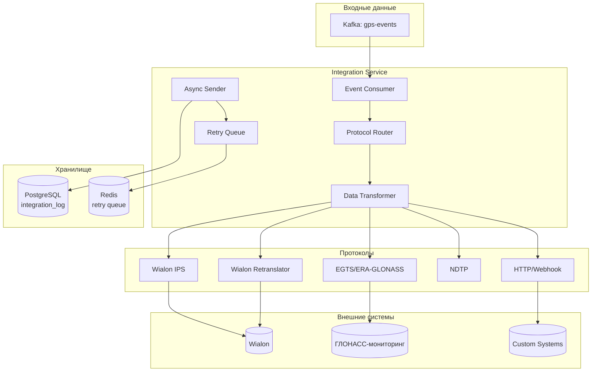

### Sequence Diagram: Ретрансляция в Wialon

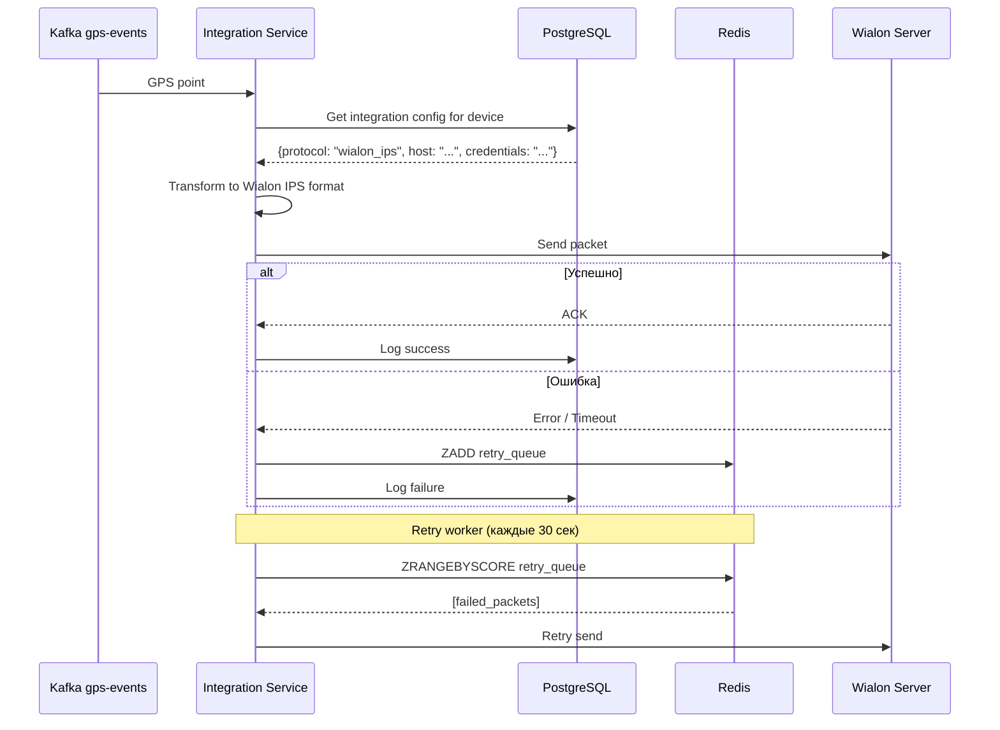

### PostgreSQL схема

```sql
-- Настройки интеграций
CREATE TABLE integrations (
    id SERIAL PRIMARY KEY,
    organization_id INTEGER REFERENCES organizations(id),
    name VARCHAR(100) NOT NULL,
    
    -- Тип интеграции
    integration_type VARCHAR(30) NOT NULL,   -- wialon_ips, wialon_retranslator, egts, webhook
    
    -- Подключение
    host VARCHAR(255) NOT NULL,
    port INTEGER,
    protocol VARCHAR(10) DEFAULT 'tcp',      -- tcp, udp, http, https
    
    -- Аутентификация
    credentials JSONB,                        -- {login, password, api_key, etc}
    
    -- Фильтр устройств
    device_ids INTEGER[],                     -- NULL = все устройства организации
    
    -- Настройки
    settings JSONB DEFAULT '{}',
    -- {
    --   "batch_size": 100,
    --   "send_interval_ms": 1000,
    --   "retry_attempts": 3,
    --   "timeout_ms": 5000
    -- }
    
    is_active BOOLEAN DEFAULT true,
    created_at TIMESTAMPTZ DEFAULT NOW(),
    updated_at TIMESTAMPTZ DEFAULT NOW()
);

CREATE INDEX idx_integrations_org ON integrations (organization_id) WHERE is_active = true;

-- Маппинг устройств для Wialon (IMEI → Unit ID)
CREATE TABLE integration_device_mapping (
    integration_id INTEGER REFERENCES integrations(id),
    device_id INTEGER REFERENCES devices(id),
    external_id VARCHAR(50) NOT NULL,         -- Unit ID в Wialon
    external_name VARCHAR(100),
    
    PRIMARY KEY (integration_id, device_id)
);

-- Лог ретрансляции
CREATE TABLE integration_log (
    id BIGSERIAL PRIMARY KEY,
    integration_id INTEGER REFERENCES integrations(id),
    device_id INTEGER,
    
    points_count INTEGER,
    bytes_sent INTEGER,
    
    status VARCHAR(20) NOT NULL,              -- success, failed, timeout, partial
    error_message TEXT,
    
    sent_at TIMESTAMPTZ DEFAULT NOW(),
    response_time_ms INTEGER
);

CREATE INDEX idx_integration_log_integration 
    ON integration_log (integration_id, sent_at DESC);
```

### Поддерживаемые протоколы

| Протокол | Формат | Направление | Описание |
|----------|--------|-------------|----------|
| Wialon IPS | Binary | → Wialon | Основной протокол Wialon |
| Wialon Retranslator | Binary | → Wialon | Для ретрансляции |
| EGTS | Binary | → ГЛОНАСС | Гос. стандарт РФ |
| NDTP | Binary | → Навтелеком | Протокол Навтелеком |
| Webhook | JSON/HTTP | → Any | Universal HTTP POST |

### Prometheus метрики

```
# Ретрансляция
integration_packets_sent_total{integration_id="1", status="success"} 500000
integration_packets_sent_total{integration_id="1", status="failed"} 150

# Latency
integration_send_duration_ms{integration_id="1", quantile="0.5"} 45
integration_send_duration_ms{integration_id="1", quantile="0.99"} 200

# Retry queue
integration_retry_queue_size{integration_id="1"} 25

# Bytes
integration_bytes_sent_total{integration_id="1"} 125000000
```

---

## 🔧 Maintenance Service

### Обзор

**Ответственность:** Контроль ТО транспорта по пробегу/моточасам, напоминания о сервисе

**Статус:** PostMVP (описание для планирования)

### Архитектура сервиса

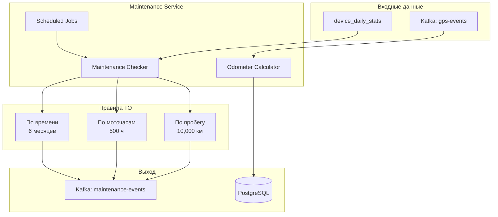

### Sequence Diagram: Проверка ТО

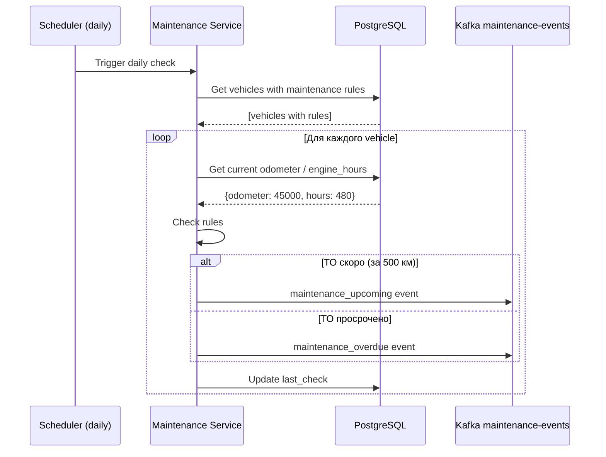

### PostgreSQL схема

```sql
-- Правила ТО
CREATE TABLE maintenance_rules (
    id SERIAL PRIMARY KEY,
    organization_id INTEGER REFERENCES organizations(id),
    name VARCHAR(100) NOT NULL,               -- "Замена масла", "ТО-1"
    description TEXT,
    
    -- Интервалы (любой или все)
    interval_km INTEGER,                      -- каждые N км
    interval_hours INTEGER,                   -- каждые N моточасов
    interval_days INTEGER,                    -- каждые N дней
    
    -- Предупреждения
    warning_km INTEGER DEFAULT 500,           -- предупредить за N км
    warning_hours INTEGER DEFAULT 50,         -- предупредить за N часов
    warning_days INTEGER DEFAULT 14,          -- предупредить за N дней
    
    is_active BOOLEAN DEFAULT true,
    created_at TIMESTAMPTZ DEFAULT NOW()
);

-- Привязка правил к устройствам
CREATE TABLE device_maintenance (
    device_id INTEGER REFERENCES devices(id),
    rule_id INTEGER REFERENCES maintenance_rules(id),
    
    -- Последнее ТО
    last_maintenance_at TIMESTAMPTZ,
    last_maintenance_km INTEGER,
    last_maintenance_hours INTEGER,
    
    -- Текущие показатели
    current_odometer_km INTEGER DEFAULT 0,
    current_engine_hours INTEGER DEFAULT 0,
    
    -- Статус
    status VARCHAR(20) DEFAULT 'ok',          -- ok, upcoming, overdue
    next_maintenance_km INTEGER,
    next_maintenance_at TIMESTAMPTZ,
    
    updated_at TIMESTAMPTZ DEFAULT NOW(),
    
    PRIMARY KEY (device_id, rule_id)
);

-- Журнал ТО
CREATE TABLE maintenance_log (
    id BIGSERIAL PRIMARY KEY,
    device_id INTEGER REFERENCES devices(id),
    rule_id INTEGER REFERENCES maintenance_rules(id),
    
    performed_at TIMESTAMPTZ NOT NULL,
    odometer_km INTEGER,
    engine_hours INTEGER,
    
    notes TEXT,
    cost DECIMAL(10,2),
    
    performed_by VARCHAR(100),                -- механик
    
    created_at TIMESTAMPTZ DEFAULT NOW(),
    created_by INTEGER REFERENCES users(id)
);

CREATE INDEX idx_maintenance_log_device 
    ON maintenance_log (device_id, performed_at DESC);

### Типы событий

| Событие | Условие | Действие |
|---------|---------|----------|
| `maintenance_upcoming` | До ТО < warning | Уведомление "скоро ТО" |
| `maintenance_overdue` | Просрочено | Критическое уведомление |
| `maintenance_performed` | ТО выполнено | Сброс счётчиков |

---

## 🔗 Взаимодействие всех сервисов Block 2

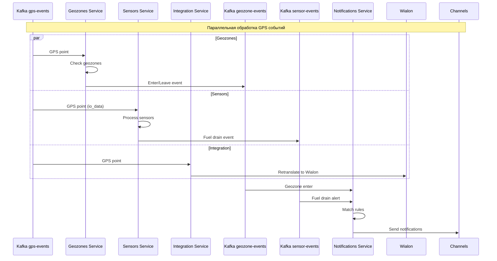

---

## 📊 Сводная таблица Block 2 (все 6 сервисов)

| Параметр | Geozones | Notifications | Analytics | Integration | Sensors | Maintenance |
|----------|----------|---------------|-----------|-------------|---------|-------------|
| **Вход** | gps-events | все события | gps-events, DB | gps-events | gps-events | daily_stats |
| **Выход** | geozone-events | каналы | reports | Wialon, etc | sensor-events | maint-events |
| **State** | Redis | PostgreSQL | Redis cache | PostgreSQL | PostgreSQL | PostgreSQL |
| **Сложность** | Высокая | Средняя | Средняя | Средняя | Средняя | Низкая |
| **MVP** | ✅ Да | ✅ Да | ⏳ Частично | ✅ Да | ⏳ Частично | ⏳ PostMVP |

---

## 🚀 Развёртывание

### Docker Compose (dev)

```yaml
services:
  geozones-service:
    build: ./services/geozones-service
    environment:
      - KAFKA_BROKERS=kafka:9092
      - DATABASE_URL=postgresql://postgres:5432/tracker
      - REDIS_URL=redis://redis:6379
    depends_on:
      - kafka
      - timescaledb
      - redis

  notifications-service:
    build: ./services/notifications-service
    environment:
      - KAFKA_BROKERS=kafka:9092
      - DATABASE_URL=postgresql://postgres:5432/tracker
      - REDIS_URL=redis://redis:6379
      - SMTP_HOST=smtp.gmail.com
      - SMS_API_KEY=${SMS_API_KEY}
    depends_on:
      - kafka
      - postgres
      - redis

  analytics-service:
    build: ./services/analytics-service
    environment:
      - KAFKA_BROKERS=kafka:9092
      - DATABASE_URL=postgresql://postgres:5432/tracker
      - REDIS_URL=redis://redis:6379
      - S3_BUCKET=reports
    depends_on:
      - kafka
      - timescaledb
      - redis

  sensors-service:
    build: ./services/sensors-service
    environment:
      - KAFKA_BROKERS=kafka:9092
      - DATABASE_URL=postgresql://postgres:5432/tracker
    depends_on:
      - kafka
      - timescaledb

  integration-service:
    build: ./services/integration-service
    environment:
      - KAFKA_BROKERS=kafka:9092
      - DATABASE_URL=postgresql://postgres:5432/tracker
      - REDIS_URL=redis://redis:6379
    depends_on:
      - kafka
      - postgres
      - redis

  # maintenance-service: (PostMVP)
  #   build: ./services/maintenance-service
  #   ...
```

---

**Дата:** 26 января 2026  
**Статус:** Block 2 документация готова ✅ (6 сервисов)

**Следующий шаг:** [ARCHITECTURE_BLOCK3.md](./ARCHITECTURE_BLOCK3.md) — Представление
