# 🧠 Block 2: Бизнес-логика

> Тег: `АКТУАЛЬНО` | Обновлён: `2026-03-06` | Версия: `2.0`
>
> **Ответственность:** Обработка GPS событий, геозоны, уведомления, аналитика, интеграции, датчики, ТО, биллинг, тикеты  
> **Сервисы (10):** Rule Checker, Notification Service, Sensors Service, Integration Service, Analytics Service, Maintenance Service, Admin Service, User Service, Billing Service, Ticket Service

> **⚠️ ТЕКУЩЕЕ ОГРАНИЧЕНИЕ (2026-03-06):**  
> `zio-redis` несовместим с ZIO 2.0.20 + Scala 3.4.0. В сервисах Block 2 кэширование реализовано через **ZIO `Ref` (in-memory)**.  
> Целевой дизайн: миграция на lettuce (как в CM). Подробнее: [REDIS_VS_REF_DECISION.md](../REDIS_VS_REF_DECISION.md)

---

## 📑 Содержание

1. [Обзор блока](#-обзор-блока)
2. [Диаграмма компонентов](#-диаграмма-компонентов)
3. [UML: Доменная модель](#-uml-доменная-модель-block-2)
4. [Потоки событий](#-потоки-событий)
5. [Rule Checker (Геозоны + Скорость)](#-rule-checker)
6. [Notification Service](#-notification-service)
7. [Sensors Service](#-sensors-service)
8. [Integration Service](#-integration-service)
9. [Analytics Service](#-analytics-service)
10. [Maintenance Service](#-maintenance-service)
11. [Admin Service](#-admin-service)
12. [User Service](#-user-service)
13. [Billing Service](#-billing-service)
14. [Ticket Service](#-ticket-service)
15. [Взаимодействие сервисов](#-взаимодействие-всех-сервисов-block-2)
16. [Kafka Topics](#-kafka-topics-block-2)
17. [ER: Базы данных](#-er-базы-данных-block-2)
16. [Сводная таблица](#-сводная-таблица-block-2)
17. [Deployment](#-deployment)

---

## 📋 Обзор блока

```
┌──────────────────────────────────────────────────────────────────────────────┐
│                          BLOCK 2: BUSINESS LOGIC                             │
├──────────────────────────────────────────────────────────────────────────────┤
│                                                                              │
│                    Kafka (gps-events, gps-events-rules)                      │
│                               │                                              │
│         ┌─────────────────────┼─────────────────────┐                       │
│         │           │         │         │           │                       │
│         ▼           ▼         ▼         ▼           ▼                       │
│  ┌───────────┐┌───────────┐┌───────────┐┌───────────┐┌───────────┐         │
│  │   Rule    ││ Sensors   ││ Analytics ││Integration││Maintenance│         │
│  │  Checker  ││ Service   ││ Service   ││ Service   ││ Service   │         │
│  │ (PostGIS) ││ (calib.)  ││ (reports) ││ (Wialon)  ││ (ТО)      │         │
│  └─────┬─────┘└─────┬─────┘└─────┬─────┘└─────┬─────┘└─────┬─────┘         │
│        │            │            │            │            │                │
│   geozone-     sensor-      (reports)    retrans-     maint-              │
│   events       events                    late         events              │
│        └────────────┴────────┬───┴────────────┘            │                │
│                              ▼                             │                │
│                    ┌─────────────────────┐                 │                │
│                    │  Notification Svc   │◄────────────────┘                │
│                    └──────────┬──────────┘                                  │
│                     Email│SMS│Push│Webhook│Telegram                         │
│                                                                              │
│  ┌───────────┐  ┌───────────┐                                               │
│  │  Admin    │  │   User    │                                               │
│  │  Service  │  │  Service  │  (cross-cutting)                              │
│  └───────────┘  └───────────┘                                               │
└──────────────────────────────────────────────────────────────────────────────┘
```

### Все сервисы Block 2

| # | Сервис | Порт | Kafka In | Kafka Out | БД | Статус |
|---|--------|------|----------|-----------|-----|--------|
| 1 | **Rule Checker** | 8093 | gps-events-rules | geozone-events, speed-events | PostgreSQL+PostGIS, Ref | MVP |
| 2 | **Notification Service** | 8094 | geozone-events, sensor-events, maintenance-events | — | PostgreSQL, Ref | MVP |
| 3 | **Sensors Service** | 8098 | gps-events | sensor-events | PostgreSQL+TimescaleDB, Ref | MVP |
| 4 | **Integration Service** | 8096 | gps-events | — | PostgreSQL, Ref | MVP |
| 5 | **Analytics Service** | 8095 | — | — | TimescaleDB+PostgreSQL, Ref | MVP |
| 6 | **Maintenance Service** | 8087 | gps-events | maintenance-events | PostgreSQL, Ref | PostMVP |
| 7 | **Admin Service** | 8097 | — | — | PostgreSQL, Ref | MVP |
| 8 | **User Service** | 8091 | — | — | PostgreSQL, Ref | MVP |
| 9 | **Billing Service** | 8099 | device-events, billing-commands | billing-events | PostgreSQL, Ref | MVP (80 тестов) |
| 10 | **Ticket Service** | 8101 | — | ticket-events | PostgreSQL, Ref | MVP (58 тестов) |

---

## 🧩 Диаграмма компонентов

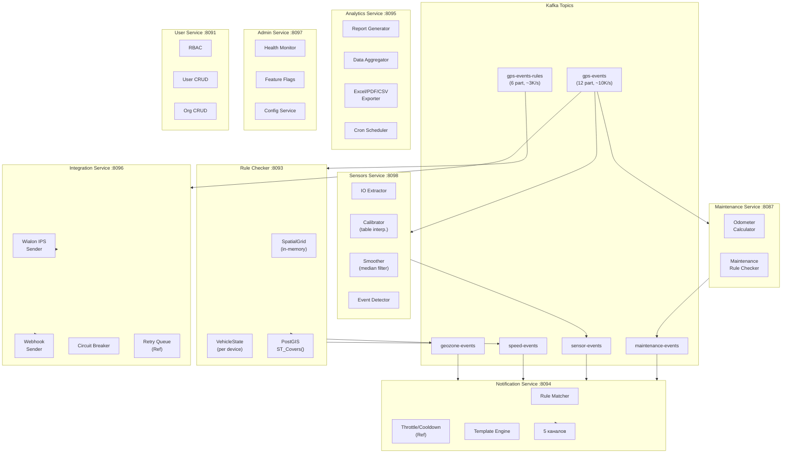
```mermaid
flowchart TB
    subgraph Kafka["Kafka Topics"]
        GPS["gps-events\n(12 part, ~10K/s)"]
        RULES["gps-events-rules\n(6 part, ~3K/s)"]
        GEO_EV["geozone-events"]
        SPEED_EV["speed-events"]
        SENSOR_EV["sensor-events"]
        MAINT_EV["maintenance-events"]
    end

    subgraph RC["Rule Checker :8093"]
        SpatialGrid["SpatialGrid\n(in-memory)"]
        VehicleState["VehicleState\n(per device)"]
        PostGIS["PostGIS\nST_Covers()"]
    end

    subgraph NS["Notification Service :8094"]
        RuleMatcher["Rule Matcher"]
        Throttle["Throttle/Cooldown\n(Ref)"]
        Template["Template Engine"]
        Channels["5 каналов"]
    end

    subgraph SS["Sensors Service :8098"]
        IoExtract["IO Extractor"]
        Calibrator["Calibrator\n(table interp.)"]
        Smoother["Smoother\n(median filter)"]
        Detector["Event Detector"]
    end

    subgraph IS["Integration Service :8096"]
        WialonSender["Wialon IPS\nSender"]
        WebhookSender["Webhook\nSender"]
        CircuitBreaker["Circuit Breaker"]
        RetryQueue["Retry Queue\n(Ref)"]
    end

    subgraph AS["Analytics Service :8095"]
        ReportGen["Report Generator"]
        Aggregator["Data Aggregator"]
        Exporter["Excel/PDF/CSV\nExporter"]
        Scheduler["Cron Scheduler"]
    end

    subgraph MS["Maintenance Service :8087"]
        OdometerCalc["Odometer\nCalculator"]
        RuleChecker2["Maintenance\nRule Checker"]
    end

    subgraph ADS["Admin Service :8097"]
        HealthMon["Health Monitor"]
        FeatureFlags["Feature Flags"]
        ConfigSvc["Config Service"]
    end

    subgraph US["User Service :8091"]
        RBAC["RBAC"]
        UserCRUD["User CRUD"]
        OrgCRUD["Org CRUD"]
    end

    RULES --> RC
    RC --> PostGIS
    RC --> GEO_EV & SPEED_EV

    GPS --> SS --> SENSOR_EV
    GPS --> IS --> WialonSender & WebhookSender
    GPS --> MS --> MAINT_EV

    GEO_EV & SPEED_EV & SENSOR_EV & MAINT_EV --> NS --> Channels
```

---

## 🏗️ UML: Доменная модель Block 2

### События и правила

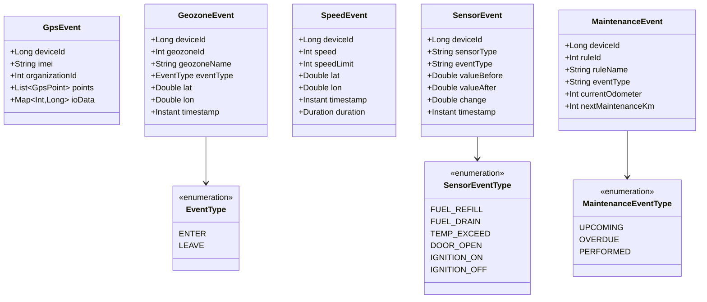
```mermaid
classDiagram
    class GpsEvent {
        +Long deviceId
        +String imei
        +Int organizationId
        +List~GpsPoint~ points
        +Map~Int,Long~ ioData
    }

    class GeozoneEvent {
        +Long deviceId
        +Int geozoneId
        +String geozoneName
        +EventType eventType
        +Double lat
        +Double lon
        +Instant timestamp
    }

    class SpeedEvent {
        +Long deviceId
        +Int speed
        +Int speedLimit
        +Double lat
        +Double lon
        +Instant timestamp
        +Duration duration
    }

    class SensorEvent {
        +Long deviceId
        +String sensorType
        +String eventType
        +Double valueBefore
        +Double valueAfter
        +Double change
        +Instant timestamp
    }

    class MaintenanceEvent {
        +Long deviceId
        +Int ruleId
        +String ruleName
        +String eventType
        +Int currentOdometer
        +Int nextMaintenanceKm
    }

    class EventType {
        <<enumeration>>
        ENTER
        LEAVE
    }

    class SensorEventType {
        <<enumeration>>
        FUEL_REFILL
        FUEL_DRAIN
        TEMP_EXCEED
        DOOR_OPEN
        IGNITION_ON
        IGNITION_OFF
    }

    class MaintenanceEventType {
        <<enumeration>>
        UPCOMING
        OVERDUE
        PERFORMED
    }

    GeozoneEvent --> EventType
    SensorEvent --> SensorEventType
    MaintenanceEvent --> MaintenanceEventType
```

### Правила уведомлений

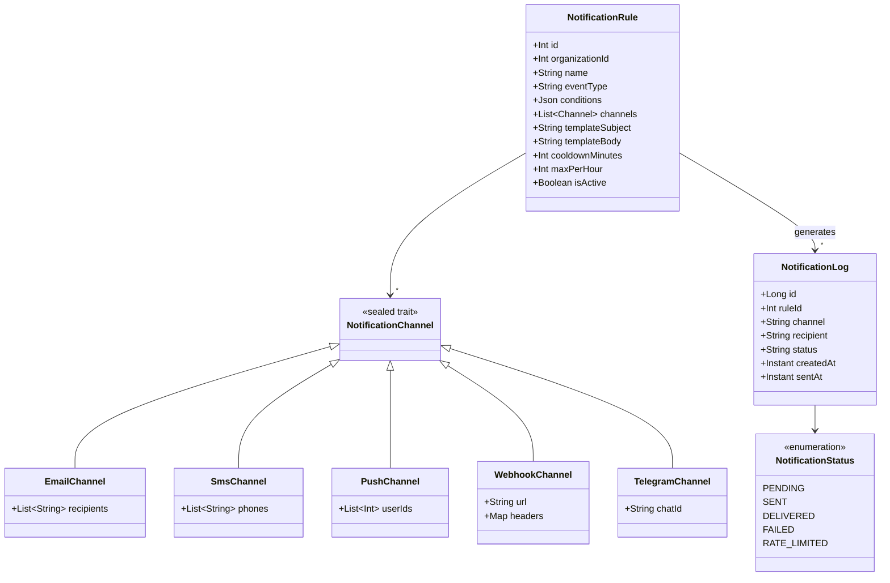
```mermaid
classDiagram
    class NotificationRule {
        +Int id
        +Int organizationId
        +String name
        +String eventType
        +Json conditions
        +List~Channel~ channels
        +String templateSubject
        +String templateBody
        +Int cooldownMinutes
        +Int maxPerHour
        +Boolean isActive
    }

    class NotificationChannel {
        <<sealed trait>>
    }
    class EmailChannel {
        +List~String~ recipients
    }
    class SmsChannel {
        +List~String~ phones
    }
    class PushChannel {
        +List~Int~ userIds
    }
    class WebhookChannel {
        +String url
        +Map headers
    }
    class TelegramChannel {
        +String chatId
    }

    class NotificationLog {
        +Long id
        +Int ruleId
        +String channel
        +String recipient
        +String status
        +Instant createdAt
        +Instant sentAt
    }

    class NotificationStatus {
        <<enumeration>>
        PENDING
        SENT
        DELIVERED
        FAILED
        RATE_LIMITED
    }

    NotificationRule --> "*" NotificationChannel
    NotificationChannel <|-- EmailChannel
    NotificationChannel <|-- SmsChannel
    NotificationChannel <|-- PushChannel
    NotificationChannel <|-- WebhookChannel
    NotificationChannel <|-- TelegramChannel
    NotificationLog --> NotificationStatus
    NotificationRule --> "*" NotificationLog : generates
```

### Геозоны

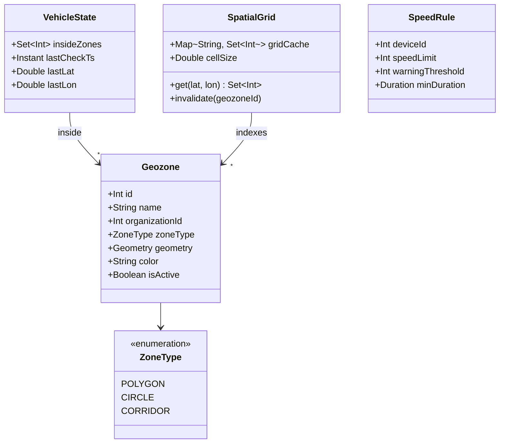
```mermaid
classDiagram
    class Geozone {
        +Int id
        +String name
        +Int organizationId
        +ZoneType zoneType
        +Geometry geometry
        +String color
        +Boolean isActive
    }

    class ZoneType {
        <<enumeration>>
        POLYGON
        CIRCLE
        CORRIDOR
    }

    class VehicleState {
        +Set~Int~ insideZones
        +Instant lastCheckTs
        +Double lastLat
        +Double lastLon
    }

    class SpatialGrid {
        +Map~String, Set~Int~~ gridCache
        +Double cellSize
        +get(lat, lon) Set~Int~
        +invalidate(geozoneId)
    }

    class SpeedRule {
        +Int deviceId
        +Int speedLimit
        +Int warningThreshold
        +Duration minDuration
    }

    Geozone --> ZoneType
    VehicleState --> "*" Geozone : inside
    SpatialGrid --> "*" Geozone : indexes
```

### Интеграции

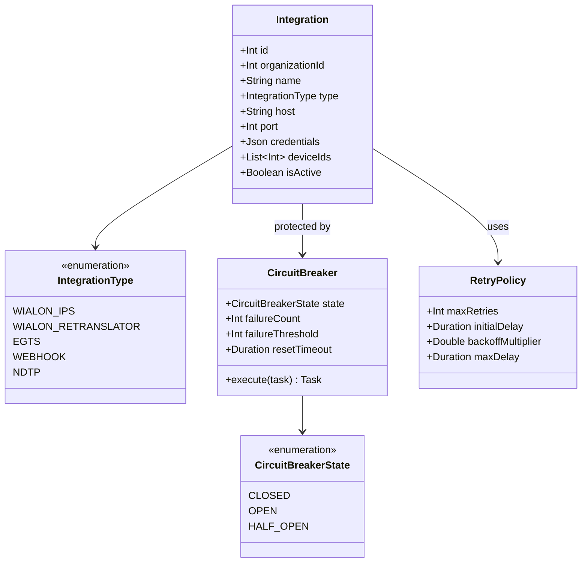
```mermaid
classDiagram
    class Integration {
        +Int id
        +Int organizationId
        +String name
        +IntegrationType type
        +String host
        +Int port
        +Json credentials
        +List~Int~ deviceIds
        +Boolean isActive
    }

    class IntegrationType {
        <<enumeration>>
        WIALON_IPS
        WIALON_RETRANSLATOR
        EGTS
        WEBHOOK
        NDTP
    }

    class CircuitBreakerState {
        <<enumeration>>
        CLOSED
        OPEN
        HALF_OPEN
    }

    class CircuitBreaker {
        +CircuitBreakerState state
        +Int failureCount
        +Int failureThreshold
        +Duration resetTimeout
        +execute(task) Task
    }

    class RetryPolicy {
        +Int maxRetries
        +Duration initialDelay
        +Double backoffMultiplier
        +Duration maxDelay
    }

    Integration --> IntegrationType
    Integration --> CircuitBreaker : protected by
    CircuitBreaker --> CircuitBreakerState
    Integration --> RetryPolicy : uses
```

---

## 🔄 Потоки событий

### Event Pipeline: GPS → Обработка → Уведомление

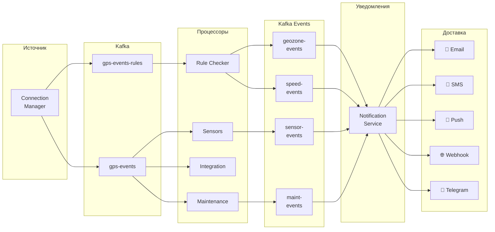
```mermaid
flowchart LR
    subgraph Source["Источник"]
        CM["Connection\nManager"]
    end

    subgraph Bus1["Kafka"]
        GPS["gps-events"]
        RULES["gps-events-rules"]
    end

    subgraph Processors["Процессоры"]
        RC["Rule Checker"]
        SS["Sensors"]
        IS["Integration"]
        MS["Maintenance"]
    end

    subgraph Bus2["Kafka Events"]
        GE["geozone-\nevents"]
        SPE["speed-\nevents"]
        SE["sensor-\nevents"]
        ME["maint-\nevents"]
    end

    subgraph Notifier["Уведомления"]
        NS["Notification\nService"]
    end

    subgraph Delivery["Доставка"]
        E["📧 Email"]
        S["📱 SMS"]
        P["🔔 Push"]
        W["🌐 Webhook"]
        T["💬 Telegram"]
    end

    CM --> GPS & RULES
    RULES --> RC
    GPS --> SS & IS & MS

    RC --> GE & SPE
    SS --> SE
    MS --> ME

    GE & SPE & SE & ME --> NS
    NS --> E & S & P & W & T
```

---

## 🗺️ Rule Checker

### Обзор

| Параметр | Значение |
|----------|----------|
| **Ответственность** | Проверка GPS точек на геозоны и скорость |
| **Порт** | 8093 |
| **Kafka In** | gps-events-rules |
| **Kafka Out** | geozone-events, speed-events |
| **БД** | PostgreSQL + PostGIS (геометрия) |
| **State** | Ref (целевой: Redis для VehicleState) |

### Архитектура

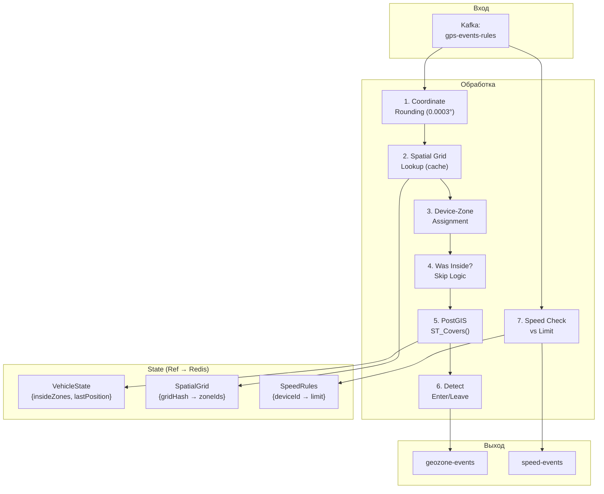
```mermaid
flowchart TB
    subgraph Input["Вход"]
        K["Kafka:\ngps-events-rules"]
    end

    subgraph Pipeline["Обработка"]
        direction TB
        Round["1. Coordinate\nRounding (0.0003°)"]
        Grid["2. Spatial Grid\nLookup (cache)"]
        Assign["3. Device-Zone\nAssignment"]
        Skip["4. Was Inside?\nSkip Logic"]
        PostGIS["5. PostGIS\nST_Covers()"]
        Detect["6. Detect\nEnter/Leave"]
        Speed["7. Speed Check\nvs Limit"]
    end

    subgraph State["State (Ref → Redis)"]
        VS["VehicleState\n{insideZones, lastPosition}"]
        SG["SpatialGrid\n{gridHash → zoneIds}"]
        SR["SpeedRules\n{deviceId → limit}"]
    end

    subgraph Output["Выход"]
        GE["geozone-events"]
        SE["speed-events"]
    end

    K --> Round --> Grid --> Assign --> Skip --> PostGIS --> Detect --> GE
    Speed --> SE
    Grid --> SG
    PostGIS --> VS
    Speed --> SR
    K --> Speed
```

### 8 уровней оптимизации

| # | Оптимизация | Сокращение запросов | Описание |
|---|------------|---------------------|----------|
| 1 | Coordinate Rounding | ~30% | 0.0003° ≈ 30м — округление координат |
| 2 | Spatial Grid Index | 50-80% | In-memory кеш зон по ячейкам сетки |
| 3 | Device-Zone Assignment | 70-90% | Проверять только назначенные зоны |
| 4 | "Was Inside" Skip | 40-60% | Если был внутри и не двигался — скип |
| 5 | Batch Processing | Latency | Kafka micro-batches вместо по одному |
| 6 | PostGIS GIST Index | ~90% | Пространственный индекс R-tree |
| 7 | ST_Simplify | ~20% | Упрощение сложных полигонов |
| 8 | Inverted Grid | Быстрее | Быстрое исключение пустых ячеек |

**Результат:**
```
10,000 GPS точек/сек → Оптимизации 1-4 → ~200 PostGIS запросов/сек → ~10ms на батч
```

### Sequence Diagram: Проверка геозон

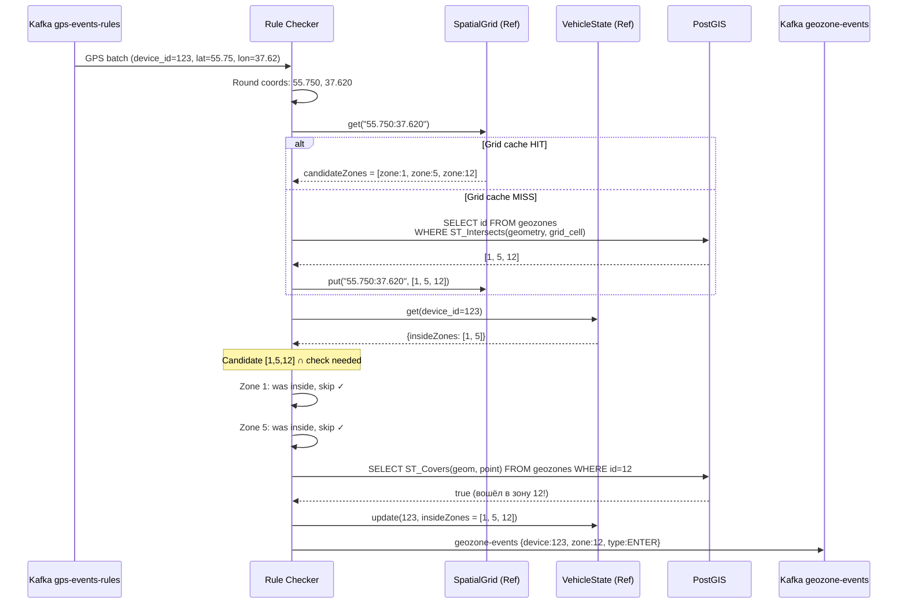
```mermaid
sequenceDiagram
    participant K as Kafka gps-events-rules
    participant RC as Rule Checker
    participant SG as SpatialGrid (Ref)
    participant VS as VehicleState (Ref)
    participant PG as PostGIS
    participant KE as Kafka geozone-events

    K->>RC: GPS batch (device_id=123, lat=55.75, lon=37.62)

    RC->>RC: Round coords: 55.750, 37.620
    RC->>SG: get("55.750:37.620")

    alt Grid cache HIT
        SG-->>RC: candidateZones = [zone:1, zone:5, zone:12]
    else Grid cache MISS
        RC->>PG: SELECT id FROM geozones<br/>WHERE ST_Intersects(geometry, grid_cell)
        PG-->>RC: [1, 5, 12]
        RC->>SG: put("55.750:37.620", [1, 5, 12])
    end

    RC->>VS: get(device_id=123)
    VS-->>RC: {insideZones: [1, 5]}

    Note over RC: Candidate [1,5,12] ∩ check needed

    RC->>RC: Zone 1: was inside, skip ✓
    RC->>RC: Zone 5: was inside, skip ✓
    RC->>PG: SELECT ST_Covers(geom, point) FROM geozones WHERE id=12
    PG-->>RC: true (вошёл в зону 12!)

    RC->>VS: update(123, insideZones = [1, 5, 12])
    RC->>KE: geozone-events {device:123, zone:12, type:ENTER}
```

### State Diagram: Устройство в геозоне

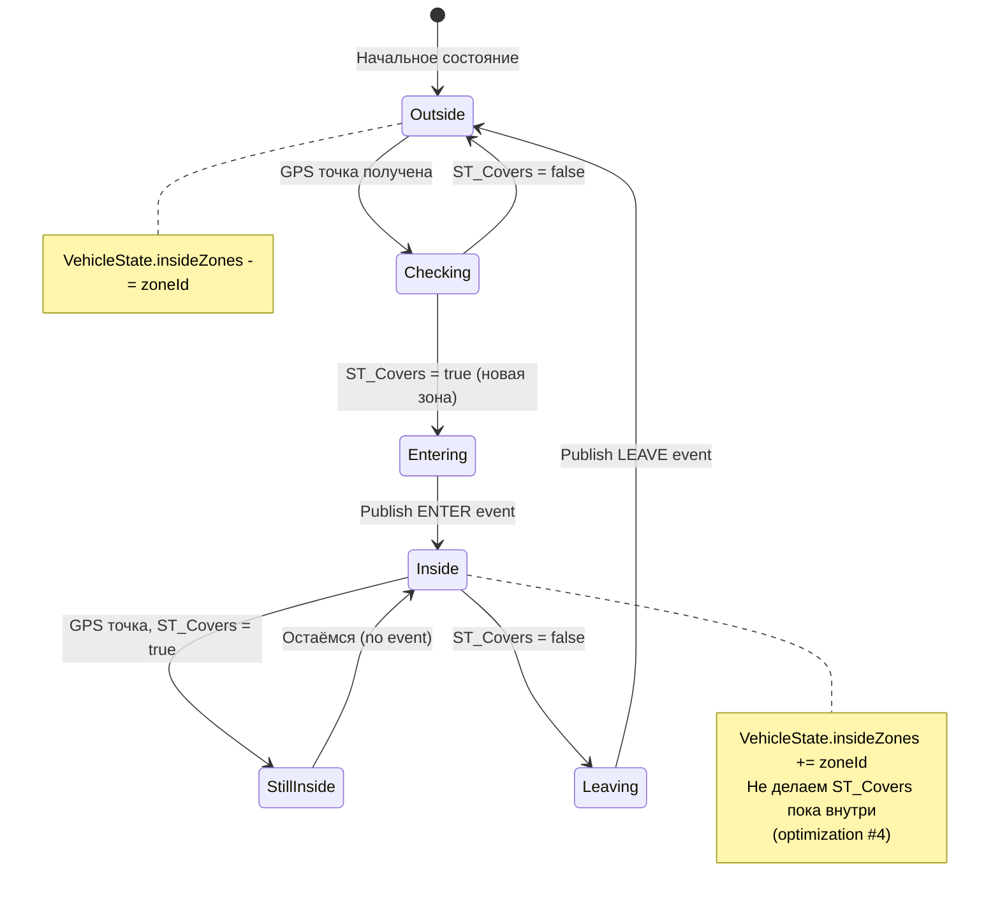
```mermaid
stateDiagram-v2
    [*] --> Outside : Начальное состояние

    Outside --> Checking : GPS точка получена
    Checking --> Outside : ST_Covers = false
    Checking --> Entering : ST_Covers = true (новая зона)
    
    Entering --> Inside : Publish ENTER event
    
    Inside --> StillInside : GPS точка, ST_Covers = true
    StillInside --> Inside : Остаёмся (no event)
    
    Inside --> Leaving : ST_Covers = false
    Leaving --> Outside : Publish LEAVE event

    note right of Inside
        VehicleState.insideZones += zoneId
        Не делаем ST_Covers пока внутри
        (optimization #4)
    end note
    
    note right of Outside
        VehicleState.insideZones -= zoneId
    end note
```

---

## 🔔 Notification Service

### Обзор

| Параметр | Значение |
|----------|----------|
| **Ответственность** | Обработка событий, применение правил, рассылка уведомлений |
| **Порт** | 8094 |
| **Kafka In** | geozone-events, speed-events, sensor-events, maintenance-events |
| **Каналы** | Email (SMTP), SMS (Twilio), Push (FCM), Webhook, Telegram |
| **State** | Ref (throttle counters, cooldown timers) |

### Sequence Diagram: Обработка события

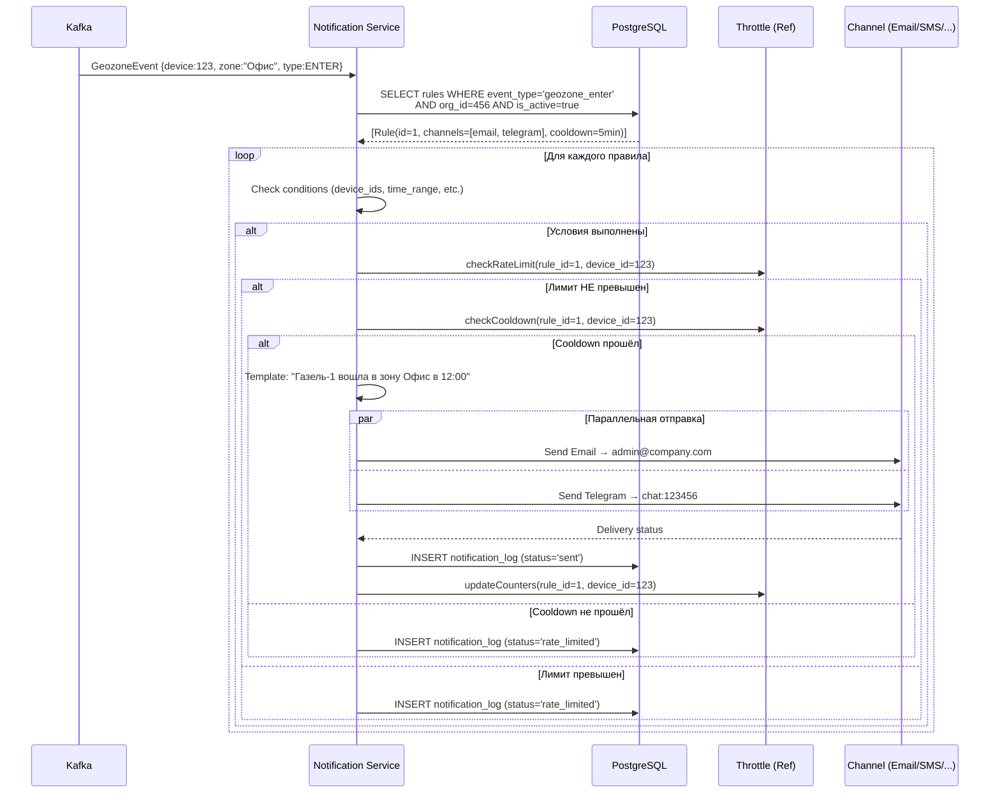
```mermaid
sequenceDiagram
    participant K as Kafka
    participant NS as Notification Service
    participant DB as PostgreSQL
    participant Th as Throttle (Ref)
    participant Ch as Channel (Email/SMS/...)

    K->>NS: GeozoneEvent {device:123, zone:"Офис", type:ENTER}
    
    NS->>DB: SELECT rules WHERE event_type='geozone_enter'<br/>AND org_id=456 AND is_active=true
    DB-->>NS: [Rule(id=1, channels=[email, telegram], cooldown=5min)]

    loop Для каждого правила
        NS->>NS: Check conditions (device_ids, time_range, etc.)
        
        alt Условия выполнены
            NS->>Th: checkRateLimit(rule_id=1, device_id=123)
            
            alt Лимит НЕ превышен
                NS->>Th: checkCooldown(rule_id=1, device_id=123)
                
                alt Cooldown прошёл
                    NS->>NS: Template: "Газель-1 вошла в зону Офис в 12:00"
                    
                    par Параллельная отправка
                        NS->>Ch: Send Email → admin@company.com
                    and
                        NS->>Ch: Send Telegram → chat:123456
                    end
                    
                    Ch-->>NS: Delivery status
                    NS->>DB: INSERT notification_log (status='sent')
                    NS->>Th: updateCounters(rule_id=1, device_id=123)
                else Cooldown не прошёл
                    NS->>DB: INSERT notification_log (status='rate_limited')
                end
            else Лимит превышен
                NS->>DB: INSERT notification_log (status='rate_limited')
            end
        end
    end
```

### Архитектура каналов доставки

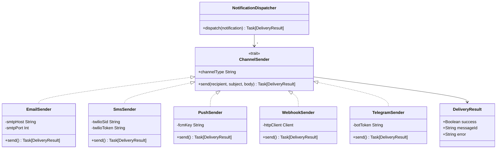
```mermaid
classDiagram
    class NotificationDispatcher {
        +dispatch(notification) Task[DeliveryResult]
    }

    class ChannelSender {
        <<trait>>
        +send(recipient, subject, body) Task[DeliveryResult]
        +channelType String
    }

    class EmailSender {
        -smtpHost String
        -smtpPort Int
        +send() Task[DeliveryResult]
    }

    class SmsSender {
        -twilioSid String
        -twilioToken String
        +send() Task[DeliveryResult]
    }

    class PushSender {
        -fcmKey String
        +send() Task[DeliveryResult]
    }

    class WebhookSender {
        -httpClient Client
        +send() Task[DeliveryResult]
    }

    class TelegramSender {
        -botToken String
        +send() Task[DeliveryResult]
    }

    class DeliveryResult {
        +Boolean success
        +String messageId
        +String error
    }

    NotificationDispatcher --> "*" ChannelSender
    ChannelSender <|.. EmailSender
    ChannelSender <|.. SmsSender
    ChannelSender <|.. PushSender
    ChannelSender <|.. WebhookSender
    ChannelSender <|.. TelegramSender
    ChannelSender --> DeliveryResult
```

---

## 🌡️ Sensors Service

### Обзор

| Параметр | Значение |
|----------|----------|
| **Ответственность** | Обработка IO данных, калибровка датчиков, детекция событий |
| **Порт** | 8098 |
| **Kafka In** | gps-events (поле ioData) |
| **Kafka Out** | sensor-events |
| **Pipeline** | IoExtract → Calibrate → Smooth → Detect |

### Pipeline обработки датчиков

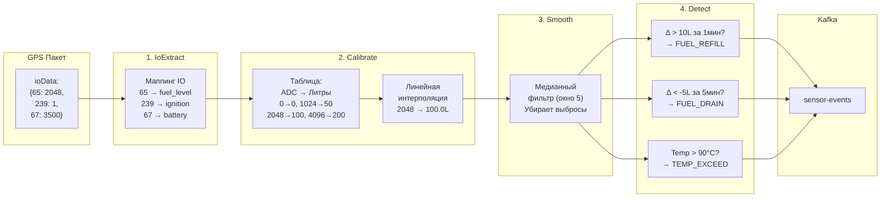
```mermaid
flowchart LR
    subgraph Input["GPS Пакет"]
        IO["ioData:\n{65: 2048,\n239: 1,\n67: 3500}"]
    end

    subgraph Extract["1. IoExtract"]
        Map["Маппинг IO\n65 → fuel_level\n239 → ignition\n67 → battery"]
    end

    subgraph Calibrate["2. Calibrate"]
        Table["Таблица:\nADC → Литры\n0→0, 1024→50\n2048→100, 4096→200"]
        Interp["Линейная\nинтерполяция\n2048 → 100.0L"]
    end

    subgraph Smooth["3. Smooth"]
        Median["Медианный\nфильтр (окно 5)\nУбирает выбросы"]
    end

    subgraph Detect["4. Detect"]
        Fuel["Δ > 10L за 1мин?\n→ FUEL_REFILL"]
        Drain["Δ < -5L за 5мин?\n→ FUEL_DRAIN"]
        Temp["Temp > 90°C?\n→ TEMP_EXCEED"]
    end

    subgraph Output["Kafka"]
        Events["sensor-events"]
    end

    IO --> Map --> Table --> Interp --> Median --> Fuel & Drain & Temp --> Events
```

### Sequence Diagram: Детекция слива топлива

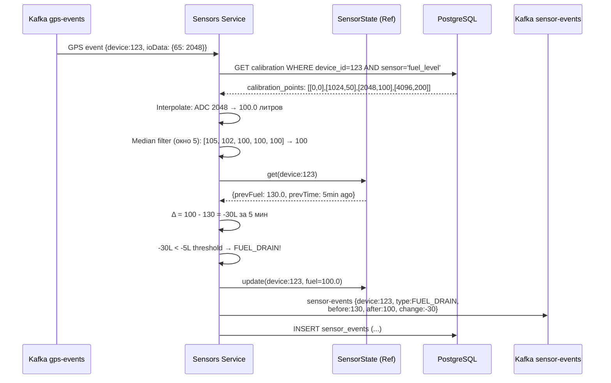
```mermaid
sequenceDiagram
    participant K as Kafka gps-events
    participant SS as Sensors Service
    participant St as SensorState (Ref)
    participant DB as PostgreSQL
    participant KE as Kafka sensor-events

    K->>SS: GPS event {device:123, ioData: {65: 2048}}
    
    SS->>DB: GET calibration WHERE device_id=123 AND sensor='fuel_level'
    DB-->>SS: calibration_points: [[0,0],[1024,50],[2048,100],[4096,200]]
    
    SS->>SS: Interpolate: ADC 2048 → 100.0 литров
    SS->>SS: Median filter (окно 5): [105, 102, 100, 100, 100] → 100
    
    SS->>St: get(device:123)
    St-->>SS: {prevFuel: 130.0, prevTime: 5min ago}
    
    SS->>SS: Δ = 100 - 130 = -30L за 5 мин
    SS->>SS: -30L < -5L threshold → FUEL_DRAIN!
    
    SS->>St: update(device:123, fuel=100.0)
    SS->>KE: sensor-events {device:123, type:FUEL_DRAIN,<br/>before:130, after:100, change:-30}
    SS->>DB: INSERT sensor_events (...)
```

### Калибровочная таблица

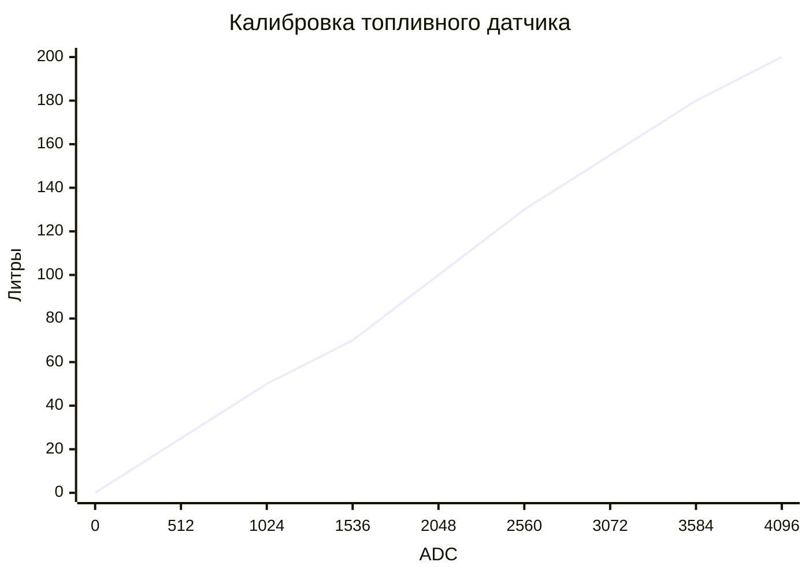
```mermaid
---
config:
  xyChart:
    yAxis:
      titleText: "Литры"
    xAxis:
      titleText: "ADC значение"
---
xychart-beta
    title "Калибровка топливного датчика"
    x-axis "ADC" [0, 512, 1024, 1536, 2048, 2560, 3072, 3584, 4096]
    y-axis "Литры" 0 --> 200
    line [0, 25, 50, 70, 100, 130, 155, 180, 200]
```

---

## 🌐 Integration Service

### Обзор

| Параметр | Значение |
|----------|----------|
| **Ответственность** | Ретрансляция GPS данных во внешние системы, приём данных |
| **Порт** | 8096 |
| **Kafka In** | gps-events |
| **Протоколы OUT** | Wialon IPS, Wialon Retranslator, EGTS, NDTP, Webhook |
| **Протоколы IN** | Inbound API (HTTP JSON → Kafka) |

### Архитектура

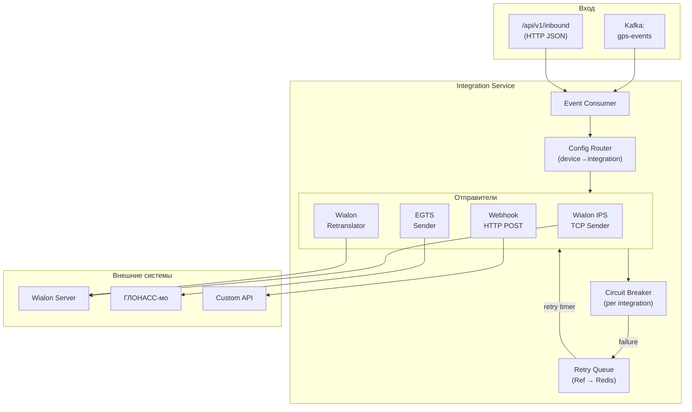
```mermaid
flowchart TB
    subgraph Input["Вход"]
        KafkaIn["Kafka:\ngps-events"]
        InboundAPI["/api/v1/inbound\n(HTTP JSON)"]
    end

    subgraph IS["Integration Service"]
        Consumer["Event Consumer"]
        Router["Config Router\n(device→integration)"]
        
        subgraph Senders["Отправители"]
            WiaIPS["Wialon IPS\nTCP Sender"]
            WiaRT["Wialon\nRetranslator"]
            EGTS["EGTS\nSender"]
            WH["Webhook\nHTTP POST"]
        end

        CB["Circuit Breaker\n(per integration)"]
        RetryQ["Retry Queue\n(Ref → Redis)"]
    end

    subgraph Targets["Внешние системы"]
        Wialon["Wialon Server"]
        Glonass["ГЛОНАСС-мо"]
        Custom["Custom API"]
    end

    KafkaIn --> Consumer --> Router --> Senders
    InboundAPI --> Consumer

    WiaIPS & WiaRT --> Wialon
    EGTS --> Glonass
    WH --> Custom

    Senders --> CB
    CB -->|failure| RetryQ
    RetryQ -->|retry timer| Senders
```

### State Diagram: Circuit Breaker

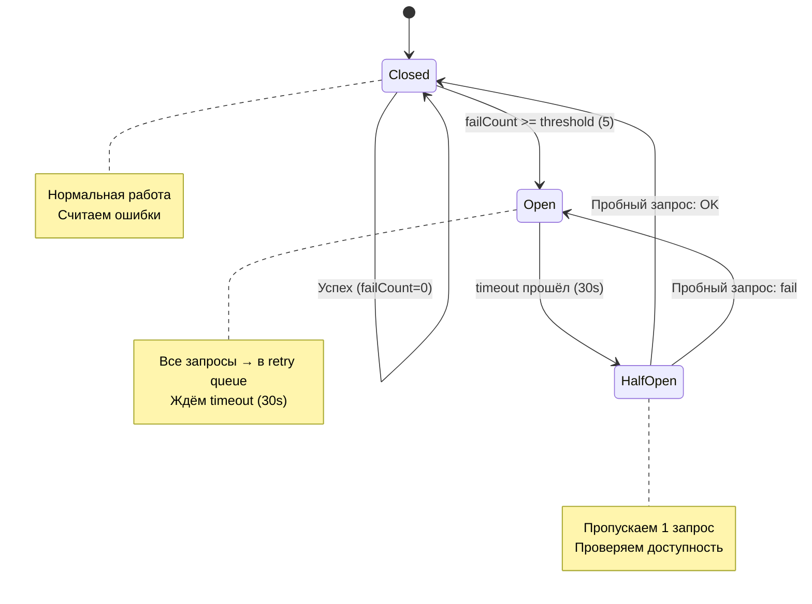
```mermaid
stateDiagram-v2
    [*] --> Closed

    Closed --> Closed : Успех (failCount=0)
    Closed --> Open : failCount >= threshold (5)

    Open --> HalfOpen : timeout прошёл (30s)
    
    HalfOpen --> Closed : Пробный запрос: OK
    HalfOpen --> Open : Пробный запрос: fail

    note right of Closed
        Нормальная работа
        Считаем ошибки
    end note

    note right of Open
        Все запросы → в retry queue
        Ждём timeout (30s)
    end note

    note right of HalfOpen
        Пропускаем 1 запрос
        Проверяем доступность
    end note
```

### Sequence Diagram: Ретрансляция в Wialon

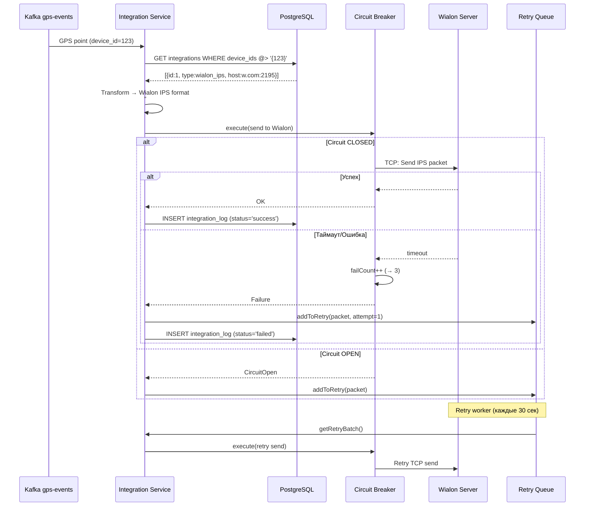
```mermaid
sequenceDiagram
    participant K as Kafka gps-events
    participant IS as Integration Service
    participant DB as PostgreSQL
    participant CB as Circuit Breaker
    participant W as Wialon Server
    participant RQ as Retry Queue

    K->>IS: GPS point (device_id=123)
    IS->>DB: GET integrations WHERE device_ids @> '{123}'
    DB-->>IS: [{id:1, type:wialon_ips, host:w.com:2195}]

    IS->>IS: Transform → Wialon IPS format<br/>"#D#260326;120000;5545.3480;N;03737.0380;E;45;180;150;12"
    
    IS->>CB: execute(send to Wialon)
    
    alt Circuit CLOSED
        CB->>W: TCP: Send IPS packet
        
        alt Успех
            W-->>CB: #AD#1
            CB-->>IS: OK
            IS->>DB: INSERT integration_log (status='success')
        else Таймаут/Ошибка
            W-->>CB: timeout
            CB->>CB: failCount++ (→ 3)
            CB-->>IS: Failure
            IS->>RQ: addToRetry(packet, attempt=1)
            IS->>DB: INSERT integration_log (status='failed')
        end
    else Circuit OPEN
        CB-->>IS: CircuitOpen
        IS->>RQ: addToRetry(packet)
    end

    Note over RQ,W: Retry worker (каждые 30 сек)
    RQ->>IS: getRetryBatch()
    IS->>CB: execute(retry send)
    CB->>W: Retry TCP send
```

---

## 📊 Analytics Service

### Обзор

| Параметр | Значение |
|----------|----------|
| **Ответственность** | Генерация отчётов, агрегация данных, экспорт |
| **Порт** | 8095 |
| **БД** | TimescaleDB (чтение GPS), PostgreSQL (отчёты, stats) |
| **Экспорт** | Excel (Apache POI), PDF (OpenPDF), CSV |

### Типы отчётов

| # | Тип | Описание | Формат | Период |
|---|-----|----------|--------|--------|
| 1 | Trip Report | Поездки, стоянки, пробег | Excel/PDF | По запросу |
| 2 | Speed Report | Превышения скорости | Excel/PDF | По запросу |
| 3 | Fuel Report | Расход, заправки, сливы | Excel/PDF | По запросу |
| 4 | Geozone Report | Посещения геозон | Excel/PDF | По запросу |
| 5 | Summary Report | Пробег, время работы | Excel/PDF | Ежедневно |
| 6 | Driver Behavior | Оценка стиля вождения | PDF | Еженедельно |

### Sequence Diagram: Генерация отчёта

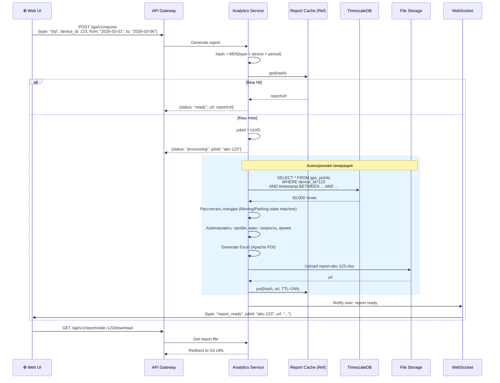
```mermaid
sequenceDiagram
    participant UI as 🌐 Web UI
    participant GW as API Gateway
    participant AS as Analytics Service
    participant Cache as Report Cache (Ref)
    participant TSDB as TimescaleDB
    participant S3 as File Storage
    participant WS as WebSocket

    UI->>GW: POST /api/v1/reports<br/>{type: "trip", device_id: 123, from: "2026-03-01", to: "2026-03-06"}
    GW->>AS: Generate report

    AS->>AS: hash = MD5(type + device + period)
    AS->>Cache: get(hash)

    alt Кеш hit
        Cache-->>AS: reportUrl
        AS-->>GW: {status: "ready", url: reportUrl}
    else Кеш miss
        AS->>AS: jobId = UUID
        AS-->>GW: {status: "processing", jobId: "abc-123"}

        rect rgb(230, 245, 255)
            Note over AS,S3: Асинхронная генерация
            AS->>TSDB: SELECT * FROM gps_points<br/>WHERE device_id=123<br/>AND timestamp BETWEEN ... AND ...
            TSDB-->>AS: 50,000 точек

            AS->>AS: Рассчитать поездки (Moving/Parking state machine)
            AS->>AS: Агрегировать: пробег, макс. скорость, время

            AS->>AS: Generate Excel (Apache POI)
            AS->>S3: Upload report-abc-123.xlsx
            S3-->>AS: url

            AS->>Cache: put(hash, url, TTL=24h)
        end

        AS->>WS: Notify user: report ready
        WS->>UI: {type: "report_ready", jobId: "abc-123", url: "..."}
    end

    UI->>GW: GET /api/v1/reports/abc-123/download
    GW->>AS: Get report file
    AS-->>GW: Redirect to S3 URL
```

### State Machine: Определение поездок

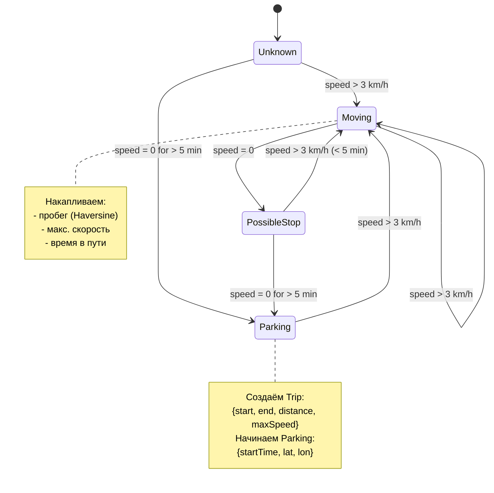
```mermaid
stateDiagram-v2
    [*] --> Unknown

    Unknown --> Moving : speed > 3 km/h
    Unknown --> Parking : speed = 0 for > 5 min

    Moving --> Moving : speed > 3 km/h
    Moving --> PossibleStop : speed = 0

    PossibleStop --> Moving : speed > 3 km/h (< 5 min)
    PossibleStop --> Parking : speed = 0 for > 5 min

    Parking --> Moving : speed > 3 km/h

    note right of Moving
        Накапливаем:
        - пробег (Haversine)
        - макс. скорость
        - время в пути
    end note

    note right of Parking
        Создаём Trip:
        {start, end, distance, maxSpeed}
        Начинаем Parking:
        {startTime, lat, lon}
    end note
```

---

## 🔧 Maintenance Service

### Обзор

| Параметр | Значение |
|----------|----------|
| **Ответственность** | Контроль ТО по пробегу/моточасам/времени, напоминания |
| **Порт** | 8087 |
| **Kafka In** | gps-events (для расчёта одометра) |
| **Kafka Out** | maintenance-events |
| **Статус** | PostMVP |

### Sequence Diagram: Проверка ТО

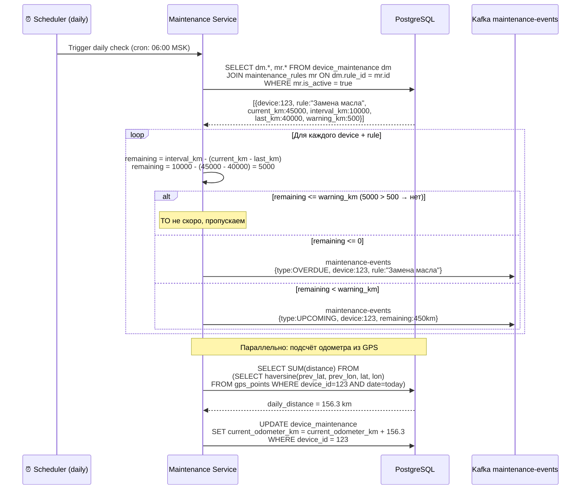
```mermaid
sequenceDiagram
    participant Sch as ⏰ Scheduler (daily)
    participant MS as Maintenance Service
    participant DB as PostgreSQL
    participant KE as Kafka maintenance-events

    Sch->>MS: Trigger daily check (cron: 06:00 MSK)
    
    MS->>DB: SELECT dm.*, mr.* FROM device_maintenance dm<br/>JOIN maintenance_rules mr ON dm.rule_id = mr.id<br/>WHERE mr.is_active = true
    DB-->>MS: [{device:123, rule:"Замена масла",<br/>current_km:45000, interval_km:10000,<br/>last_km:40000, warning_km:500}]

    loop Для каждого device + rule
        MS->>MS: remaining = interval_km - (current_km - last_km)<br/>remaining = 10000 - (45000 - 40000) = 5000

        alt remaining <= warning_km (5000 > 500 → нет)
            Note over MS: ТО не скоро, пропускаем
        else remaining <= 0
            MS->>KE: maintenance-events<br/>{type:OVERDUE, device:123, rule:"Замена масла"}
        else remaining < warning_km
            MS->>KE: maintenance-events<br/>{type:UPCOMING, device:123, remaining:450km}
        end
    end

    Note over MS,DB: Параллельно: подсчёт одометра из GPS

    MS->>DB: SELECT SUM(distance) FROM<br/>(SELECT haversine(prev_lat, prev_lon, lat, lon)<br/>FROM gps_points WHERE device_id=123 AND date=today)
    DB-->>MS: daily_distance = 156.3 km
    MS->>DB: UPDATE device_maintenance<br/>SET current_odometer_km = current_odometer_km + 156.3<br/>WHERE device_id = 123
```

---

## 🛡️ Admin Service

### Обзор

| Параметр | Значение |
|----------|----------|
| **Ответственность** | Мониторинг системы, feature flags, конфигурация |
| **Порт** | 8097 |
| **Функции** | Health monitoring, system config, audit log, background tasks |

### Компонентная диаграмма

```mermaid
flowchart TB
    subgraph API["Admin REST API"]
        Health["/admin/health"]
        Config["/admin/config"]
        Tasks["/admin/tasks"]
        Audit["/admin/audit"]
    end

    subgraph Services["Service Layer"]
        HealthMon["HealthMonitor\n(ping all services)"]
        ConfigSvc["ConfigService\n(feature flags, Ref)"]
        TaskMgr["TaskManager\n(background jobs)"]
        AuditSvc["AuditService\n(action log)"]
    end

    subgraph Targets["Мониторинг"]
        CM["CM :10090/health"]
        HW["HW :10091/health"]
        DM["DM :10092/health"]
        NS["NS :8094/health"]
        Other["... другие сервисы"]
    end

    subgraph Storage["Хранилище"]
        PG[("PostgreSQL\nconfig, audit_log")]
    end

    Health --> HealthMon --> CM & HW & DM & NS & Other
    Config --> ConfigSvc --> PG
    Tasks --> TaskMgr
    Audit --> AuditSvc --> PG
```

---

## 👤 User Service

### Обзор

| Параметр | Значение |
|----------|----------|
| **Ответственность** | Пользователи, организации, роли, права доступа |
| **Порт** | 8091 |
| **БД** | PostgreSQL (users, organizations, roles) |
| **Auth** | BCrypt для паролей, JWT validation |

### Модель RBAC (Role-Based Access Control)

```mermaid
classDiagram
    class User {
        +Int id
        +String email
        +String passwordHash
        +String name
        +Int organizationId
        +Int roleId
        +Boolean isActive
    }

    class Organization {
        +Int id
        +String name
        +String subscriptionType
        +Int maxDevices
        +Int maxUsers
        +Json settings
    }

    class Role {
        +Int id
        +String name
        +String displayName
        +List~String~ permissions
        +Boolean isSystem
    }

    class Permission {
        <<enumeration>>
        DEVICES_READ
        DEVICES_WRITE
        DEVICES_DELETE
        COMMANDS_SEND
        GEOZONES_READ
        GEOZONES_WRITE
        REPORTS_READ
        REPORTS_CREATE
        USERS_READ
        USERS_WRITE
        ADMIN_ALL
    }

    class VehicleGroup {
        +Int id
        +String name
        +Int organizationId
        +List~Int~ deviceIds
    }

    Organization "1" --> "*" User : contains
    Role "1" --> "*" User : assigned
    Role --> "*" Permission : grants
    Organization "1" --> "*" VehicleGroup : has
    User --> "*" VehicleGroup : can access
```

### Предустановленные роли

| Роль | Permissions | Описание |
|------|-------------|----------|
| **admin** | `["*"]` | Полный доступ |
| **manager** | `["devices.*", "geozones.*", "reports.*", "users.read"]` | Управление всем кроме пользователей |
| **operator** | `["devices.read", "commands.send", "geozones.read"]` | Отправка команд, просмотр |
| **viewer** | `["devices.read", "geozones.read"]` | Только чтение |

---

## 🔗 Взаимодействие всех сервисов Block 2

```mermaid
sequenceDiagram
    participant CM as Connection Manager
    participant K1 as Kafka (gps-events)
    participant K2 as Kafka (gps-events-rules)
    participant RC as Rule Checker
    participant SS as Sensors Service
    participant IS as Integration Service
    participant MS as Maintenance Service
    participant K3 as Kafka (events: geo, speed, sensor, maint)
    participant NS as Notification Service
    participant Channels as 📧📱🔔💬

    Note over CM,Channels: Параллельная обработка GPS

    CM->>K1: gps-events (все точки)
    CM->>K2: gps-events-rules (с правилами)

    par Rule Checker
        K2->>RC: GPS point
        RC->>RC: Check geozones (PostGIS)
        RC->>RC: Check speed limits
        RC->>K3: geozone-events / speed-events
    and Sensors
        K1->>SS: GPS point (ioData)
        SS->>SS: Calibrate → Smooth → Detect
        SS->>K3: sensor-events
    and Integration
        K1->>IS: GPS point
        IS->>IS: Transform → Wialon IPS
        IS-->>IS: TCP → Wialon Server
    and Maintenance
        K1->>MS: GPS point
        MS->>MS: Update odometer (Haversine)
        MS->>K3: maintenance-events (if check triggers)
    end

    K3->>NS: All events
    NS->>NS: Match rules → Apply templates
    NS->>Channels: Send notifications
```

---

## 📨 Kafka Topics Block 2

| Топик | Key | Partitions | Producer | Consumer |
|-------|-----|------------|----------|----------|
| **gps-events-rules** | deviceId | 6 | CM | Rule Checker |
| **geozone-events** | deviceId | 6 | Rule Checker | Notification Service |
| **speed-events** | deviceId | 6 | Rule Checker | Notification Service |
| **sensor-events** | deviceId | 6 | Sensors Service | Notification Service, Analytics |
| **maintenance-events** | deviceId | 3 | Maintenance Service | Notification Service |

---

## 🗄️ ER: Базы данных Block 2

### Rule Checker (PostgreSQL + PostGIS)

```mermaid
erDiagram
    geozones {
        int id PK
        string name
        int organization_id FK
        string zone_type
        geometry geometry
        string color
        boolean is_active
    }

    device_geozone_assignments {
        int device_id FK
        int geozone_id FK
    }

    geozone_events {
        bigint id PK
        int device_id
        int geozone_id FK
        string event_type
        timestamptz timestamp
        double lat
        double lon
    }

    speed_rules {
        int id PK
        int organization_id FK
        int speed_limit
        int warning_threshold
    }

    geozones ||--o{ device_geozone_assignments : "assigned to"
    geozones ||--o{ geozone_events : "generates"
```

### Notification Service

```mermaid
erDiagram
    notification_rules {
        int id PK
        int organization_id FK
        string name
        string event_type
        jsonb conditions
        jsonb channels
        string template_subject
        text template_body
        int cooldown_minutes
        int max_per_hour
        boolean is_active
    }

    notification_log {
        bigint id PK
        int rule_id FK
        string event_type
        int device_id
        string channel
        string recipient
        string status
        text error_message
        timestamptz sent_at
    }

    notification_templates {
        int id PK
        string event_type
        string language
        string channel
        text body
    }

    notification_rules ||--o{ notification_log : "generates"
```

### Sensors Service

```mermaid
erDiagram
    sensor_calibrations {
        int id PK
        int device_id FK
        string sensor_type
        int io_element
        jsonb calibration_points
        string unit
    }

    sensor_data {
        int device_id
        timestamptz timestamp
        string sensor_type
        int raw_value
        decimal calibrated_value
    }

    sensor_events {
        bigint id PK
        int device_id
        string event_type
        timestamptz timestamp
        double lat
        double lon
        decimal value_before
        decimal value_after
        decimal value_change
    }

    sensor_calibrations ||--o{ sensor_data : "calibrates"
    sensor_calibrations ||--o{ sensor_events : "detects"
```

### Maintenance Service

```mermaid
erDiagram
    maintenance_rules {
        int id PK
        int organization_id FK
        string name
        int interval_km
        int interval_hours
        int interval_days
        int warning_km
        boolean is_active
    }

    device_maintenance {
        int device_id FK
        int rule_id FK
        timestamptz last_maintenance_at
        int last_maintenance_km
        int current_odometer_km
        string status
    }

    maintenance_log {
        bigint id PK
        int device_id FK
        int rule_id FK
        timestamptz performed_at
        int odometer_km
        text notes
        decimal cost
    }

    maintenance_rules ||--o{ device_maintenance : "applied to"
    device_maintenance ||--o{ maintenance_log : "records"
```

### User Service

```mermaid
erDiagram
    organizations {
        int id PK
        string name
        string subscription_type
        int max_devices
        int max_users
        jsonb settings
    }

    users {
        int id PK
        int organization_id FK
        string email UK
        string password_hash
        string name
        int role_id FK
        boolean is_active
    }

    roles {
        int id PK
        string name
        string display_name
        jsonb permissions
        boolean is_system
    }

    user_invitations {
        int id PK
        int organization_id FK
        string email
        int role_id FK
        string token UK
        timestamptz expires_at
    }

    organizations ||--o{ users : "employs"
    roles ||--o{ users : "assigned"
    organizations ||--o{ user_invitations : "invites"
```

---

## 📊 Сводная таблица Block 2

| Параметр | Rule Checker | Notifications | Sensors | Integration | Analytics | Maintenance | Admin | User |
|----------|-------------|---------------|---------|-------------|-----------|-------------|-------|------|
| **Порт** | 8093 | 8094 | 8098 | 8096 | 8095 | 8087 | 8097 | 8091 |
| **Вход** | gps-events-rules | events | gps-events | gps-events | DB queries | gps-events | — | — |
| **Выход** | geo/speed events | channels | sensor-events | Wialon,etc | reports | maint-events | — | — |
| **БД** | PG+PostGIS | PG | PG+TSDB | PG | TSDB+PG | PG | PG | PG |
| **State** | Ref* | Ref* | Ref* | Ref* | Ref* | Ref* | Ref* | Ref* |
| **Сложность** | 🔴 Высокая | 🟡 Средняя | 🟡 Средняя | 🟡 Средняя | 🟡 Средняя | 🟢 Низкая | 🟢 Низкая | 🟢 Низкая |
| **MVP** | ✅ | ✅ | ✅ | ✅ | ✅ | ⏳ PostMVP | ✅ | ✅ |

> \* Ref (in-memory) — временное решение. Целевой state: Redis через lettuce.  
> Критично для: Rule Checker (VehicleState), Integration (CircuitBreaker, RetryQueue).  
> Подробнее: [REDIS_VS_REF_DECISION.md](../REDIS_VS_REF_DECISION.md)

---

## 🚀 Deployment

### Docker Compose (dev)

```yaml
services:
  rule-checker:
    build: ./services/rule-checker
    ports: ["8093:8093"]
    environment:
      KAFKA_BROKERS: kafka:9092
      DATABASE_URL: postgresql://postgres:5432/tracker
    depends_on: [kafka, postgres]

  notification-service:
    build: ./services/notification-service
    ports: ["8094:8094"]
    environment:
      KAFKA_BROKERS: kafka:9092
      DATABASE_URL: postgresql://postgres:5432/tracker
      SMTP_HOST: smtp.gmail.com
      SMS_API_KEY: ${SMS_API_KEY}
      TELEGRAM_BOT_TOKEN: ${TELEGRAM_BOT_TOKEN}
    depends_on: [kafka, postgres]

  sensors-service:
    build: ./services/sensors-service
    ports: ["8098:8098"]
    environment:
      KAFKA_BROKERS: kafka:9092
      DATABASE_URL: postgresql://postgres:5432/tracker
    depends_on: [kafka, postgres, timescaledb]

  integration-service:
    build: ./services/integration-service
    ports: ["8096:8096"]
    environment:
      KAFKA_BROKERS: kafka:9092
      DATABASE_URL: postgresql://postgres:5432/tracker
    depends_on: [kafka, postgres]

  analytics-service:
    build: ./services/analytics-service
    ports: ["8095:8095"]
    environment:
      DATABASE_URL: postgresql://postgres:5432/tracker
      TIMESCALE_URL: postgresql://postgres:5432/tracker_ts
      S3_BUCKET: reports
    depends_on: [postgres, timescaledb]

  maintenance-service:
    build: ./services/maintenance-service
    ports: ["8087:8087"]
    environment:
      KAFKA_BROKERS: kafka:9092
      DATABASE_URL: postgresql://postgres:5432/tracker
    depends_on: [kafka, postgres]

  admin-service:
    build: ./services/admin-service
    ports: ["8097:8097"]
    environment:
      DATABASE_URL: postgresql://postgres:5432/tracker
    depends_on: [postgres]

  user-service:
    build: ./services/user-service
    ports: ["8091:8091"]
    environment:
      DATABASE_URL: postgresql://postgres:5432/tracker
    depends_on: [postgres]

  billing-service:
    build: ./services/billing-service
    ports: ["8099:8099"]
    environment:
      KAFKA_BROKERS: kafka:9092
      DATABASE_URL: postgresql://postgres:5432/wayrecall_billing
    depends_on: [kafka, postgres]

  ticket-service:
    build: ./services/ticket-service
    ports: ["8101:8101"]
    environment:
      KAFKA_BROKERS: kafka:9092
      DATABASE_URL: postgresql://postgres:5432/wayrecall_tickets
    depends_on: [kafka, postgres]
```

---

## 💳 Billing Service

**Порт:** 8099 | **Ответственность:** Тарифы, подписки, оплата, счета, баланс

**Ключевые возможности:**
- Управление тарифными планами с компонентными ценами (GPS, геозоны, датчики, история)
- Подписки с auto-renew, trial периодом, grace period
- Provider-agnostic оплата (Тинькофф, Сбер, YooKassa, Mock)
- Автоматическое списание по расписанию (FeeProcessor)
- Счета (Invoice) с PDF генерацией

**Kafka:** billing-events (out), billing-commands (in), device-events (in)  
**БД:** PostgreSQL (wayrecall_billing)  
**Тесты:** 80 (100% pass)  
**Подробнее:** [billing-service/docs/README.md](../../services/billing-service/docs/README.md)

---

## 🎫 Ticket Service

**Порт:** 8101 | **Ответственность:** Тикеты технической поддержки, диалоги с пользователями

**Ключевые возможности:**
- CRUD тикетов с категориями (Оборудование, Программа, Финансы) и приоритетами
- Диалоговая система сообщений (User ↔ Support)
- Статусная модель: New → Open → InProgress → Resolved → Closed
- Настройки уведомлений по категориям
- Пометка прочитанности (userRead/supportRead)

**Kafka:** ticket-events (out)  
**БД:** PostgreSQL (wayrecall_tickets)  
**Тесты:** 58 (100% pass)  
**Подробнее:** [ticket-service/docs/README.md](../../services/ticket-service/docs/README.md)

---

**Предыдущий блок:** [ARCHITECTURE_BLOCK1.md](./ARCHITECTURE_BLOCK1.md) — Сбор данных  
**Следующий блок:** [ARCHITECTURE_BLOCK3.md](./ARCHITECTURE_BLOCK3.md) — Представление

*Версия: 2.1 | Обновлён: 5 марта 2026*
