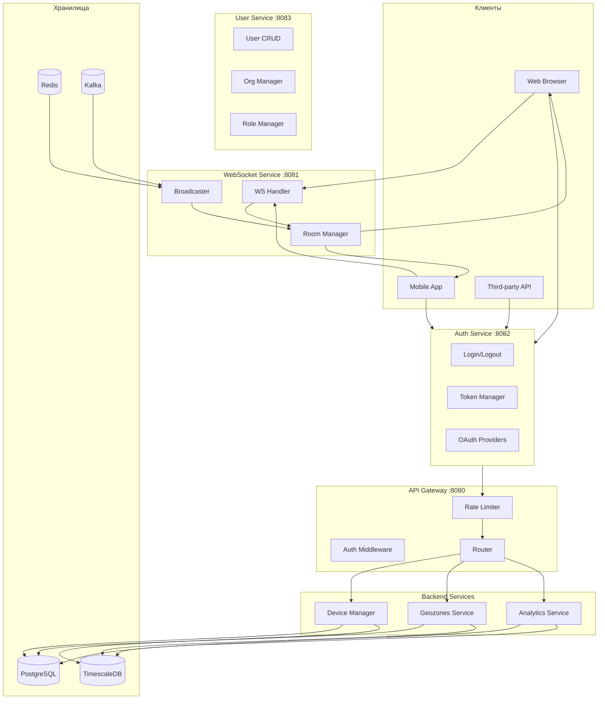
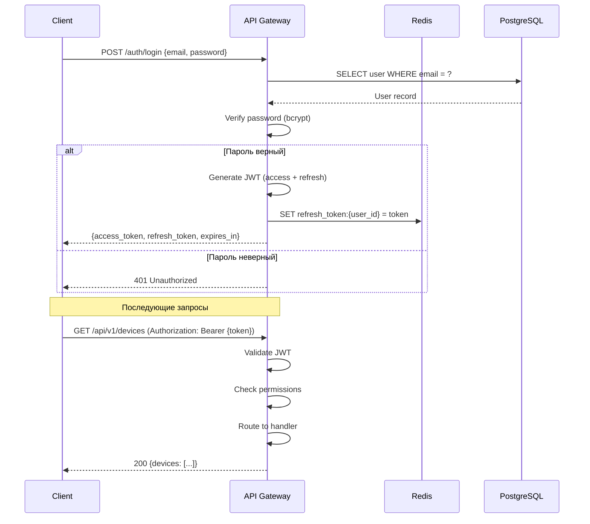
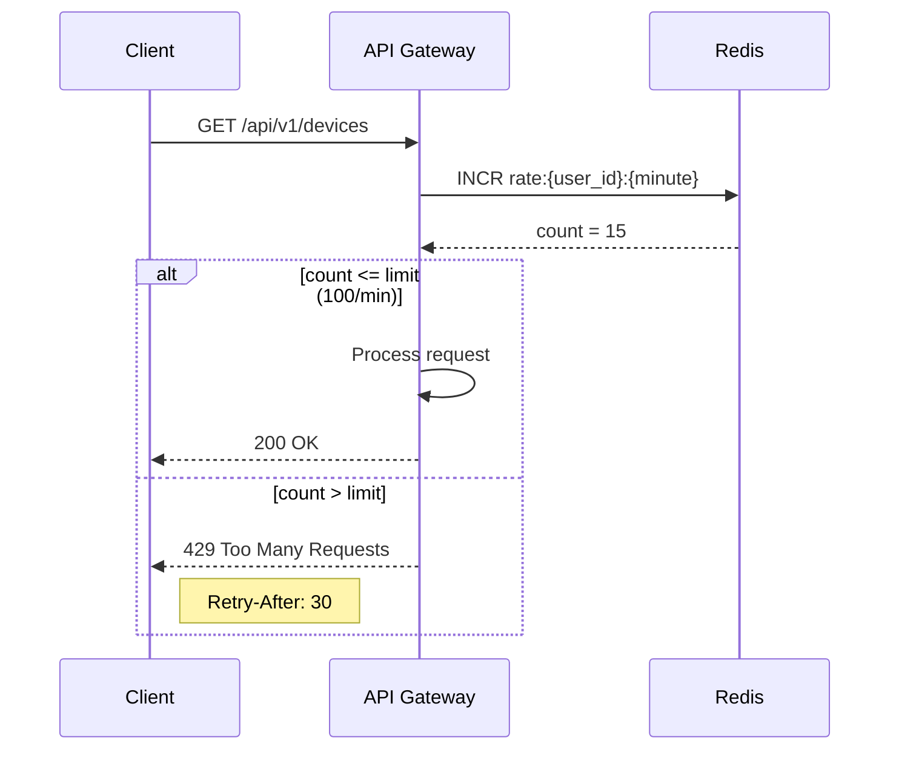
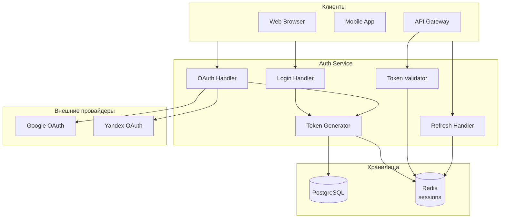
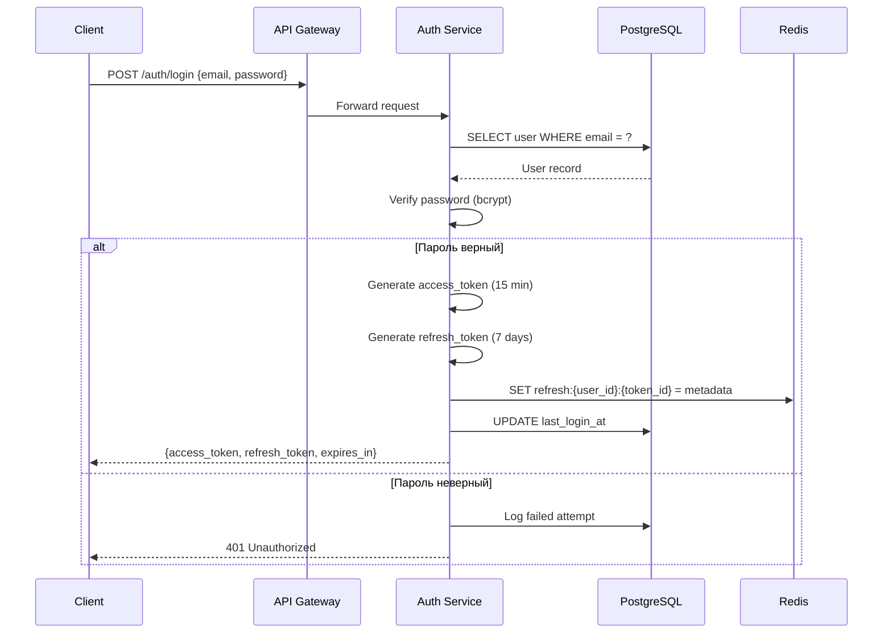
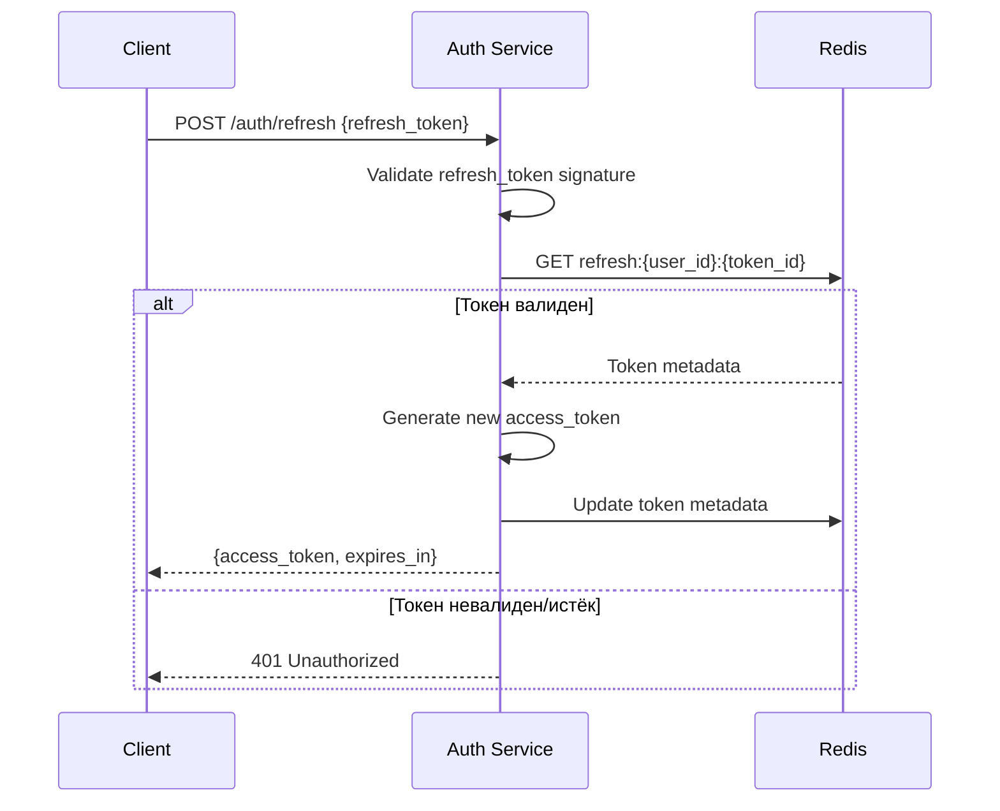
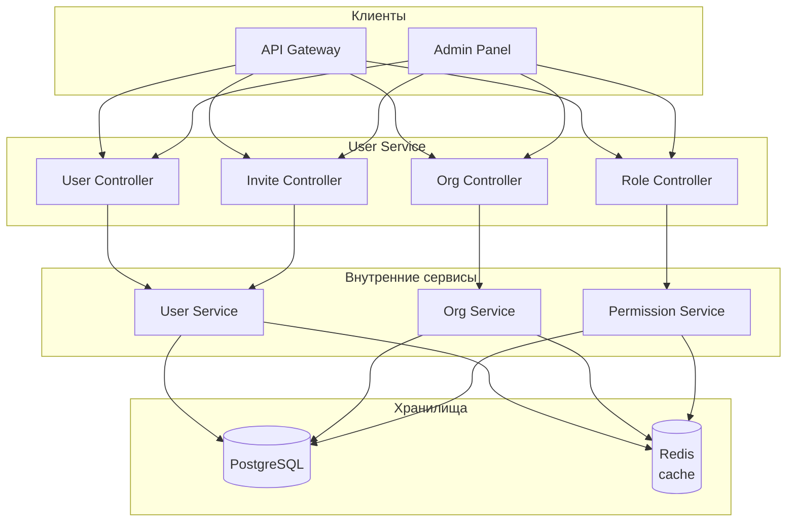
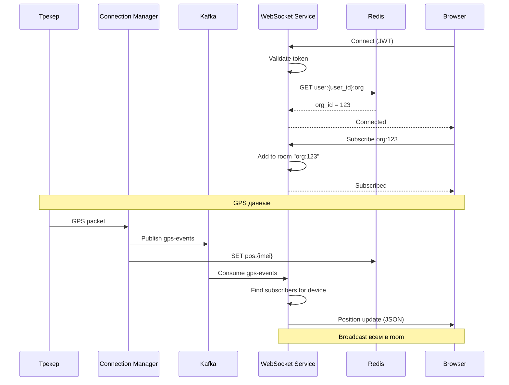
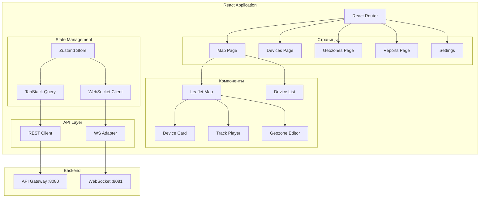
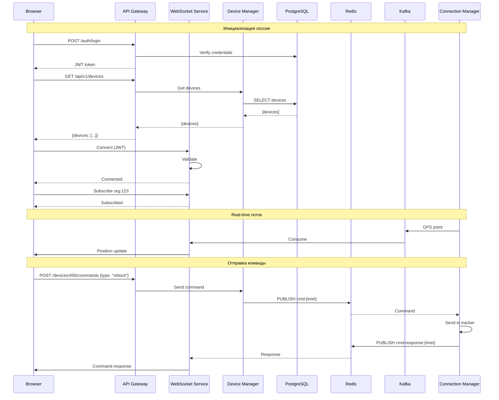

# 🖥️ Block 3: Представление

> **Ответственность:** API для клиентов, аутентификация, real-time обновления, веб-интерфейс, администрирование  
> **Сервисы (6):** API Gateway, Auth Service, User Service, WebSocket Service, Admin Service, Web Frontend

---

## 📋 Полный список сервисов Block 3

| # | Сервис | Назначение | MVP | Статус |
|---|--------|------------|-----|--------|
| 1 | **API Gateway** | REST API, маршрутизация, rate limiting | ✅ | 📋 Спроектирован |
| 2 | **Auth Service** | JWT токены, сессии, OAuth | ✅ | 📋 Планируется |
| 3 | **User Service** | Пользователи, роли, права, организации | ✅ | 📋 Планируется |
| 4 | **WebSocket Service** | Real-time позиции, события, алерты | ✅ | 📋 Спроектирован |
| 5 | **Admin Service** | Панель управления системой, аудит | ✅ | 📋 Планируется |
| 6 | **Web Frontend** | React + Leaflet карта | ✅ | 📋 Планируется |

> **PostMVP сервисы:** Billing Service (тарифы, платежи), Route Service (маршруты, путевые листы)

---

## 📋 Обзор блока

```
┌─────────────────────────────────────────────────────────────────────────────┐
│                         BLOCK 3: PRESENTATION                               │
├─────────────────────────────────────────────────────────────────────────────┤
│                                                                             │
│  ┌───────────────────────────────────────────────────────────┐             │
│  │                     Web Frontend                          │             │
│  │                  React + Leaflet Map                      │             │
│  └───────────────────────────┬───────────────────────────────┘             │
│                              │                                              │
│                    HTTP / WebSocket                                         │
│                              │                                              │
│          ┌───────────────────┴───────────────────┐                         │
│          │                                       │                         │
│          ▼                                       ▼                         │
│  ┌───────────────┐                      ┌───────────────┐                  │
│  │  API Gateway  │                      │   WebSocket   │                  │
│  │  (REST API)   │                      │   Service     │                  │
│  │    :8080      │                      │    :8081      │                  │
│  └───────┬───────┘                      └───────┬───────┘                  │
│          │                                      │                          │
│          ▼                                      │                          │
│  ┌───────────────┐  ┌───────────────┐          │ Redis Pub/Sub            │
│  │ Auth Service  │  │ User Service  │          │ Kafka                    │
│  │  (JWT, OAuth) │  │ (Users, Orgs) │          │                          │
│  │    :8082      │  │    :8083      │          │                          │
│  └───────────────┘  └───────────────┘          │                          │
│          │                                      │                          │
│          └──────────────────────────────────────┘                          │
│                               │                                             │
│                               ▼                                             │
│  ┌─────────────────────────────────────────────────────────────┐           │
│  │         Block 1 & Block 2 Services                           │           │
│  │         PostgreSQL, TimescaleDB, Redis                       │           │
│  └─────────────────────────────────────────────────────────────┘           │
│                                                                             │
└─────────────────────────────────────────────────────────────────────────────┘
```

---

## 🔄 Потоки данных Block 3



---

## 🚪 API Gateway

### Обзор

**Ответственность:** REST API, аутентификация, авторизация, rate limiting, маршрутизация

**Порт:** 8080

### Архитектура сервиса

```mermaid
flowchart TB
    subgraph Incoming["Входящие запросы"]
        HTTP[HTTP Requests]
    end

    subgraph Middleware["Middleware Stack"]
        Logger[Request Logger]
        CORS[CORS Handler]
        Auth[JWT Authenticator]
        Authz[Authorizer]
        RateLimit[Rate Limiter]
    end

    subgraph Handlers["Route Handlers"]
        DevicesH[/api/v1/devices]
        TrackH[/api/v1/track]
        GeozonesH[/api/v1/geozones]
        ReportsH[/api/v1/reports]
        UsersH[/api/v1/users]
        AlertsH[/api/v1/alerts]
    end

    subgraph Services["Backend Services"]
        DM[Device Manager]
        HW[History (TimescaleDB)]
        GS[Geozones Service]
        AS[Analytics Service]
        NS[Notifications]
    end

    HTTP --> Logger --> CORS --> Auth --> Authz --> RateLimit
    RateLimit --> DevicesH & TrackH & GeozonesH & ReportsH & UsersH & AlertsH
    
    DevicesH --> DM
    TrackH --> HW
    GeozonesH --> GS
    ReportsH --> AS
    AlertsH --> NS
```

### REST API Endpoints

#### Устройства

```yaml
# Device Management
GET    /api/v1/devices                    # Список устройств
GET    /api/v1/devices/{id}               # Одно устройство
POST   /api/v1/devices                    # Создать устройство
PUT    /api/v1/devices/{id}               # Обновить устройство
DELETE /api/v1/devices/{id}               # Удалить устройство

# Device Position & Track
GET    /api/v1/devices/{id}/position      # Последняя позиция
GET    /api/v1/devices/{id}/track         # Трек за период
  Query params:
    - from: ISO8601 datetime
    - to: ISO8601 datetime
    - simplify: boolean (упростить для отображения)

# Device Commands
POST   /api/v1/devices/{id}/commands      # Отправить команду
GET    /api/v1/devices/{id}/commands      # История команд

# Bulk Operations
GET    /api/v1/devices/positions          # Позиции всех устройств
POST   /api/v1/devices/export             # Экспорт в CSV
POST   /api/v1/devices/import             # Импорт из CSV
```

#### Геозоны

```yaml
GET    /api/v1/geozones                   # Список геозон
GET    /api/v1/geozones/{id}              # Одна геозона
POST   /api/v1/geozones                   # Создать геозону
PUT    /api/v1/geozones/{id}              # Обновить геозону
DELETE /api/v1/geozones/{id}              # Удалить геозону

# Geozone Events
GET    /api/v1/geozones/{id}/events       # События по геозоне
GET    /api/v1/devices/{id}/geozone-events # События по устройству
```

#### Отчёты

```yaml
POST   /api/v1/reports                    # Создать отчёт
GET    /api/v1/reports/{id}               # Статус/скачать отчёт
GET    /api/v1/reports                    # История отчётов

# Quick Stats (без генерации файла)
GET    /api/v1/devices/{id}/stats         # Статистика за период
GET    /api/v1/devices/{id}/trips         # Список поездок
GET    /api/v1/devices/{id}/stops         # Список остановок
```

#### Пользователи и Организации

```yaml
# Auth
POST   /api/v1/auth/login                 # Логин (получить JWT)
POST   /api/v1/auth/refresh               # Обновить токен
POST   /api/v1/auth/logout                # Выход

# Users
GET    /api/v1/users                      # Список пользователей (admin)
GET    /api/v1/users/me                   # Текущий пользователь
PUT    /api/v1/users/me                   # Обновить профиль
PUT    /api/v1/users/me/password          # Сменить пароль

# Organizations
GET    /api/v1/organizations/{id}         # Информация об организации
PUT    /api/v1/organizations/{id}         # Обновить (admin)
```

### Sequence Diagram: Аутентификация



### Sequence Diagram: Rate Limiting



### JWT Structure

```json
{
  "header": {
    "alg": "RS256",
    "typ": "JWT"
  },
  "payload": {
    "sub": "user_123",              // user ID
    "org": "org_456",               // organization ID
    "role": "operator",             // admin, manager, operator, viewer
    "permissions": ["read", "write", "commands"],
    "iat": 1706270400,              // issued at
    "exp": 1706274000               // expires (1 hour)
  }
}
```

### PostgreSQL схема

```sql
-- Пользователи
CREATE TABLE users (
    id SERIAL PRIMARY KEY,
    organization_id INTEGER REFERENCES organizations(id),
    email VARCHAR(255) UNIQUE NOT NULL,
    password_hash VARCHAR(255) NOT NULL,
    name VARCHAR(100),
    role VARCHAR(20) NOT NULL DEFAULT 'viewer',  -- admin, manager, operator, viewer
    permissions JSONB DEFAULT '[]',
    is_active BOOLEAN DEFAULT true,
    last_login_at TIMESTAMPTZ,
    created_at TIMESTAMPTZ DEFAULT NOW(),
    updated_at TIMESTAMPTZ DEFAULT NOW()
);

CREATE INDEX idx_users_org ON users (organization_id) WHERE is_active = true;
CREATE INDEX idx_users_email ON users (email);

-- Организации
CREATE TABLE organizations (
    id SERIAL PRIMARY KEY,
    name VARCHAR(100) NOT NULL,
    subscription_type VARCHAR(20) DEFAULT 'trial',  -- trial, basic, pro, enterprise
    max_devices INTEGER DEFAULT 10,
    settings JSONB DEFAULT '{}',
    is_active BOOLEAN DEFAULT true,
    created_at TIMESTAMPTZ DEFAULT NOW(),
    updated_at TIMESTAMPTZ DEFAULT NOW()
);

-- API Keys (для интеграций)
CREATE TABLE api_keys (
    id SERIAL PRIMARY KEY,
    organization_id INTEGER REFERENCES organizations(id),
    key_hash VARCHAR(255) UNIQUE NOT NULL,
    name VARCHAR(100),
    permissions JSONB DEFAULT '[]',
    rate_limit INTEGER DEFAULT 1000,  -- requests per minute
    last_used_at TIMESTAMPTZ,
    expires_at TIMESTAMPTZ,
    is_active BOOLEAN DEFAULT true,
    created_at TIMESTAMPTZ DEFAULT NOW()
);

CREATE INDEX idx_api_keys_hash ON api_keys (key_hash) WHERE is_active = true;
```

### Prometheus метрики

```
# HTTP requests
http_requests_total{method="GET", path="/api/v1/devices", status="200"} 150000
http_requests_total{method="POST", path="/api/v1/auth/login", status="401"} 350

# Latency
http_request_duration_ms{method="GET", path="/api/v1/devices", quantile="0.5"} 25
http_request_duration_ms{method="GET", path="/api/v1/devices", quantile="0.99"} 150

# Rate limiting
rate_limit_exceeded_total{user_id="123"} 45

# Auth
auth_login_total{status="success"} 5000
auth_login_total{status="failed"} 150
auth_token_refresh_total 12000
```

---

## � Auth Service

### Обзор

**Ответственность:** Аутентификация, JWT токены, сессии, OAuth

**Порт:** 8082

### Архитектура сервиса



### Sequence Diagram: Login Flow



### Sequence Diagram: Token Refresh



### REST API

```yaml
# Authentication
POST   /auth/login                # Login (email + password)
POST   /auth/logout               # Logout (invalidate tokens)
POST   /auth/refresh              # Refresh access token
POST   /auth/password/reset       # Request password reset
POST   /auth/password/change      # Change password (authenticated)

# OAuth
GET    /auth/oauth/google         # Redirect to Google
GET    /auth/oauth/google/callback  # Google callback
GET    /auth/oauth/yandex         # Redirect to Yandex
GET    /auth/oauth/yandex/callback  # Yandex callback

# Token validation (internal)
POST   /auth/validate             # Validate access token
```

### PostgreSQL схема

```sql
-- Refresh токены
CREATE TABLE refresh_tokens (
    id UUID PRIMARY KEY DEFAULT gen_random_uuid(),
    user_id INTEGER NOT NULL REFERENCES users(id),
    token_hash VARCHAR(255) NOT NULL,
    device_info JSONB,                     -- {user_agent, ip, device}
    expires_at TIMESTAMPTZ NOT NULL,
    created_at TIMESTAMPTZ DEFAULT NOW(),
    revoked_at TIMESTAMPTZ
);

CREATE INDEX idx_refresh_tokens_user ON refresh_tokens (user_id) WHERE revoked_at IS NULL;

-- Журнал аутентификации
CREATE TABLE auth_log (
    id BIGSERIAL PRIMARY KEY,
    user_id INTEGER REFERENCES users(id),
    event_type VARCHAR(20) NOT NULL,       -- login_success, login_failed, logout, token_refresh
    ip_address INET,
    user_agent TEXT,
    metadata JSONB,
    created_at TIMESTAMPTZ DEFAULT NOW()
);

CREATE INDEX idx_auth_log_user ON auth_log (user_id, created_at DESC);
```

### Redis структуры

```
# Refresh токены
refresh:{user_id}:{token_id}
  HASH
  created_at: timestamp
  device: "Chrome on Windows"
  ip: "192.168.1.1"
  TTL: 604800 (7 дней)

# Blacklist (отозванные токены)
token_blacklist:{jti}
  value: 1
  TTL: до истечения токена

# Rate limiting для login
auth_rate:{ip}
  count: 5
  TTL: 300 (5 минут)
```

---

## 👤 User Service

### Обзор

**Ответственность:** Управление пользователями, организациями, ролями и правами

**Порт:** 8083

### Архитектура сервиса



### REST API

```yaml
# Users
GET    /api/v1/users                      # Список пользователей (admin)
GET    /api/v1/users/{id}                 # Один пользователь
POST   /api/v1/users                      # Создать пользователя (admin)
PUT    /api/v1/users/{id}                 # Обновить пользователя
DELETE /api/v1/users/{id}                 # Удалить пользователя (soft)

# Current user
GET    /api/v1/users/me                   # Текущий пользователь
PUT    /api/v1/users/me                   # Обновить профиль
PUT    /api/v1/users/me/password          # Сменить пароль
PUT    /api/v1/users/me/settings          # Обновить настройки

# Organizations
GET    /api/v1/organizations              # Список организаций (superadmin)
GET    /api/v1/organizations/{id}         # Одна организация
POST   /api/v1/organizations              # Создать организацию
PUT    /api/v1/organizations/{id}         # Обновить организацию
DELETE /api/v1/organizations/{id}         # Удалить организацию (soft)

# Roles & Permissions
GET    /api/v1/roles                      # Список ролей
GET    /api/v1/roles/{id}/permissions     # Права роли
PUT    /api/v1/users/{id}/role            # Назначить роль

# Invitations
POST   /api/v1/invites                    # Пригласить пользователя
GET    /api/v1/invites/{token}            # Проверить приглашение
POST   /api/v1/invites/{token}/accept     # Принять приглашение
```

### Модель ролей и прав

```
┌─────────────────────────────────────────────────────────────────────────────┐
│                         RBAC (Role-Based Access Control)                    │
├─────────────────────────────────────────────────────────────────────────────┤
│                                                                             │
│  Роли:                                                                      │
│  ┌─────────────┐  ┌─────────────┐  ┌─────────────┐  ┌─────────────┐        │
│  │   Admin     │  │  Manager    │  │  Operator   │  │   Viewer    │        │
│  │  (полный)   │  │ (настройки) │  │ (команды)   │  │ (только чт.)│        │
│  └─────────────┘  └─────────────┘  └─────────────┘  └─────────────┘        │
│                                                                             │
│  Права (permissions):                                                       │
│  • devices.read        • geozones.read       • reports.read                │
│  • devices.write       • geozones.write      • reports.create              │
│  • devices.delete      • geozones.delete     • reports.delete              │
│  • commands.send       • notifications.read  • users.read                  │
│  • commands.view       • notifications.write • users.write                 │
│                                                                             │
│  Ограничения:                                                               │
│  • device_ids[]        — доступ к конкретным устройствам                   │
│  • geozone_ids[]       — доступ к конкретным геозонам                      │
│  • org_id              — принадлежность к организации                      │
│                                                                             │
└─────────────────────────────────────────────────────────────────────────────┘
```

### PostgreSQL схема

```sql
-- Расширенная таблица users
CREATE TABLE users (
    id SERIAL PRIMARY KEY,
    organization_id INTEGER NOT NULL REFERENCES organizations(id),
    
    -- Аутентификация
    email VARCHAR(255) UNIQUE NOT NULL,
    password_hash VARCHAR(255),            -- NULL для OAuth users
    
    -- Профиль
    name VARCHAR(100),
    phone VARCHAR(20),
    avatar_url TEXT,
    timezone VARCHAR(50) DEFAULT 'Europe/Moscow',
    language VARCHAR(5) DEFAULT 'ru',
    
    -- Авторизация
    role_id INTEGER REFERENCES roles(id),
    custom_permissions JSONB DEFAULT '[]',  -- дополнительные права
    
    -- Ограничения доступа
    allowed_device_ids INTEGER[],           -- NULL = все устройства org
    allowed_geozone_ids INTEGER[],          -- NULL = все геозоны org
    
    -- Настройки уведомлений
    notification_settings JSONB DEFAULT '{}',
    -- {"email": true, "push": true, "sms": false}
    
    -- Статус
    is_active BOOLEAN DEFAULT true,
    email_verified BOOLEAN DEFAULT false,
    last_login_at TIMESTAMPTZ,
    
    -- OAuth
    oauth_provider VARCHAR(20),             -- google, yandex
    oauth_id VARCHAR(100),
    
    -- Timestamps
    created_at TIMESTAMPTZ DEFAULT NOW(),
    updated_at TIMESTAMPTZ DEFAULT NOW(),
    deleted_at TIMESTAMPTZ                  -- soft delete
);

-- Роли
CREATE TABLE roles (
    id SERIAL PRIMARY KEY,
    name VARCHAR(50) NOT NULL,              -- admin, manager, operator, viewer
    display_name VARCHAR(100),              -- "Администратор", "Оператор"
    permissions JSONB NOT NULL DEFAULT '[]',
    is_system BOOLEAN DEFAULT false,        -- системные роли нельзя удалить
    created_at TIMESTAMPTZ DEFAULT NOW()
);

-- Предустановленные роли
INSERT INTO roles (name, display_name, permissions, is_system) VALUES
('admin', 'Администратор', '["*"]', true),
('manager', 'Менеджер', '["devices.*", "geozones.*", "reports.*", "users.read"]', true),
('operator', 'Оператор', '["devices.read", "commands.send", "geozones.read"]', true),
('viewer', 'Наблюдатель', '["devices.read", "geozones.read"]', true);

-- Приглашения
CREATE TABLE user_invitations (
    id SERIAL PRIMARY KEY,
    organization_id INTEGER REFERENCES organizations(id),
    email VARCHAR(255) NOT NULL,
    role_id INTEGER REFERENCES roles(id),
    token VARCHAR(100) UNIQUE NOT NULL,
    expires_at TIMESTAMPTZ NOT NULL,
    accepted_at TIMESTAMPTZ,
    created_by INTEGER REFERENCES users(id),
    created_at TIMESTAMPTZ DEFAULT NOW()
);

CREATE INDEX idx_invitations_token ON user_invitations (token) WHERE accepted_at IS NULL;

-- Расширенная таблица organizations
CREATE TABLE organizations (
    id SERIAL PRIMARY KEY,
    
    -- Основное
    name VARCHAR(100) NOT NULL,
    legal_name VARCHAR(200),
    
    -- Подписка
    subscription_type VARCHAR(20) DEFAULT 'trial',
    subscription_expires_at TIMESTAMPTZ,
    max_devices INTEGER DEFAULT 10,
    max_users INTEGER DEFAULT 5,
    max_geozones INTEGER DEFAULT 50,
    
    -- Настройки
    settings JSONB DEFAULT '{}',
    -- {
    --   "timezone": "Europe/Moscow",
    --   "date_format": "DD.MM.YYYY",
    --   "speed_unit": "kmh",
    --   "fuel_unit": "liters"
    -- }
    
    -- Брендинг
    logo_url TEXT,
    primary_color VARCHAR(7),
    
    -- Контакты
    contact_email VARCHAR(255),
    contact_phone VARCHAR(20),
    address TEXT,
    
    -- Статус
    is_active BOOLEAN DEFAULT true,
    
    -- Timestamps
    created_at TIMESTAMPTZ DEFAULT NOW(),
    updated_at TIMESTAMPTZ DEFAULT NOW()
);
```

### Prometheus метрики

```
# Users
user_service_operations_total{operation="create"} 150
user_service_operations_total{operation="update"} 3500
user_service_operations_total{operation="delete"} 45

# Organizations
org_service_organizations_total 120
org_service_users_per_org{org_id="1"} 15

# Invitations
user_service_invitations_sent_total 500
user_service_invitations_accepted_total 420
```

---

## �🔌 WebSocket Service

### Обзор

**Ответственность:** Real-time обновления позиций, событий, команд

**Порт:** 8081

### Архитектура сервиса

```mermaid
flowchart TB
    subgraph Clients["Клиенты"]
        WS1[Browser 1]
        WS2[Browser 2]
        WS3[Mobile App]
    end

    subgraph WSService["WebSocket Service"]
        Upgrader[HTTP → WS Upgrader]
        Auth[Token Validator]
        ConnManager[Connection Manager]
        RoomManager[Room Manager]
        MessageHandler[Message Handler]
    end

    subgraph Rooms["Rooms (каналы)"]
        OrgRoom[org:{org_id}\nВсе устройства орг.]
        DevRoom[device:{device_id}\nКонкретное устройство]
        AlertRoom[alerts:{org_id}\nАлерты организации]
    end

    subgraph Sources["Источники данных"]
        Kafka[(Kafka)]
        Redis[(Redis Pub/Sub)]
    end

    WS1 & WS2 & WS3 --> Upgrader --> Auth --> ConnManager
    ConnManager --> RoomManager
    RoomManager --> OrgRoom & DevRoom & AlertRoom
    
    Kafka --> MessageHandler
    Redis --> MessageHandler
    MessageHandler --> RoomManager
```

### Протокол сообщений

#### Подключение и подписка

```json
// 1. Подключение
ws://tracker.local:8081/ws?token=JWT_TOKEN

// 2. Подписка на организацию (все устройства)
{
  "type": "subscribe",
  "channel": "org:123"
}

// 3. Подписка на конкретное устройство
{
  "type": "subscribe", 
  "channel": "device:456"
}

// 4. Подписка на алерты
{
  "type": "subscribe",
  "channel": "alerts:123"
}

// 5. Отписка
{
  "type": "unsubscribe",
  "channel": "device:456"
}
```

#### Исходящие сообщения (Server → Client)

```json
// Обновление позиции
{
  "type": "position",
  "device_id": 456,
  "data": {
    "lat": 55.7558,
    "lon": 37.6173,
    "speed": 45,
    "course": 180,
    "timestamp": "2026-01-26T12:00:00Z"
  }
}

// Событие геозоны
{
  "type": "geozone_event",
  "device_id": 456,
  "data": {
    "event": "enter",
    "geozone_id": 789,
    "geozone_name": "Офис",
    "timestamp": "2026-01-26T12:00:00Z"
  }
}

// Алерт
{
  "type": "alert",
  "device_id": 456,
  "data": {
    "alert_type": "speed_exceed",
    "value": 120,
    "threshold": 90,
    "timestamp": "2026-01-26T12:00:00Z"
  }
}

// Статус подключения устройства
{
  "type": "connection_status",
  "device_id": 456,
  "data": {
    "status": "online",
    "protocol": "teltonika",
    "connected_at": "2026-01-26T11:55:00Z"
  }
}

// Ответ на команду
{
  "type": "command_response",
  "device_id": 456,
  "data": {
    "command_id": 999,
    "status": "executed",
    "response": "OK"
  }
}
```

### Sequence Diagram: Real-time позиции



### Redis структуры

```
# Активные WS подключения (для мониторинга)
ws:connections:{node_id}
  HASH
  user:{user_id}: {connected_at, subscriptions}

# Подписки (для горизонтального масштабирования)
ws:subs:org:{org_id}
  SET of node_ids that have subscribers

ws:subs:device:{device_id}
  SET of node_ids that have subscribers

# Pub/Sub каналы для кросс-ноды broadcast
ws:broadcast:org:{org_id}
ws:broadcast:device:{device_id}
ws:broadcast:alerts:{org_id}
```

### Prometheus метрики

```
# Connections
ws_connections_active 1500
ws_connections_total 25000
ws_disconnections_total 23500

# Subscriptions
ws_subscriptions_active{channel_type="org"} 1200
ws_subscriptions_active{channel_type="device"} 300
ws_subscriptions_active{channel_type="alerts"} 500

# Messages
ws_messages_sent_total{type="position"} 5000000
ws_messages_sent_total{type="geozone_event"} 15000
ws_messages_sent_total{type="alert"} 3000

# Latency (Kafka → Client)
ws_broadcast_latency_ms{quantile="0.5"} 15
ws_broadcast_latency_ms{quantile="0.99"} 50
```

---

## 🌐 Web Frontend

### Обзор

**Ответственность:** Веб-интерфейс для мониторинга и управления

**Технологии:**
- React 18
- TypeScript
- Leaflet (карта)
- TanStack Query (data fetching)
- Zustand (state management)
- Tailwind CSS

### Архитектура приложения



### Основные экраны

#### 1. Карта (главный экран)

```
┌─────────────────────────────────────────────────────────────────────────────┐
│  TrackerGPS    [Поиск устройства...]        🔔 3  👤 Admin   ⚙️            │
├─────────────────────────────────────────────────────────────────────────────┤
│                                                                             │
│  ┌──────────────┐  ┌───────────────────────────────────────────────────┐   │
│  │ 📋 Устройства │  │                                                   │   │
│  │              │  │                      🗺️ КАРТА                      │   │
│  │ 🟢 Газель-1  │  │                                                   │   │
│  │    45 км/ч   │  │          🚗                                       │   │
│  │              │  │                                                   │   │
│  │ 🟢 Фура-12   │  │                    🚛                             │   │
│  │    62 км/ч   │  │                                                   │   │
│  │              │  │      ┌─────────┐                                  │   │
│  │ 🔴 Кран-3    │  │      │ Офис    │  (геозона)                       │   │
│  │    Offline   │  │      └─────────┘                                  │   │
│  │              │  │                                                   │   │
│  │ 🟡 БМВ-007   │  │                         🚗                        │   │
│  │    Стоит     │  │                                                   │   │
│  │              │  │                                                   │   │
│  │ [+ Добавить] │  │  ─ ─ ─ (трек)                                     │   │
│  │              │  │                                                   │   │
│  └──────────────┘  └───────────────────────────────────────────────────┘   │
│                                                                             │
│  ┌─────────────────────────────────────────────────────────────────────────┤
│  │ 🚗 Газель-1 | IMEI: 123456789 | 55.755, 37.617 | 45 км/ч | 12:45:30   │
│  └─────────────────────────────────────────────────────────────────────────┘
└─────────────────────────────────────────────────────────────────────────────┘
```

#### 2. Трек устройства

```
┌─────────────────────────────────────────────────────────────────────────────┐
│  ← Назад    Трек: Газель-1    [26.01.2026] [08:00] - [18:00]    [Показать] │
├─────────────────────────────────────────────────────────────────────────────┤
│                                                                             │
│  ┌─────────────────────────────────────────────────────────────────────┐   │
│  │                                                                     │   │
│  │           🚗━━━━━━━━━━━━━━━━━━━━━━━━━━━━━━━━━━━🚗                 │   │
│  │          Start                                  End                │   │
│  │                                                                     │   │
│  │     A ─────────────────────────────────────────── B                │   │
│  │    (08:00)                                      (17:45)             │   │
│  │                                                                     │   │
│  └─────────────────────────────────────────────────────────────────────┘   │
│                                                                             │
│  ◄ ▶️ ║ ═══════════●═══════════════════════════════════ │ 1x 2x 5x        │
│       08:00        10:00     12:00     14:00     16:00  17:45             │
│                                                                             │
│  ┌─────────────────────────────────────────────────────────────────────────┤
│  │ Пробег: 156 км | Время в пути: 8ч 15м | Макс. скорость: 95 км/ч       │
│  │ Остановок: 5 | В геозонах: Офис (2ч), Склад (45м)                     │
│  └─────────────────────────────────────────────────────────────────────────┘
└─────────────────────────────────────────────────────────────────────────────┘
```

### Компонент: Map (Leaflet)

```typescript
// Упрощённая структура
interface MapProps {
  devices: Device[];
  geozones: Geozone[];
  selectedDevice?: Device;
  track?: GpsPoint[];
  onDeviceClick: (device: Device) => void;
  onGeozoneClick: (geozone: Geozone) => void;
}

// Слои карты
const mapLayers = {
  base: 'OpenStreetMap',      // базовая карта
  devices: 'DeviceMarkers',   // маркеры устройств
  geozones: 'GeozonePolygons', // полигоны геозон
  track: 'TrackPolyline',     // трек устройства
  clusters: 'DeviceClusters'  // кластеризация (много устройств)
};
```

### WebSocket Client

```typescript
// Упрощённая структура
class TrackerWebSocket {
  private ws: WebSocket;
  private subscriptions: Set<string> = new Set();
  
  connect(token: string): void;
  subscribe(channel: string): void;
  unsubscribe(channel: string): void;
  
  onPosition(callback: (data: PositionUpdate) => void): void;
  onGeozoneEvent(callback: (data: GeozoneEvent) => void): void;
  onAlert(callback: (data: Alert) => void): void;
  onConnectionStatus(callback: (data: ConnectionStatus) => void): void;
}

// Использование
const ws = new TrackerWebSocket();
ws.connect(authToken);
ws.subscribe(`org:${organizationId}`);

ws.onPosition((update) => {
  // Обновить маркер на карте
  mapStore.updateDevicePosition(update.device_id, update.data);
});
```

### Структура проекта

```
web-frontend/
├── src/
│   ├── api/
│   │   ├── client.ts           # Axios instance
│   │   ├── devices.ts          # Device API
│   │   ├── geozones.ts         # Geozone API
│   │   └── reports.ts          # Reports API
│   │
│   ├── components/
│   │   ├── map/
│   │   │   ├── Map.tsx
│   │   │   ├── DeviceMarker.tsx
│   │   │   ├── GeozoneLayer.tsx
│   │   │   ├── TrackLayer.tsx
│   │   │   └── TrackPlayer.tsx
│   │   │
│   │   ├── devices/
│   │   │   ├── DeviceList.tsx
│   │   │   ├── DeviceCard.tsx
│   │   │   └── DeviceForm.tsx
│   │   │
│   │   ├── geozones/
│   │   │   ├── GeozoneList.tsx
│   │   │   ├── GeozoneEditor.tsx
│   │   │   └── GeozoneDrawer.tsx
│   │   │
│   │   └── common/
│   │       ├── Header.tsx
│   │       ├── Sidebar.tsx
│   │       └── ...
│   │
│   ├── pages/
│   │   ├── MapPage.tsx
│   │   ├── DevicesPage.tsx
│   │   ├── GeozonesPage.tsx
│   │   ├── ReportsPage.tsx
│   │   └── SettingsPage.tsx
│   │
│   ├── store/
│   │   ├── authStore.ts
│   │   ├── devicesStore.ts
│   │   └── mapStore.ts
│   │
│   ├── hooks/
│   │   ├── useDevices.ts
│   │   ├── useTrack.ts
│   │   ├── useWebSocket.ts
│   │   └── ...
│   │
│   ├── types/
│   │   ├── device.ts
│   │   ├── geozone.ts
│   │   └── ...
│   │
│   ├── utils/
│   │   ├── geo.ts              # Геометрические утилиты
│   │   ├── format.ts           # Форматирование
│   │   └── ...
│   │
│   ├── App.tsx
│   └── main.tsx
│
├── public/
├── package.json
├── tsconfig.json
├── vite.config.ts
└── tailwind.config.js
```

---

## 🔗 Взаимодействие сервисов Block 3



---

## 📊 Сводная таблица Block 3

### Основные характеристики сервисов (MVP — 6 сервисов)

| Параметр | API Gateway | WebSocket | User Service | Auth Service | Admin Service | Web Frontend |
|----------|-------------|-----------|--------------|--------------|---------------|--------------|
| **Тип** | REST API | WebSocket | REST API | REST API | REST API | SPA |
| **Порт** | 8080 | 8081 | 8082 | 8083 | 8084 | 3000 |
| **Технологии** | Scala + ZIO | Scala + ZIO | Scala + ZIO | Scala + ZIO | Scala + ZIO | React + TS |
| **State** | Stateless | Redis | Stateless | Redis + DB | Stateless | Browser |
| **Масштабирование** | Горизонтальное | + Redis Pub/Sub | Горизонтальное | Горизонтальное | Горизонтальное | CDN |
| **Auth** | JWT validation | JWT (WS param) | JWT + RBAC | JWT issuer | JWT + Admin | Cookies |

### Зависимости сервисов

| Сервис | PostgreSQL | Redis | Kafka | Зависит от |
|--------|------------|-------|-------|------------|
| API Gateway | ✅ (api_keys) | ✅ (cache) | ❌ | Auth, User, Block 2 |
| WebSocket Service | ❌ | ✅ (state) | ✅ (consume) | Auth Service |
| User Service | ✅ (users) | ✅ (cache) | ❌ | Auth Service |
| Auth Service | ✅ (sessions) | ✅ (tokens) | ❌ | User Service (verify) |
| Admin Service | ✅ (audit) | ✅ (cache) | ✅ (audit events) | Auth, User |
| Web Frontend | ❌ | ❌ | ❌ | API Gateway, WebSocket |

### Endpoints по сервисам

| Сервис | Endpoints | Основные операции |
|--------|-----------|-------------------|
| **API Gateway** | `/api/v1/*` | Роутинг, rate limiting, агрегация |
| **WebSocket** | `/ws` | Real-time позиции, команды, уведомления |
| **User Service** | `/users/*`, `/orgs/*` | CRUD пользователей, организации |
| **Auth Service** | `/auth/*` | Login, logout, refresh, 2FA |
| **Admin Service** | `/admin/*` | Системные настройки, аудит, мониторинг |
| **Web Frontend** | `/` | UI для мониторинга, управление устройствами |

### PostMVP сервисы

| Сервис | Назначение | Порт |
|--------|------------|------|
| **Billing Service** | Тарифы, платежи, подписки | 8085 |
| **Route Service** | Маршруты, путевые листы, контроль рейсов | 8086 |

---

## 🚀 Развёртывание

### Docker Compose (dev)

```yaml
services:
  # ============ API Gateway ============
  api-gateway:
    build: ./services/api-gateway
    ports:
      - "8080:8080"
    environment:
      - DATABASE_URL=postgresql://postgres:5432/tracker
      - REDIS_URL=redis://redis:6379
      - JWT_SECRET=${JWT_SECRET}
      - AUTH_SERVICE_URL=http://auth-service:8083
      - USER_SERVICE_URL=http://user-service:8082
    depends_on:
      - postgres
      - redis
      - auth-service
      - user-service

  # ============ WebSocket Service ============
  websocket-service:
    build: ./services/websocket-service
    ports:
      - "8081:8081"
    environment:
      - KAFKA_BROKERS=kafka:9092
      - REDIS_URL=redis://redis:6379
      - JWT_SECRET=${JWT_SECRET}
    depends_on:
      - kafka
      - redis

  # ============ User Service ============
  user-service:
    build: ./services/user-service
    ports:
      - "8082:8082"
    environment:
      - DATABASE_URL=postgresql://postgres:5432/tracker
      - REDIS_URL=redis://redis:6379
      - JWT_SECRET=${JWT_SECRET}
    depends_on:
      - postgres
      - redis

  # ============ Auth Service ============
  auth-service:
    build: ./services/auth-service
    ports:
      - "8083:8083"
    environment:
      - DATABASE_URL=postgresql://postgres:5432/tracker
      - REDIS_URL=redis://redis:6379
      - JWT_SECRET=${JWT_SECRET}
      - JWT_ACCESS_EXPIRY=15m
      - JWT_REFRESH_EXPIRY=7d
      - USER_SERVICE_URL=http://user-service:8082
    depends_on:
      - postgres
      - redis

  # ============ Admin Service ============
  admin-service:
    build: ./services/admin-service
    ports:
      - "8084:8084"
    environment:
      - DATABASE_URL=postgresql://postgres:5432/tracker
      - REDIS_URL=redis://redis:6379
      - KAFKA_BROKERS=kafka:9092
      - JWT_SECRET=${JWT_SECRET}
    depends_on:
      - postgres
      - redis
      - kafka
      - auth-service

  # ============ Web Frontend ============
  web-frontend:
    build: ./services/web-frontend
    ports:
      - "3000:80"
    environment:
      - VITE_API_URL=http://localhost:8080
      - VITE_WS_URL=ws://localhost:8081
    depends_on:
      - api-gateway
      - websocket-service
```

### Nginx Config (production)

```nginx
upstream api {
    server api-gateway-1:8080;
    server api-gateway-2:8080;
}

upstream websocket {
    server ws-service-1:8081;
    server ws-service-2:8081;
    # sticky sessions для WS
    ip_hash;
}

server {
    listen 443 ssl http2;
    server_name tracker.example.com;

    # API
    location /api/ {
        proxy_pass http://api;
        proxy_set_header Host $host;
        proxy_set_header X-Real-IP $remote_addr;
    }

    # WebSocket
    location /ws {
        proxy_pass http://websocket;
        proxy_http_version 1.1;
        proxy_set_header Upgrade $http_upgrade;
        proxy_set_header Connection "upgrade";
        proxy_read_timeout 86400;
    }

    # Static files (frontend)
    location / {
        root /var/www/tracker;
        try_files $uri /index.html;
    }
}
```

---

**Дата:** 26 января 2026  
**Статус:** Block 3 документация готова ✅

**Следующий шаг:** [DATA_STORES.md](./DATA_STORES.md) — Схемы хранилищ
