# 🖥️ Block 3: Представление

> Тег: `АКТУАЛЬНО` | Обновлён: `2026-06-06` | Версия: `2.1`
>
> **Ответственность:** API для клиентов, аутентификация, real-time обновления, веб-интерфейс  
> **Сервисы (6):** API Gateway, Auth Service, User Service, WebSocket Service, Admin Service, Web Frontend

> **PostMVP:** Billing Service (тарифы, платежи), Route Service (маршруты, путевые листы)

---

## 📑 Содержание

1. [Обзор блока](#-обзор-блока)
2. [Диаграмма компонентов](#-диаграмма-компонентов)
3. [UML: Доменная модель](#-uml-доменная-модель-block-3)
4. [API Gateway](#-api-gateway)
5. [Auth Service](#-auth-service)
6. [User Service](#-user-service)
7. [WebSocket Service](#-websocket-service)
8. [Admin Service (Block 3 часть)](#-admin-service-block-3)
9. [Web Frontend](#-web-frontend)
10. [State Diagrams](#-state-diagrams)
11. [Взаимодействие сервисов](#-взаимодействие-всех-сервисов-block-3)
12. [ER: Базы данных](#-er-базы-данных-block-3)
13. [REST API Reference](#-rest-api-reference)
14. [Сводная таблица](#-сводная-таблица-block-3)
15. [Deployment](#-deployment)

---

## 📋 Обзор блока

```
┌─────────────────────────────────────────────────────────────────────────────┐
│                         BLOCK 3: PRESENTATION                               │
├─────────────────────────────────────────────────────────────────────────────┤
│                                                                             │
│  ┌───────────────────────────────────────────────────────────┐             │
│  │                     Web Frontend                          │             │
│  │                  React + Leaflet Map                      │             │
│  └───────────────────────────┬───────────────────────────────┘             │
│                       HTTP / │ WebSocket                                    │
│          ┌───────────────────┴───────────────────┐                         │
│          ▼                                       ▼                         │
│  ┌───────────────┐                      ┌───────────────┐                  │
│  │  API Gateway  │                      │   WebSocket   │                  │
│  │  (REST API)   │                      │   Service     │                  │
│  │    :8080      │                      │    :8090      │                  │
│  └───────┬───────┘                      └───────┬───────┘                  │
│          │                                      │                          │
│  ┌───────┴───────┐                     Kafka (gps-events,                    │
│  │  Auth Service │                     geozone-events, rule-violations)      │
│  │  (JWT, OAuth) │                              │                          │
│  │    :8082      │                              │                          │
│  └───────────────┘                              │                          │
│          │                                      │                          │
│          └──────────────────┬───────────────────┘                          │
│                             ▼                                               │
│  ┌─────────────────────────────────────────────────────────────┐           │
│  │         Block 1 & Block 2 Services (backend)                 │           │
│  └─────────────────────────────────────────────────────────────┘           │
└─────────────────────────────────────────────────────────────────────────────┘
```

### Все сервисы Block 3

| # | Сервис | Порт | Тип | Хранилище | Статус |
|---|--------|------|-----|-----------|--------|
| 1 | **API Gateway** | 8080 | REST proxy | Redis (lettuce) — rate limit, cache | MVP |
| 2 | **Auth Service** | 8082 | REST | PostgreSQL + Redis — sessions, tokens | MVP |
| 3 | **User Service** | 8091 | REST | PostgreSQL — users, orgs, roles | MVP |
| 4 | **WebSocket Service** | 8090 | WS + REST | Kafka (gps-events, geozone-events, rule-violations), In-memory (ZIO Ref) | MVP ✅ 60 тестов |
| 5 | **Admin Service** | 8097 | REST | PostgreSQL — config, audit | MVP |
| 6 | **Web Frontend** | 3001 | SPA | — (browser state) | MVP |

---

## 🧩 Диаграмма компонентов

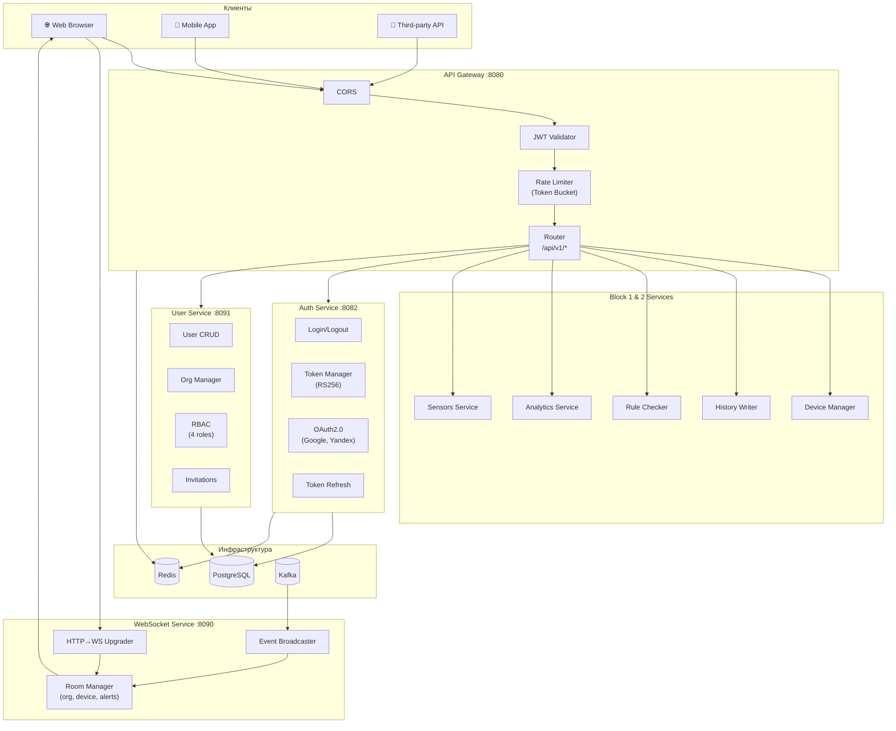
```mermaid
flowchart TB
    subgraph Clients["Клиенты"]
        Browser["🌐 Web Browser"]
        Mobile["📱 Mobile App"]
        ThirdParty["🔌 Third-party API"]
    end

    subgraph Gateway["API Gateway :8080"]
        CORS["CORS"]
        JWT["JWT Validator"]
        RateLimit["Rate Limiter\n(Token Bucket)"]
        Router["Router\n/api/v1/*"]
    end

    subgraph Auth["Auth Service :8082"]
        Login["Login/Logout"]
        TokenMgr["Token Manager\n(RS256)"]
        OAuth["OAuth2.0\n(Google, Yandex)"]
        Refresh["Token Refresh"]
    end

    subgraph Users["User Service :8091"]
        UserCRUD["User CRUD"]
        OrgMgr["Org Manager"]
        RBAC["RBAC\n(4 roles)"]
        Invite["Invitations"]
    end

    subgraph WS["WebSocket Service :8090"]
        Upgrader["HTTP→WS Upgrader"]
        RoomMgr["Room Manager\n(org, device, alerts)"]
        Broadcaster["Event Broadcaster"]
    end

    subgraph Block12["Block 1 & 2 Services"]
        DM["Device Manager"]
        HW["History Writer"]
        RC["Rule Checker"]
        AS["Analytics Service"]
        SS["Sensors Service"]
    end

    subgraph Infra["Инфраструктура"]
        PG[("PostgreSQL")]
        Redis[("Redis")]
        Kafka[("Kafka")]
    end

    Browser & Mobile & ThirdParty --> CORS --> JWT --> RateLimit --> Router
    Router --> DM & HW & RC & AS & SS
    Router --> Auth & Users

    Browser --> Upgrader --> RoomMgr
    Kafka --> Broadcaster --> RoomMgr --> Browser

    Auth --> PG & Redis
    Users --> PG
    Gateway --> Redis
```

---

## 🏗️ UML: Доменная модель Block 3

### Аутентификация и сессии

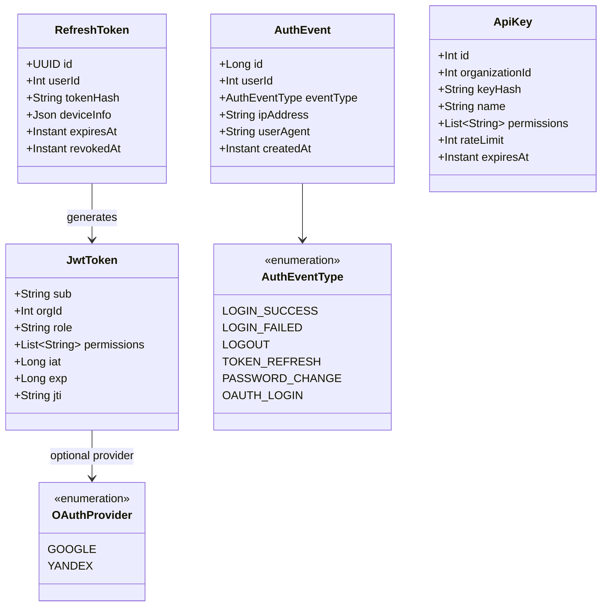
```mermaid
classDiagram
    class JwtToken {
        +String sub
        +Int orgId
        +String role
        +List~String~ permissions
        +Long iat
        +Long exp
        +String jti
    }

    class RefreshToken {
        +UUID id
        +Int userId
        +String tokenHash
        +Json deviceInfo
        +Instant expiresAt
        +Instant revokedAt
    }

    class AuthEvent {
        +Long id
        +Int userId
        +AuthEventType eventType
        +String ipAddress
        +String userAgent
        +Instant createdAt
    }

    class AuthEventType {
        <<enumeration>>
        LOGIN_SUCCESS
        LOGIN_FAILED
        LOGOUT
        TOKEN_REFRESH
        PASSWORD_CHANGE
        OAUTH_LOGIN
    }

    class OAuthProvider {
        <<enumeration>>
        GOOGLE
        YANDEX
    }

    class ApiKey {
        +Int id
        +Int organizationId
        +String keyHash
        +String name
        +List~String~ permissions
        +Int rateLimit
        +Instant expiresAt
    }

    JwtToken --> OAuthProvider : optional provider
    AuthEvent --> AuthEventType
    RefreshToken --> JwtToken : generates
```

### WebSocket протокол

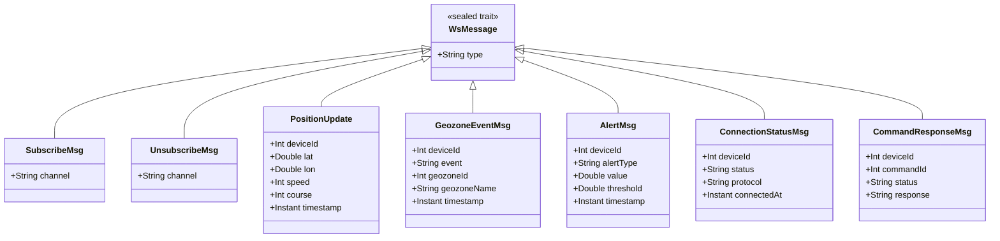
```mermaid
classDiagram
    class WsMessage {
        <<sealed trait>>
        +String type
    }

    class SubscribeMsg {
        +String channel
    }
    class UnsubscribeMsg {
        +String channel
    }

    class PositionUpdate {
        +Int deviceId
        +Double lat
        +Double lon
        +Int speed
        +Int course
        +Instant timestamp
    }

    class GeozoneEventMsg {
        +Int deviceId
        +String event
        +Int geozoneId
        +String geozoneName
        +Instant timestamp
    }

    class AlertMsg {
        +Int deviceId
        +String alertType
        +Double value
        +Double threshold
        +Instant timestamp
    }

    class ConnectionStatusMsg {
        +Int deviceId
        +String status
        +String protocol
        +Instant connectedAt
    }

    class CommandResponseMsg {
        +Int deviceId
        +Int commandId
        +String status
        +String response
    }

    WsMessage <|-- SubscribeMsg
    WsMessage <|-- UnsubscribeMsg
    WsMessage <|-- PositionUpdate
    WsMessage <|-- GeozoneEventMsg
    WsMessage <|-- AlertMsg
    WsMessage <|-- ConnectionStatusMsg
    WsMessage <|-- CommandResponseMsg
```

### RBAC: Роли и права

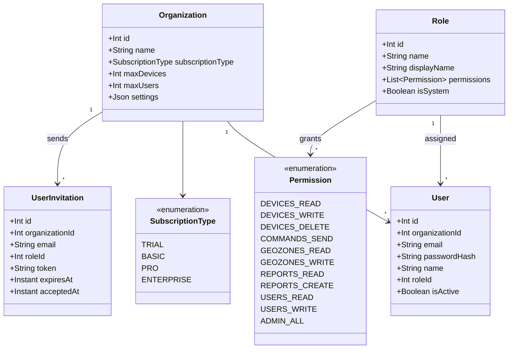
```mermaid
classDiagram
    class User {
        +Int id
        +Int organizationId
        +String email
        +String passwordHash
        +String name
        +Int roleId
        +Boolean isActive
    }

    class Organization {
        +Int id
        +String name
        +SubscriptionType subscriptionType
        +Int maxDevices
        +Int maxUsers
        +Json settings
    }

    class Role {
        +Int id
        +String name
        +String displayName
        +List~Permission~ permissions
        +Boolean isSystem
    }

    class Permission {
        <<enumeration>>
        DEVICES_READ
        DEVICES_WRITE
        DEVICES_DELETE
        COMMANDS_SEND
        GEOZONES_READ
        GEOZONES_WRITE
        REPORTS_READ
        REPORTS_CREATE
        USERS_READ
        USERS_WRITE
        ADMIN_ALL
    }

    class SubscriptionType {
        <<enumeration>>
        TRIAL
        BASIC
        PRO
        ENTERPRISE
    }

    class UserInvitation {
        +Int id
        +Int organizationId
        +String email
        +Int roleId
        +String token
        +Instant expiresAt
        +Instant acceptedAt
    }

    Organization "1" --> "*" User : contains
    Role "1" --> "*" User : assigned
    Role --> "*" Permission : grants
    Organization --> SubscriptionType
    Organization "1" --> "*" UserInvitation : sends
```

---

## 🚪 API Gateway

### Обзор

| Параметр | Значение |
|----------|----------|
| **Ответственность** | REST API, маршрутизация, rate limiting, аутентификация |
| **Порт** | 8080 |
| **State** | Redis (lettuce) — rate limit counters, JWT cache |
| **Auth** | JWT validation (RS256) |

### Middleware Stack

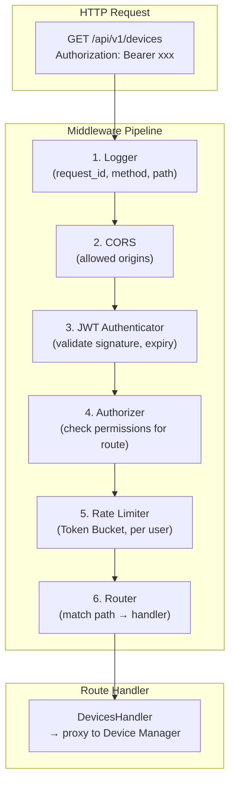
```mermaid
flowchart TB
    subgraph Request["HTTP Request"]
        R["GET /api/v1/devices\nAuthorization: Bearer xxx"]
    end

    subgraph Pipeline["Middleware Pipeline"]
        direction TB
        L["1. Logger\n(request_id, method, path)"]
        C["2. CORS\n(allowed origins)"]
        A["3. JWT Authenticator\n(validate signature, expiry)"]
        Z["4. Authorizer\n(check permissions for route)"]
        RL["5. Rate Limiter\n(Token Bucket, per user)"]
        RO["6. Router\n(match path → handler)"]
    end

    subgraph Handler["Route Handler"]
        H["DevicesHandler\n→ proxy to Device Manager"]
    end

    R --> L --> C --> A --> Z --> RL --> RO --> H
```

### Rate Limiting: Token Bucket

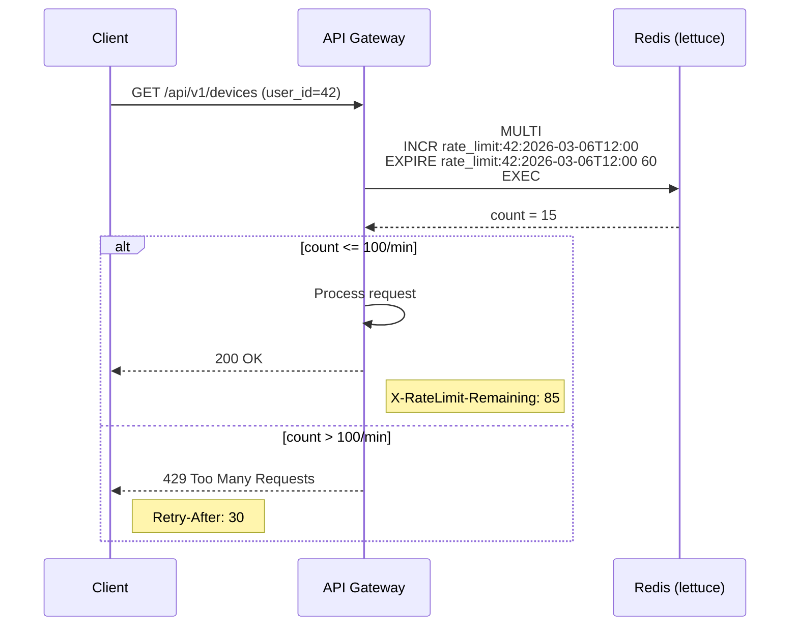
```mermaid
sequenceDiagram
    participant C as Client
    participant GW as API Gateway
    participant R as Redis (lettuce)

    C->>GW: GET /api/v1/devices (user_id=42)
    
    GW->>R: MULTI<br/>INCR rate_limit:42:2026-03-06T12:00<br/>EXPIRE rate_limit:42:2026-03-06T12:00 60<br/>EXEC
    R-->>GW: count = 15

    alt count <= 100/min
        GW->>GW: Process request
        GW-->>C: 200 OK
        Note right of GW: X-RateLimit-Remaining: 85
    else count > 100/min
        GW-->>C: 429 Too Many Requests
        Note right of C: Retry-After: 30
    end
```

### JWT Structure

```json
{
  "header": {
    "alg": "RS256",
    "typ": "JWT"
  },
  "payload": {
    "sub": "user_42",
    "org": 123,
    "role": "operator",
    "permissions": ["devices.read", "commands.send", "geozones.read"],
    "iat": 1709712000,
    "exp": 1709715600,
    "jti": "unique-token-id"
  }
}
```

---

## 🔐 Auth Service

### Обзор

| Параметр | Значение |
|----------|----------|
| **Ответственность** | JWT токены, сессии, OAuth2.0 |
| **Порт** | 8082 |
| **Access Token TTL** | 15 минут (RS256) |
| **Refresh Token TTL** | 7 дней (stored in Redis + DB) |

### Sequence Diagram: Полный Login Flow

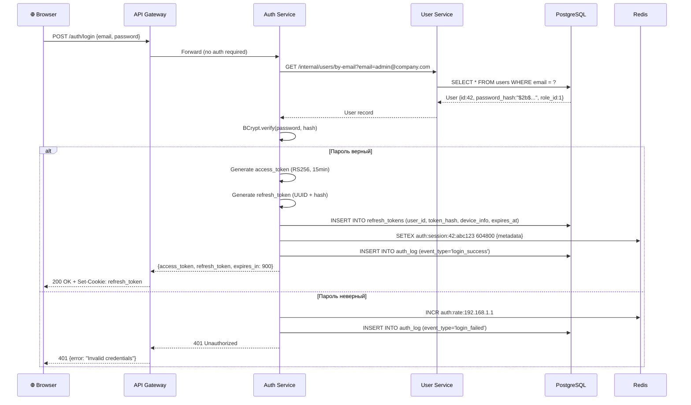
```mermaid
sequenceDiagram
    participant B as 🌐 Browser
    participant GW as API Gateway
    participant AS as Auth Service
    participant US as User Service
    participant DB as PostgreSQL
    participant R as Redis

    B->>GW: POST /auth/login {email, password}
    GW->>AS: Forward (no auth required)
    
    AS->>US: GET /internal/users/by-email?email=admin@company.com
    US->>DB: SELECT * FROM users WHERE email = ?
    DB-->>US: User {id:42, password_hash:"$2b$...", role_id:1}
    US-->>AS: User record

    AS->>AS: BCrypt.verify(password, hash)

    alt Пароль верный
        AS->>AS: Generate access_token (RS256, 15min)
        AS->>AS: Generate refresh_token (UUID + hash)
        AS->>DB: INSERT INTO refresh_tokens (user_id, token_hash, device_info, expires_at)
        AS->>R: SETEX auth:session:42:abc123 604800 {metadata}
        AS->>DB: INSERT INTO auth_log (event_type='login_success')

        AS-->>GW: {access_token, refresh_token, expires_in: 900}
        GW-->>B: 200 OK + Set-Cookie: refresh_token
    else Пароль неверный
        AS->>R: INCR auth:rate:192.168.1.1
        AS->>DB: INSERT INTO auth_log (event_type='login_failed')
        AS-->>GW: 401 Unauthorized
        GW-->>B: 401 {error: "Invalid credentials"}
    end
```

### Sequence Diagram: Token Refresh

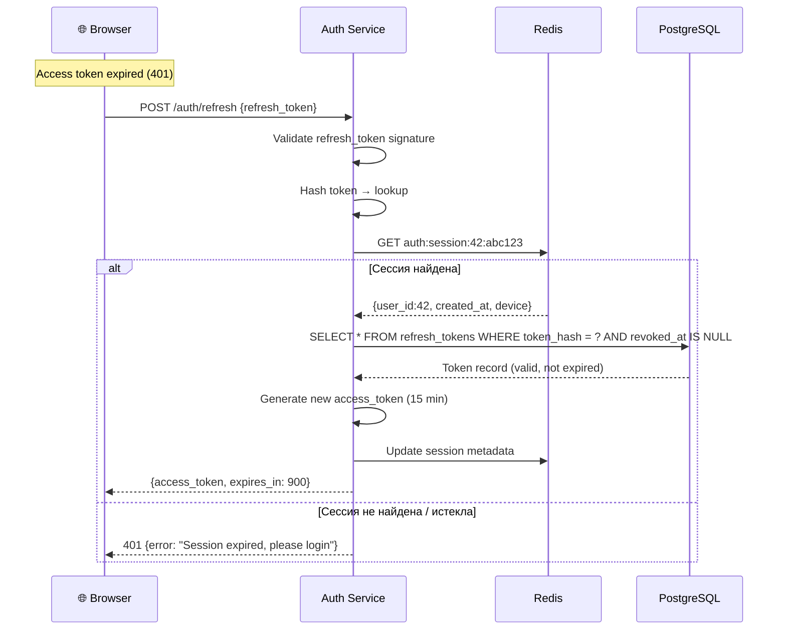
```mermaid
sequenceDiagram
    participant B as 🌐 Browser
    participant AS as Auth Service
    participant R as Redis
    participant DB as PostgreSQL

    Note over B: Access token expired (401)

    B->>AS: POST /auth/refresh {refresh_token}
    AS->>AS: Validate refresh_token signature
    AS->>AS: Hash token → lookup

    AS->>R: GET auth:session:42:abc123
    
    alt Сессия найдена
        R-->>AS: {user_id:42, created_at, device}
        AS->>DB: SELECT * FROM refresh_tokens WHERE token_hash = ? AND revoked_at IS NULL
        DB-->>AS: Token record (valid, not expired)

        AS->>AS: Generate new access_token (15 min)
        AS->>R: Update session metadata
        AS-->>B: {access_token, expires_in: 900}
    else Сессия не найдена / истекла
        AS-->>B: 401 {error: "Session expired, please login"}
    end
```

### OAuth2.0 Flow

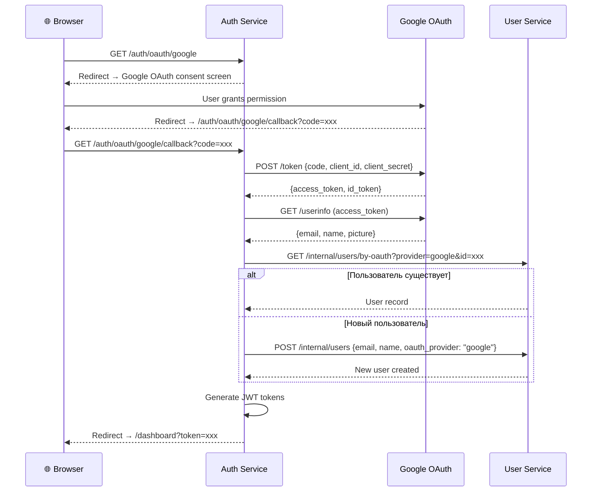
```mermaid
sequenceDiagram
    participant B as 🌐 Browser
    participant AS as Auth Service
    participant G as Google OAuth
    participant US as User Service

    B->>AS: GET /auth/oauth/google
    AS-->>B: Redirect → Google OAuth consent screen

    B->>G: User grants permission
    G-->>B: Redirect → /auth/oauth/google/callback?code=xxx

    B->>AS: GET /auth/oauth/google/callback?code=xxx
    AS->>G: POST /token {code, client_id, client_secret}
    G-->>AS: {access_token, id_token}

    AS->>G: GET /userinfo (access_token)
    G-->>AS: {email, name, picture}

    AS->>US: GET /internal/users/by-oauth?provider=google&id=xxx

    alt Пользователь существует
        US-->>AS: User record
    else Новый пользователь
        AS->>US: POST /internal/users {email, name, oauth_provider: "google"}
        US-->>AS: New user created
    end

    AS->>AS: Generate JWT tokens
    AS-->>B: Redirect → /dashboard?token=xxx
```

---

## 👤 User Service

### Обзор

| Параметр | Значение |
|----------|----------|
| **Ответственность** | Пользователи, организации, роли, RBAC |
| **Порт** | 8091 |
| **Роли** | admin, manager, operator, viewer |

### Предустановленные роли

| Роль | Permissions | Описание |
|------|-------------|----------|
| **admin** | `["*"]` | Полный доступ ко всему |
| **manager** | `["devices.*", "geozones.*", "reports.*", "users.read"]` | Управление кроме других пользователей |
| **operator** | `["devices.read", "commands.send", "geozones.read"]` | Мониторинг + отправка команд |
| **viewer** | `["devices.read", "geozones.read"]` | Только просмотр |

### Архитектура

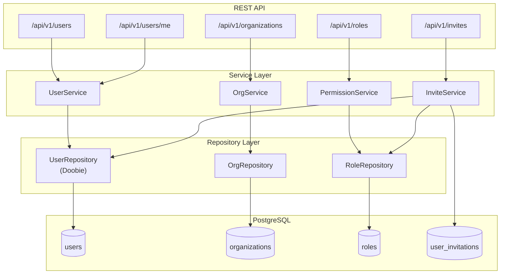
```mermaid
flowchart TB
    subgraph API["REST API"]
        Users["/api/v1/users"]
        Orgs["/api/v1/organizations"]
        Roles["/api/v1/roles"]
        Invites["/api/v1/invites"]
        Me["/api/v1/users/me"]
    end

    subgraph Service["Service Layer"]
        UserSvc["UserService"]
        OrgSvc["OrgService"]
        PermSvc["PermissionService"]
        InviteSvc["InviteService"]
    end

    subgraph Repo["Repository Layer"]
        UserRepo["UserRepository\n(Doobie)"]
        OrgRepo["OrgRepository"]
        RoleRepo["RoleRepository"]
    end

    subgraph DB["PostgreSQL"]
        UsersT[("users")]
        OrgsT[("organizations")]
        RolesT[("roles")]
        InvT[("user_invitations")]
    end

    Users & Me --> UserSvc --> UserRepo --> UsersT
    Orgs --> OrgSvc --> OrgRepo --> OrgsT
    Roles --> PermSvc --> RoleRepo --> RolesT
    Invites --> InviteSvc --> UserRepo & RoleRepo
    InviteSvc --> InvT
```

---

## 🔌 WebSocket Service

### Обзор

| Параметр | Значение |
|----------|----------|
| **Ответственность** | Real-time позиции, события, алерты |
| **Порт** | 8090 |
| **Источники** | Kafka: gps-events (group: ws-positions), geozone-events + rule-violations (group: ws-events) |
| **Подписки** | vehicleId (Set) + orgId (all vehicles) — Dual Index pattern |

### Архитектура

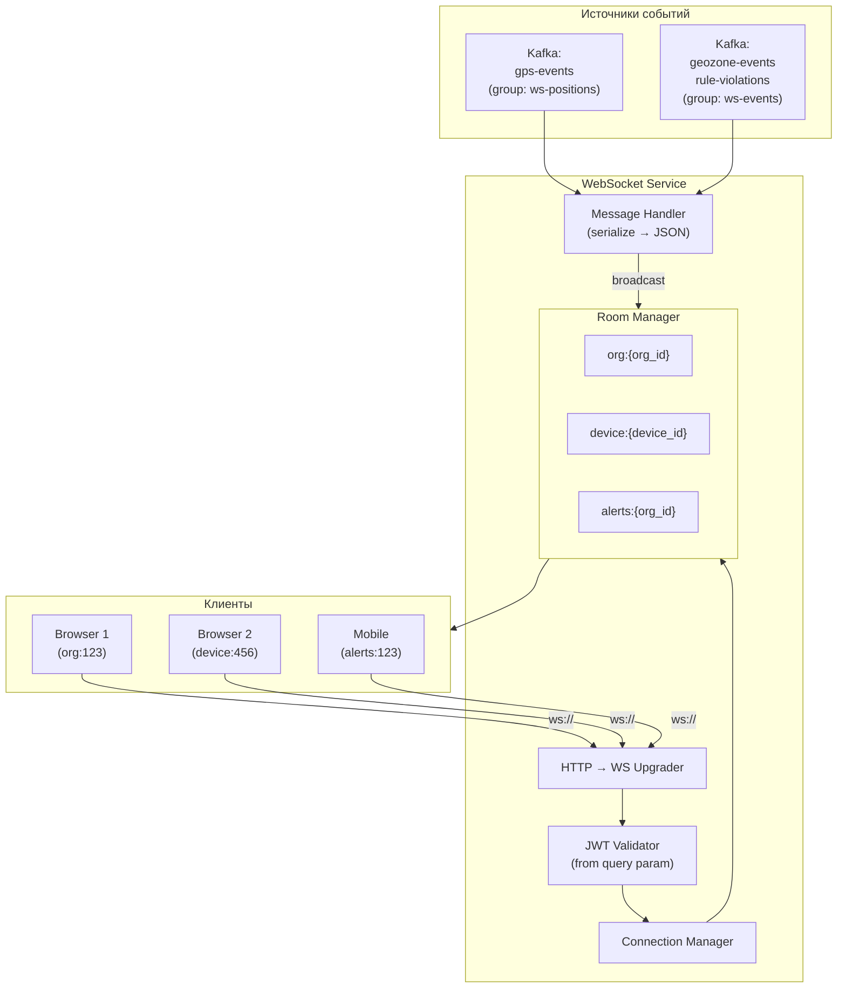
```mermaid
flowchart TB
    subgraph Clients["Клиенты"]
        B1["Browser 1\n(org:123)"]
        B2["Browser 2\n(device:456)"]
        M["Mobile\n(alerts:123)"]
    end

    subgraph WS["WebSocket Service"]
        Upgrader["HTTP → WS Upgrader"]
        AuthWS["JWT Validator\n(from query param)"]
        ConnMgr["Connection Manager"]
        
        subgraph Rooms["Room Manager"]
            OrgRoom["org:{org_id}"]
            DevRoom["device:{device_id}"]
            AlertRoom["alerts:{org_id}"]
        end

        MsgHandler["Message Handler\n(serialize → JSON)"]
    end

    subgraph Sources["Источники событий"]
        KafkaGPS["Kafka:\ngps-events\n(group: ws-positions)"]
        KafkaEvents["Kafka:\ngeozone-events\nrule-violations\n(group: ws-events)"]
    end

    B1 & B2 & M -->|ws://| Upgrader --> AuthWS --> ConnMgr --> Rooms
    
    KafkaGPS --> MsgHandler
    KafkaEvents --> MsgHandler
    
    MsgHandler --> |broadcast| Rooms --> Clients
```

### Sequence Diagram: Real-time позиции до браузера

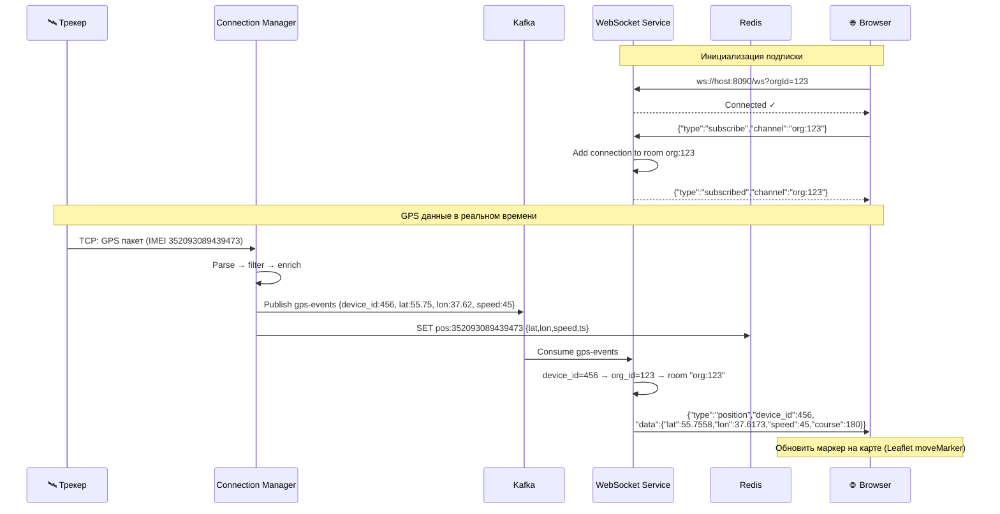
```mermaid
sequenceDiagram
    participant T as 🛰️ Трекер
    participant CM as Connection Manager
    participant K as Kafka
    participant WS as WebSocket Service
    participant R as Redis
    participant B as 🌐 Browser

    Note over B,WS: Инициализация подписки

    B->>WS: ws://host:8090/ws?orgId=123
    WS-->>B: Connected ✓

    B->>WS: {"type":"subscribe","channel":"org:123"}
    WS->>WS: Add connection to room org:123
    WS-->>B: {"type":"subscribed","channel":"org:123"}

    Note over T,B: GPS данные в реальном времени

    T->>CM: TCP: GPS пакет (IMEI 352093089439473)
    CM->>CM: Parse → filter → enrich
    CM->>K: Publish gps-events {device_id:456, lat:55.75, lon:37.62, speed:45}
    CM->>R: SET pos:352093089439473 {lat,lon,speed,ts}

    K->>WS: Consume gps-events
    WS->>WS: device_id=456 → org_id=123 → room "org:123"

    WS->>B: {"type":"position","device_id":456,<br/>"data":{"lat":55.7558,"lon":37.6173,"speed":45,"course":180}}

    Note over B: Обновить маркер на карте (Leaflet moveMarker)
```

### Протокол сообщений

**Client → Server:**

| type | Описание | Пример |
|------|----------|--------|
| `subscribe` | Подписка на канал | `{"type":"subscribe","channel":"org:123"}` |
| `unsubscribe` | Отписка | `{"type":"unsubscribe","channel":"device:456"}` |
| `ping` | Keep-alive | `{"type":"ping"}` |

**Server → Client:**

| type | Описание | Частота |
|------|----------|---------|
| `position` | GPS позиция | ~1-60 раз/мин на устройство |
| `geozone_event` | Вход/выход из геозоны | По событию |
| `alert` | Алерт (скорость, датчик) | По событию |
| `connection_status` | Устройство online/offline | По событию |
| `command_response` | Ответ на команду | По событию |
| `pong` | Keep-alive ответ | По запросу |

### Redis структуры для WS

> **Текущая реализация:** Redis НЕ используется. Всё состояние хранится in-memory через **ZIO Ref**:
> - `connections: Ref[Map[UUID, ActiveConnection]]` — активные WS соединения
> - `vehicleIndex: Ref[Map[Long, Set[UUID]]]` — vehicleId → подписчики
> - `orgIndex: Ref[Map[Long, Set[UUID]]]` — orgId → подписчики на всю организацию
>
> Для горизонтального масштабирования в будущем: Redis Pub/Sub для кросс-нод broadcast.

---

## 🛡️ Admin Service (Block 3)

> Admin Service также описан в [ARCHITECTURE_BLOCK2.md](./ARCHITECTURE_BLOCK2.md) (системный мониторинг).  
> Здесь — его UI-facing часть для Block 3.

### Функции

- **System Dashboard** — статус всех сервисов, Kafka lag, Redis stats
- **Feature Flags** — вкл/выкл функциональности динамически
- **Audit Log** — журнал всех действий пользователей
- **Config** — настройки системы без перезапуска

---

## 🌐 Web Frontend

### Обзор

| Параметр | Значение |
|----------|----------|
| **Фреймворк** | React 19 + TypeScript 5.9 |
| **Карта** | Leaflet + React-Leaflet |
| **Data Fetching** | TanStack Query v5 |
| **State** | Zustand |
| **Сборка** | Vite 7.2.4 |
| **Стили** | Tailwind CSS 4 |

### Архитектура Frontend

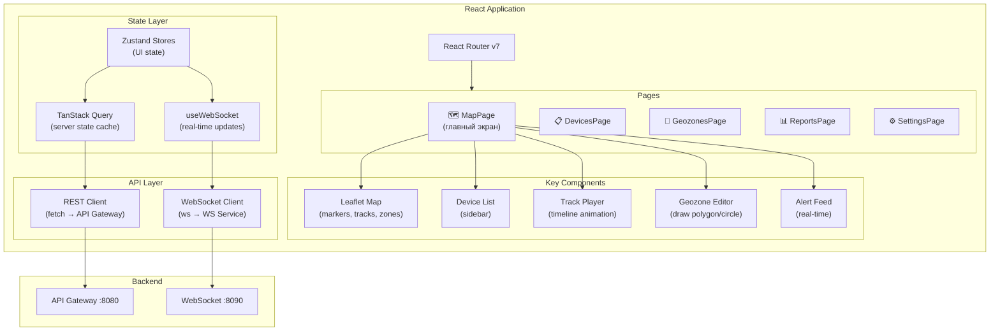
```mermaid
flowchart TB
    subgraph App["React Application"]
        Router["React Router v7"]
        
        subgraph Pages["Pages"]
            MapPage["🗺️ MapPage\n(главный экран)"]
            DevicesPage["📋 DevicesPage"]
            GeozonesPage["📍 GeozonesPage"]
            ReportsPage["📊 ReportsPage"]
            SettingsPage["⚙️ SettingsPage"]
        end

        subgraph Components["Key Components"]
            LeafletMap["Leaflet Map\n(markers, tracks, zones)"]
            DeviceList["Device List\n(sidebar)"]
            TrackPlayer["Track Player\n(timeline animation)"]
            GeoEditor["Geozone Editor\n(draw polygon/circle)"]
            AlertFeed["Alert Feed\n(real-time)"]
        end

        subgraph StateLayer["State Layer"]
            TanStack["TanStack Query\n(server state cache)"]
            Zustand["Zustand Stores\n(UI state)"]
            WSHook["useWebSocket\n(real-time updates)"]
        end

        subgraph ApiLayer["API Layer"]
            RestClient["REST Client\n(fetch → API Gateway)"]
            WSClient["WebSocket Client\n(ws → WS Service)"]
        end
    end

    subgraph Backend["Backend"]
        GW["API Gateway :8080"]
        WS["WebSocket :8090"]
    end

    Router --> Pages
    MapPage --> LeafletMap & DeviceList & TrackPlayer & GeoEditor & AlertFeed
    
    TanStack --> RestClient --> GW
    WSHook --> WSClient --> WS
    Zustand --> TanStack & WSHook
```

### Основной экран: Карта

```
┌─────────────────────────────────────────────────────────────────────────────┐
│  TrackerGPS    [🔍 Поиск устройства...]         🔔 3  👤 Admin   ⚙️        │
├─────────────────────────────────────────────────────────────────────────────┤
│ 🗺️ Карта │ 📋 Устройства │ 📍 Геозоны │ 📊 Отчёты │ ⚙️ Настройки          │
├──────────────┬──────────────────────────────────────────────────────────────┤
│              │                                                              │
│ 📋 Устрой-  │                    🗺️ LEAFLET MAP                            │
│    ства      │                                                              │
│              │          🚗 Газель-1 (45 км/ч)                               │
│ 🟢 Газель-1  │                                                              │
│    45 км/ч   │                    🚛 Фура-12 (62 км/ч)                      │
│ 🟢 Фура-12   │                                                              │
│    62 км/ч   │      ┌─────────┐                                             │
│ 🔴 Кран-3    │      │ Офис    │  (геозона, полигон)                         │
│    Offline   │      └─────────┘                                             │
│ 🟡 БМВ-007   │                         🚗 БМВ-007 (стоит)                   │
│    Стоит     │                                                              │
│              │                                                              │
│ [+ Добавить] │  - - - (трек Газели за сегодня)                              │
│              │                                                              │
├──────────────┴──────────────────────────────────────────────────────────────┤
│ 🚗 Газель-1 │ IMEI: 352093089439473 │ 55.755, 37.617 │ 45 км/ч │ 12:45:30 │
└─────────────────────────────────────────────────────────────────────────────┘
```

### Экран: Track Player

```
┌─────────────────────────────────────────────────────────────────────────────┐
│  ← Назад     Трек: Газель-1    📅 [06.03.2026] ⏰ [08:00] - [18:00] [▶]   │
├─────────────────────────────────────────────────────────────────────────────┤
│                                                                             │
│                            🗺️ MAP + TRACK                                  │
│                                                                             │
│     A ━━━━━━━━━━━━━━━━━━━━━━━━━━━━━━━━━━━━━━━━━━━━ B                      │
│   (start)              🚗 (current)              (end)                      │
│                                                                             │
│  ◄◄  ▶️  ►►  ═══════════●═══════════════════════  │ 1x 2x 5x 10x          │
│           08:00     10:30      12:00     14:00     16:00    17:45           │
│                                                                             │
├─────────────────────────────────────────────────────────────────────────────┤
│  Пробег: 156 км │ Время в пути: 8ч 15м │ Макс: 95 км/ч │ Стоянок: 5      │
│  Геозоны: Офис (2ч 10м), Склад (45м) │ Средняя скорость: 42 км/ч         │
└─────────────────────────────────────────────────────────────────────────────┘
```

### Структура проекта

```
web-frontend/src/
├── api/
│   ├── client.ts                # fetch wrapper + interceptors
│   ├── devices.ts               # Device API hooks
│   ├── geozones.ts              # Geozone API hooks
│   ├── reports.ts               # Reports API hooks
│   └── auth.ts                  # Auth API hooks
├── components/
│   ├── map/
│   │   ├── Map.tsx              # Leaflet container
│   │   ├── DeviceMarker.tsx     # Маркер устройства (анимация движения)
│   │   ├── GeozoneLayer.tsx     # Полигоны/круги геозон
│   │   ├── TrackLayer.tsx       # Polyline трека
│   │   └── TrackPlayer.tsx      # Плеер временной шкалы
│   ├── devices/
│   │   ├── DeviceList.tsx       # Боковая панель
│   │   ├── DeviceCard.tsx       # Карточка устройства
│   │   └── DeviceForm.tsx       # Форма создания/редактирования
│   ├── geozones/
│   │   ├── GeozoneEditor.tsx    # Рисование на карте
│   │   └── GeozoneList.tsx      # Список геозон
│   └── common/
│       ├── Header.tsx
│       ├── Sidebar.tsx
│       └── AlertBadge.tsx
├── pages/
│   ├── MapPage.tsx
│   ├── DevicesPage.tsx
│   ├── GeozonesPage.tsx
│   ├── ReportsPage.tsx
│   └── SettingsPage.tsx
├── store/
│   ├── authStore.ts             # JWT tokens, user
│   ├── devicesStore.ts          # Устройства + real-time позиции
│   └── mapStore.ts              # Viewport, selected device
├── hooks/
│   ├── useDevices.ts            # TanStack Query: devices
│   ├── useTrack.ts              # TanStack Query: track history
│   ├── useWebSocket.ts          # WS connection + auto-reconnect
│   └── useGeozones.ts           # TanStack Query: geozones
├── types/
│   ├── device.ts
│   ├── geozone.ts
│   ├── ws.ts
│   └── api.ts
├── utils/
│   ├── geo.ts                   # Haversine, bearing, etc.
│   ├── format.ts                # Дата, скорость, координаты
│   └── wsReconnect.ts           # Exponential backoff WS reconnect
├── App.tsx
└── main.tsx
```

---

## 🔄 State Diagrams

### WebSocket Connection Lifecycle

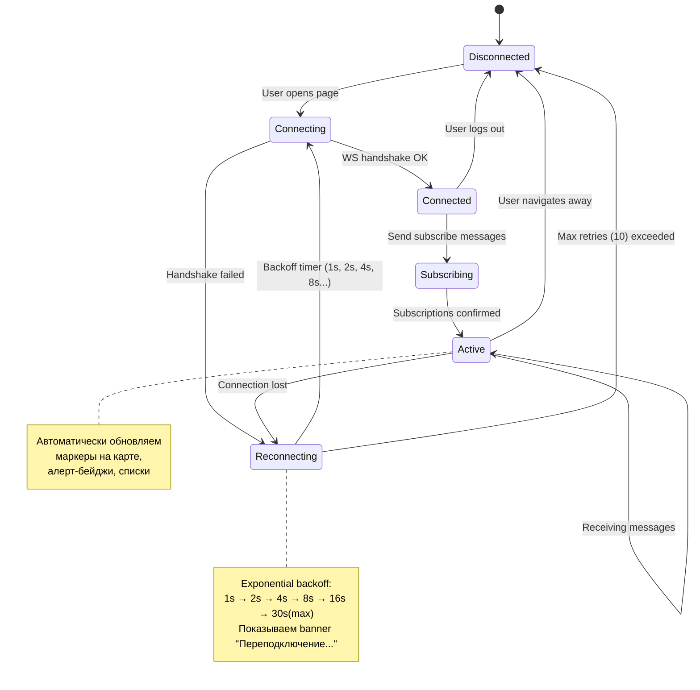
```mermaid
stateDiagram-v2
    [*] --> Disconnected

    Disconnected --> Connecting : User opens page
    Connecting --> Connected : WS handshake OK
    Connecting --> Reconnecting : Handshake failed

    Connected --> Subscribing : Send subscribe messages
    Subscribing --> Active : Subscriptions confirmed
    
    Active --> Active : Receiving messages
    Active --> Reconnecting : Connection lost
    
    Reconnecting --> Connecting : Backoff timer (1s, 2s, 4s, 8s...)
    Reconnecting --> Disconnected : Max retries (10) exceeded

    Active --> Disconnected : User navigates away
    Connected --> Disconnected : User logs out

    note right of Active
        Автоматически обновляем
        маркеры на карте,
        алерт-бейджи, списки
    end note

    note right of Reconnecting
        Exponential backoff:
        1s → 2s → 4s → 8s → 16s → 30s(max)
        Показываем banner "Переподключение..."
    end note
```

### JWT Token Lifecycle

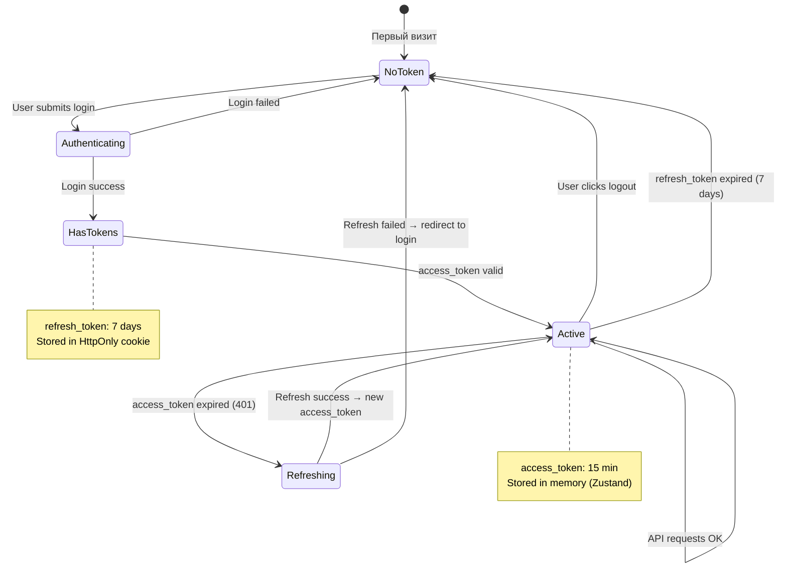
```mermaid
stateDiagram-v2
    [*] --> NoToken : Первый визит

    NoToken --> Authenticating : User submits login
    Authenticating --> HasTokens : Login success
    Authenticating --> NoToken : Login failed

    HasTokens --> Active : access_token valid
    Active --> Active : API requests OK

    Active --> Refreshing : access_token expired (401)
    Refreshing --> Active : Refresh success → new access_token
    Refreshing --> NoToken : Refresh failed → redirect to login

    Active --> NoToken : User clicks logout
    Active --> NoToken : refresh_token expired (7 days)

    note right of Active
        access_token: 15 min
        Stored in memory (Zustand)
    end note

    note right of HasTokens
        refresh_token: 7 days
        Stored in HttpOnly cookie
    end note
```

---

## 🔗 Взаимодействие всех сервисов Block 3

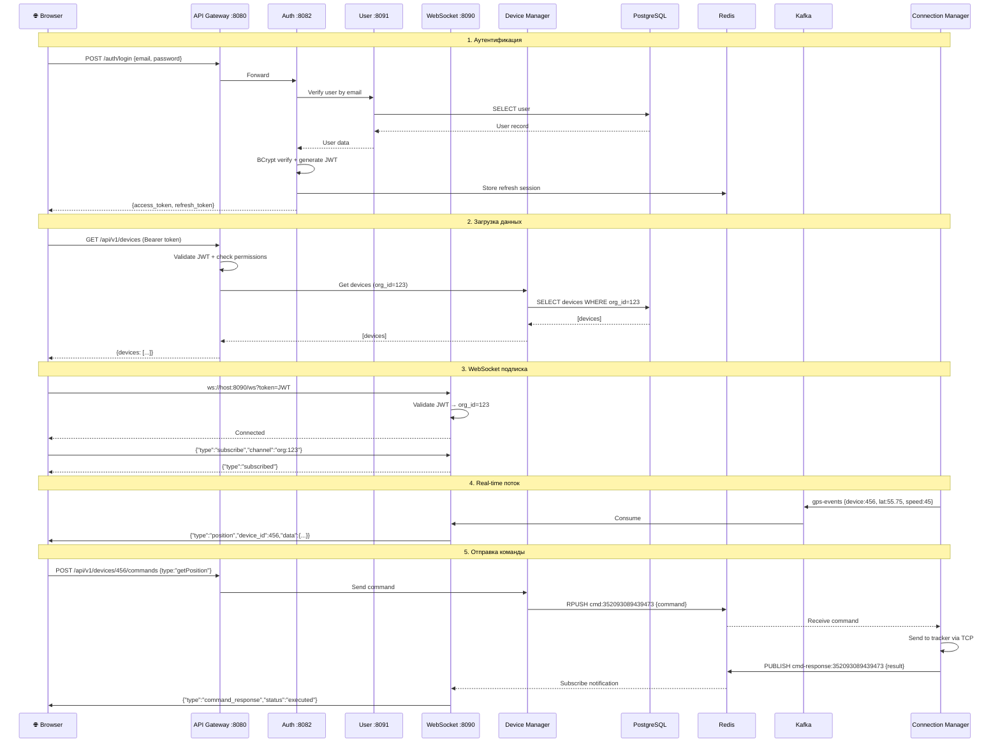
```mermaid
sequenceDiagram
    participant B as 🌐 Browser
    participant GW as API Gateway :8080
    participant AS as Auth :8082
    participant US as User :8091
    participant WS as WebSocket :8090
    participant DM as Device Manager
    participant DB as PostgreSQL
    participant R as Redis
    participant K as Kafka
    participant CM as Connection Manager

    Note over B,CM: 1. Аутентификация

    B->>GW: POST /auth/login {email, password}
    GW->>AS: Forward
    AS->>US: Verify user by email
    US->>DB: SELECT user
    DB-->>US: User record
    US-->>AS: User data
    AS->>AS: BCrypt verify + generate JWT
    AS->>R: Store refresh session
    AS-->>B: {access_token, refresh_token}

    Note over B,CM: 2. Загрузка данных

    B->>GW: GET /api/v1/devices (Bearer token)
    GW->>GW: Validate JWT + check permissions
    GW->>DM: Get devices (org_id=123)
    DM->>DB: SELECT devices WHERE org_id=123
    DB-->>DM: [devices]
    DM-->>GW: [devices]
    GW-->>B: {devices: [...]}

    Note over B,CM: 3. WebSocket подписка

    B->>WS: ws://host:8090/ws?token=JWT
    WS->>WS: Validate JWT → org_id=123
    WS-->>B: Connected

    B->>WS: {"type":"subscribe","channel":"org:123"}
    WS-->>B: {"type":"subscribed"}

    Note over B,CM: 4. Real-time поток

    CM->>K: gps-events {device:456, lat:55.75, speed:45}
    K->>WS: Consume
    WS->>B: {"type":"position","device_id":456,"data":{...}}

    Note over B,CM: 5. Отправка команды

    B->>GW: POST /api/v1/devices/456/commands {type:"getPosition"}
    GW->>DM: Send command
    DM->>R: RPUSH cmd:352093089439473 {command}
    R-->>CM: Receive command
    CM->>CM: Send to tracker via TCP

    CM->>R: PUBLISH cmd-response:352093089439473 {result}
    R-->>WS: Subscribe notification
    WS->>B: {"type":"command_response","status":"executed"}
```

---

## 🗄️ ER: Базы данных Block 3

### Auth Service

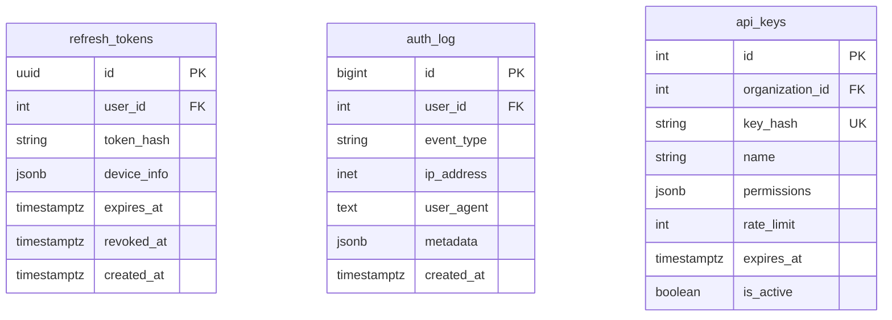
```mermaid
erDiagram
    refresh_tokens {
        uuid id PK
        int user_id FK
        string token_hash
        jsonb device_info
        timestamptz expires_at
        timestamptz revoked_at
        timestamptz created_at
    }

    auth_log {
        bigint id PK
        int user_id FK
        string event_type
        inet ip_address
        text user_agent
        jsonb metadata
        timestamptz created_at
    }

    api_keys {
        int id PK
        int organization_id FK
        string key_hash UK
        string name
        jsonb permissions
        int rate_limit
        timestamptz expires_at
        boolean is_active
    }
```

### User Service

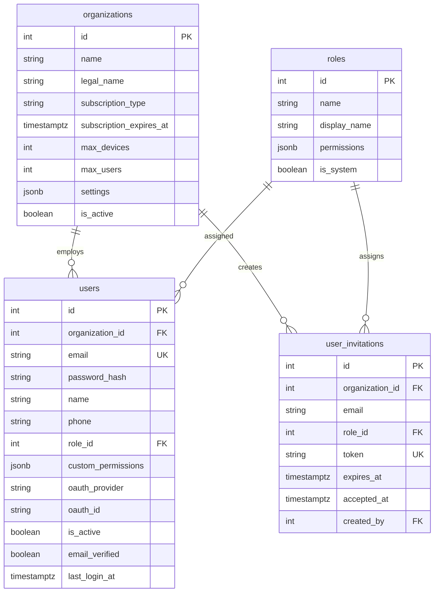
```mermaid
erDiagram
    organizations {
        int id PK
        string name
        string legal_name
        string subscription_type
        timestamptz subscription_expires_at
        int max_devices
        int max_users
        jsonb settings
        boolean is_active
    }

    users {
        int id PK
        int organization_id FK
        string email UK
        string password_hash
        string name
        string phone
        int role_id FK
        jsonb custom_permissions
        string oauth_provider
        string oauth_id
        boolean is_active
        boolean email_verified
        timestamptz last_login_at
    }

    roles {
        int id PK
        string name
        string display_name
        jsonb permissions
        boolean is_system
    }

    user_invitations {
        int id PK
        int organization_id FK
        string email
        int role_id FK
        string token UK
        timestamptz expires_at
        timestamptz accepted_at
        int created_by FK
    }

    organizations ||--o{ users : "employs"
    roles ||--o{ users : "assigned"
    organizations ||--o{ user_invitations : "creates"
    roles ||--o{ user_invitations : "assigns"
```

---

## 📡 REST API Reference

### Auth Service (:8082)

```yaml
POST   /auth/login                    # Login → JWT tokens
POST   /auth/logout                   # Logout → revoke tokens
POST   /auth/refresh                  # Refresh access token
POST   /auth/password/reset           # Request password reset
POST   /auth/password/change          # Change password (auth required)
GET    /auth/oauth/google             # Google OAuth redirect
GET    /auth/oauth/google/callback    # Google callback
GET    /auth/oauth/yandex             # Yandex OAuth redirect
GET    /auth/oauth/yandex/callback    # Yandex callback
POST   /auth/validate                 # Internal: validate token
```

### User Service (:8091)

```yaml
GET    /api/v1/users                  # List users (admin)
GET    /api/v1/users/{id}             # Get user
POST   /api/v1/users                  # Create user (admin)
PUT    /api/v1/users/{id}             # Update user
DELETE /api/v1/users/{id}             # Soft delete user
GET    /api/v1/users/me               # Current user profile
PUT    /api/v1/users/me               # Update profile
PUT    /api/v1/users/me/password      # Change password
GET    /api/v1/organizations/{id}     # Get organization
PUT    /api/v1/organizations/{id}     # Update organization
GET    /api/v1/roles                  # List roles
PUT    /api/v1/users/{id}/role        # Assign role (admin)
POST   /api/v1/invites               # Send invitation
POST   /api/v1/invites/{token}/accept # Accept invitation
```

### API Gateway (:8080) — проксирует к backend

```yaml
# Devices (→ Device Manager)
GET    /api/v1/devices                # List devices
GET    /api/v1/devices/{id}           # Get device
POST   /api/v1/devices                # Create device
PUT    /api/v1/devices/{id}           # Update device
DELETE /api/v1/devices/{id}           # Delete device
GET    /api/v1/devices/{id}/position  # Last position
GET    /api/v1/devices/{id}/track     # Track (from, to params)
POST   /api/v1/devices/{id}/commands  # Send command
GET    /api/v1/devices/positions      # All positions (bulk)

# Geozones (→ Rule Checker)
GET    /api/v1/geozones               # List geozones
POST   /api/v1/geozones               # Create geozone
PUT    /api/v1/geozones/{id}          # Update geozone
DELETE /api/v1/geozones/{id}          # Delete geozone
GET    /api/v1/geozones/{id}/events   # Geozone events

# Reports (→ Analytics Service)
POST   /api/v1/reports                # Generate report
GET    /api/v1/reports/{id}           # Get report / download
GET    /api/v1/reports                # List reports

# Stats (→ Analytics Service)
GET    /api/v1/devices/{id}/stats     # Device stats for period
GET    /api/v1/devices/{id}/trips     # Trip list
GET    /api/v1/devices/{id}/stops     # Stop list
```

---

## 📊 Сводная таблица Block 3

| Параметр | API Gateway | Auth Service | User Service | WebSocket | Admin Svc | Web Frontend |
|----------|-------------|-------------|-------------|-----------|-----------|-------------|
| **Порт** | 8080 | 8082 | 8091 | 8090 | 8097 | 3001 |
| **Тип** | REST proxy | REST | REST | WS | REST | SPA |
| **Язык** | Scala 3 | Scala 3 | Scala 3 | Scala 3 | Scala 3 | TypeScript |
| **БД** | — | PG + Redis | PG | — | PG | — |
| **State** | Redis (lettuce) | Redis (lettuce) | Ref | Ref + Kafka | Ref | Zustand |
| **Auth** | JWT validate | JWT issue | JWT + RBAC | JWT (WS) | JWT admin | Cookie |
| **Масштаб.** | Горизонтальное | Горизонтальное | Горизонтальное | + Redis Pub/Sub | Горизонтальное | CDN |

---

## 🚀 Deployment

### Docker Compose (dev)

```yaml
services:
  api-gateway:
    build: ./services/API-Gateway
    ports: ["8080:8080"]
    environment:
      REDIS_URL: redis://redis:6379
      JWT_PUBLIC_KEY: ${JWT_PUBLIC_KEY}
      AUTH_SERVICE_URL: http://auth-service:8082
    depends_on: [redis]

  websocket-service:
    build: ./services/websocket-service
    ports: ["8090:8090"]
    environment:
      KAFKA_BROKERS: kafka:9092
      REDIS_URL: redis://redis:6379
      JWT_PUBLIC_KEY: ${JWT_PUBLIC_KEY}
    depends_on: [kafka, redis]

  auth-service:
    build: ./services/auth-service
    ports: ["8082:8082"]
    environment:
      DATABASE_URL: postgresql://postgres:5432/tracker
      REDIS_URL: redis://redis:6379
      JWT_PRIVATE_KEY: ${JWT_PRIVATE_KEY}
      JWT_ACCESS_EXPIRY: 15m
      JWT_REFRESH_EXPIRY: 7d
      GOOGLE_CLIENT_ID: ${GOOGLE_CLIENT_ID}
      GOOGLE_CLIENT_SECRET: ${GOOGLE_CLIENT_SECRET}
    depends_on: [postgres, redis]

  user-service:
    build: ./services/user-service
    ports: ["8091:8091"]
    environment:
      DATABASE_URL: postgresql://postgres:5432/tracker
    depends_on: [postgres]

  web-frontend:
    build: ./services/web-frontend
    ports: ["3001:80"]
    environment:
      VITE_API_URL: http://localhost:8080
      VITE_WS_URL: ws://localhost:8090

  admin-service:
    build: ./services/admin-service
    ports: ["8097:8097"]
    environment:
      DATABASE_URL: postgresql://postgres:5432/tracker
    depends_on: [postgres]
```

### Nginx Config (production)

```nginx
upstream api {
    server api-gateway-1:8080;
    server api-gateway-2:8080;
}

upstream websocket {
    server ws-service-1:8090;
    server ws-service-2:8090;
    ip_hash;  # sticky sessions для WS
}

server {
    listen 443 ssl http2;
    server_name tracker.example.com;

    ssl_certificate     /etc/nginx/ssl/cert.pem;
    ssl_certificate_key /etc/nginx/ssl/key.pem;

    # REST API
    location /api/ {
        proxy_pass http://api;
        proxy_set_header Host $host;
        proxy_set_header X-Real-IP $remote_addr;
        proxy_set_header X-Forwarded-For $proxy_add_x_forwarded_for;
    }

    # WebSocket
    location /ws {
        proxy_pass http://websocket;
        proxy_http_version 1.1;
        proxy_set_header Upgrade $http_upgrade;
        proxy_set_header Connection "upgrade";
        proxy_read_timeout 86400;
    }

    # Frontend static
    location / {
        root /var/www/tracker;
        try_files $uri /index.html;
        expires 1d;
    }
}
```

---

**Предыдущий блок:** [ARCHITECTURE_BLOCK2.md](./ARCHITECTURE_BLOCK2.md) — Бизнес-логика  
**Общая архитектура:** [ARCHITECTURE.md](../ARCHITECTURE.md)

*Версия: 2.0 | Обновлён: 6 марта 2026*
