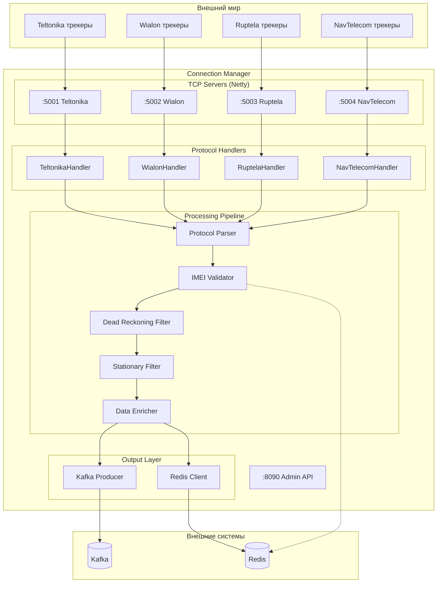
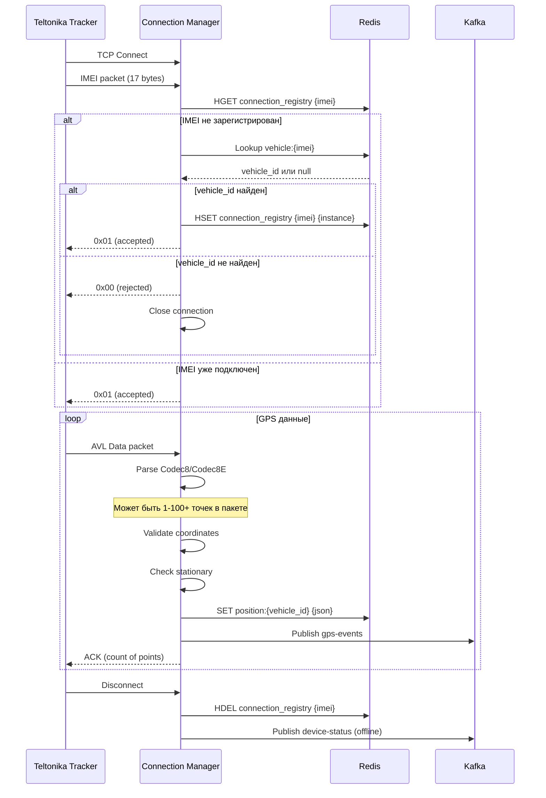
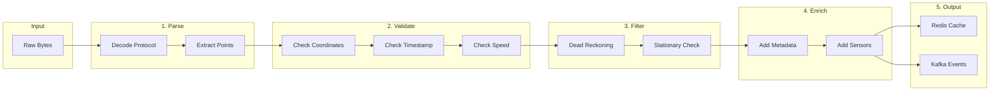
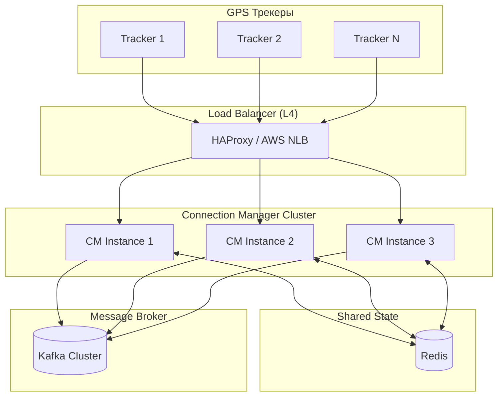

# 🔌 Connection Manager — Детальная документация

> **Блок:** 1 (Data Collection)  
> **Порты:** TCP (один порт на инстанс, задаётся через CLI/env), HTTP 8090 (admin/metrics)  
> **Сложность:** Высокая  
> **Статус:** 🟡 В разработке  
> **Обновлено:** 12 февраля 2026

---

## 📋 Содержание

1. [Обзор](#обзор)
2. [Принцип работы](#принцип-работы)
3. [Запуск и конфигурация](#запуск-и-конфигурация)
4. [Архитектура компонентов](#архитектура-компонентов)
5. [Протоколы трекеров](#протоколы-трекеров)
6. [Обработка данных](#обработка-данных)
7. [Типизированные ошибки парсинга (ADT)](#типизированные-ошибки-парсинга-adt)
8. [Redis интеграция](#redis-интеграция)
9. [Kafka интеграция](#kafka-интеграция)
10. [API endpoints](#api-endpoints)
11. [Масштабирование](#масштабирование)
12. [Метрики и мониторинг](#метрики-и-мониторинг)
13. [Post-MVP: GPS спуфинг-фильтр](#post-mvp-gps-спуфинг-фильтр)

---

## Обзор

**Connection Manager** — сервис приёма GPS данных от трекеров. Каждый инстанс обслуживает **один протокол на одном порту**, что упрощает масштабирование и деплой.

### Ключевые характеристики

| Параметр | Значение |
|----------|----------|
| **Протоколы** | Teltonika, Wialon IPS, Ruptela, NavTelecom (+ 6 Post-MVP) |
| **Deployment** | Один инстанс = один протокол + один порт |
| **Пропускная способность** | 10,000+ точек/сек на инстанс |
| **Latency** | < 50ms (parse → Kafka) |
| **Concurrent connections** | 3,000+ на инстанс |
| **State** | Redis (кеш) + in-memory (pending commands) |

---

## Принцип работы

### Один инстанс — один протокол

```
┌─────────────────────────────────────────────────────────────────────────┐
│                        DEPLOYMENT МОДЕЛЬ                                 │
├─────────────────────────────────────────────────────────────────────────┤
│                                                                         │
│  docker run -e CM_PROTOCOL=teltonika -e CM_PORT=5001 cm:latest          │
│  docker run -e CM_PROTOCOL=wialon    -e CM_PORT=5002 cm:latest          │
│  docker run -e CM_PROTOCOL=ruptela   -e CM_PORT=5003 cm:latest          │
│  docker run -e CM_PROTOCOL=navtelecom -e CM_PORT=5004 cm:latest         │
│                                                                         │
│  ┌─────────────┐ ┌─────────────┐ ┌─────────────┐ ┌─────────────┐        │
│  │ CM Instance │ │ CM Instance │ │ CM Instance │ │ CM Instance │        │
│  │ Teltonika   │ │ Wialon      │ │ Ruptela     │ │ NavTelecom  │        │
│  │ :5001       │ │ :5002       │ │ :5003       │ │ :5004       │        │
│  └──────┬──────┘ └──────┬──────┘ └──────┬──────┘ └──────┬──────┘        │
│         │               │               │               │               │
│         └───────────────┴───────┬───────┴───────────────┘               │
│                                 ↓                                       │
│                         ┌─────────────┐                                 │
│                         │    Redis    │  ← Shared state                 │
│                         │   (HASH)    │  ← device:{imei}                │
│                         └─────────────┘                                 │
│                                 ↓                                       │
│                         ┌─────────────┐                                 │
│                         │    Kafka    │  ← gps-events                   │
│                         │             │  ← gps-events-rules             │
│                         └─────────────┘                                 │
│                                                                         │
└─────────────────────────────────────────────────────────────────────────┘
```

### Data Flow

```
┌─────────────────────────────────────────────────────────────────────────┐
│                         CONNECTION MANAGER FLOW                          │
├─────────────────────────────────────────────────────────────────────────┤
│                                                                         │
│  1. TCP CONNECT + IMEI PACKET                                           │
│     ─────────────────────────                                           │
│     Трекер → TCP → parseImei() → Redis HGETALL device:{imei}            │
│                                                                         │
│     Результат = null → NACK + close (неизвестный трекер)                │
│     Результат = DeviceData → ACK + записываем connection поля           │
│                                                                         │
│  2. DATA PACKET (loop)                                                  │
│     ──────────────────                                                  │
│     ┌─────────────────────────────────────────────────────────────┐     │
│     │ 2.1 PARSE                                                   │     │
│     │     parseData(buffer) → List[GpsRawPoint]                   │     │
│     └─────────────────────────────────────────────────────────────┘     │
│                                       ↓                                 │
│     ┌─────────────────────────────────────────────────────────────┐     │
│     │ 2.2 GET FRESH CONTEXT (на каждый пакет!)                    │     │
│     │     Redis HGETALL device:{imei} → DeviceData                │     │
│     │     (context + prev position за 1 запрос)                   │     │
│     └─────────────────────────────────────────────────────────────┘     │
│                                       ↓                                 │
│     ┌─────────────────────────────────────────────────────────────┐     │
│     │ 2.3 ENRICH                                                  │     │
│     │     raw + context → GpsPoint                                │     │
│     │     (vehicleId, orgId, speedLimit, hasGeozones,             │     │
│     │      hasRetranslation, retranslationTargets, ...)           │     │
│     └─────────────────────────────────────────────────────────────┘     │
│                                       ↓                                 │
│     ┌─────────────────────────────────────────────────────────────┐     │
│     │ 2.4 VALIDATE + DEAD RECKONING FILTER                        │     │
│     │     - Координаты валидны? Timestamp не в будущем?           │     │
│     │     - Сравнение с prev position (из того же HGETALL)        │     │
│     │     - Нет телепортации? Скорость < 300 км/ч?                │     │
│     └─────────────────────────────────────────────────────────────┘     │
│                                       ↓                                 │
│     ┌─────────────────────────────────────────────────────────────┐     │
│     │ 2.5 UPDATE REDIS (всегда, после валидации)                  │     │
│     │     HMSET device:{imei} lat .. lon .. speed .. time ..      │     │
│     │     (обновляем только position + lastActivity поля)         │     │
│     └─────────────────────────────────────────────────────────────┘     │
│                                       ↓                                 │
│     ┌─────────────────────────────────────────────────────────────┐     │
│     │ 2.6 KAFKA PUBLISH                                           │     │
│     │                                                             │     │
│     │     → gps-events (ВСЕГДА)                                   │     │
│     │       Consumers: History Writer, WebSocket Service          │     │
│     │                                                             │     │
│     │     → gps-events-rules (если hasGeozones OR hasSpeedRules)  │     │
│     │       Consumers: Geozones Service, Speed Alert Service      │     │
│     │                                                             │     │
│     │     → gps-events-retranslation (если hasRetranslation)      │     │
│     │       Consumers: Integration Service                        │     │
│     │       (retranslationTargets встраиваются в сообщение)       │     │
│     │                                                             │     │
│     └─────────────────────────────────────────────────────────────┘     │
│                                       ↓                                 │
│     ┌─────────────────────────────────────────────────────────────┐     │
│     │ 2.7 ACK → трекеру, GOTO 2.1                                 │     │
│     └─────────────────────────────────────────────────────────────┘     │
│                                                                         │
│  3. DISCONNECT                                                          │
│     ──────────                                                          │
│     Очищаем connection поля в Redis, публикуем device-status offline    │
│                                                                         │
└─────────────────────────────────────────────────────────────────────────┘
```

---

## Запуск и конфигурация

### CLI аргументы

```bash
# Полный формат
./connection-manager --protocol=teltonika --port=5001 --host=0.0.0.0

# Минимальный (host по умолчанию 0.0.0.0)
./connection-manager --protocol=wialon --port=5002
```

### Environment Variables (для Docker)

```bash
# Обязательные
CM_PROTOCOL=teltonika          # teltonika|wialon|ruptela|navtelecom
CM_PORT=5001                   # TCP порт для трекеров

# Инфраструктура
REDIS_HOST=redis               # Redis сервер
REDIS_PORT=6379
KAFKA_BROKERS=kafka:9092       # Kafka брокеры

# Опциональные
CM_INSTANCE_ID=cm-teltonika-1  # ID инстанса (по умолчанию: hostname)
CM_ADMIN_PORT=8090             # Порт для health/metrics
TCP_WORKER_THREADS=4           # Netty worker threads
TCP_BOSS_THREADS=1             # Netty boss threads
LOG_LEVEL=INFO
```

### Docker Compose пример

```yaml
services:
  cm-teltonika:
    image: wayrecall/connection-manager:latest
    ports:
      - "5001:5001"
      - "8091:8090"
    environment:
      - CM_PROTOCOL=teltonika
      - CM_PORT=5001
      - CM_INSTANCE_ID=cm-teltonika-1
      - REDIS_HOST=redis
      - KAFKA_BROKERS=kafka:9092
    depends_on:
      - redis
      - kafka

  cm-wialon:
    image: wayrecall/connection-manager:latest
    ports:
      - "5002:5002"
      - "8092:8090"
    environment:
      - CM_PROTOCOL=wialon
      - CM_PORT=5002
      - CM_INSTANCE_ID=cm-wialon-1
      - REDIS_HOST=redis
      - KAFKA_BROKERS=kafka:9092
    depends_on:
      - redis
      - kafka
```

---

## Архитектура компонентов



### Компоненты

| Компонент | Описание | Технология |
|-----------|----------|------------|
| **TCP Servers** | Приём соединений от трекеров | Netty NIO |
| **Protocol Handlers** | Codec для каждого протокола | ZIO + Netty |
| **Parser** | Парсинг бинарных пакетов → GpsPoint | Pure Scala |
| **IMEI Validator** | Проверка IMEI в Redis/PostgreSQL | ZIO + Redis |
| **Dead Reckoning Filter** | Валидация координат | Pure Scala |
| **Stationary Filter** | Определение движение/стоянка | Pure Scala |
| **Data Enricher** | Добавление метаданных | Pure Scala |
| **Kafka Producer** | Публикация в топики | zio-kafka |
| **Kafka Consumer** | Получение команд (device-commands) | zio-kafka (Static Partition) |
| **Command Handler** | Отправка команд на трекеры + pending queue | ZIO + Redis |
| **Redis Client** | Кеш позиций, backup команд | zio-redis |

---

## Протоколы трекеров

### Teltonika (порт 5001)



#### Teltonika Codec8 Extended

```
┌────────────────────────────────────────────────────────────────────┐
│                      AVL Data Packet                               │
├──────────┬──────────┬──────────────────────────────────────────────┤
│ Preamble │ Data Len │              AVL Data                        │
│ 4 bytes  │ 4 bytes  │              Variable                        │
│ 00000000 │          │                                              │
├──────────┴──────────┼──────────────────────────────────────────────┤
│                     │  ┌─────────────────────────────────────────┐ │
│                     │  │ Codec ID: 0x8E (Codec8 Extended)        │ │
│                     │  │ Number of Data 1: count                 │ │
│                     │  │ AVL Data[]:                             │ │
│                     │  │   - Timestamp (8 bytes)                 │ │
│                     │  │   - Priority (1 byte)                   │ │
│                     │  │   - GPS Element:                        │ │
│                     │  │     - Longitude (4 bytes, int * 10^-7)  │ │
│                     │  │     - Latitude (4 bytes, int * 10^-7)   │ │
│                     │  │     - Altitude (2 bytes)                │ │
│                     │  │     - Angle (2 bytes)                   │ │
│                     │  │     - Satellites (1 byte)               │ │
│                     │  │     - Speed (2 bytes)                   │ │
│                     │  │   - IO Element (variable)               │ │
│                     │  │ Number of Data 2: count                 │ │
│                     │  │ CRC-16 (4 bytes)                        │ │
│                     │  └─────────────────────────────────────────┘ │
└─────────────────────┴──────────────────────────────────────────────┘
```

### Wialon IPS (порт 5002)

```
Формат: текстовый, разделитель ";"

Login:    #L#imei;password\r\n
Response: #AL#1\r\n (success) или #AL#0\r\n (fail)

Data:     #D#date;time;lat1;lat2;lon1;lon2;speed;course;alt;sats;hdop;inputs;outputs;adc;ibutton;params\r\n
Response: #AD#1\r\n

Short:    #SD#date;time;lat1;lat2;lon1;lon2;speed;course;alt;sats\r\n
Response: #ASD#1\r\n

Ping:     #P#\r\n
Response: #AP#\r\n
```

### Ruptela (порт 5003)

```
Бинарный протокол, структура пакета:
- Length (2 bytes, big-endian)
- IMEI (8 bytes, BCD)
- Command ID (1 byte)
- Payload (variable)
- CRC-16 (2 bytes)

Command IDs:
- 0x01: Records
- 0x02: Extended Records
- 0x41: SMS from server
- 0x42: SMS response
```

### NavTelecom (порт 5004)

```
Бинарный протокол FLEX:
- Signature: "@NTC"
- Receiver ID (4 bytes)
- Sender ID (4 bytes)
- Packet Length (2 bytes)
- Packet Flags (1 byte)
- Header CRC (1 byte)
- Service ID (1 byte)
- Packet Type (1 byte)
- Payload
- Data CRC (1 byte)
```

---

## Обработка данных

### Pipeline обработки



### GpsRawPoint → GpsPoint (обогащение)

```scala
/**
 * Сырая точка из парсера (без контекста)
 */
case class GpsRawPoint(
  imei: String,
  latitude: Double,
  longitude: Double,
  altitude: Option[Int],
  speed: Int,
  course: Int,
  satellites: Option[Int],
  deviceTime: Instant,
  sensors: SensorData
)

/**
 * Обогащённая точка (для Redis + Kafka)
 */
case class GpsPoint(
  // Идентификация (из DeviceData context)
  vehicleId: Long,
  organizationId: Long,
  imei: String,
  
  // Координаты (из raw)
  latitude: Double,
  longitude: Double,
  altitude: Option[Int],
  speed: Int,
  course: Int,
  satellites: Option[Int],
  
  // Время
  deviceTime: Instant,      // Время на трекере (из raw)
  serverTime: Instant,      // Время получения сервером
  
  // Флаги для downstream (из DeviceData context)
  speedLimit: Option[Int],        // Для проверки превышения
  hasGeozones: Boolean,           // Маркер → gps-events-rules
  hasSpeedRules: Boolean,         // Маркер → gps-events-rules
  
  // Статус (вычисляется)
  isMoving: Boolean,              // Stationary filter
  isValid: Boolean,               // Dead Reckoning filter
  validationError: Option[String],
  
  // Датчики (из raw, возможно обогащённые калибровкой)
  sensors: SensorData,
  
  // Метаданные
  protocol: String,               // Из CLI/env
  instanceId: String              // Из CLI/env
)

/**
 * Обогащение raw → enriched
 */
def enrich(raw: GpsRawPoint, context: DeviceData, protocol: String, instanceId: String): GpsPoint =
  GpsPoint(
    vehicleId = context.vehicleId,
    organizationId = context.organizationId,
    imei = raw.imei,
    latitude = raw.latitude,
    longitude = raw.longitude,
    altitude = raw.altitude,
    speed = raw.speed,
    course = raw.course,
    satellites = raw.satellites,
    deviceTime = raw.deviceTime,
    serverTime = Instant.now,
    speedLimit = context.speedLimit,
    hasGeozones = context.hasGeozones,
    hasSpeedRules = context.hasSpeedRules,
    isMoving = true,  // будет определено Stationary filter
    isValid = true,   // будет определено Dead Reckoning filter
    validationError = None,
    sensors = raw.sensors,  // TODO: применить калибровку из context.sensorConfig
    protocol = protocol,
    instanceId = instanceId
  )
```

case class SensorData(
  ignition: Option[Boolean],
  fuel: Option[Double],
  temperature: Option[Double],
  battery: Option[Double],
  externalPower: Option[Boolean],
  doors: Option[Boolean],
  raw: JsonObject              // Все остальные IO параметры
)
```

### Dead Reckoning Filter

```scala
object DeadReckoningFilter {
  
  case class ValidationResult(
    isValid: Boolean,
    error: Option[String]
  )
  
  def validate(
    current: GpsPoint,
    previous: Option[GpsPoint]
  ): ValidationResult = {
    
    // 1. Проверка границ координат
    if (current.latitude < -90 || current.latitude > 90 ||
        current.longitude < -180 || current.longitude > 180) {
      return ValidationResult(false, Some("INVALID_COORDS"))
    }
    
    // 2. Проверка нулевых координат (GPS потерял фиксацию)
    if (current.latitude == 0.0 && current.longitude == 0.0) {
      return ValidationResult(false, Some("NULL_ISLAND"))
    }
    
    // 3. Проверка телепортации (если есть предыдущая точка)
    previous.foreach { prev =>
      val distance = haversineDistance(
        prev.latitude, prev.longitude,
        current.latitude, current.longitude
      )
      val timeDiff = Duration.between(prev.deviceTime, current.deviceTime)
      val speed = distance / timeDiff.getSeconds  // м/с
      
      // Максимум 300 км/ч = 83 м/с
      if (speed > 83 && timeDiff.getSeconds < 60) {
        return ValidationResult(false, Some("TELEPORT"))
      }
    }
    
    // 4. Проверка скорости (самолёт?)
    if (current.speed > 300) {
      return ValidationResult(false, Some("IMPOSSIBLE_SPEED"))
    }
    
    ValidationResult(true, None)
  }
  
  private def haversineDistance(
    lat1: Double, lon1: Double,
    lat2: Double, lon2: Double
  ): Double = {
    val R = 6371000 // радиус Земли в метрах
    val dLat = Math.toRadians(lat2 - lat1)
    val dLon = Math.toRadians(lon2 - lon1)
    val a = Math.sin(dLat/2) * Math.sin(dLat/2) +
            Math.cos(Math.toRadians(lat1)) * Math.cos(Math.toRadians(lat2)) *
            Math.sin(dLon/2) * Math.sin(dLon/2)
    val c = 2 * Math.atan2(Math.sqrt(a), Math.sqrt(1-a))
    R * c
  }
}
```

### Stationary Filter

```scala
object StationaryFilter {
  
  case class StationaryResult(
    isMoving: Boolean,
    parkingStartTime: Option[Instant]
  )
  
  // Параметры
  val SPEED_THRESHOLD = 3        // км/ч — меньше = стоим
  val DISTANCE_THRESHOLD = 50    // метров — радиус "стоянки"
  val MIN_PARKING_DURATION = 60  // секунд — минимум для стоянки
  
  def check(
    current: GpsPoint,
    previous: Option[GpsPoint],
    parkingState: Option[ParkingState]
  ): (StationaryResult, Option[ParkingState]) = {
    
    // Простая проверка по скорости
    if (current.speed <= SPEED_THRESHOLD) {
      // Возможно стоим
      parkingState match {
        case Some(state) =>
          // Уже в режиме стоянки — проверяем расстояние
          val dist = haversineDistance(
            state.anchorLat, state.anchorLon,
            current.latitude, current.longitude
          )
          if (dist < DISTANCE_THRESHOLD) {
            // Всё ещё стоим
            (StationaryResult(isMoving = false, Some(state.startTime)), Some(state))
          } else {
            // Сдвинулись — обновляем anchor
            val newState = ParkingState(current.latitude, current.longitude, current.deviceTime)
            (StationaryResult(isMoving = false, Some(newState.startTime)), Some(newState))
          }
        case None =>
          // Начинаем стоянку
          val newState = ParkingState(current.latitude, current.longitude, current.deviceTime)
          (StationaryResult(isMoving = false, Some(newState.startTime)), Some(newState))
      }
    } else {
      // Едем
      (StationaryResult(isMoving = true, None), None)
    }
  }
  
  case class ParkingState(
    anchorLat: Double,
    anchorLon: Double,
    startTime: Instant
  )
}
```

---

## Redis интеграция

### Единая структура: `device:{imei}` (HASH)

Все данные об устройстве хранятся в **одном HASH ключе**, что минимизирует количество запросов к Redis.

```
┌─────────────────────────────────────────────────────────────────────────┐
│                    REDIS: device:{imei} (HASH)                          │
├─────────────────────────────────────────────────────────────────────────┤
│                                                                         │
│  ═══════════════════════════════════════════════════════════════════    │
│  CONTEXT FIELDS (записывает Device Manager)                             │
│  ═══════════════════════════════════════════════════════════════════    │
│                                                                         │
│  vehicleId        = "12345"          # Long, ID в PostgreSQL            │
│  organizationId   = "100"            # Long, ID организации             │
│  name             = "Газель АА123"   # Название ТС                      │
│  speedLimit       = "90"             # Int или "" (нет лимита)          │
│  hasGeozones      = "true"           # Boolean string                   │
│  hasSpeedRules    = "false"          # Boolean string                   │
│  fuelTankVolume   = "70"             # Double или ""                    │
│  sensorConfig     = "{...}"          # JSON string                      │
│                                                                         │
│  ═══════════════════════════════════════════════════════════════════    │
│  POSITION FIELDS (записывает Connection Manager)                        │
│  ═══════════════════════════════════════════════════════════════════    │
│                                                                         │
│  lat              = "55.751244"      # Double                           │
│  lon              = "37.618423"      # Double                           │
│  speed            = "45"             # Int, км/ч                        │
│  course           = "180"            # Int, 0-359                       │
│  altitude         = "156"            # Int, метры                       │
│  satellites       = "12"             # Int                              │
│  time             = "2026-02-04T12:30:00Z"  # ISO8601 Instant           │
│  isMoving         = "true"           # Boolean string                   │
│  sensors          = '{"fuel":45.5,"ignition":true}'  # JSON             │
│                                                                         │
│  ═══════════════════════════════════════════════════════════════════    │
│  CONNECTION FIELDS (записывает Connection Manager)                      │
│  ═══════════════════════════════════════════════════════════════════    │
│                                                                         │
│  instanceId       = "cm-teltonika-1" # ID инстанса CM                   │
│  protocol         = "teltonika"      # Протокол                         │
│  connectedAt      = "2026-02-04T12:00:00Z"  # Время подключения         │
│  lastActivity     = "2026-02-04T12:30:00Z"  # Последняя активность      │
│  remoteAddress    = "1.2.3.4:54321"  # IP:port трекера                  │
│                                                                         │
└─────────────────────────────────────────────────────────────────────────┘
```

### Операции Redis

```scala
// ═══════════════════════════════════════════════════════════════════════
// DEVICE MANAGER (при создании/обновлении устройства)
// ═══════════════════════════════════════════════════════════════════════

// Создание устройства
HSET device:860719020025346
  vehicleId "12345"
  organizationId "100"
  name "Газель АА123"
  speedLimit "90"
  hasGeozones "false"
  hasSpeedRules "false"

// Добавили геозону для этого ТС
HSET device:860719020025346 hasGeozones "true"

// Удаление устройства
DEL device:860719020025346

// ═══════════════════════════════════════════════════════════════════════
// CONNECTION MANAGER
// ═══════════════════════════════════════════════════════════════════════

// 1. При CONNECT (IMEI пакет) — проверяем существование
HGETALL device:860719020025346
// → Если нет vehicleId → трекер неизвестен → NACK + close
// → Если есть → ACK + записываем connection info:

HMSET device:860719020025346
  instanceId "cm-teltonika-1"
  protocol "teltonika"
  connectedAt "2026-02-04T12:00:00Z"
  lastActivity "2026-02-04T12:00:00Z"
  remoteAddress "1.2.3.4:54321"

// 2. При DATA пакете (каждый раз — без кеширования!)
HGETALL device:860719020025346
// → Получаем ВСЁ: context + prev position за 1 запрос
// → Гарантирует актуальность флагов (hasGeozones и т.д.)

// 3. После обработки — обновляем только position поля
HMSET device:860719020025346
  lat "55.751244"
  lon "37.618423"
  speed "45"
  course "180"
  time "2026-02-04T12:30:15Z"
  isMoving "true"
  sensors '{"fuel":45.5,"ignition":true}'
  lastActivity "2026-02-04T12:30:15Z"

// 4. При DISCONNECT — очищаем connection поля
HDEL device:860719020025346 instanceId connectedAt remoteAddress
```

### Синхронизация Redis с PostgreSQL (Device Manager)

Device Manager запускает **ежедневный sync job** для гарантии консистентности:

```
┌─────────────────────────────────────────────────────────────────────────┐
│                    DEVICE MANAGER: Daily Sync Job                        │
│                    (запускается раз в сутки, ~03:00)                     │
├─────────────────────────────────────────────────────────────────────────┤
│                                                                         │
│  1. SCAN Redis: получить все ключи device:*                             │
│     SCAN 0 MATCH device:* COUNT 1000                                    │
│                                                                         │
│  2. Для каждого ключа:                                                  │
│     - Извлечь IMEI из ключа                                             │
│     - Проверить существование в PostgreSQL                              │
│                                                                         │
│  3. Если устройство УДАЛЕНО из БД:                                      │
│     DEL device:{imei}                                                   │
│     → Очистка orphan ключей                                             │
│                                                                         │
│  4. Если устройство ЕСТЬ в БД:                                          │
│     - Сравнить context поля (vehicleId, orgId, speedLimit, flags)       │
│     - Если расхождение → HMSET актуальными данными из БД                │
│     → Исправление drift                                                 │
│                                                                         │
│  5. Проверить устройства в БД без ключа в Redis:                        │
│     - SELECT * FROM devices WHERE NOT EXISTS in Redis                   │
│     - Создать HASH с context полями                                     │
│     → Восстановление пропущенных                                        │
│                                                                         │
│  Результат:                                                             │
│  - Redis = source of truth для real-time данных                         │
│  - PostgreSQL = source of truth для конфигурации                        │
│  - Sync job гарантирует eventual consistency                            │
│                                                                         │
└─────────────────────────────────────────────────────────────────────────┘
```

### TTL стратегия

| Ключ | TTL | Причина |
|------|-----|---------|
| `device:{imei}` | **Нет** | Master data, управляется Device Manager |
| Position поля | **Нет** | Обновляются при каждом пакете, `lastActivity` показывает актуальность |
| Connection поля | **Нет** | Очищаются при disconnect, проверяются по `lastActivity` |

**Определение offline на фронтенде:**
```javascript
const isOnline = device.lastActivity && 
  (Date.now() - new Date(device.lastActivity).getTime()) < 5 * 60 * 1000;
```

### Scala структуры

```scala
/**
 * Полные данные устройства из Redis HASH
 * Ключ: device:{imei}
 */
case class DeviceData(
  // === CONTEXT (Device Manager) ===
  vehicleId: Long,
  organizationId: Long,
  name: String,
  speedLimit: Option[Int],
  hasGeozones: Boolean,
  hasSpeedRules: Boolean,
  hasRetranslation: Boolean,                    // Integration Service записывает в Redis
  retranslationTargets: Option[List[String]],   // ["wialon-0", "webhook-1"] — цели ретрансляции
  fuelTankVolume: Option[Double],
  sensorConfig: Option[SensorConfig],
  
  // === POSITION (Connection Manager) ===
  lat: Option[Double],
  lon: Option[Double],
  speed: Option[Int],
  course: Option[Int],
  altitude: Option[Int],
  satellites: Option[Int],
  time: Option[Instant],
  isMoving: Option[Boolean],
  sensors: Option[SensorData],
  
  // === CONNECTION (Connection Manager) ===
  instanceId: Option[String],
  protocol: Option[String],
  connectedAt: Option[Instant],
  lastActivity: Option[Instant],
  remoteAddress: Option[String]
)

object DeviceData:
  /**
   * Парсинг из Redis HASH (Map[String, String])
   */
  def fromRedisHash(hash: Map[String, String]): Option[DeviceData] =
    for
      vehicleId <- hash.get("vehicleId").flatMap(_.toLongOption)
      orgId     <- hash.get("organizationId").flatMap(_.toLongOption)
    yield DeviceData(
      vehicleId = vehicleId,
      organizationId = orgId,
      name = hash.getOrElse("name", ""),
      speedLimit = hash.get("speedLimit").filter(_.nonEmpty).flatMap(_.toIntOption),
      hasGeozones = hash.get("hasGeozones").contains("true"),
      hasSpeedRules = hash.get("hasSpeedRules").contains("true"),
      hasRetranslation = hash.get("hasRetranslation").contains("true"),
      retranslationTargets = hash.get("retranslationTargets")
        .filter(_.nonEmpty)
        .map(_.split(",").toList),
      fuelTankVolume = hash.get("fuelTankVolume").flatMap(_.toDoubleOption),
      sensorConfig = hash.get("sensorConfig").flatMap(_.fromJson[SensorConfig].toOption),
      
      lat = hash.get("lat").flatMap(_.toDoubleOption),
      lon = hash.get("lon").flatMap(_.toDoubleOption),
      speed = hash.get("speed").flatMap(_.toIntOption),
      course = hash.get("course").flatMap(_.toIntOption),
      altitude = hash.get("altitude").flatMap(_.toIntOption),
      satellites = hash.get("satellites").flatMap(_.toIntOption),
      time = hash.get("time").flatMap(s => Try(Instant.parse(s)).toOption),
      isMoving = hash.get("isMoving").map(_ == "true"),
      sensors = hash.get("sensors").flatMap(_.fromJson[SensorData].toOption),
      
      instanceId = hash.get("instanceId").filter(_.nonEmpty),
      protocol = hash.get("protocol"),
      connectedAt = hash.get("connectedAt").flatMap(s => Try(Instant.parse(s)).toOption),
      lastActivity = hash.get("lastActivity").flatMap(s => Try(Instant.parse(s)).toOption),
      remoteAddress = hash.get("remoteAddress")
    )
  
  /**
   * Position поля для HMSET после обработки пакета
   */
  def positionToHash(point: GpsPoint): Map[String, String] =
    Map(
      "lat" -> point.latitude.toString,
      "lon" -> point.longitude.toString,
      "speed" -> point.speed.toString,
      "course" -> point.course.toString,
      "time" -> point.deviceTime.toString,
      "isMoving" -> point.isMoving.toString,
      "lastActivity" -> Instant.now.toString
    ) ++ point.altitude.map(a => "altitude" -> a.toString)
      ++ point.satellites.map(s => "satellites" -> s.toString)
      ++ Some("sensors" -> point.sensors.toJson)
```

---

## Kafka интеграция

### Топики

| Топик | Партиции | Retention | Условие публикации | Роль CM |
|-------|----------|-----------|-------------------|---------|
| `gps-events` | 12 | 7 дней | **ВСЕ** валидные точки | **Producer** |
| `gps-events-rules` | 6 | 1 день | `hasGeozones=true` OR `hasSpeedRules=true` | **Producer** |
| `gps-events-retranslation` | 6 | 1 день | `hasRetranslation=true` | **Producer** |
| `device-status` | 3 | 30 дней | Connect/Disconnect | **Producer** |
| `device-commands` | 6 | 7 дней | — | **Consumer** (Static Partition Assignment) |
| `command-audit` | 3 | 90 дней | Результат выполнения команды | **Producer** |

### Логика публикации

```scala
// После валидации и обновления Redis
def publishToKafka(point: GpsPoint): Task[Unit] =
  for
    // 1. ВСЕГДА публикуем в основной топик
    _ <- kafkaProducer.publish("gps-events", point.vehicleId.toString, point.toJson)
    
    // 2. Если есть правила — дублируем в топик для проверок
    _ <- ZIO.when(point.hasGeozones || point.hasSpeedRules)(
           kafkaProducer.publish("gps-events-rules", point.vehicleId.toString, point.toJson)
         )
    
    // 3. Если есть ретрансляция — в топик для Integration Service
    //    retranslationTargets уже встроены в GpsPoint, consumer не делает lookup в БД
    _ <- ZIO.when(point.hasRetranslation)(
           kafkaProducer.publish("gps-events-retranslation", point.vehicleId.toString, point.toJson)
         )
  yield ()
```

### Формат сообщений

```scala
/**
 * GPS точка для Kafka (обогащённая данными из DeviceData)
 */
case class GpsPoint(
  // Идентификация
  vehicleId: Long,
  organizationId: Long,
  imei: String,
  
  // Координаты
  latitude: Double,
  longitude: Double,
  altitude: Option[Int],
  speed: Int,
  course: Int,
  satellites: Option[Int],
  
  // Время
  deviceTime: Instant,
  serverTime: Instant,
  
  // Флаги из контекста (для downstream сервисов)
  speedLimit: Option[Int],                     // Geozones Service проверит превышение
  hasGeozones: Boolean,                        // Маркер для фильтрации → gps-events-rules
  hasSpeedRules: Boolean,                      // Маркер для фильтрации → gps-events-rules
  hasRetranslation: Boolean,                   // Маркер для фильтрации → gps-events-retranslation
  retranslationTargets: Option[List[String]],  // ["wialon-0", "webhook-1"] — цели без lookup в БД
  
  // Статус
  isMoving: Boolean,
  isValid: Boolean,
  validationError: Option[String],
  
  // Датчики
  sensors: SensorData,
  
  // Метаданные
  protocol: String,
  instanceId: String
)

// Partitioning key: vehicleId.toString
// Гарантирует ordering всех точек одной машины

/**
 * Статус устройства (online/offline)
 */
case class DeviceStatusMessage(
  vehicleId: Long,
  imei: String,
  status: String,         // "online" | "offline"
  timestamp: Instant,
  instanceId: String,
  protocol: String,
  connectionDuration: Option[Long],  // секунд (для offline)
  disconnectReason: Option[String]   // "timeout", "error", "normal"
)
```

### Анализ трафика

```
┌─────────────────────────────────────────────────────────────────────────┐
│  Предположение: 30% машин имеют геозоны/правила, 10% ретрансляцию       │
├─────────────────────────────────────────────────────────────────────────┤
│                                                                         │
│  10,000 точек/сек:                                                      │
│  ├─ gps-events:              10,000 точек/сек (100%)                    │
│  ├─ gps-events-rules:         3,000 точек/сек (~30%)                    │
│  └─ gps-events-retranslation: 1,000 точек/сек (~10%)                    │
│                                                                         │
│  Итого: 1.4x трафик (приемлемый overhead за отсутствие DB lookup)        │
│  ✅ Integration Service не ходит в PostgreSQL на каждое сообщение       │
│                                                                         │
│  При 200 байт/точка (+50 байт retranslationTargets):                    │
│  ├─ gps-events:              ~2 MB/sec → ~170 GB/day                    │
│  ├─ gps-events-rules:        ~0.6 MB/sec → ~50 GB/day                   │
│  └─ gps-events-retranslation: ~0.25 MB/sec → ~20 GB/day                 │
│                                                                         │
└─────────────────────────────────────────────────────────────────────────┘
```

### Producer конфигурация

```scala
val producerSettings = ProducerSettings(List("kafka:9092"))
  .withClientId("connection-manager")
  .withProperty("acks", "1")              // Баланс надёжности и скорости
  .withProperty("batch.size", "16384")    // 16KB батчи
  .withProperty("linger.ms", "5")         // Ждём 5мс для батчинга
  .withProperty("compression.type", "lz4") // Сжатие
  .withProperty("retries", "3")
```

---

## API endpoints

### Admin API (порт 8090)

```yaml
openapi: 3.0.0
info:
  title: Connection Manager Admin API
  version: 1.0.0

paths:
  /health:
    get:
      summary: Health check
      responses:
        200:
          description: Service is healthy
          content:
            application/json:
              schema:
                type: object
                properties:
                  status: { type: string, example: "healthy" }
                  uptime: { type: integer, example: 3600 }
                  connections: { type: integer, example: 1500 }

  /metrics:
    get:
      summary: Prometheus metrics
      responses:
        200:
          description: Prometheus format metrics
          content:
            text/plain:
              example: |
                cm_connections_total{protocol="teltonika"} 1234
                cm_points_received_total 5678900
                cm_parse_errors_total{protocol="wialon"} 12

  /admin/connections:
    get:
      summary: List active connections
      parameters:
        - name: protocol
          in: query
          schema: { type: string }
        - name: limit
          in: query
          schema: { type: integer, default: 100 }
      responses:
        200:
          content:
            application/json:
              schema:
                type: array
                items:
                  type: object
                  properties:
                    imei: { type: string }
                    vehicleId: { type: integer }
                    protocol: { type: string }
                    connectedAt: { type: string, format: date-time }
                    lastActivity: { type: string, format: date-time }
                    pointsReceived: { type: integer }

  /admin/connections/{imei}:
    get:
      summary: Get connection details
      responses:
        200:
          content:
            application/json:
              schema:
                $ref: '#/components/schemas/ConnectionDetails'
    delete:
      summary: Force disconnect tracker
      responses:
        204:
          description: Disconnected

  /admin/reload-config:
    post:
      summary: Reload configuration without restart
      responses:
        200:
          description: Config reloaded
```

---

## Масштабирование

### Архитектура с Load Balancer



### Стратегия масштабирования

| Метрика | Порог | Действие |
|---------|-------|----------|
| CPU > 70% | 5 минут | Scale up +1 instance |
| CPU < 30% | 10 минут | Scale down -1 instance |
| Connections > 3000 | per instance | Scale up |
| Memory > 80% | 3 минуты | Scale up |

### Session Affinity

```yaml
# HAProxy config
frontend tcp_trackers
    bind *:5001-5004
    mode tcp
    default_backend cm_servers

backend cm_servers
    mode tcp
    balance source  # Sticky по IP трекера
    option tcp-check
    server cm1 cm-1:5001 check
    server cm2 cm-2:5001 check
    server cm3 cm-3:5001 check
```

**Важно:** Трекер должен переподключаться к тому же инстансу (session affinity), но если инстанс упал — Redis registry позволяет другому инстансу принять соединение.

---

## Метрики и мониторинг

### Prometheus метрики

```
# Соединения
cm_connections_active{protocol="teltonika",instance="cm-1"} 1234
cm_connections_total{protocol="teltonika"} 5678
cm_connection_duration_seconds_bucket{le="60"} 100
cm_connection_duration_seconds_bucket{le="300"} 500

# Точки
cm_points_received_total{protocol="teltonika"} 12345678
cm_points_per_second{protocol="teltonika"} 450
cm_points_invalid_total{reason="teleport"} 123

# Парсинг
cm_parse_duration_seconds_bucket{protocol="teltonika",le="0.001"} 9999
cm_parse_errors_total{protocol="wialon",error="checksum"} 45

# Kafka
cm_kafka_publish_duration_seconds_bucket{le="0.01"} 9990
cm_kafka_publish_errors_total 12

# Redis
cm_redis_operations_total{operation="setPosition"} 123456
cm_redis_latency_seconds_bucket{operation="setPosition",le="0.001"} 9999
```

### Grafana Dashboard

```
┌─────────────────────────────────────────────────────────────────────┐
│                    Connection Manager Dashboard                      │
├───────────────────────┬───────────────────────┬─────────────────────┤
│  Active Connections   │   Points/sec          │   Parse Errors      │
│       [4,523]         │      [8,456]          │      [12]           │
├───────────────────────┴───────────────────────┴─────────────────────┤
│                                                                     │
│  Connections by Protocol (graph)                                    │
│  ████████████████████ Teltonika (3,200)                            │
│  ██████████ Wialon (1,100)                                         │
│  ████ Ruptela (200)                                                │
│  █ NavTelecom (23)                                                 │
│                                                                     │
├─────────────────────────────────────────────────────────────────────┤
│                                                                     │
│  Points/sec over time (line chart)                                 │
│   10K ┤                    ╭─╮                                      │
│    8K ┤               ╭────╯ ╰────╮                                │
│    6K ┤          ╭────╯          ╰────                             │
│    4K ┤     ╭────╯                                                 │
│    2K ┤╭────╯                                                      │
│     0 ┼────────────────────────────────────────                    │
│       00:00  04:00  08:00  12:00  16:00  20:00                     │
│                                                                     │
├───────────────────────┬───────────────────────┬─────────────────────┤
│  Kafka Latency p99    │   Redis Latency p99   │   Instance Count    │
│      [5.2 ms]         │      [0.8 ms]         │      [3]            │
└───────────────────────┴───────────────────────┴─────────────────────┘
```

### Алерты

```yaml
groups:
  - name: connection-manager
    rules:
      - alert: CMHighParseErrors
        expr: rate(cm_parse_errors_total[5m]) > 10
        for: 5m
        labels:
          severity: warning
        annotations:
          summary: "High parse error rate"

      - alert: CMConnectionsDrop
        expr: cm_connections_active < 1000
        for: 5m
        labels:
          severity: critical
        annotations:
          summary: "Connections dropped significantly"

      - alert: CMKafkaLatency
        expr: histogram_quantile(0.99, cm_kafka_publish_duration_seconds_bucket) > 0.1
        for: 5m
        labels:
          severity: warning
        annotations:
          summary: "Kafka publish latency > 100ms"
```

---

## Конфигурация

### application.conf

```hocon
connection-manager {
  instance-id = ${?HOSTNAME}
  instance-id = ${?CM_INSTANCE_ID}
  
  tcp {
    # Порты протоколов
    teltonika.port = 5001
    wialon.port = 5002
    ruptela.port = 5003
    navtelecom.port = 5004
    
    # Netty настройки
    backlog = 1024
    receive-buffer-size = 65536
    send-buffer-size = 65536
    keep-alive = true
    tcp-no-delay = true
    
    # Таймауты
    connection-timeout = 30s
    idle-timeout = 300s  # Отключаем неактивных
  }
  
  admin {
    port = 8090
    enabled = true
  }
  
  validation {
    dead-reckoning {
      enabled = true
      max-speed-kmh = 300
      max-teleport-meters = 5000
    }
    
    stationary {
      enabled = true
      speed-threshold-kmh = 3
      distance-threshold-meters = 50
    }
  }
  
  redis {
    host = ${REDIS_HOST}
    port = 6379
    database = 0
    
    position-ttl = 1h
    vehicle-mapping-ttl = 1h
    
    pool {
      max-total = 50
      max-idle = 10
    }
  }
  
  kafka {
    bootstrap-servers = ${KAFKA_BROKERS}
    
    topics {
      gps-events = "gps-events"
      gps-events-moving = "gps-events-moving"
      device-status = "device-status"
      command-responses = "command-responses"
    }
    
    producer {
      acks = "1"
      batch-size = 16384
      linger-ms = 5
      compression = "lz4"
    }
  }
}
```

### Environment variables

```bash
# Обязательные
REDIS_HOST=redis
KAFKA_BROKERS=kafka:9092

# Опциональные
CM_INSTANCE_ID=cm-instance-1
CM_ADMIN_PORT=8090
CM_TELTONIKA_PORT=5001
CM_WIALON_PORT=5002

# Logging
LOG_LEVEL=INFO
LOG_FORMAT=json
```

### Docker Compose

```yaml
services:
  connection-manager:
    build: ./services/connection-manager
    ports:
      - "5001:5001"  # Teltonika
      - "5002:5002"  # Wialon
      - "5003:5003"  # Ruptela
      - "5004:5004"  # NavTelecom
      - "8090:8090"  # Admin API
    environment:
      - REDIS_HOST=redis
      - KAFKA_BROKERS=kafka:9092
      - CM_INSTANCE_ID=cm-1
    depends_on:
      - redis
      - kafka
    deploy:
      resources:
        limits:
          cpus: '2'
          memory: 2G
        reservations:
          cpus: '1'
          memory: 1G
    healthcheck:
      test: ["CMD", "curl", "-f", "http://localhost:8090/health"]
      interval: 10s
      timeout: 5s
      retries: 3
```

---

## 📚 Связанные документы

- [ARCHITECTURE_BLOCK1.md](./ARCHITECTURE_BLOCK1.md) — Обзор Block 1
- [DATA_STORES.md](./DATA_STORES.md) — Схемы хранилищ
- [HISTORY_WRITER.md](./services/HISTORY_WRITER.md) — Следующий сервис

---

## 🤖 Промпт для AI-агента

<details>
<summary><b>Развернуть полный промпт для реализации Connection Manager</b></summary>

```markdown
# ЗАДАЧА: Реализовать Connection Manager для TrackerGPS

## КОНТЕКСТ
Ты — senior Scala разработчик. Создай Connection Manager — сервис приёма GPS данных от трекеров для системы мониторинга транспорта TrackerGPS.

## ТЕХНИЧЕСКИЙ СТЕК (ОБЯЗАТЕЛЬНО)
- **Язык:** Scala 3.4.0
- **Эффекты:** ZIO 2.0.20
- **Сеть:** zio-http (для HTTP API), Netty 4 (для TCP)
- **Kafka:** zio-kafka
- **Redis:** zio-redis  
- **Конфигурация:** zio-config + HOCON
- **Метрики:** zio-metrics + Prometheus
- **Логирование:** zio-logging + SLF4J
- **Сборка:** SBT

## АРХИТЕКТУРА СЕРВИСА

### Основные компоненты:
1. **TCP Server (Netty)** — слушает порты 5001-5004 для разных протоколов
2. **Protocol Router** — определяет протокол по первым байтам
3. **Protocol Parsers** — парсеры для Teltonika, Wialon IPS, Ruptela, NavTelecom
4. **Validator** — проверка координат, IMEI, timestamp
5. **Kafka Producer** — публикация в топик `gps-events`
6. **Redis Client** — регистрация устройств, команды
7. **HTTP API** — health, metrics, admin endpoints

### Flow обработки:
```
TCP Connection → Read bytes → Detect protocol → Parse → Validate → Enrich → Kafka
                                                                      ↓
                                                              Redis (register device)
```

## ТРЕБОВАНИЯ К РЕАЛИЗАЦИИ

### 1. TCP Server
```scala
// Конфигурация портов
trait TcpServerConfig:
  def ports: Map[Protocol, Int]  // Teltonika -> 5001, Wialon -> 5002, etc.
  def maxConnections: Int        // 10000
  def idleTimeout: Duration      // 5 minutes
  def readBufferSize: Int        // 4096 bytes

// Обработчик соединений
trait ConnectionHandler:
  def handle(channel: Channel): ZIO[Any, Throwable, Unit]
```

### 2. Protocol Parsers (trait + implementations)
```scala
trait ProtocolParser:
  def protocol: Protocol
  def canParse(bytes: Chunk[Byte]): Boolean  // Проверка magic bytes
  def parse(bytes: Chunk[Byte]): IO[ParseError, List[GpsPoint]]

// Каждый парсер должен:
// - Извлекать IMEI устройства
// - Парсить координаты (lat, lon)
// - Парсить timestamp (Unix epoch)
// - Извлекать скорость, курс, высоту
// - Парсить I/O данные (ignition, fuel level, etc.)
// - Формировать ACK ответ для трекера
```

### 3. Модели данных
```scala
case class GpsPoint(
  deviceId: String,           // IMEI
  timestamp: Instant,
  latitude: Double,
  longitude: Double,
  altitude: Option[Int],
  speed: Option[Int],         // км/ч
  course: Option[Int],        // 0-359 градусов
  satellites: Option[Int],
  hdop: Option[Double],
  ignition: Option[Boolean],
  fuelLevel: Option[Double],
  ioData: Map[String, String],
  protocol: Protocol,
  rawData: Option[Chunk[Byte]]
)

enum Protocol:
  case Teltonika, WialonIPS, Ruptela, NavTelecom, Unknown
```

### 4. Валидация
```scala
object GpsValidator:
  // Координаты в допустимом диапазоне
  def validateCoordinates(lat: Double, lon: Double): Boolean =
    lat >= -90 && lat <= 90 && lon >= -180 && lon <= 180
  
  // Timestamp не в будущем и не слишком старый
  def validateTimestamp(ts: Instant): Boolean =
    val now = Instant.now()
    ts.isBefore(now.plusMinutes(5)) && ts.isAfter(now.minusDays(7))
  
  // IMEI валидный (15 цифр)
  def validateImei(imei: String): Boolean =
    imei.matches("^\\d{15}$")
```

### 5. Redis операции
```scala
trait DeviceRegistry:
  // При получении данных — обновляем last_seen
  def registerActivity(deviceId: String, protocol: Protocol): UIO[Unit]
  
  // Проверяем очередь команд для устройства
  def getCommand(deviceId: String): UIO[Option[DeviceCommand]]
  
  // Подтверждаем выполнение команды
  def ackCommand(deviceId: String, commandId: String): UIO[Unit]

// Redis ключи:
// device:{imei}:last_seen = timestamp
// device:{imei}:protocol = "teltonika"
// device:{imei}:commands = List[Command] (очередь)
```

### 6. Kafka Producer
```scala
trait GpsEventProducer:
  def publish(points: List[GpsPoint]): Task[Unit]

// Топик: gps-events (12 партиций)
// Ключ: device_id (IMEI) — для ordering по устройству
// Формат: JSON или Avro
```

### 7. HTTP API (zio-http)
```scala
// GET /health — liveness probe
// GET /ready — readiness probe (Kafka + Redis connected)
// GET /metrics — Prometheus метрики
// GET /connections — список активных соединений
// POST /disconnect/{imei} — отключить устройство
```

### 8. Метрики (Prometheus)
```scala
// Counters
cm_connections_total{protocol="teltonika"}
cm_points_received_total{protocol="teltonika"}
cm_points_published_total
cm_parse_errors_total{protocol="teltonika", error="invalid_checksum"}

// Gauges
cm_active_connections{protocol="teltonika"}

// Histograms
cm_parse_duration_seconds{protocol="teltonika"}
cm_publish_duration_seconds
```

## СТРУКТУРА ПРОЕКТА
```
connection-manager/
├── src/main/scala/
│   └── trackergps/connectionmanager/
│       ├── Main.scala              # Entry point
│       ├── config/
│       │   └── AppConfig.scala     # HOCON config
│       ├── tcp/
│       │   ├── TcpServer.scala     # Netty server
│       │   └── ConnectionHandler.scala
│       ├── protocol/
│       │   ├── Protocol.scala      # Enum
│       │   ├── ProtocolParser.scala # Trait
│       │   ├── TeltonikaParser.scala
│       │   ├── WialonIpsParser.scala
│       │   ├── RuptelaParser.scala
│       │   └── NavTelecomParser.scala
│       ├── model/
│       │   ├── GpsPoint.scala
│       │   └── DeviceCommand.scala
│       ├── validation/
│       │   └── GpsValidator.scala
│       ├── kafka/
│       │   └── GpsEventProducer.scala
│       ├── redis/
│       │   └── DeviceRegistry.scala
│       ├── http/
│       │   └── AdminApi.scala
│       └── metrics/
│           └── Metrics.scala
├── src/main/resources/
│   └── application.conf
├── src/test/scala/
│   └── ... (unit tests)
└── build.sbt
```

## ПРИМЕР КОДА (стиль)

```scala
// Main.scala
object Main extends ZIOAppDefault:
  
  override def run: ZIO[Any, Any, Any] =
    (for
      config <- ZIO.service[AppConfig]
      _      <- ZIO.logInfo(s"Starting Connection Manager on ports ${config.tcp.ports}")
      
      // Запускаем TCP серверы для каждого протокола
      tcpFibers <- ZIO.foreach(config.tcp.ports.toList) { case (protocol, port) =>
        TcpServer.start(port, protocol).fork
      }
      
      // Запускаем HTTP API
      httpFiber <- AdminApi.serve(config.http.port).fork
      
      // Ждём завершения
      _ <- ZIO.never
      
    yield ())
      .provide(
        AppConfig.live,
        TcpServer.live,
        ProtocolRouter.live,
        TeltonikaParser.live,
        WialonIpsParser.live,
        GpsEventProducer.live,
        DeviceRegistry.live,
        Metrics.live,
        ZLayer.succeed(Scope.global)
      )
```

## КРИТЕРИИ ПРИЁМКИ

1. ✅ Сервис запускается и слушает TCP порты
2. ✅ Парсит минимум 2 протокола (Teltonika + Wialon IPS)
3. ✅ Публикует точки в Kafka
4. ✅ Регистрирует устройства в Redis
5. ✅ Отдаёт метрики в Prometheus формате
6. ✅ Graceful shutdown
7. ✅ Unit тесты для парсеров
8. ✅ Docker-ready (Dockerfile)

## ССЫЛКИ НА ДОКУМЕНТАЦИЮ ПРОТОКОЛОВ
- Teltonika: https://wiki.teltonika-gps.com/view/Codec
- Wialon IPS: https://extapi.wialon.com/hw/cfg/Wialon%20IPS_v2.0.pdf
```

</details>

---

**Дата:** 12 февраля 2026  
**Статус:** Документация обновлена ✅

---

## Типизированные ошибки парсинга (ADT)

### Проблема (текущий код)

Все парсеры (Teltonika, Wialon, Ruptela, NavTelecom) используют `throw new Exception(...)` / `throw new RuntimeException(...)` — это нарушает FP-принципы и не даёт структурированной информации об ошибке.

### Решение: sealed trait ParseError

```scala
/**
 * Иерархия ошибок парсинга GPS-пакетов
 * 
 * Каждая ошибка содержит:
 * - protocol: какой парсер вызвал ошибку
 * - message: человекочитаемое описание
 * - field: какое именно поле не удалось распарсить (если применимо)
 * - rawBytes: сырые данные для отладки (первые N байт)
 */
sealed trait ParseError extends Throwable:
  def protocol: String
  def message: String

object ParseError:
  /** Недостаточно байт для чтения пакета */
  case class InsufficientData(
    protocol: String,
    expected: Int,
    actual: Int,
    stage: String  // "imei", "header", "data", "crc"
  ) extends ParseError:
    def message = s"[$protocol] $stage: ожидал $expected байт, получил $actual"

  /** Невалидный формат поля */
  case class InvalidField(
    protocol: String,
    fieldName: String,
    rawValue: String,
    reason: String
  ) extends ParseError:
    def message = s"[$protocol] Невалидное поле '$fieldName': $rawValue ($reason)"

  /** Невалидный IMEI */
  case class InvalidImei(
    protocol: String,
    imei: String,
    reason: String
  ) extends ParseError:
    def message = s"[$protocol] Невалидный IMEI: $imei ($reason)"

  /** Ошибка контрольной суммы */
  case class CrcMismatch(
    protocol: String,
    expected: Long,
    actual: Long
  ) extends ParseError:
    def message = s"[$protocol] CRC не совпадает: ожидал=$expected, получил=$actual"

  /** Неподдерживаемая версия кодека */
  case class UnsupportedCodec(
    protocol: String,
    codecId: Int
  ) extends ParseError:
    def message = s"[$protocol] Неподдерживаемый кодек: 0x${codecId.toHexString}"

  /** Несовпадение количества записей */
  case class RecordCountMismatch(
    protocol: String,
    headerCount: Int,
    trailerCount: Int
  ) extends ParseError:
    def message = s"[$protocol] Записи: заголовок=$headerCount, footer=$trailerCount"

  /** Невалидная сигнатура пакета */
  case class InvalidSignature(
    protocol: String,
    expected: String,
    actual: String
  ) extends ParseError:
    def message = s"[$protocol] Невалидная сигнатура: ожидал=$expected, получил=$actual"

  /** Неизвестный тип пакета */
  case class UnknownPacketType(
    protocol: String,
    packetType: String
  ) extends ParseError:
    def message = s"[$protocol] Неизвестный тип пакета: $packetType"
```

### Миграция парсеров

**До (throw):**
```scala
// ❌ TeltonikaParser.scala
throw new Exception(s"Невалидный preamble: $preamble")
throw new Exception(s"CRC не совпадает: calculated=$calc, received=$recv")
```

**После (ADT):**
```scala
// ✅ TeltonikaParser.scala
ZIO.fail(ParseError.InvalidSignature("teltonika", "00000000", preamble.toString))
ZIO.fail(ParseError.CrcMismatch("teltonika", calc, recv))
```

### Что это даёт

- **Метрики:** можно считать ошибки по типам (`InvalidImei` vs `CrcMismatch`)
- **Мониторинг:** алерт "много CRC ошибок от протокола X" = проблема с сетью
- **Отладка:** в логах видно конкретную причину, а не generic Exception
- **FP:** ошибки в сигнатурах типов, компилятор помогает обрабатывать все случаи

---

## Post-MVP: GPS спуфинг-фильтр

### Проблема

В крупных городах России (особенно центр Москвы) системы РЭБ подавляют/подменяют GPS сигнал. Типичная аномалия: трекер едет по Тверской → внезапная точка в аэропорту Внуково (50 км). Это **не ошибка трекера** и **не телепортация** — это намеренное искажение координат служебными системами.

Dead Reckoning фильтр отсекает такую точку (>300 км/ч), но **не восстанавливает реальный маршрут**.

### Концепция: SpoofingFilter (расширяющаяся окружность)

```
             Время →
     
     ●───●───●───X · · · X · · · X───●───●───●
     │ нормальные │  спуфинг-зона │ восстановление
     │   точки    │  (Внуково)   │
     │            │              │
     │   [A]      │              │    [B]
     │ last valid  │              │  first valid
     
     Алгоритм:
     
     1. Детектим аномалию: точка [X] далеко от [A] за слишком короткое время
     2. Запоминаем контекст:
        - последняя валидная точка [A] (из Redis)
        - последняя известная скорость V (из Redis)
        - время начала аномалии T0
     3. Каждую следующую точку проверяем:
        - ΔT = текущее_время - T0
        - R = V × 1.5 × ΔT (окружность растёт со скоростью 1.5x)
        - Если новая точка попадает в окружность с центром [A] и радиусом R → ВАЛИДНА [B]
     4. При [B] — выходим из спуфинг-режима
     5. Между [A] и [B] — можно аппроксимировать маршрут (интерполяция)
```

### Состояние фильтра (в Redis или Ref)

```scala
case class SpoofingContext(
  lastValidPoint: GpsPoint,       // точка [A]
  lastValidSpeed: Double,         // скорость в [A] (км/ч)
  spoofingStartTime: Instant,     // когда началась аномалия
  spoofedPoints: List[GpsPoint],  // накопленные аномальные точки
  radiusGrowthFactor: Double = 1.5 // множитель роста окружности
)
```

### Алгоритм проверки

```scala
def checkSpoofing(
  newPoint: GpsPoint,
  context: SpoofingContext
): SpoofingResult =
  val elapsed = Duration.between(context.spoofingStartTime, newPoint.deviceTime)
  val elapsedHours = elapsed.toMillis / 3_600_000.0
  
  // Радиус окружности растёт из точки [A] со скоростью V × 1.5
  val radiusKm = context.lastValidSpeed * context.radiusGrowthFactor * elapsedHours
  
  // Дистанция от [A] до новой точки
  val distanceKm = GeoMath.distanceKm(
    context.lastValidPoint.latitude, context.lastValidPoint.longitude,
    newPoint.latitude, newPoint.longitude
  )
  
  if distanceKm <= radiusKm then
    SpoofingResult.RecoveredValid(newPoint)  // точка [B] — вернулись в нормальный режим
  else
    SpoofingResult.StillSpoofed(newPoint)    // всё ещё аномалия — копим контекст
```

### Готовые OSM-данные по дорогам

Для более точного восстановления маршрута:

- **OSRM** (Open Source Routing Machine) — map matching API (snap GPS точек к дорогам)
- **Valhalla** — аналог OSRM (поддерживает map matching из коробки)
- **pgRouting** — расширение PostGIS для маршрутизации в базе данных
- **OpenStreetMap для России** — полный граф дорог, обновляется сообществом

Для Post-MVP можно поднять OSRM контейнер с OSM-данными России и восстанавливать маршрут между [A] и [B] через map matching.

### Интеграция в Pipeline

```
parseData → deadReckoningFilter → [spoofingFilter] → stationaryFilter → Kafka
                                       ↑
                                  Post-MVP
```

### Конфигурация (DynamicConfigService)

```
spoofing_filter_enabled: true
spoofing_radius_growth_factor: 1.5    # множитель скорости роста окружности
spoofing_max_duration_minutes: 60     # макс. время аномалии (после — сброс)
spoofing_min_distance_km: 5.0         # мин. расстояние для детекции (< 5 км не спуфинг)
```

---

## ⚠️ TODO: Доработки парсеров (MVP)

1. **Заменить `throw new Exception` на ADT-ошибки** во всех парсерах:
   - `TeltonikaParser.scala` — 8 мест с throw
   - `WialonParser.scala` — 4 места с throw
   - `RuptelaParser.scala` — 2 места с throw
   - `NavTelecomParser.scala` — 5 мест с throw
2. **Возвращать `IO[ParseError, T]`** вместо raw throw
3. **Добавить метрики** по типам ошибок парсинга

---

## ✅ РЕШЕНО: Доставка команд (12 февраля 2026)

### Kafka device-commands + Static Partition Assignment

**Архитектура:** Каждый CM инстанс привязан к **своей партиции** Kafka топика `device-commands`.
Маршрутизация: `protocol → instanceId → partition` (статичный маппинг).

```
teltonika  → cm-instance-1 → partition 0
wialon     → cm-instance-2 → partition 1
ruptela    → cm-instance-3 → partition 2
navtelecom → cm-instance-4 → partition 3
```

**Device Manager** определяет protocol устройства из БД и публикует команду с key=instanceId.
**Connection Manager** использует `kafkaConsumer.assign(partition)` (НЕ Consumer Group).

**При получении команды из Kafka:**
- Трекер онлайн → отправляем сразу по TCP (<100ms)
- Трекер offline → in-memory queue + Redis ZSET backup (`pending_commands:{imei}`)

**При подключении трекера:**
- Объединяем in-memory queue + Redis backup
- Дедупликация по `commandId`
- Отправляем все pending команды
- Очищаем in-memory + Redis

### Redis disconnect: что очищаем и зачем

При отключении трекера **очищаются только connection-поля** в Redis:
- `connection_instance` → какой CM instance обслуживает трекер
- `connection_time` → время подключения
- `connection_ip` → IP адрес

**НЕ очищаются:**
- Позиция устройства (`lat`, `lon`, `speed`, `time`)
- Контекст устройства (`vehicleId`, `orgId`, `hasGeozones`, `hasRetranslation`)

Причина: при переподключении трекера (reconnect, сетевой сбой) контекст нужен сразу, а connection-поля обновятся при новом подключении.

---

## ⚠️ TODO: WebSocket / Real-time Service (MVP)

### Архитектура передачи точек в реальном времени

**Решение для MVP:** Polling вместо WebSocket push

```
Connection Manager
    ↓ (Kafka: gps-events, ВСЕГДА)
    ↓
WebSocket/Real-time Service
    ↓ (Kafka consumer, группирует по orgId)
    ↓ хранит в памяти: Map[UserId, List[GpsPoint]]
    ↓
Frontend (polling каждые 3 сек)
    → GET /api/v1/realtime/positions
    ← JSON: {vehicles: [{id, lat, lon, speed, ...}]}
```

**Оптимизация:**
- Флаг `isUserOnline` в Redis — если пользователь авторизован, его точки накапливаются
- CM не знает про пользователей — просто шлёт ВСЁ в `gps-events`
- Real-time Service подписан на `gps-events`, фильтрует по orgId авторизованных пользователей
- 1000 пользователей × 10 машин × polling 3 сек = ~3300 RPS — нормально для zio-http
