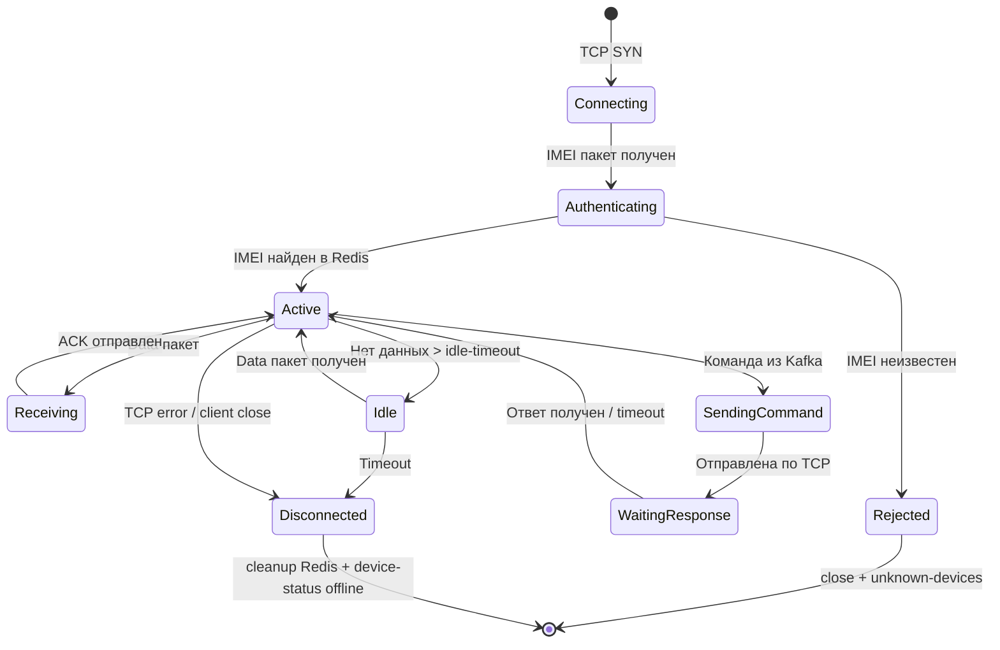
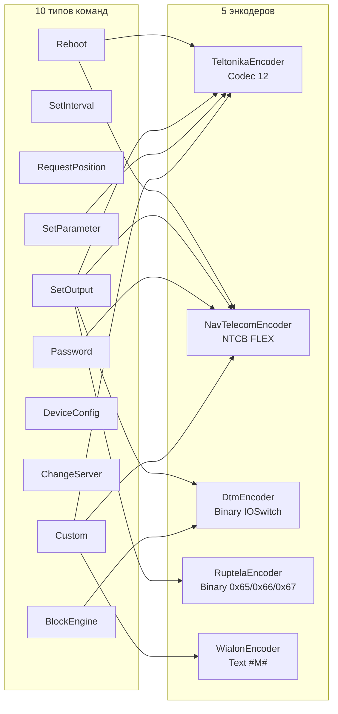
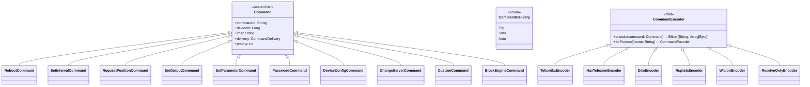
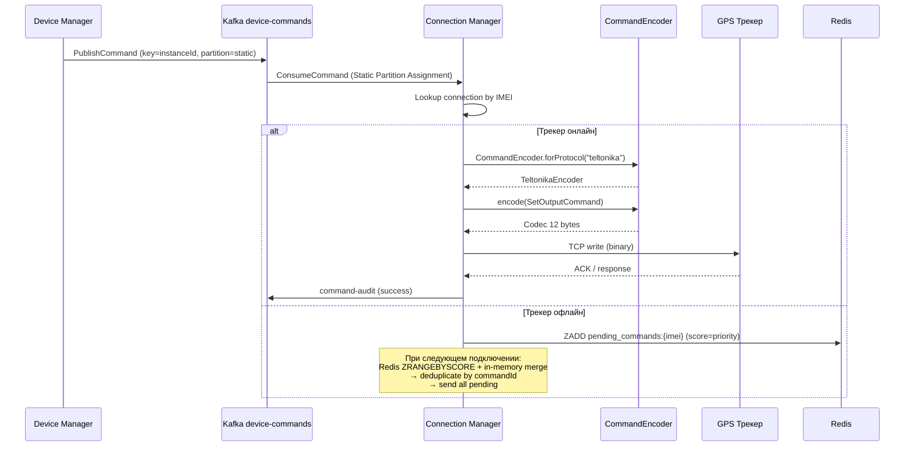
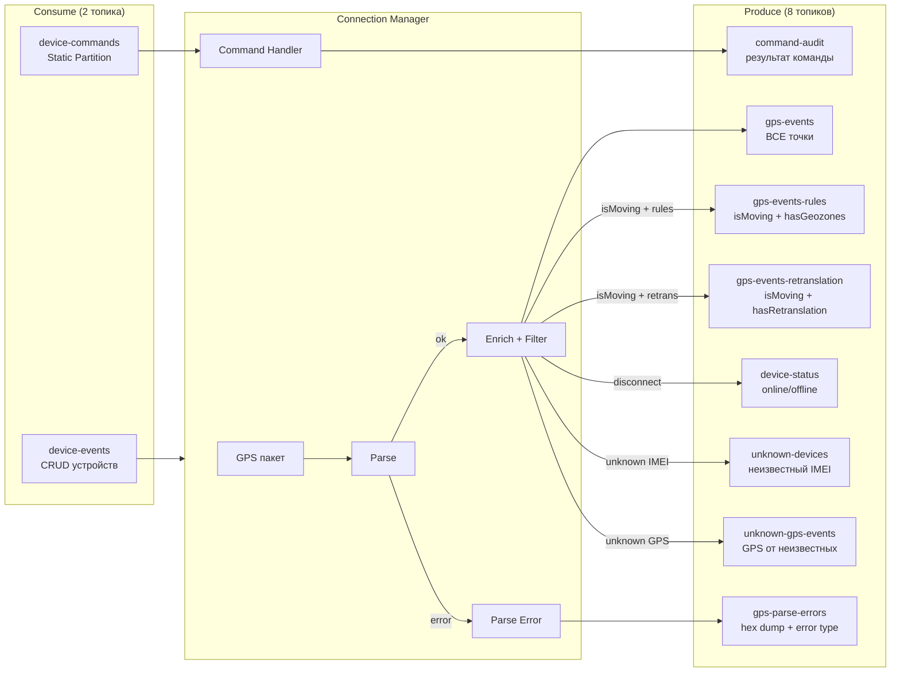
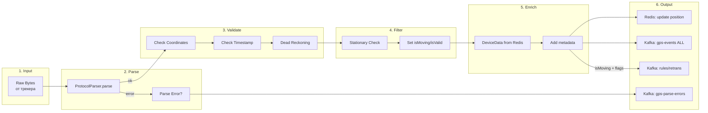
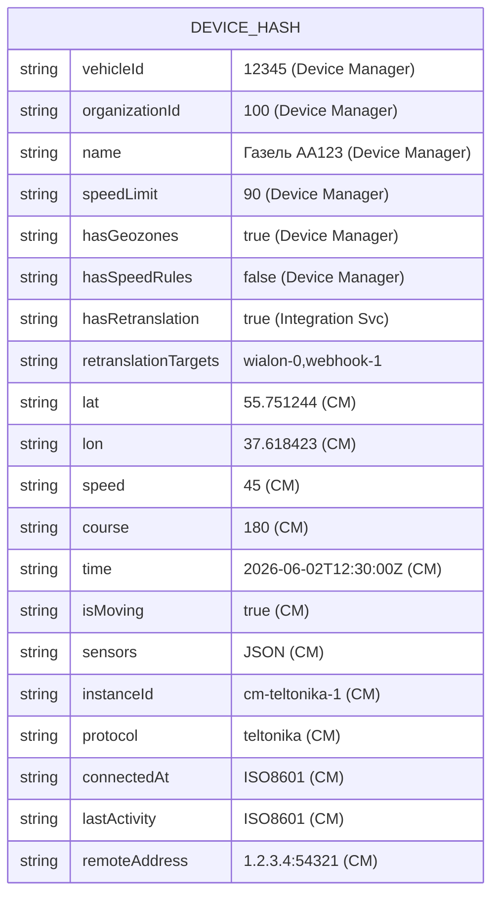
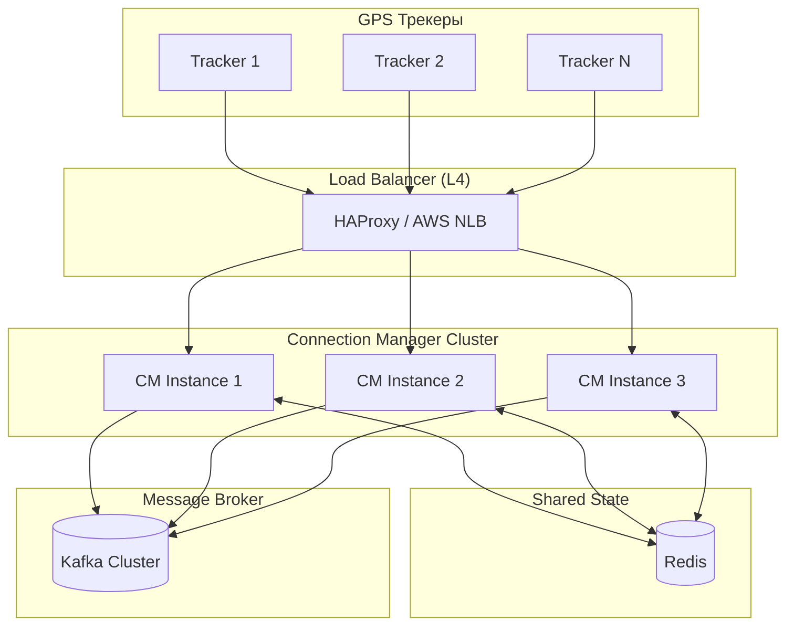

# 🔌 Connection Manager — Детальная документация

> **Блок:** 1 (Data Collection)  
> **Порты:** TCP 5001-5015 (протоколы) + 5100 (multi-protocol) + 10090 (HTTP API)  
> **Сложность:** Высокая  
> **Статус:** 🟢 Реализован (v4.0)  
> **Тег:** `АКТУАЛЬНО` | **Обновлён:** 2 июня 2026 | **Версия:** 4.0

---

## 📋 Содержание

1. [Обзор](#обзор)
2. [Общая архитектура](#общая-архитектура)
3. [Протоколы (18 штук)](#протоколы-18-штук)
4. [Система команд (10 типов, 5 энкодеров)](#система-команд)
5. [Kafka интеграция (10 топиков)](#kafka-интеграция)
6. [Pipeline обработки точек](#pipeline-обработки-точек)
7. [Мониторинг ошибок парсинга](#мониторинг-ошибок-парсинга)
8. [Redis интеграция](#redis-интеграция)
9. [API endpoints (20+)](#api-endpoints)
10. [Масштабирование](#масштабирование)
11. [Метрики и мониторинг](#метрики-и-мониторинг)
12. [Конфигурация](#конфигурация)
13. [Структура файлов](#структура-файлов)
14. [Связанные документы](#-связанные-документы)
15. [Post-MVP: GPS спуфинг-фильтр](#post-mvp-gps-спуфинг-фильтр)

---

## Обзор

**Connection Manager (CM)** — центральный сервис приёма GPS данных от трекеров 18 различных протоколов. Принимает TCP-соединения, парсит бинарные/текстовые пакеты, обогащает данными из Redis, отправляет команды на трекеры и публикует события в 10 Kafka топиков.

### Ключевые характеристики

| Параметр | Значение |
|----------|----------|
| **Протоколы** | 18 (Teltonika, Wialon IPS/Binary/Adapter, Ruptela, NavTelecom, GoSafe, SkySim, AutophoneMayak, DTM, Galileosky, Concox, TK102, Arnavi, ADM, GTLT, MicroMayak) |
| **Система команд** | 10 типов команд, 5 протокольных энкодеров (Teltonika, NavTelecom, DTM, Ruptela, Wialon) |
| **Kafka** | 10 топиков: 8 produce (gps-events, gps-events-rules, gps-events-retranslation, gps-parse-errors, device-status, command-audit, unknown-devices, unknown-gps-events) + 2 consume (device-commands, device-events) |
| **ALL-points** | ВСЕ точки → gps-events (включая невалидные/стационарные) с флагами `isValid`/`isMoving` |
| **Multi-protocol** | Порт 5100: автодетекция протокола по magic bytes (quickDetect + fullDetect) |
| **Пропускная способность** | 10,000+ точек/сек на кластер |
| **Latency** | < 50ms (parse → Kafka) |
| **Порты** | TCP 5001-5015 (протоколы), 5100 (multi), 10090 (HTTP API) |
| **State** | Redis (кеш позиций, контекст) + in-memory (AwaitingCommand) |

---

## Общая архитектура

### Архитектура компонентов

```mermaid
flowchart TB
    subgraph External["GPS трекеры (18 протоколов)"]
        T1[Teltonika :5001]
        T2[Wialon IPS :5002]
        T3[Ruptela :5003]
        T4["NavTelecom :5004"]
        T5["... ещё 12 протоколов :5005-5015"]
        TM[Multi-protocol :5100]
    end

    subgraph CM["Connection Manager"]
        subgraph TCP["TCP Servers (Netty 4.1)"]
            S1[ServerBootstrap ×16]
            SM[MultiProtocol ServerBootstrap]
        end

        subgraph Detect["Protocol Detection"]
            MPP[MultiProtocolParser]
            QD[quickDetect: magic bytes]
            FD[fullDetect: deep analysis]
        end

        subgraph Parsers["16 Protocol Parsers"]
            PP[TeltonikaParser, WialonParser, RuptelaParser, NavTelecomParser, GoSafeParser, SkySimParser, AutophoneMayakParser, DtmParser, GalileoskyParser, ConcoxParser, TK102Parser, ArnaviParser, AdmParser, GtltParser, MicroMayakParser, WialonBinaryParser]
        end

        subgraph Pipeline["Processing Pipeline"]
            CH[ConnectionHandler]
            DR[Dead Reckoning Filter]
            SF[Stationary Filter]
            EN[Enricher + DeviceData]
        end

        subgraph CmdSys["Command System"]
            CE[CommandEncoder.forProtocol]
            TE[TeltonikaEncoder]
            NE[NavTelecomEncoder]
            DE[DtmEncoder]
            RE[RuptelaEncoder]
            WE[WialonEncoder]
            RO[ReceiveOnlyEncoder ×13]
        end

        subgraph Output["Output Layer"]
            KP[KafkaProducer → 8 топиков]
            KC[KafkaConsumer ← device-commands]
            RC[RedisClient → device:{imei}]
        end

        API[":10090 HTTP API (20+ endpoints)"]
    end

    subgraph Storage["Инфраструктура"]
        Redis[(Redis 7.0)]
        Kafka[(Kafka 3.4+)]
    end

    T1 & T2 & T3 & T4 & T5 --> S1
    TM --> SM --> MPP
    MPP --> QD --> FD
    S1 & FD --> PP
    PP --> CH
    CH --> DR --> SF --> EN
    EN --> KP & RC
    KC --> CE
    CE --> TE & NE & DE & RE & WE & RO
    KP --> Kafka
    RC --> Redis
    KC -.-> Kafka
```

### Data Flow: GPS пакет → Kafka

```mermaid
sequenceDiagram
    participant T as GPS Трекер
    participant CM as ConnectionHandler
    participant P as ProtocolParser
    participant R as Redis
    participant K as Kafka

    T->>CM: TCP Connect
    T->>CM: IMEI пакет
    CM->>R: HGETALL device:{imei}
    
    alt IMEI зарегистрирован
        R-->>CM: DeviceData (context + prev position)
        CM-->>T: ACK (протокол-специфичный)
        CM->>R: HMSET connection fields
        CM->>K: device-status "online"
    else IMEI неизвестен
        CM-->>T: NACK
        CM->>K: unknown-devices
        CM->>CM: Close connection
    end

    loop Каждый GPS пакет
        T->>CM: Data пакет (binary/text)
        CM->>P: parse(buffer)
        
        alt Парсинг успешен
            P-->>CM: List[GpsRawPoint]
            CM->>R: HGETALL device:{imei} (fresh context)
            CM->>CM: Enrich + Validate + Filter
            CM->>K: gps-events (ВСЕ точки!)
            CM->>K: gps-events-rules (если isMoving + hasGeozones)
            CM->>K: gps-events-retranslation (если isMoving + hasRetranslation)
            CM->>R: HMSET position fields
            CM-->>T: ACK
        else Ошибка парсинга
            P-->>CM: ProtocolError
            CM->>K: gps-parse-errors (hex dump + error type)
            CM-->>T: ACK/NACK (зависит от протокола)
        end
    end

    T->>CM: Disconnect
    CM->>R: HDEL connection fields
    CM->>K: device-status "offline"
```



### Жизненный цикл соединения



---

## Протоколы (18 штук)

### Сводная таблица

| # | Протокол | Порт | Тип | Парсер | Энкодер | Кол-во команд |
|---|----------|------|-----|--------|---------|:-------------:|
| 1 | Teltonika Codec 8/8E | 5001 | binary | TeltonikaParser | TeltonikaEncoder | 5 |
| 2 | Wialon IPS | 5002 | text | WialonParser | WialonEncoder | 1 |
| 3 | Ruptela | 5003 | binary | RuptelaParser | RuptelaEncoder | 3 |
| 4 | NavTelecom FLEX | 5004 | binary | NavTelecomParser | NavTelecomEncoder | 3 |
| 5 | GoSafe | 5005 | text | GoSafeParser | ReceiveOnly | 0 |
| 6 | SkySim | 5006 | text | SkySimParser | ReceiveOnly | 0 |
| 7 | AutophoneMayak | 5007 | binary | AutophoneMayakParser | ReceiveOnly | 0 |
| 8 | DTM | 5008 | binary | DtmParser | DtmEncoder | 2 |
| 9 | Galileosky | 5009 | binary | GalileoskyParser | ReceiveOnly | 0 |
| 10 | Concox | 5010 | binary | ConcoxParser | ReceiveOnly | 0 |
| 11 | TK102 | 5011 | text | TK102Parser | ReceiveOnly | 0 |
| 12 | Arnavi | 5012 | binary | ArnaviParser | ReceiveOnly | 0 |
| 13 | ADM | 5013 | binary | AdmParser | ReceiveOnly | 0 |
| 14 | GTLT | 5014 | text | GtltParser | ReceiveOnly | 0 |
| 15 | MicroMayak | 5015 | binary | MicroMayakParser | ReceiveOnly | 0 |
| 16 | Wialon Binary | 5002* | binary | WialonBinaryParser | WialonEncoder | 1 |
| 17 | Wialon Adapter | — | text | WialonAdapterParser | WialonEncoder | 1 |
| 18 | Multi-protocol | 5100 | auto | MultiProtocolParser | — | — |

> \* Wialon Binary разделяет порт с Wialon IPS (определяется по первым байтам)

### Матрица поддержки команд



### Автодетекция (MultiProtocolParser)

```mermaid
flowchart TD
    Start[Получены байты на :5100] --> QD{quickDetect<br/>magic bytes}
    
    QD -->|0x00 0x00 0x00 0x00| Teltonika
    QD -->|0x23 '#'| WialonGroup{Wialon IPS/Short/Ping}
    QD -->|0x00 + BCD IMEI| Ruptela
    QD -->|0x40 0x4E 0x54 0x43 '@NTC'| NavTelecom
    QD -->|'$' ASCII| GoSafe
    QD -->|0x78 0x78 / 0x79 0x79| Concox
    QD -->|0x01 + header| Galileosky
    QD -->|0x7B '{' binary| DTM
    QD -->|'*HQ' text| TK102
    QD -->|0xFF + header| Arnavi
    QD -->|не определён| FD{fullDetect<br/>deep analysis}
    
    FD -->|"SkySim pattern"| SkySim
    FD -->|"ADM header"| ADM
    FD -->|"GTLT pattern"| GTLT
    FD -->|"Mayak header"| AutophoneMayak
    FD -->|"Binary Mayak"| MicroMayak
    FD -->|"Wialon Binary"| WialonBinary
    FD -->|"Все парсеры failed"| Unknown[Reject + close]
```

### Legacy STELS → CM маппинг портов

| Legacy (STELS) | CM порт | Протокол | Статус |
|:-:|:-:|----------|--------|
| — | 5001 | Teltonika | ✅ |
| — | 5002 | Wialon IPS | ✅ |
| — | 5003 | Ruptela | ✅ |
| 5113 | 5004 | NavTelecom FLEX | ✅ |
| — | 5005 | GoSafe | ✅ |
| — | 5006 | SkySim | ✅ |
| 5115 | 5007 | AutophoneMayak | ✅ |
| — | 5008 | DTM | ✅ |
| 5112 | 5009 | Galileosky | ✅ |
| — | 5010 | Concox | ✅ |
| — | 5011 | TK102 | ✅ |
| 5114 | 5012 | Arnavi | ✅ |
| 5111 | 5013 | ADM | ✅ |
| — | 5014 | GTLT | ✅ |
| — | 5015 | MicroMayak | ✅ |

---

## Система команд

### 10 типов команд (domain/Command.scala)



### 5 энкодеров (command/ package)

| Энкодер | Формат | Протоколы | Команды |
|---------|--------|-----------|---------|
| **TeltonikaEncoder** | Codec 12 binary | Teltonika | `cpureset`, `setparam`, `getrecord`, `setdigout`, custom |
| **NavTelecomEncoder** | NTCB FLEX text | NavTelecom | `>PASS:{password}`, `!{n}Y/N`, custom |
| **DtmEncoder** | Binary IOSwitch `[0x7B][Len][0xFF][XOR][cmd][val][0x7D]` | DTM | SetOutput, BlockEngine |
| **RuptelaEncoder** | Binary commands `0x65/0x66/0x67` | Ruptela | SetOutput, SMS forward, config |
| **WialonEncoder** | Text `#M#{text}\r\n` | Wialon IPS, Binary, Adapter | Custom text |
| **ReceiveOnlyEncoder** | — | 13 протоколов | → `UnsupportedProtocol` |

### Поток команды (device-commands → трекер)



---

## Kafka интеграция

### 10 Kafka топиков



### Семантика ALL-points → gps-events

> **Изменение v4.0:** gps-events получает **ВСЕ** точки (включая невалидные и стационарные).
> Поля `isValid` и `isMoving` позволяют consumers фильтровать нужное.

| Точка | isValid | isMoving | → gps-events | → gps-events-rules | → gps-events-retranslation |
|-------|:-------:|:--------:|:------------:|:-------------------:|:--------------------------:|
| Нормальная движущаяся | ✅ | ✅ | ✅ | ✅ (если flags) | ✅ (если flags) |
| Стационарная (стоянка) | ✅ | ❌ | ✅ | ❌ | ❌ |
| Невалидная (teleport) | ❌ | — | ✅ | ❌ | ❌ |
| Parse error | — | — | ❌ | ❌ | ❌ → **gps-parse-errors** |

### Логика публикации

```scala
def processPoint(point: GpsPoint): Task[Unit] = for {
  // 1. ВСЕ точки → gps-events (для TimescaleDB полной истории)
  _ <- kafkaProducer.publish("gps-events", point.vehicleId.toString, point.toJson)
  
  // 2. Только движущиеся + с правилами → gps-events-rules
  _ <- ZIO.when(point.isMoving && (point.hasGeozones || point.hasSpeedRules))(
         kafkaProducer.publish("gps-events-rules", point.vehicleId.toString, point.toJson)
       )
  
  // 3. Только движущиеся + с ретрансляцией → gps-events-retranslation
  _ <- ZIO.when(point.isMoving && point.hasRetranslation)(
         kafkaProducer.publish("gps-events-retranslation", point.vehicleId.toString, point.toJson)
       )
} yield ()
```

### Топики: полная спецификация

| Топик | Партиции | Retention | Key | Условие | Consumers |
|-------|:--------:|-----------|-----|---------|-----------|
| `gps-events` | 12 | 7 дней | vehicleId | **ВСЕ** точки | History Writer, WebSocket, Analytics |
| `gps-events-rules` | 6 | 1 день | vehicleId | isMoving + (hasGeozones ∨ hasSpeedRules) | Rule Checker, Geozones |
| `gps-events-retranslation` | 6 | 1 день | vehicleId | isMoving + hasRetranslation | Integration Service |
| `gps-parse-errors` | 3 | 3 дня | imei | Ошибка парсинга | Admin Service, Grafana |
| `device-status` | 6 | 30 дней | imei | Connect/Disconnect | Notification, History Writer |
| `command-audit` | 3 | 90 дней | deviceId | Результат команды | Аудит-лог |
| `unknown-devices` | 3 | 7 дней | imei | IMEI не в Redis | Device Manager |
| `unknown-gps-events` | 6 | 30 дней | imei | GPS от незарег. трекеров | History Writer, Device Manager |

> Подробнее: [infra/kafka/TOPICS.md](../../infra/kafka/TOPICS.md)

---

## Pipeline обработки точек



### GpsRawPoint → GpsPoint (обогащение)

```scala
case class GpsRawPoint(
  imei: String,
  latitude: Double,
  longitude: Double,
  altitude: Option[Int],
  speed: Int,
  course: Int,
  satellites: Option[Int],
  deviceTime: Instant,
  sensors: SensorData
)

case class GpsPoint(
  vehicleId: Long,          // из DeviceData
  organizationId: Long,     // из DeviceData
  imei: String,
  latitude: Double,
  longitude: Double,
  altitude: Option[Int],
  speed: Int,
  course: Int,
  satellites: Option[Int],
  deviceTime: Instant,
  serverTime: Instant,
  speedLimit: Option[Int],        // из DeviceData
  hasGeozones: Boolean,           // маркер → gps-events-rules
  hasSpeedRules: Boolean,         // маркер → gps-events-rules
  hasRetranslation: Boolean,      // маркер → gps-events-retranslation
  retranslationTargets: Option[List[String]],
  isMoving: Boolean,              // Stationary filter
  isValid: Boolean,               // Dead Reckoning filter
  validationError: Option[String],
  sensors: SensorData,
  protocol: String,
  instanceId: String
)
```

---

## Мониторинг ошибок парсинга

### Топик gps-parse-errors (NEW v4.0)

При ошибке парсинга GPS пакета ConnectionHandler ловит исключение через `foldZIO` и публикует в `gps-parse-errors`:

```scala
// В ConnectionHandler.processDataPacket:
parser.parse(buffer).foldZIO(
  error => for {
    hexDump <- ZIO.succeed(bytesToHex(buffer, maxBytes = 512))
    event = GpsParseErrorEvent(
      imei = imei,
      protocol = protocolName,
      errorType = mapErrorType(error),
      errorMessage = error.getMessage,
      rawPacketHex = hexDump,
      rawPacketSize = buffer.readableBytes(),
      remoteAddress = remoteAddr,
      instanceId = instanceId,
      timestamp = Instant.now
    )
    _ <- kafkaProducer.publishParseError(event)
  } yield List.empty,
  points => ZIO.succeed(points)
)
```

### Типы ошибок (ProtocolError ADT)

| errorType | Описание | Типичная причина |
|-----------|----------|------------------|
| `InvalidChecksum` | CRC не совпадает | Битый пакет, плохой канал |
| `InvalidCodec` | Неизвестный codec ID | Новая прошивка трекера |
| `ParseError` | Общая ошибка парсинга | Неожиданный формат |
| `InsufficientData` | Недостаточно байт | Обрыв TCP, фрагментация |
| `InvalidImei` | IMEI не проходит проверку | Повреждённый IMEI |
| `UnknownDevice` | IMEI не в Redis | Незарегистрированный трекер |
| `UnsupportedProtocol` | Протокол не поддерживается | Неизвестный трекер |
| `ProtocolDetectionFailed` | Не определён протокол | multi-protocol порт |

### GpsParseErrorEvent

```json
{
  "imei": "860719020025346",
  "protocol": "teltonika",
  "errorType": "InvalidChecksum",
  "errorMessage": "CRC mismatch: expected 0xA3F1, got 0xB2E0",
  "rawPacketHex": "000000000000004308...",
  "rawPacketSize": 67,
  "remoteAddress": "192.168.1.100:54321",
  "instanceId": "cm-01",
  "timestamp": "2026-06-02T10:30:00Z"
}
```

---

## Redis интеграция

### Единая структура: `device:{imei}` (HASH)

Все данные об устройстве хранятся в **одном HASH ключе** — context + position + connection за **один HGETALL**.



### Операции CM с Redis

```
1. CONNECT (IMEI пакет):    HGETALL device:{imei} → DeviceData
                              → HMSET instanceId, protocol, connectedAt, remoteAddress
2. DATA пакет (каждый раз): HGETALL device:{imei} → fresh context + prev position
                              → HMSET lat, lon, speed, course, time, isMoving, sensors, lastActivity
3. DISCONNECT:              HDEL device:{imei} instanceId connectedAt remoteAddress
4. Pending commands:        ZADD pending_commands:{imei} (при offline)
                              ZRANGEBYSCORE pending_commands:{imei} (при reconnect)
```

---

## API endpoints

### Admin/Management API (порт 10090)

20+ HTTP endpoints для управления и мониторинга:

| Метод | Путь | Описание |
|-------|------|----------|
| GET | `/health` | Health check (K8s liveness probe) |
| GET | `/ready` | Readiness (Redis + Kafka connected) |
| GET | `/metrics` | Prometheus метрики |
| GET | `/admin/connections` | Список активных соединений |
| GET | `/admin/connections/{imei}` | Детали соединения |
| DELETE | `/admin/connections/{imei}` | Force disconnect |
| GET | `/admin/protocols` | Список активных протоколов |
| GET | `/admin/protocols/{name}/stats` | Статистика протокола |
| POST | `/admin/reload-config` | Перезагрузка конфигурации |
| GET | `/admin/commands/pending` | Ожидающие команды |
| GET | `/admin/commands/pending/{imei}` | Pending по IMEI |
| DELETE | `/admin/commands/pending/{commandId}` | Отменить команду |
| GET | `/admin/parse-errors` | Последние ошибки парсинга |
| GET | `/admin/parse-errors/stats` | Статистика ошибок по протоколам |
| GET | `/admin/kafka/lag` | Consumer lag по партициям |
| GET | `/admin/redis/stats` | Статистика Redis операций |
| GET | `/admin/filters/dead-reckoning/stats` | Статистика Dead Reckoning |
| PUT | `/admin/filters/dead-reckoning/config` | Обновить конфиг фильтра |
| GET | `/admin/instance` | Информация об инстансе |
| POST | `/admin/gc` | Force GC (для отладки) |

---

## Масштабирование

### Архитектура с Load Balancer



### Стратегия масштабирования

| Метрика | Порог | Действие |
|---------|-------|----------|
| CPU > 70% | 5 минут | Scale up +1 instance |
| CPU < 30% | 10 минут | Scale down -1 instance |
| Connections > 3000 | per instance | Scale up |
| Memory > 80% | 3 минуты | Scale up |

### Session Affinity

```yaml
# HAProxy config (18 протоколов)
frontend tcp_trackers
    bind *:5001-5015  # 15 протоколов
    bind *:5100       # Multi-protocol
    mode tcp
    default_backend cm_servers

backend cm_servers
    mode tcp
    balance source  # Sticky по IP трекера
    option tcp-check
    server cm1 cm-1:5001-5015 check
    server cm2 cm-2:5001-5015 check
    server cm3 cm-3:5001-5015 check
```

**Важно:** Трекер переподключается к тому же инстансу (session affinity), но если инстанс упал — Redis registry позволяет другому инстансу принять соединение. Все 18 протоколов проксируются через один L4 балансировщик.

---

## Метрики и мониторинг

### Prometheus метрики

```
# Соединения
cm_connections_active{protocol="teltonika",instance="cm-1"} 1234
cm_connections_total{protocol="teltonika"} 5678
cm_connection_duration_seconds_bucket{le="60"} 100
cm_connection_duration_seconds_bucket{le="300"} 500

# Точки
cm_points_received_total{protocol="teltonika"} 12345678
cm_points_per_second{protocol="teltonika"} 450
cm_points_invalid_total{reason="teleport"} 123

# Парсинг (18 протоколов)
cm_parse_duration_seconds_bucket{protocol="teltonika",le="0.001"} 9999
cm_parse_errors_total{protocol="wialon",error="checksum"} 45

# Ошибки парсинга → gps-parse-errors (NEW v4.0)
cm_parse_errors_published_total{protocol="concox",errorType="CrcMismatch"} 12

# Kafka
cm_kafka_publish_duration_seconds_bucket{le="0.01"} 9990
cm_kafka_publish_errors_total 12

# Redis
cm_redis_operations_total{operation="setPosition"} 123456
cm_redis_latency_seconds_bucket{operation="setPosition",le="0.001"} 9999
```

### Grafana Dashboard

```
┌─────────────────────────────────────────────────────────────────────┐
│                    Connection Manager Dashboard                      │
├───────────────────────┬───────────────────────┬─────────────────────┤
│  Active Connections   │   Points/sec          │   Parse Errors      │
│       [4,523]         │      [8,456]          │      [12]           │
├───────────────────────┴───────────────────────┴─────────────────────┤
│                                                                     │
│  Connections by Protocol — TOP-5 (graph)                            │
│  ████████████████████ Teltonika (3,200)                            │
│  ██████████ Wialon (1,100)                                         │
│  ████ Concox (400)                                                 │
│  ███ Ruptela (200)                                                 │
│  ██ Galileosky (150)                                               │
│  █ NavTelecom + 12 остальных (373)                                 │
│                                                                     │
├─────────────────────────────────────────────────────────────────────┤
│                                                                     │
│  Points/sec over time (line chart)                                 │
│   10K ┤                    ╭─╮                                      │
│    8K ┤               ╭────╯ ╰────╮                                │
│    6K ┤          ╭────╯          ╰────                             │
│    4K ┤     ╭────╯                                                 │
│    2K ┤╭────╯                                                      │
│     0 ┼────────────────────────────────────────                    │
│       00:00  04:00  08:00  12:00  16:00  20:00                     │
│                                                                     │
├───────────────────────┬───────────────────────┬─────────────────────┤
│  Kafka Latency p99    │   Redis Latency p99   │   Instance Count    │
│      [5.2 ms]         │      [0.8 ms]         │      [3]            │
└───────────────────────┴───────────────────────┴─────────────────────┘
```

### Алерты

```yaml
groups:
  - name: connection-manager
    rules:
      - alert: CMHighParseErrors
        expr: rate(cm_parse_errors_total[5m]) > 10
        for: 5m
        labels:
          severity: warning
        annotations:
          summary: "High parse error rate"

      - alert: CMConnectionsDrop
        expr: cm_connections_active < 1000
        for: 5m
        labels:
          severity: critical
        annotations:
          summary: "Connections dropped significantly"

      - alert: CMKafkaLatency
        expr: histogram_quantile(0.99, cm_kafka_publish_duration_seconds_bucket) > 0.1
        for: 5m
        labels:
          severity: warning
        annotations:
          summary: "Kafka publish latency > 100ms"
```

---

## Конфигурация

### application.conf (актуальный)

```hocon
connection-manager {
  instance-id = ${?HOSTNAME}
  instance-id = ${?CM_INSTANCE_ID}
  
  tcp {
    # 16 портов протоколов + 1 multi-protocol
    teltonika      { port = 5001, enabled = true }
    wialon         { port = 5002, enabled = true }
    ruptela        { port = 5003, enabled = true }
    navtelecom     { port = 5004, enabled = true }
    gosafe         { port = 5005, enabled = true }
    skysim         { port = 5006, enabled = true }
    autophone-mayak { port = 5007, enabled = true }
    dtm            { port = 5008, enabled = true }
    galileosky     { port = 5009, enabled = true }
    concox         { port = 5010, enabled = true }
    tk102          { port = 5011, enabled = true }
    arnavi         { port = 5012, enabled = true }
    adm            { port = 5013, enabled = true }
    gtlt           { port = 5014, enabled = true }
    micro-mayak    { port = 5015, enabled = true }
    multi-protocol { port = 5100, enabled = true }
    
    # Netty настройки
    backlog = 1024
    receive-buffer-size = 65536
    keep-alive = true
    tcp-no-delay = true
    idle-timeout = 300s
  }
  
  admin {
    port = 10090
    enabled = true
  }
  
  kafka {
    bootstrap-servers = ${KAFKA_BROKERS}
    
    topics {
      gps-events = "gps-events"
      gps-events-rules = "gps-events-rules"
      gps-events-retranslation = "gps-events-retranslation"
      gps-parse-errors = "gps-parse-errors"
      device-status = "device-status"
      device-commands = "device-commands"
      device-events = "device-events"
      command-audit = "command-audit"
      unknown-devices = "unknown-devices"
      unknown-gps-events = "unknown-gps-events"
    }
    
    producer {
      acks = "1"
      batch-size = 16384
      linger-ms = 5
      compression = "lz4"
    }
  }
  
  redis {
    host = ${REDIS_HOST}
    port = 6379
    database = 0
  }
  
  validation {
    dead-reckoning {
      enabled = true
      max-speed-kmh = 300
      max-teleport-meters = 5000
    }
    stationary {
      enabled = true
      speed-threshold-kmh = 3
      distance-threshold-meters = 50
    }
  }
}
```

### Docker Compose

```yaml
services:
  connection-manager:
    build: ./services/connection-manager
    ports:
      - "5001-5015:5001-5015"  # Все протоколы
      - "5100:5100"            # Multi-protocol
      - "10090:10090"          # Admin API
    environment:
      - REDIS_HOST=redis
      - KAFKA_BROKERS=kafka:9092
      - CM_INSTANCE_ID=cm-1
    depends_on:
      - redis
      - kafka
    healthcheck:
      test: ["CMD", "curl", "-f", "http://localhost:10090/health"]
      interval: 10s
      timeout: 5s
      retries: 3
```

---

## Структура файлов

```
services/connection-manager/
├── docs/
│   ├── README.md           # Точка входа: запуск, порты, окружение
│   ├── ARCHITECTURE.md     # Внутренняя архитектура, 10+ Mermaid диаграмм
│   ├── KAFKA.md            # 10 топиков: produce/consume маршруты
│   ├── PROTOCOLS.md        # 18 протоколов: формат пакетов, CRC, ACK
│   ├── DATA_MODEL.md       # Redis ключи, GpsPoint, GpsParseErrorEvent
│   ├── DECISIONS.md        # ADR 001-011: все архитектурные решения
│   ├── RUNBOOK.md          # Запуск, дебаг, типичные ошибки
│   └── INDEX.md            # Содержание документации
└── src/main/scala/com/wayrecall/tracker/
    ├── Main.scala                          # ZIOAppDefault entry point
    ├── config/
    │   └── AppConfig.scala                 # HOCON конфиг + KafkaTopicsConfig
    ├── domain/
    │   ├── GpsPoint.scala                  # GpsRawPoint, GpsPoint, GpsParseErrorEvent
    │   ├── Command.scala                   # 10 типов команд + CommandDelivery + PendingCommand
    │   └── Protocol.scala                  # enum Protocol (18 вариантов)
    ├── command/                            # 🆕 v4.0 — Система команд
    │   ├── CommandEncoder.scala            # trait + factory forProtocol()
    │   ├── TeltonikaEncoder.scala          # Codec 12 + CRC-16-IBM
    │   ├── NavTelecomEncoder.scala         # NTCB FLEX text
    │   ├── DtmEncoder.scala               # Binary IOSwitch
    │   ├── RuptelaEncoder.scala            # Binary 0x65/0x66/0x67
    │   └── WialonEncoder.scala             # Text #M#{text}\r\n
    ├── protocol/                           # 18 парсеров
    │   ├── ProtocolParser.scala            # trait + canParse + generateAck + encodeCommand
    │   ├── MultiProtocolParser.scala       # Автодетекция: quickDetect → fullDetect
    │   ├── TeltonikaParser.scala           # Codec 8/8E, порт 5001
    │   ├── WialonParser.scala              # IPS v2.0, порт 5002
    │   ├── RuptelaParser.scala             # Binary, порт 5003
    │   ├── NavTelecomParser.scala          # FLEX, порт 5004
    │   ├── GosafeParser.scala              # ASCII, порт 5005
    │   ├── SkysimParser.scala              # AT-команды, порт 5006
    │   ├── AutophoneMayakParser.scala      # Binary, порт 5007
    │   ├── DtmParser.scala                 # Binary, порт 5008
    │   ├── GalileoskyParser.scala          # Binary tags, порт 5009
    │   ├── ConcoxParser.scala              # Binary, порт 5010
    │   ├── Tk102Parser.scala               # ASCII SMS-like, порт 5011
    │   ├── ArnaviParser.scala              # Binary, порт 5012
    │   ├── AdmParser.scala                 # Binary, порт 5013
    │   ├── GtltParser.scala                # ASCII, порт 5014
    │   └── MicroMayakParser.scala          # Binary micro, порт 5015
    ├── filter/
    │   ├── DeadReckoningFilter.scala       # Фильтр телепортаций (>300 км/ч)
    │   └── StationaryFilter.scala          # Фильтр стоянок (<3 км/ч)
    ├── network/
    │   ├── TcpServer.scala                 # Netty: 16 портов + multi
    │   ├── ConnectionHandler.scala         # Обработка соединений, foldZIO → gps-parse-errors
    │   ├── CommandService.scala            # Получение/отправка команд
    │   └── GpsProcessingService.scala      # Pipeline: parse → validate → enrich → Kafka
    ├── service/
    │   └── DeviceContextService.scala      # Redis context: org, vehicle, capabilities
    ├── storage/
    │   ├── RedisClient.scala               # device:{imei} HASH операции
    │   └── KafkaProducer.scala             # 10 топиков: publish + publishParseError
    └── util/
        ├── CrcCalculator.scala             # CRC-16, CRC-32 для разных протоколов
        └── GeoMath.scala                   # Haversine, bearing, distance
```

---

## 📚 Связанные документы

### Документация CM (services/connection-manager/docs/)

| Документ | Содержание |
|----------|------------|
| [ARCHITECTURE.md](../../services/connection-manager/docs/ARCHITECTURE.md) | Внутренняя архитектура, 10+ Mermaid диаграмм |
| [KAFKA.md](../../services/connection-manager/docs/KAFKA.md) | 10 Kafka топиков, маршруты, JSON примеры |
| [PROTOCOLS.md](../../services/connection-manager/docs/PROTOCOLS.md) | 18 протоколов, binary format, CRC алгоритмы |
| [DATA_MODEL.md](../../services/connection-manager/docs/DATA_MODEL.md) | Redis ключи, домен модели, GpsParseErrorEvent |
| [DECISIONS.md](../../services/connection-manager/docs/DECISIONS.md) | ADR 001-011, все архитектурные решения |

### Системная документация

| Документ | Содержание |
|----------|------------|
| [ARCHITECTURE_BLOCK1.md](../ARCHITECTURE_BLOCK1.md) | Обзор Block 1 — Data Collection |
| [ARCHITECTURE.md](../ARCHITECTURE.md) | Общая архитектура (3 блока) |
| [DATA_STORES.md](../DATA_STORES.md) | Схемы всех хранилищ |
| [infra/kafka/TOPICS.md](../../infra/kafka/TOPICS.md) | 10 Kafka топиков, матрица сервисов |
| [DEVICE_MANAGER.md](./DEVICE_MANAGER.md) | REST API устройств, отправка команд |
| [HISTORY_WRITER.md](./HISTORY_WRITER.md) | Запись GPS в TimescaleDB |

---

## ✅ РЕАЛИЗОВАНО: Типизированные ошибки парсинга (v4.0)

> Реализовано в `domain/GpsPoint.scala` — `ProtocolError` sealed trait + `GpsParseErrorEvent`

Все 18 парсеров используют типизированные ошибки через `ZIO.fail(ProtocolError.*)`.
При ошибке парсинга — событие публикуется в `gps-parse-errors` Kafka топик (см. раздел "Мониторинг ошибок парсинга").

8 типов ошибок: `InsufficientData`, `InvalidField`, `InvalidImei`, `CrcMismatch`, `UnsupportedCodec`, `RecordCountMismatch`, `InvalidSignature`, `UnknownPacketType`

---

## Post-MVP: GPS спуфинг-фильтр

> Статус: **В планах** (после MVP)

В крупных городах России (центр Москвы) системы РЭБ подменяют GPS сигнал. Dead Reckoning отсекает аномальные точки, но не восстанавливает реальный маршрут.

**Концепция:** расширяющаяся окружность из последней валидной точки [A] с радиусом `R = V × 1.5 × ΔT`. Когда новая точка попадает в окружность — спуфинг закончился, точка [B] валидна. Между [A] и [B] — интерполяция через OSRM (map matching по OSM данным России).

**Интеграция в Pipeline:**
```
parseData → deadReckoningFilter → [spoofingFilter] → stationaryFilter → Kafka
                                       ↑ Post-MVP
```

---

## ✅ РЕШЕНО: Доставка команд (v4.0)

> Полностью реализовано: 10 типов команд, 5 энкодеров, Kafka `device-commands` → TCP

**Архитектура (v4.0):**
- Device Manager публикует команду в `device-commands` (key = instanceId)
- CM потребляет через `kafkaConsumer.assign(partition)` (статический маппинг)
- `CommandEncoder.forProtocol(protocol)` выбирает нужный энкодер
- Трекер онлайн → отправка по TCP (<100ms)
- Трекер offline → Redis ZSET `pending_commands:{imei}` backup

Подробности см. в разделе "Система команд" выше.

---

## ⚠️ TODO: WebSocket / Real-time Service (Block 3)

**Решение для MVP:** Polling вместо WebSocket push

```
CM → Kafka (gps-events, ALL points)
  → WebSocket/Real-time Service (Kafka consumer, группирует по orgId)
  → Frontend (polling каждые 3 сек)
    GET /api/v1/realtime/positions → JSON: {vehicles: [...]}
```

CM не знает про пользователей — шлёт ВСЁ в `gps-events`. Real-time Service подписан на `gps-events`, фильтрует по `orgId` авторизованных пользователей.

---

**Дата:** 2 июня 2026
**Версия:** 4.0
**Статус:** 🟢 Документация актуальна | 18 протоколов | 10 команд | 10 Kafka топиков
